# QAV-S 2 JOHNNYFPV EDITION — Assembly Manual

Auto-generated from Manual2.pdf using VLM.

---

## Parts List

### Page 2 — structural parts and plates

[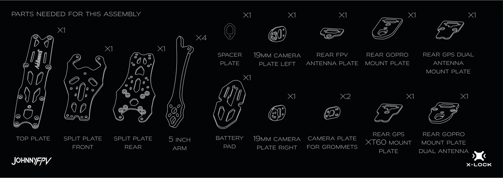](parts/parts_page2.png)

Here is a list of every part shown in the image:

*   **TOP PLATE** x1
*   **SPLIT PLATE FRONT** x1
*   **SPLIT PLATE REAR** x1
*   **5 INCH ARM** x4
*   **SPACER PLATE** x1
*   **19MM CAMERA PLATE LEFT** x1
*   **REAR FPV ANTENNA PLATE** x1
*   **REAR GOPRO MOUNT PLATE** x1
*   **REAR GPS DUAL ANTENNA MOUNT PLATE** x1
*   **BATTERY PAD** x1
*   **19MM CAMERA PLATE RIGHT** x1
*   **CAMERA PLATE FOR GROMMETS** x2
*   **REAR GPS XT60 MOUNT PLATE** x1
*   **REAR GOPRO MOUNT PLATE DUAL ANTENNA** x1

### Page 3 — mounts, standoffs, grommets, and strap

[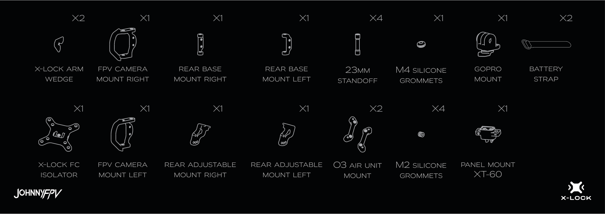](parts/parts_page3.png)

Here is the list of parts from the image:

*   X-LOCK ARM WEDGE x2
*   FPV CAMERA MOUNT RIGHT x1
*   REAR BASE MOUNT RIGHT x1
*   REAR BASE MOUNT LEFT x1
*   23MM STANDOFF x4
*   M4 SILICONE GROMMETS x1
*   GOPRO MOUNT x1
*   BATTERY STRAP x2
*   X-LOCK FC ISOLATOR x1
*   FPV CAMERA MOUNT LEFT x1
*   REAR ADJUSTABLE MOUNT RIGHT x1
*   REAR ADJUSTABLE MOUNT LEFT x1
*   O3 AIR UNIT MOUNT x2
*   M2 SILICONE GROMMETS x4
*   PANEL MOUNT XT-60 x1

### Page 4 — screws and optional 7 inch frame parts

[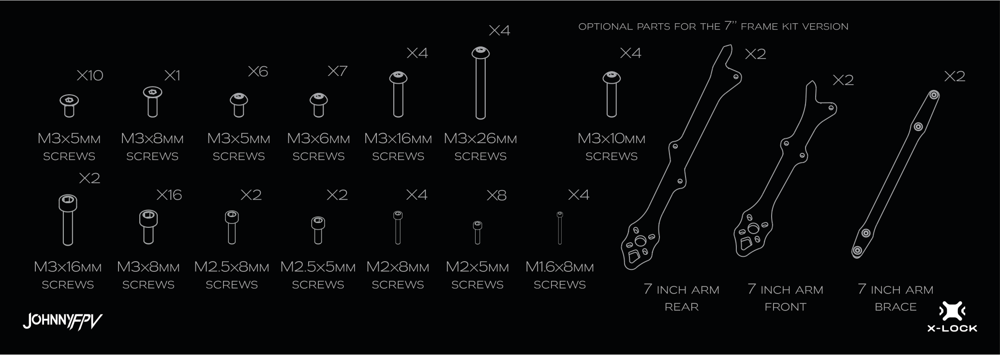](parts/parts_page4.png)

Here is a list of every part shown in the image:

*   M3x5mm Screws: x10
*   M3x8mm Screws: x1
*   M3x5mm Screws: x6
*   M3x6mm Screws: x7
*   M3x16mm Screws: x4
*   M3x26mm Screws: x4
*   M3x10mm Screws: x4
*   M3x16mm Screws: x2
*   M3x8mm Screws: x16
*   M2.5x8mm Screws: x2
*   M2.5x5mm Screws: x2
*   M2x8mm Screws: x4
*   M2x5mm Screws: x8
*   M1.6x8mm Screws: x4
*   7 Inch Arm Rear: x2
*   7 Inch Arm Front: x2
*   7 Inch Arm Brace: x2

---

## Assembly Steps

### Step 1

[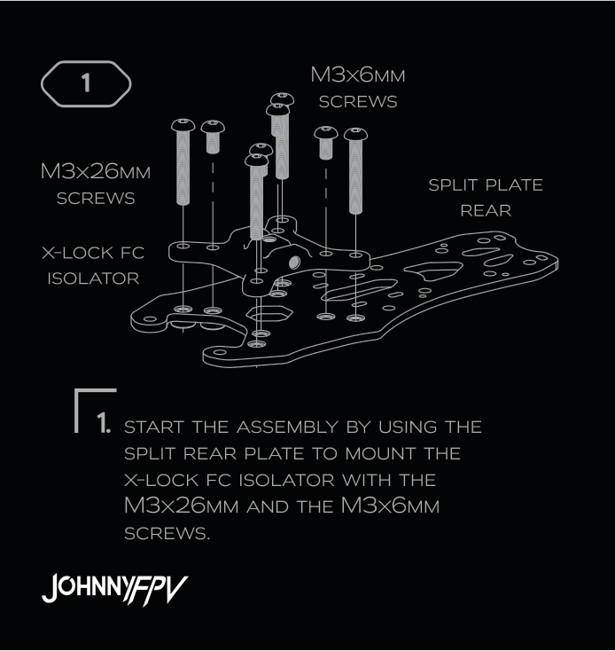](steps/step_01.png)

#### Step 1

**Instruction:** START THE ASSEMBLY BY USING THE SPLIT REAR PLATE TO MOUNT THE X-LOCK FC ISOLATOR WITH THE M3x26MM AND THE M3x6MM SCREWS.

**Parts:**
- SPLIT PLATE REAR
- X-LOCK FC ISOLATOR

**Screws:**
- M3x26MM SCREWS
- M3x6MM SCREWS

**Diagram:** The diagram shows an exploded view of the split plate rear, X-lock FC isolator, and the M3x26mm and M3x6mm screws being assembled.

### Step 2

[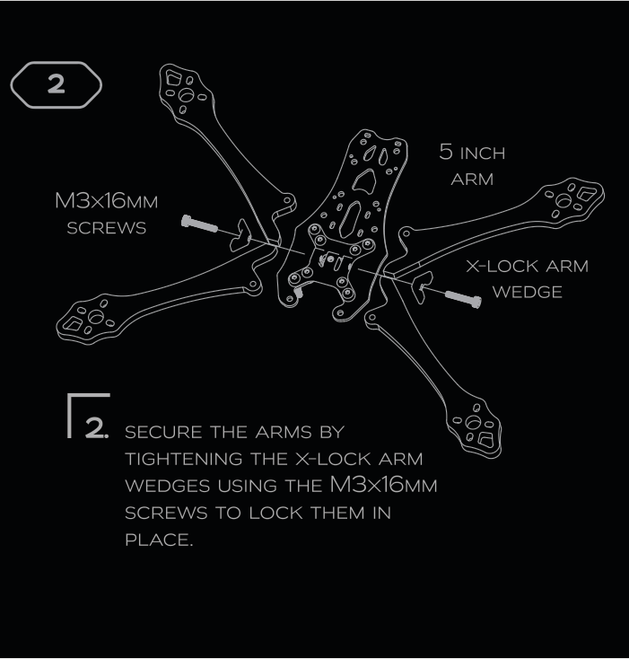](steps/step_02.png)

#### Step 2

**Instruction:** SECURE THE ARMS BY TIGHTENING THE X-LOCK ARM WEDGES USING THE M3x16MM SCREWS TO LOCK THEM IN PLACE.

**Parts:**
- 5 inch arm
- X-lock arm wedge

**Screws:**
- M3x16mm screws

**Diagram:** The diagram shows an exploded view of a central frame piece, four 5-inch arms, four X-lock arm wedges, and four M3x16mm screws, illustrating how the arms and wedges are attached to the frame with the screws.

### Step 3

[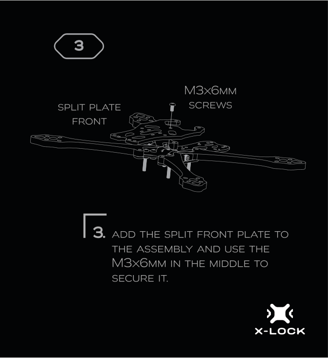](steps/step_03.png)

#### Step 3

**Instruction:** ADD THE SPLIT FRONT PLATE TO THE ASSEMBLY AND USE THE M3x6MM IN THE MIDDLE TO SECURE IT.

**Parts:**
- SPLIT PLATE FRONT

**Screws:**
- M3x6MM

**Diagram:** The diagram shows the split plate front being attached to the assembly with an M3x6MM screw in the middle.

### Step 4

[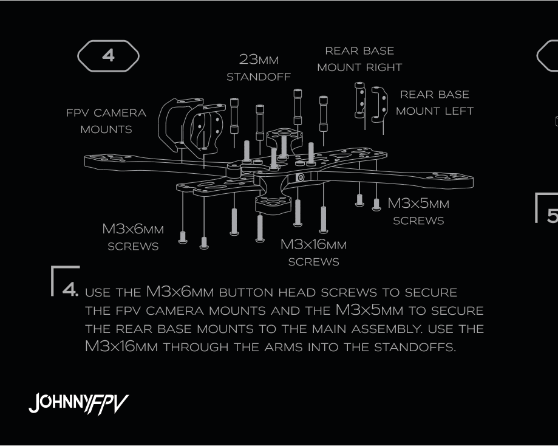](steps/step_04.png)

#### Step 4

**Instruction:** USE THE M3x6MM BUTTON HEAD SCREWS TO SECURE THE FPV CAMERA MOUNTS AND THE M3x5MM TO SECURE THE REAR BASE MOUNTS TO THE MAIN ASSEMBLY. USE THE M3x16MM THROUGH THE ARMS INTO THE STANDOFFS.

**Parts:**
- 23mm STANDOFF
- REAR BASE MOUNT RIGHT
- FPV CAMERA MOUNTS
- REAR BASE MOUNT LEFT

**Screws:**
- M3x6mm SCREWS
- M3x16mm SCREWS
- M3x5mm SCREWS

**Diagram:** The diagram shows an exploded view of the main assembly with FPV camera mounts, rear base mounts, standoffs, and various screws.

### Step 5

[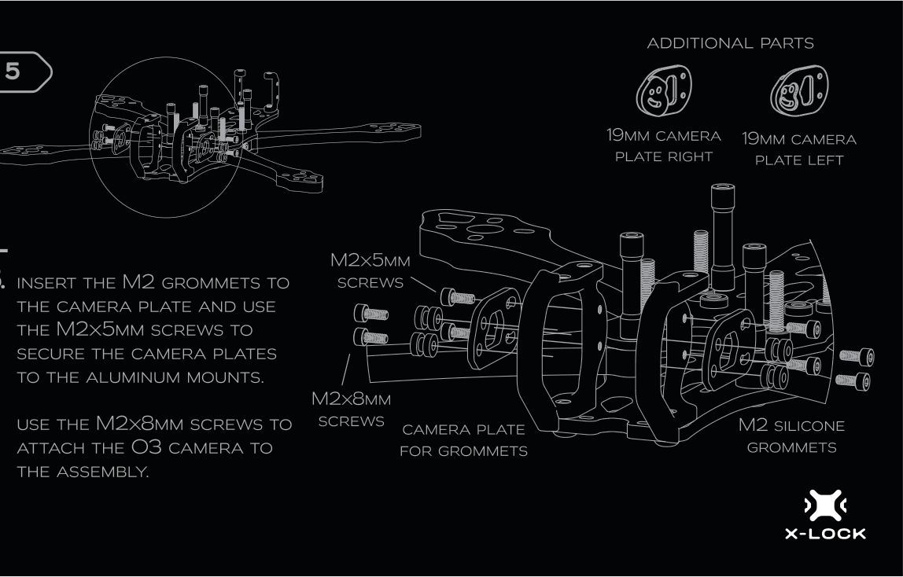](steps/step_05.png)

#### Step 5

**Instruction:** INSERT THE M2 GROMMETS TO THE CAMERA PLATE AND USE THE M2x5MM SCREWS TO SECURE THE CAMERA PLATES TO THE ALUMINUM MOUNTS. USE THE M2x8MM SCREWS TO ATTACH THE O3 CAMERA TO THE ASSEMBLY.

**Parts:**
- M2 silicone grommets
- Camera plate for grommets
- 19mm camera plate right
- 19mm camera plate left
- O3 camera
- Aluminum mounts

**Screws:**
- M2x5mm screws
- M2x8mm screws

**Diagram:** The diagram shows an exploded view of the camera assembly with grommets, camera plates, and screws, along with an overhead view of the assembled camera on the drone frame.

### Step 6

[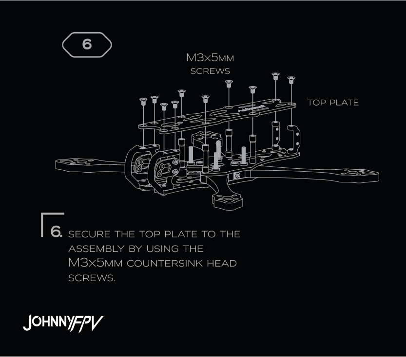](steps/step_06.png)

#### Step 6

**Instruction:** SECURE THE TOP PLATE TO THE ASSEMBLY BY USING THE M3x5MM COUNTERSINK HEAD SCREWS.

**Parts:**
- TOP PLATE

**Screws:**
- M3x5MM COUNTERSINK HEAD SCREWS

**Diagram:** The diagram shows an exploded view of the top plate being attached to the assembly with screws.

### Step 7

[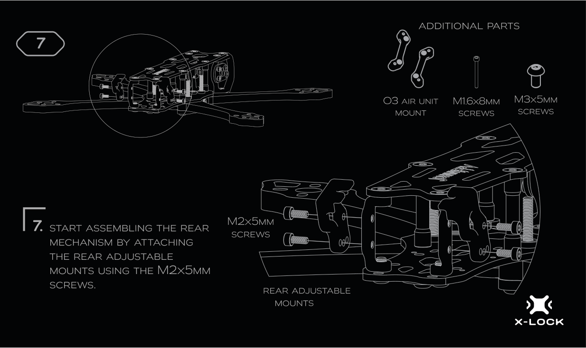](steps/step_07.png)

#### Step 7

**Instruction:** START ASSEMBLING THE REAR MECHANISM BY ATTACHING THE REAR ADJUSTABLE MOUNTS USING THE M2x5MM SCREWS.

**Parts:**
- Rear Adjustable Mounts

**Screws:**
- M2x5mm Screws

**Diagram:** The diagram shows an exploded view of the rear adjustable mounts being attached to the main body of the drone with screws.

### Step 8

[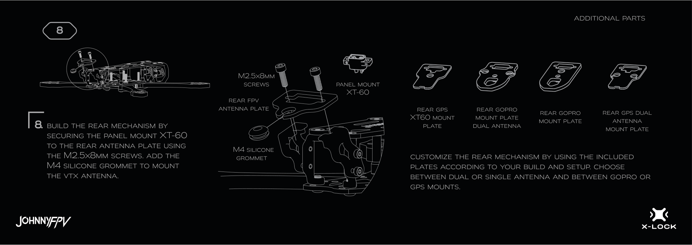](steps/step_08.png)

#### Step 8

**Instruction:** BUILD THE REAR MECHANISM BY SECURING THE PANEL MOUNT XT-60 TO THE REAR ANTENNA PLATE USING THE M2.5x8MM SCREWS. ADD THE M4 SILICONE GROMMET TO MOUNT THE VTX ANTENNA. CUSTOMIZE THE REAR MECHANISM BY USING THE INCLUDED PLATES ACCORDING TO YOUR BUILD AND SETUP. CHOOSE BETWEEN DUAL OR SINGLE ANTENNA AND BETWEEN GOPRO OR GPS MOUNTS.

**Parts:**
- Rear FPV Antenna Plate
- Panel Mount XT-60
- M4 Silicone Grommet
- Rear GPS XT60 Mount Plate
- Rear GoPro Mount Plate Dual Antenna
- Rear GoPro Mount Plate
- Rear GPS Dual Antenna Mount Plate

**Screws:**
- M2.5x8mm screws

**Diagram:** The diagram shows an exploded view of the rear mechanism assembly, including the panel mount, antenna plate, and silicone grommet, along with various optional rear mount plates.

### Step 9

[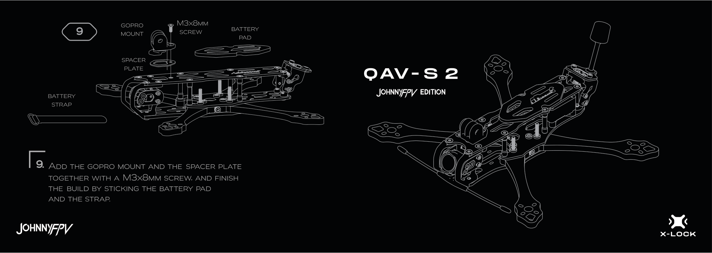](steps/step_09.png)

#### Step 9

**Instruction:** ADD THE GOPRO MOUNT AND THE SPACER PLATE TOGETHER WITH A M3X8MM SCREW, AND FINISH THE BUILD BY STICKING THE BATTERY PAD AND THE STRAP.

**Parts:**
- GOPRO MOUNT
- SPACER PLATE
- BATTERY PAD
- BATTERY STRAP

**Screws:**
- M3x8MM SCREW

**Diagram:** The diagram shows an exploded view of the GoPro mount, spacer plate, battery pad, and battery strap being added to the top of the drone frame, with an assembled drone shown to the right.

