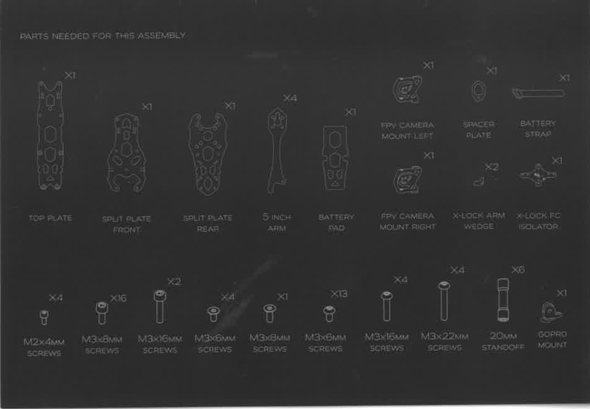
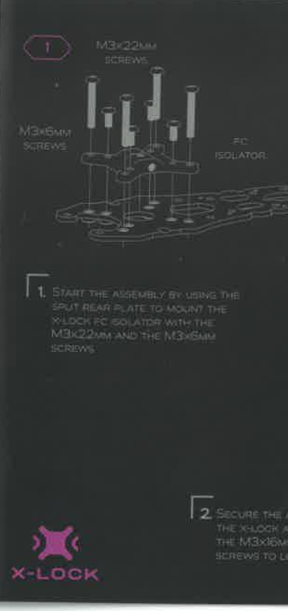
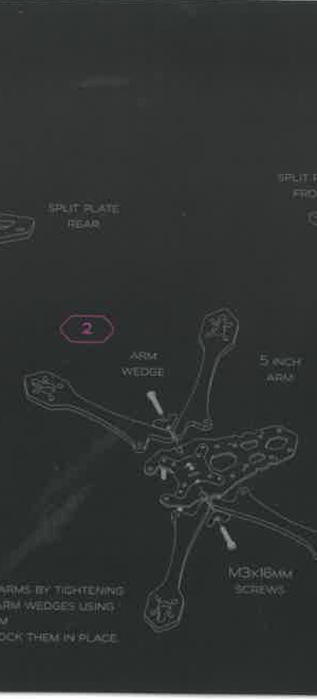
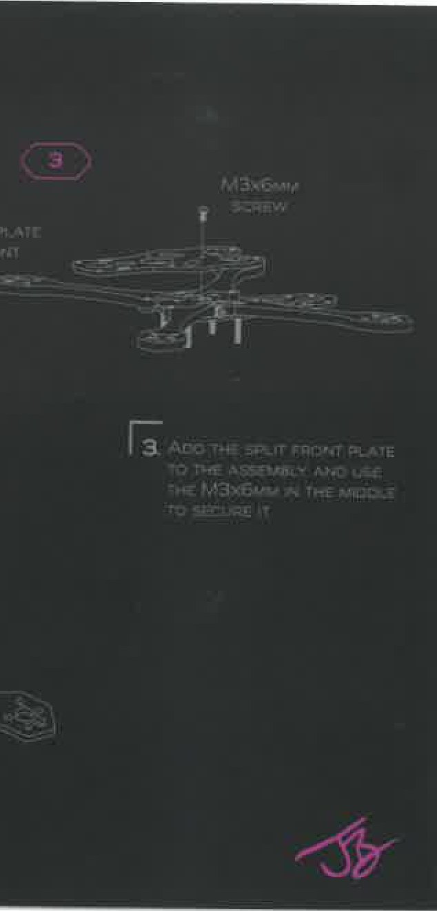
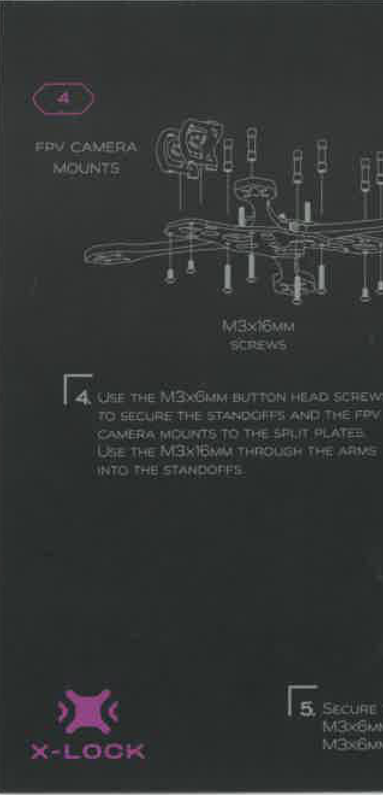
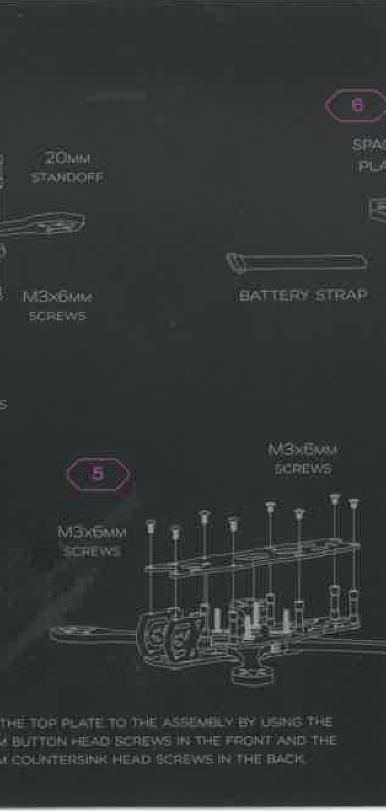
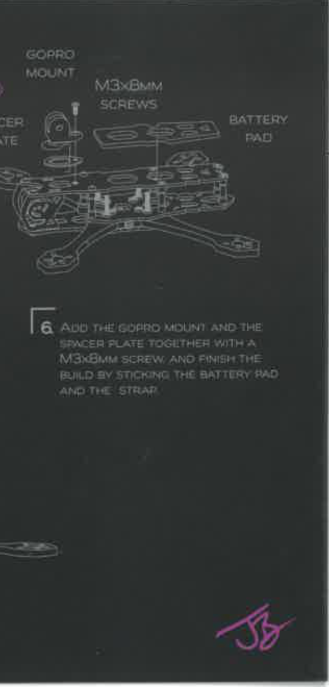

# QAV-S 2 JOSHUA BARDWELL EDITION — Assembly Manual

Auto-generated from manual.pdf using VLM.

---

## Parts List

### Page 2 — parts needed for this assembly

Here is a list of all parts shown in the image:

*   TOP PLATE x1
*   SPLIT PLATE FRONT x1
*   SPLIT PLATE REAR x1
*   5 INCH ARM x4
*   BATTERY PAD x1
*   FPV CAMERA MOUNT LEFT x1
*   SPACER PLATE x1
*   BATTERY STRAP x1
*   FPV CAMERA MOUNT RIGHT x1
*   X-LOCK ARM WEDGE x2
*   X-LOCK FC ISOLATOR x1
*   M2x4mm SCREWS x4
*   M3x8mm SCREWS x16
*   M3x16mm SCREWS x2
*   M3x6mm SCREWS x4
*   M3x8mm SCREWS x1
*   M3x6mm SCREWS x13
*   M3x16mm SCREWS x4
*   M3x22mm SCREWS x4
*   20mm STANDOFF x6
*   GOPRO MOUNT x1

---

## Assembly Steps

### Step 1

Here's the structured information from the assembly instruction manual page:

**Step number:** 1
**Instruction text:** START THE ASSEMBLY BY USING THE SPUT REAR PLATE TO MOUNT THE X-LOCK FC ISOLATOR WITH THE M3x22MM AND THE M3x6MM SCREWS
**Parts referenced:** SPUT REAR PLATE, X-LOCK FC ISOLATOR
**Screws/fasteners:** M3x22mm SCREWS, M3x6mm SCREWS
**Diagram description:** An exploded view showing various screws (M3x22mm and M3x6mm) and an FC Isolator being assembled onto a plate.

**Step number:** 2
**Instruction text:** SECURE THE THE X-LOCK A THE M3x16MM SCREWS TO L
**Parts referenced:** X-LOCK
**Screws/fasteners:** M3x16mm SCREWS
**Diagram description:** (No clear diagram for step 2 is visible in the provided image, only the text for step 2 is partially visible.)

### Step 2

Here's the structured information extracted from the image:

**1. Step number**
2

**2. Instruction text**
Tighten arms by tightening arm wedges using M3x16mm screws to lock them in place.

**3. Parts referenced**
*   Arm wedge
*   5 inch arm
*   Split plate rear
*   Split plate front (partially visible)

**4. Screws/fasteners**
M3x16mm screws

**5. Diagram description**
An exploded view diagram showing the assembly of a drone frame. It illustrates how the "5 inch arm" connects to the main body, secured by an "arm wedge" and "M3x16mm screws". "Split plate rear" and "Split plate front" are also labeled, indicating other components of the frame.

### Step 3

Here's the structured information from the assembly instruction manual page:

**Step number:**
3

**Instruction text:**
ADD THE SPLIT FRONT PLATE TO THE ASSEMBLY AND USE THE M3X6MM IN THE MIDDLE TO SECURE IT

**Parts referenced:**
Split Front Plate
Assembly

**Screws/fasteners:**
M3x6mm screw

**Diagram description:**
An exploded view showing a screw being inserted through a top plate, through an underlying structure, and into a lower plate, indicating the attachment of a "Split Front Plate" to an assembly.

### Step 4

Here's the structured information extracted from the image:

**Step Number:** 4

**Instruction Text:**
USE THE M3x6mm BUTTON HEAD SCREW TO SECURE THE STANDOFFS AND THE FPV CAMERA MOUNTS TO THE SPLIT PLATES. USE THE M3x16mm THROUGH THE ARMS INTO THE STANDOFFS.

**Parts Referenced:**
*   FPV Camera Mounts
*   Standoffs
*   Split Plates
*   Arms

**Screws/Fasteners:**
*   M3x6mm Button Head Screw
*   M3x16mm Screws

**Diagram Description:**
The diagram shows an exploded view of an FPV camera mounting assembly. It illustrates how FPV camera mounts, standoffs, and arms are connected using M3x16mm screws. The FPV camera mounts appear to be secured to split plates.

### Step 5

Here's the structured information extracted from the image:

**1. Step number**
* 5
* 6

**2. Instruction text**
* (For step 5, the instruction is partially visible and reads): "THE TOP PLATE TO THE ASSEMBLY BY USING THE BUTTON HEAD SCREWS IN THE FRONT AND THE M COUNTERSINK HEAD SCREWS IN THE BACK."

**3. Parts referenced**
* 20MM STANDOFF
* BATTERY STRAP
* TOP PLATE (mentioned in instruction text)
* ASSEMBLY (mentioned in instruction text)
* (Part labeled 6, partially visible): SPAC, PLA (likely "SPACER PLATE" or similar)

**4. Screws/fasteners**
* M3x6MM SCREWS (mentioned multiple times)
* BUTTON HEAD SCREWS (mentioned in instruction text)
* M COUNTERSINK HEAD SCREWS (mentioned in instruction text)

**5. Diagram description**
* The diagram for step 5 shows an assembly with multiple standoffs and screws, with a plate being attached. It appears to be a frame or chassis structure.
* The diagram for step 6 shows a "BATTERY STRAP" and a part labeled "SPAC PLA" (likely a spacer plate).
* There's also a diagram showing a "20MM STANDOFF".

### Step 6

Here's the extracted information:

**Step number:**
6

**Instruction text:**
ADD THE GOPRO MOUNT AND THE SPACER PLATE TOGETHER WITH A M3x8MM SCREW AND FINISH THE BUILD BY STICKING THE BATTERY PAD AND THE STRAP

**Parts referenced:**
* GoPro Mount
* Spacer Plate
* Battery Pad
* Strap

**Screws/fasteners:**
* M3x8mm screw

**Diagram description:**
An exploded view showing the assembly of a GoPro mount and a spacer plate onto a base structure, secured with screws. A battery pad is also indicated.

