# Zone-Based Movement & State Report

**Duration:** 929.8s | **Resolution:** 1920x1080 | **Segments:** 31

---

## Segment 0 [00:00.00 - 00:30.00]

  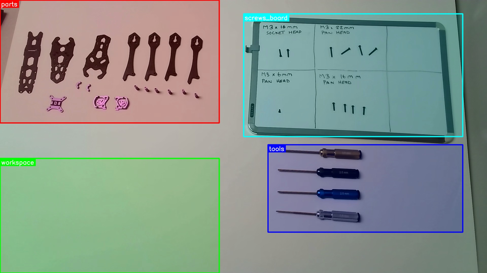    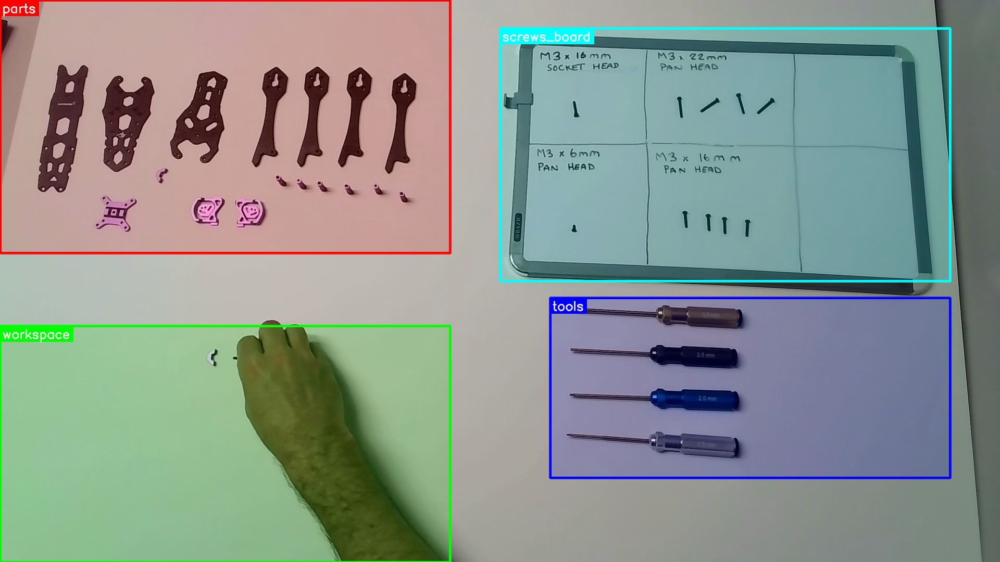    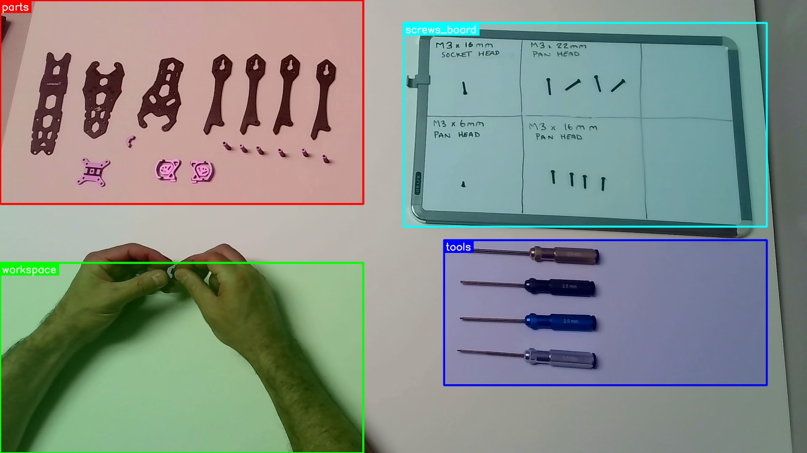

| Zone | Bbox | Objects |
|---|---|---|
| workspace | (0.00, 0.58, 0.45, 1.00) | hands, small purple parts |
| tools | (0.55, 0.53, 0.95, 0.85) | screwdrivers, hex drivers |
| parts | (0.00, 0.00, 0.45, 0.45) | frame components, standoffs, small purple parts |
| screws_board | (0.50, 0.05, 0.95, 0.50) | whiteboard, screws |

**Description**: The person is preparing to assemble a drone frame. They begin by picking up two small, purple, square-shaped parts from the parts zone and placing them in the workspace. These parts appear to be standoffs or similar small structural components.

**Movement**:
  [PART: purple square part @ parts -> workspace]
  [PART: purple square part @ parts -> workspace]

**Zone States**:
  - workspace: Two purple square parts are being held and examined.
  - tools: All four screwdrivers are present.
  - parts: All frame components, standoffs, and structural parts are present, except for the two purple square parts moved to the workspace.
  - screws_board: All screws are present on the board.

**Tools & Parts Summary**:
  Tools: [TOOL: none]
  Parts: [PART: purple square part @ workspace]

## Segment 1 [00:30.00 - 01:00.00]

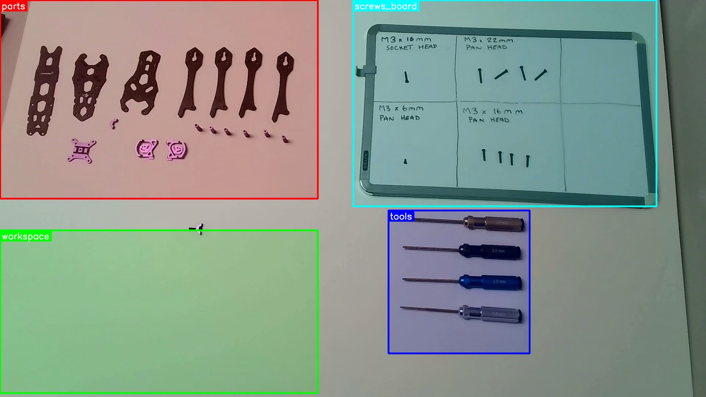    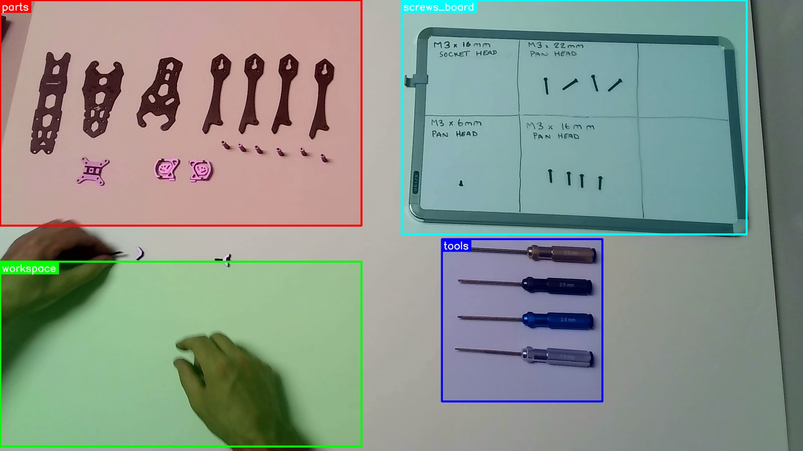      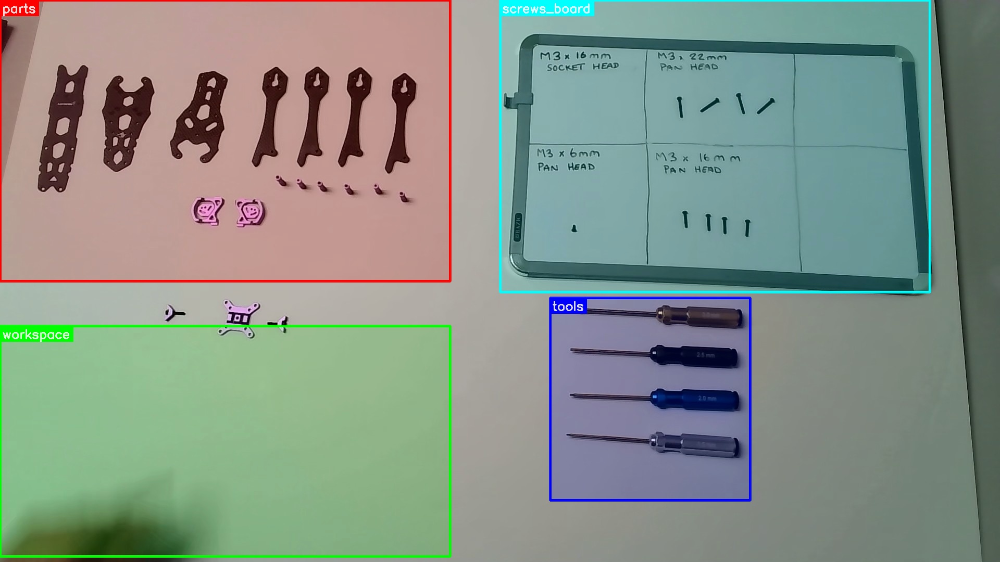

| Zone | Bbox | Objects |
|---|---|---|
| workspace | (0.00, 0.58, 0.45, 0.99) | hands, small purple component, small black component |
| tools | (0.55, 0.53, 0.75, 0.89) | gold hex driver, black hex driver, blue hex driver, silver hex driver |
| parts | (0.00, 0.00, 0.45, 0.50) | black frame components, purple standoffs, small black standoffs |
| screws_board | (0.50, 0.00, 0.93, 0.52) | whiteboard, screws |

**Description**: The person is preparing to assemble a drone frame. They are organizing the small parts, specifically the standoffs, by separating them from the other components and moving them into the workspace. This action clears the parts zone and makes the standoffs readily available for the next assembly step.

**Movement**:
  [PART: standoff @ parts -> workspace]
  [PART: standoff @ parts -> workspace]
  [PART: standoff @ parts -> workspace]
  [PART: standoff @ parts -> workspace]

**Zone States**:
  - workspace: Four standoffs are now present in the workspace.
  - tools: All four hex drivers are present.
  - parts: All standoffs have been removed from the parts zone. The frame components remain.
  - screws_board: All screws remain on the board.

**Tools & Parts Summary**:
  Tools: [TOOL: 2.0mm hex driver @ tools], [TOOL: 2.5mm hex driver @ tools], [TOOL: 1.5mm hex driver @ tools], [TOOL: 3.0mm hex driver @ tools]
  Parts: [PART: standoff @ workspace]

## Segment 2 [01:00.00 - 01:30.00]

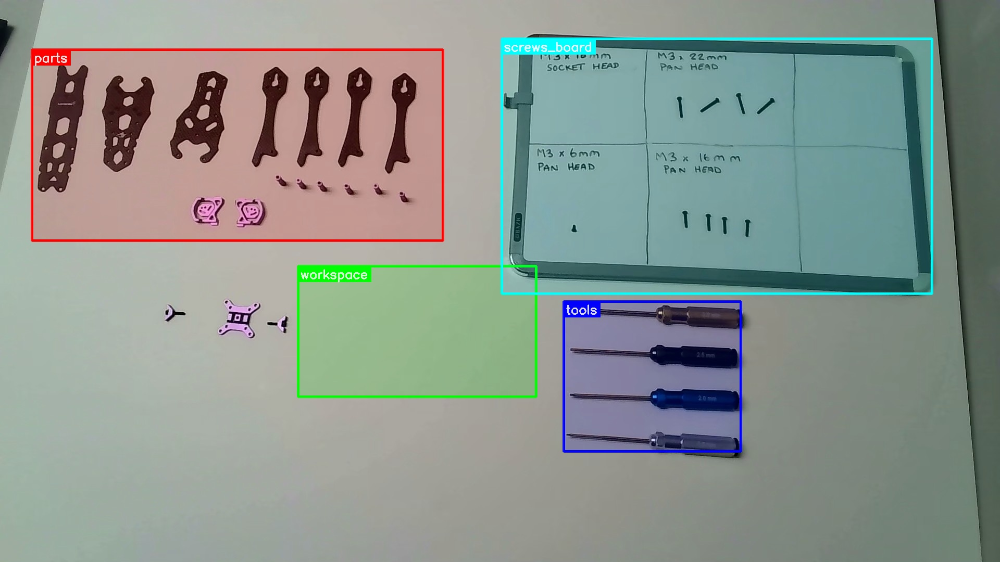      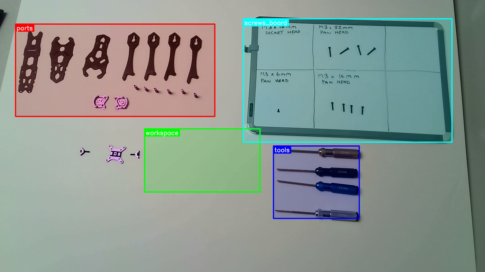    

| Zone | Bbox | Objects |
|---|---|---|
| workspace | (0.30, 0.47, 0.54, 0.71) | hands, screwdriver, small purple parts |
| tools | (0.56, 0.54, 0.74, 0.80) | gold screwdriver, black screwdriver, blue screwdriver, silver screwdriver |
| parts | (0.03, 0.09, 0.44, 0.43) | black frame components, small black standoffs, small purple parts |
| screws_board | (0.50, 0.07, 0.93, 0.52) | whiteboard, screws |

**Description**:
The person is preparing for the assembly by selecting the correct hex driver. They pick up a 2.0mm hex driver from the tools zone and then place it back, indicating they are checking or confirming the tool. This action suggests the next step will involve using this specific tool.

**Movement**:
  [TOOL: hex driver 2.0mm (blue) @ tools -> workspace]
  [TOOL: hex driver 2.0mm (blue) @ workspace -> tools]

**Zone States**:
  - workspace: Empty.
  - tools: All four hex drivers are present.
  - parts: All parts remain in their initial positions.
  - screws_board: All screws remain on the board.

**Tools & Parts Summary**:
  Tools: [TOOL: hex driver 2.0mm (blue) @ tools].
  Parts: [PART: none].

## Segment 3 [01:30.00 - 02:00.00]

  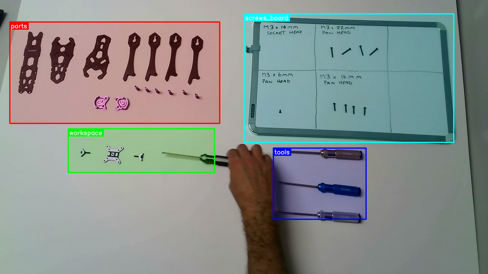    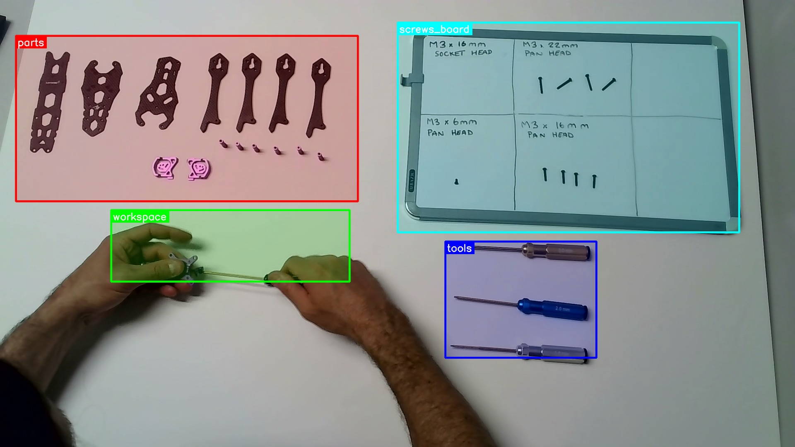  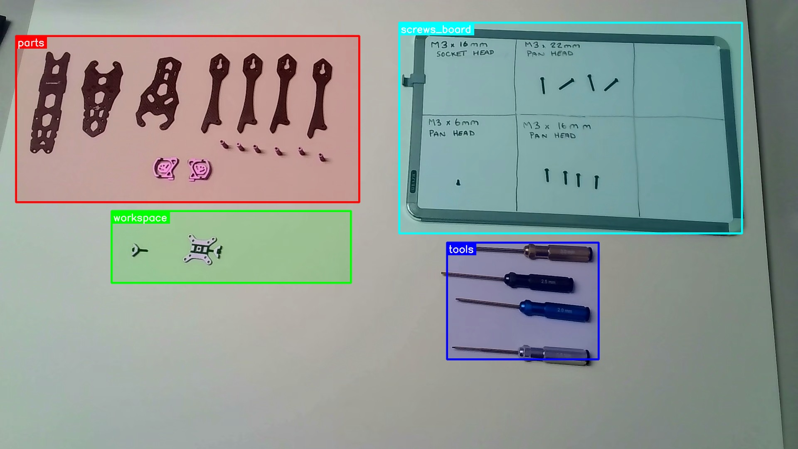  

| Zone | Bbox | Objects |
|---|---|---|
| workspace | (0.14, 0.47, 0.44, 0.63) | hand, screwdriver, purple component |
| tools | (0.56, 0.54, 0.75, 0.80) | screwdrivers |
| parts | (0.02, 0.08, 0.45, 0.45) | frame components, standoffs |
| screws_board | (0.50, 0.05, 0.93, 0.52) | whiteboard, screws |

**Description**:
The person is preparing to assemble a drone frame. They pick up a hex driver and use it to attach a standoff to a frame component. This action is repeated for a second standoff and frame component.

**Movement**:
[TOOL: hex driver 2.0mm @ tools -> workspace]
[PART: standoff @ parts -> workspace]
[PART: frame component @ parts -> workspace]
[TOOL: hex driver 2.0mm @ workspace]
[PART: standoff @ parts -> workspace]
[PART: frame component @ parts -> workspace]
[TOOL: hex driver 2.0mm @ workspace -> tools]

**Zone States**:
- **workspace**: Two frame components, each with a standoff attached.
- **tools**: All four hex drivers are present, with the 2.0mm hex driver returned to its spot.
- **parts**: Two standoffs and two frame components have been removed.
- **screws_board**: No screws have been removed from the board.

**Tools & Parts Summary**:
Tools: [TOOL: hex driver 2.0mm @ tools]
Parts: [PART: standoff @ workspace], [PART: frame component @ workspace]

## Segment 4 [02:00.00 - 02:30.00]

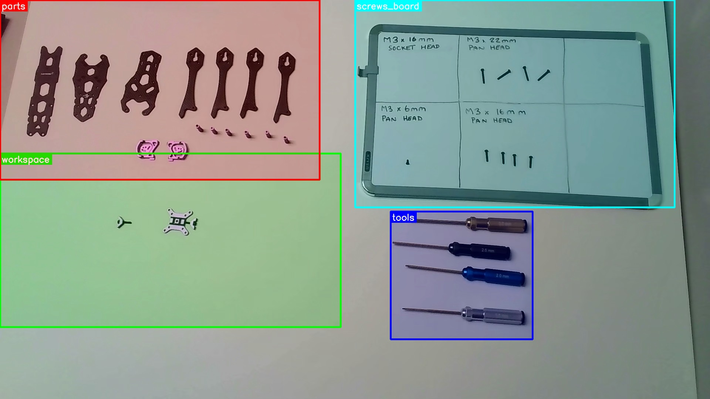    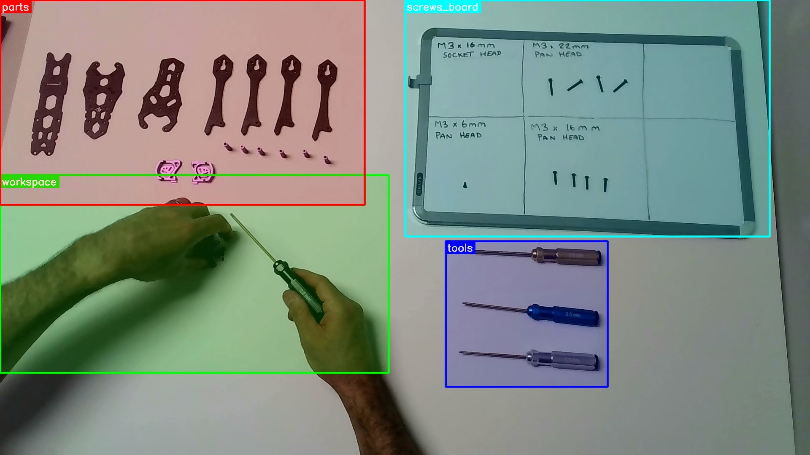    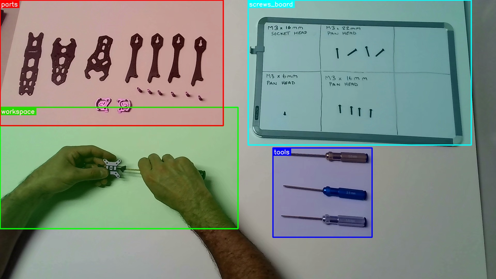  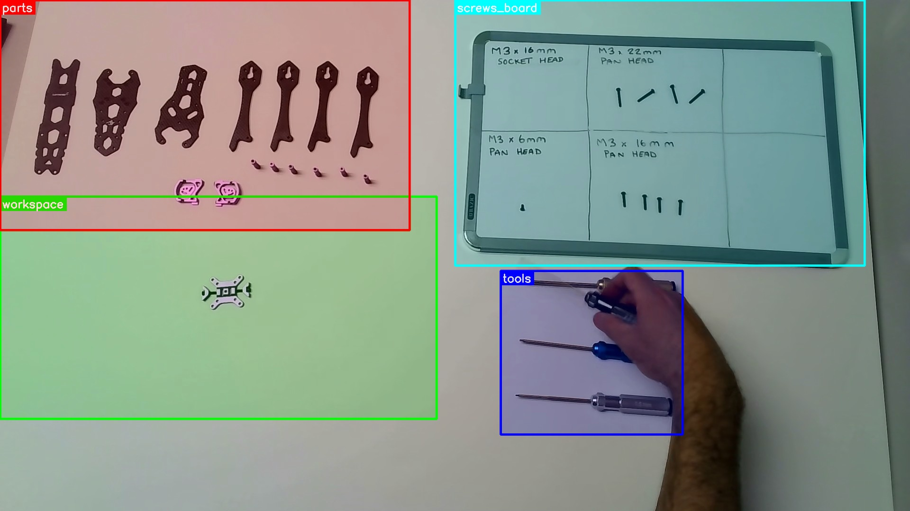

| Zone | Bbox | Objects |
|---|---|---|
| workspace | (0.00, 0.39, 0.48, 0.82) | hand, screwdriver, purple frame part |
| tools | (0.55, 0.53, 0.75, 0.85) | gold screwdriver, blue screwdriver, silver screwdriver |
| parts | (0.00, 0.00, 0.45, 0.45) | black frame parts, small black standoffs, purple frame parts |
| screws_board | (0.50, 0.00, 0.95, 0.52) | whiteboard, screws, text labels |

**Description**: The person is preparing to assemble a small component, likely a camera mount or similar small part, by picking up a small purple part and a screw. They then use a hex driver to attach the screw to the part.

**Movement**:
  [PART: small purple part @ parts -> workspace]
  [TOOL: hex driver 2.0mm @ tools -> workspace]
  [PART: small screw @ parts -> workspace]
  [TOOL: hex driver 2.0mm @ workspace -> tools]

**Zone States**:
  - workspace: a small purple part with a screw partially inserted
  - tools: all hex drivers are present, with the 2.0mm hex driver returned to its spot
  - parts: one small purple part and one small screw have been removed
  - screws_board: all screws are still on the board

**Tools & Parts Summary**:
  Tools: [TOOL: hex driver 2.0mm @ tools]
  Parts: [PART: small purple part @ workspace], [PART: small screw @ workspace]

## Segment 5 [02:30.00 - 03:00.00]

  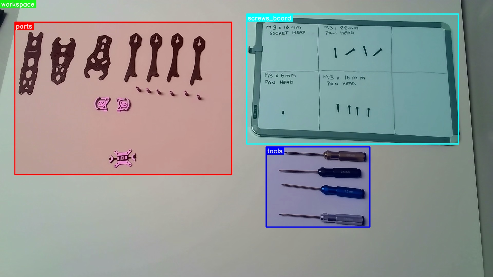        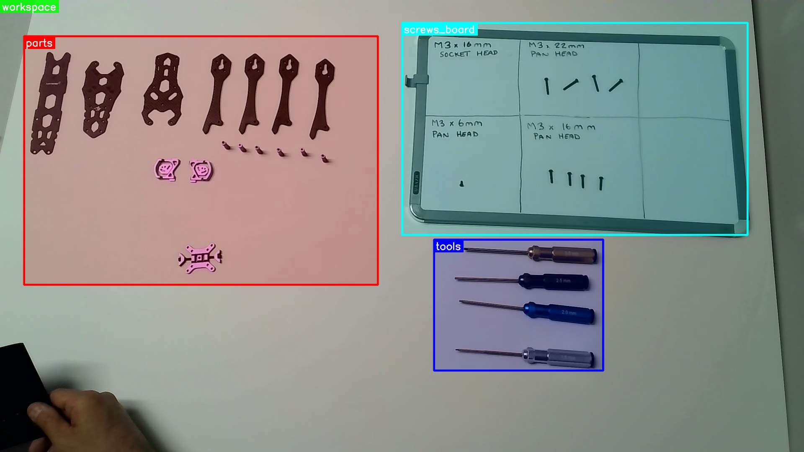

| Zone | Bbox | Objects |
|---|---|---|
| workspace | (0.00, 0.00, 0.00, 0.00) |  |
| tools | (0.54, 0.53, 0.75, 0.82) | screwdrivers, hex drivers |
| parts | (0.03, 0.08, 0.47, 0.63) | frame components, standoffs, structural parts |
| screws_board | (0.50, 0.05, 0.93, 0.52) | whiteboard, screws |

**Description**:
The person is preparing for the assembly process by organizing the tools and parts. They are specifically focusing on the hex drivers, ensuring they are readily available for use. This segment is a setup phase, making sure everything is in place before starting the actual assembly.

**Movement**:
  [TOOL: hex screwdriver 2.0mm @ tools]
  [TOOL: hex screwdriver 2.5mm @ tools]
  [TOOL: hex screwdriver 1.5mm @ tools]
  [TOOL: hex screwdriver 3.0mm @ tools]

**Zone States**:
  - workspace: Empty.
  - tools: All four hex screwdrivers (3.0mm, 2.5mm, 2.0mm, 1.5mm) are present and organized.
  - parts: All frame components, standoffs, and structural parts are present and organized.
  - screws_board: All screws are present on the board.

**Tools & Parts Summary**:
  Tools: [TOOL: hex screwdriver 3.0mm @ tools], [TOOL: hex screwdriver 2.5mm @ tools], [TOOL: hex screwdriver 2.0mm @ tools], [TOOL: hex screwdriver 1.5mm @ tools]
  Parts: [PART: none]

## Segment 6 [03:00.00 - 03:30.00]

        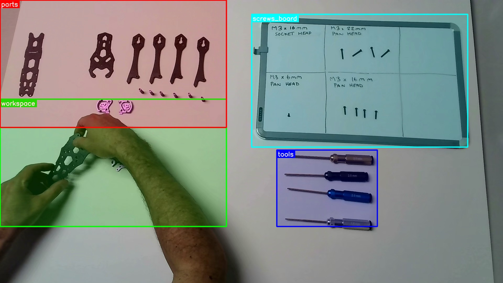  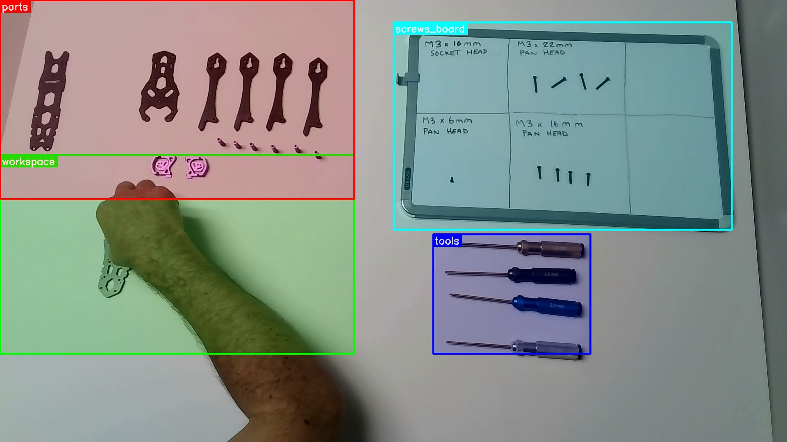

| Zone | Bbox | Objects |
|---|---|---|
| workspace | (0.00, 0.35, 0.45, 0.80) | hand, frame component |
| tools | (0.55, 0.53, 0.75, 0.80) | screwdrivers, hex drivers |
| parts | (0.00, 0.00, 0.45, 0.45) | frame components, standoffs |
| screws_board | (0.50, 0.05, 0.93, 0.52) | whiteboard, screws |

**Description**:
The person is preparing to assemble a drone frame. They are identifying and selecting the main frame plate from the "parts" zone. This action marks the beginning of the physical assembly process, as the main frame plate is typically the foundation upon which other components are attached.

**Movement**:
[PART: main frame plate @ parts -> workspace]

**Zone States**:
- **workspace**: The main frame plate is now in the workspace.
- **tools**: All four hex drivers (gold 2.5mm, black 2.5mm, blue 2.0mm, silver 1.5mm) are present.
- **parts**: One main frame plate has been removed. The remaining frame components, standoffs, and structural parts are still present.
- **screws_board**: All screws are still on the board.

**Tools & Parts Summary**:
Tools: [TOOL: none]
Parts: [PART: main frame plate @ workspace]

## Segment 7 [03:30.00 - 04:00.00]

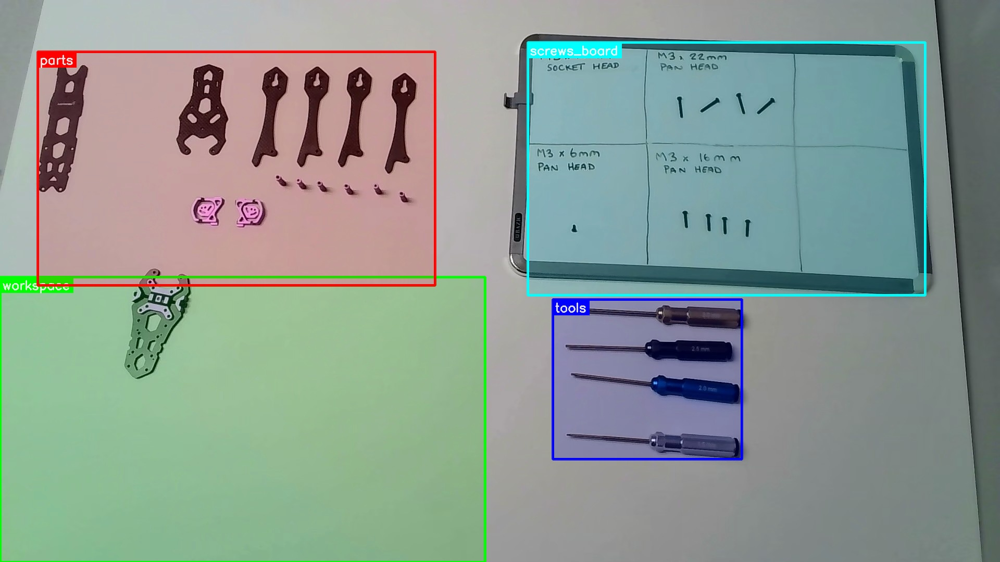      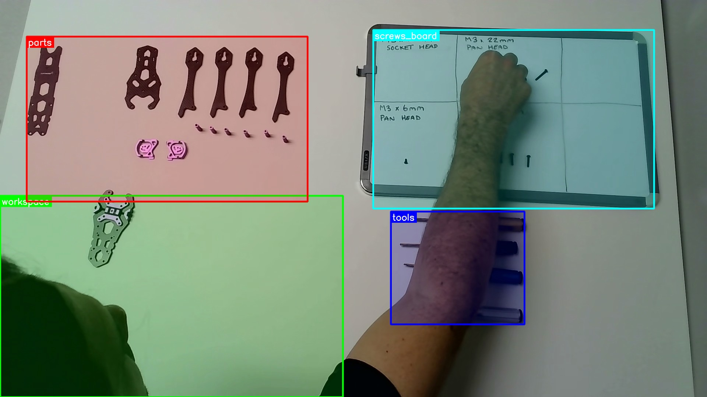    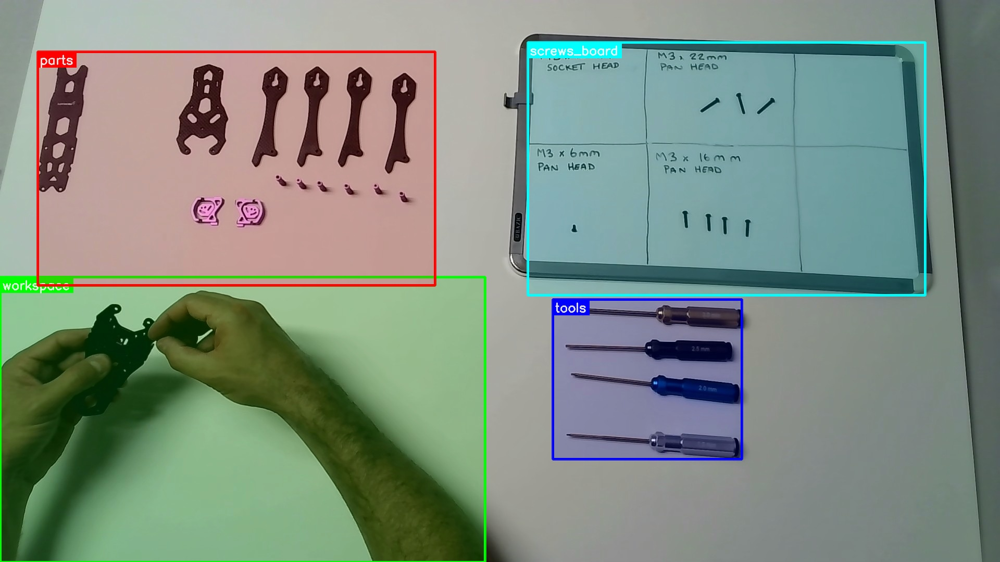

| Zone | Bbox | Objects |
|---|---|---|
| workspace | (0.00, 0.49, 0.48, 1.00) | hands, frame components, screws |
| tools | (0.55, 0.53, 0.74, 0.82) | screwdrivers, hex drivers |
| parts | (0.04, 0.09, 0.43, 0.51) | frame components, standoffs |
| screws_board | (0.53, 0.07, 0.93, 0.53) | whiteboard, screws |

**Description**: The person is continuing to assemble the drone frame. They are attaching the bottom plate to the frame arms using screws and standoffs. This step involves securing the frame's structural components together.

**Movement**:
  [PART: M3x22mm pan head screw @ screws_board -> workspace]
  [PART: standoff @ parts -> workspace]
  [PART: frame arm @ parts -> workspace]
  [PART: bottom plate @ parts -> workspace]
  [PART: M3x22mm pan head screw @ screws_board -> workspace]
  [PART: standoff @ parts -> workspace]
  [PART: frame arm @ parts -> workspace]

**Zone States**:
  - workspace: The person is holding a partially assembled frame arm with a standoff and screw, and another frame arm with a standoff and screw.
  - tools: All screwdrivers are present.
  - parts: One bottom plate, one top plate, two frame arms, and two standoffs remain.
  - screws_board: Two M3x22mm pan head screws have been removed.

**Tools & Parts Summary**:
  Tools: [TOOL: none].
  Parts: [PART: M3x22mm pan head screw @ screws_board], [PART: standoff @ parts], [PART: frame arm @ parts], [PART: bottom plate @ parts].

## Segment 8 [04:00.00 - 04:30.00]

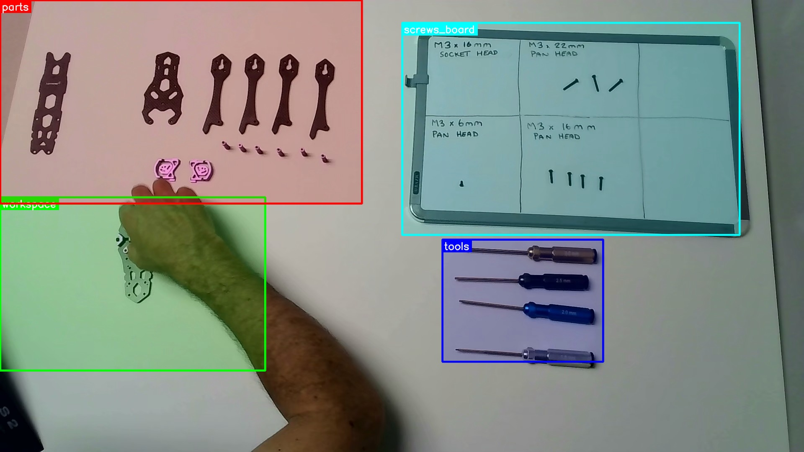  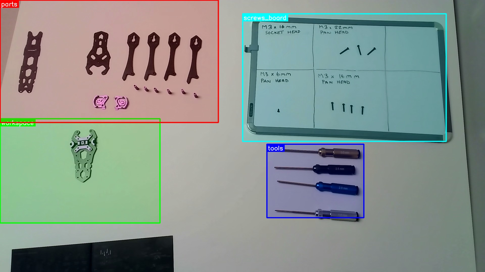        

| Zone | Bbox | Objects |
|---|---|---|
| workspace | (0.00, 0.44, 0.33, 0.82) | hand, frame component, standoffs |
| tools | (0.55, 0.53, 0.75, 0.80) | hex drivers |
| parts | (0.00, 0.00, 0.45, 0.45) | frame components, standoffs |
| screws_board | (0.50, 0.05, 0.92, 0.52) | whiteboard, screws |

**Description**: The person is assembling the frame of the drone. They are attaching the bottom plate to the frame arms using standoffs. This involves carefully aligning the parts and securing them together.

**Movement**:
[PART: bottom plate @ parts -> workspace]
[PART: standoff @ parts -> workspace]
[PART: standoff @ parts -> workspace]
[PART: standoff @ parts -> workspace]
[PART: standoff @ parts -> workspace]

**Zone States**:
- workspace: The bottom plate is being held, with four standoffs attached to it.
- tools: All four hex drivers (2.0mm, 2.5mm, 2.5mm, 3.0mm) are present.
- parts: The top plate and four frame arms remain.
- screws_board: All screws are still on the board.

**Tools & Parts Summary**:
Tools: [TOOL: none]
Parts: [PART: bottom plate @ workspace], [PART: standoff @ workspace]

## Segment 9 [04:30.00 - 05:00.00]

    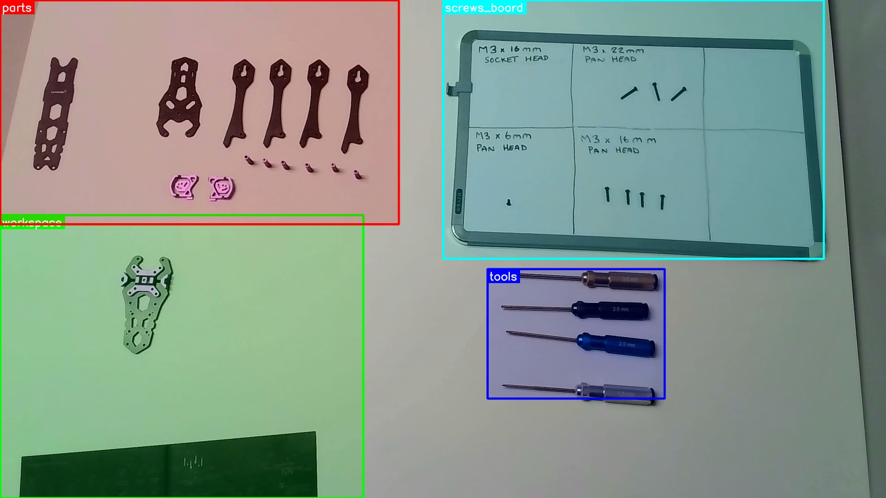    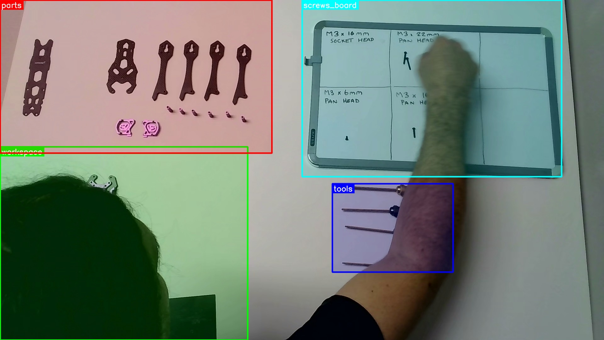  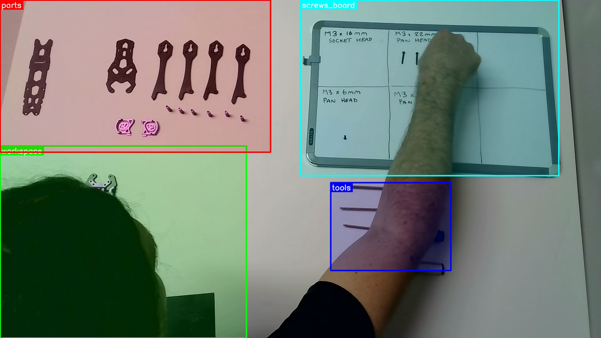

| Zone | Bbox | Objects |
|---|---|---|
| workspace | (0.00, 0.43, 0.41, 1.00) | hands, frame components |
| tools | (0.55, 0.54, 0.75, 0.80) | screwdrivers, hex drivers |
| parts | (0.00, 0.00, 0.45, 0.45) | frame components, standoffs |
| screws_board | (0.50, 0.00, 0.93, 0.52) | whiteboard, screws |

**Description**: The person is preparing to assemble the drone frame. They are taking a frame arm and a frame plate from the parts zone and placing them in the workspace. They then remove three M3x22mm pan head screws from the screws board, indicating they will be used in the next step.

**Movement**:
  [PART: frame arm @ parts -> workspace]
  [PART: frame plate @ parts -> workspace]
  [SCREW: M3x22mm pan head screw @ screws_board -> workspace] (x3)

**Zone States**:
  - workspace: Contains one frame arm, one frame plate, and three M3x22mm pan head screws.
  - tools: All four hex screwdrivers (2.5mm, 2.0mm, 1.5mm, 3.0mm) are present.
  - parts: One frame arm and one frame plate have been removed. The remaining frame components and standoffs are still present.
  - screws_board: Three M3x22mm pan head screws have been removed from the board.

**Tools & Parts Summary**:
  Tools: [TOOL: none]
  Parts: [PART: frame arm @ workspace], [PART: frame plate @ workspace], [SCREW: M3x22mm pan head screw @ workspace]

## Segment 10 [05:00.00 - 05:30.00]

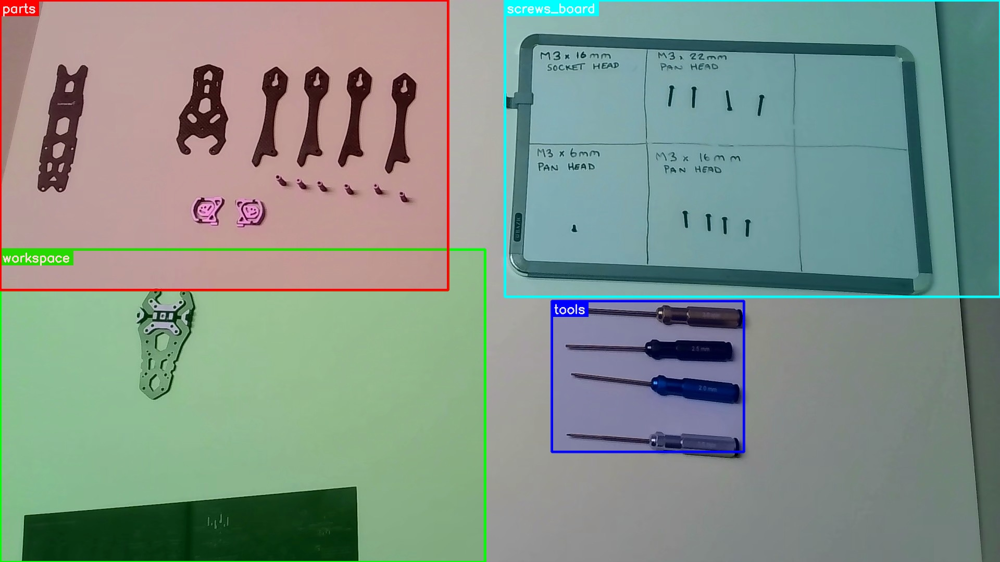  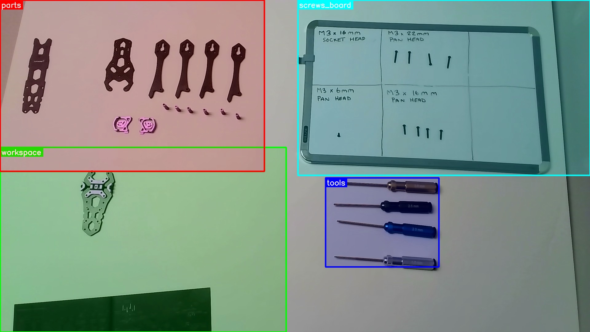  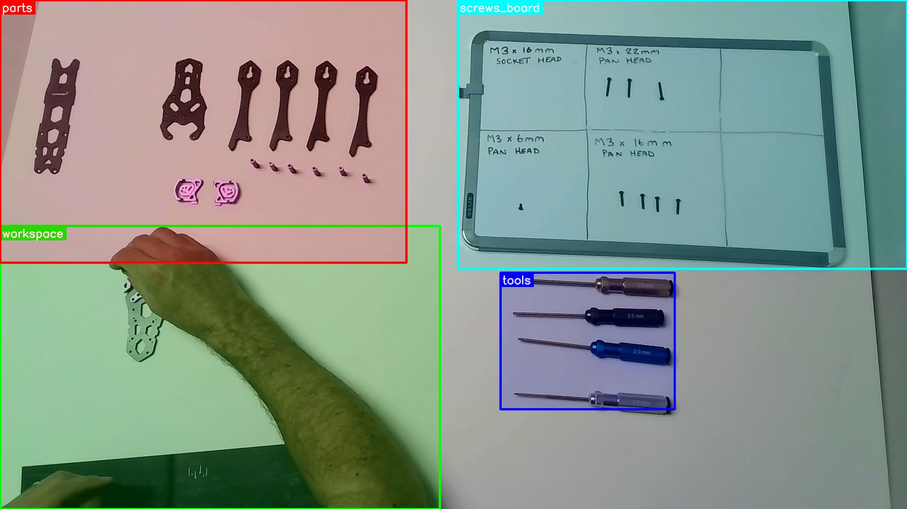      

| Zone | Bbox | Objects |
|---|---|---|
| workspace | (0.00, 0.44, 0.48, 1.00) | hand, frame component |
| tools | (0.55, 0.54, 0.74, 0.80) | hex drivers, screwdrivers |
| parts | (0.00, 0.00, 0.45, 0.52) | frame components, standoffs |
| screws_board | (0.51, 0.00, 1.00, 0.53) | whiteboard, screws |

**Description**: The person is preparing to assemble the drone frame. They pick up the bottom plate of the drone frame and then select a 2.0mm hex driver from the tools area. They then use the hex driver to attach the bottom plate to the main frame, securing it with screws.

**Movement**:
[PART: bottom plate @ parts -> workspace]
[TOOL: hex driver 2.0mm @ tools -> workspace]
[PART: M3x6mm screw @ screws_board -> workspace]
[PART: M3x6mm screw @ screws_board -> workspace]
[PART: M3x6mm screw @ screws_board -> workspace]
[PART: M3x6mm screw @ screws_board -> workspace]
[TOOL: hex driver 2.0mm @ workspace -> tools]

**Zone States**:
  - workspace: The bottom plate is now attached to the main frame.
  - tools: All hex drivers are present, with the 2.0mm hex driver returned to its spot.
  - parts: The bottom plate has been used.
  - screws_board: Four M3x6mm pan head screws have been removed.

**Tools & Parts Summary**:
  Tools: [TOOL: hex driver 2.0mm @ tools]
  Parts: [PART: bottom plate @ workspace], [PART: M3x6mm screw @ screws_board]

## Segment 11 [05:30.00 - 06:00.00]

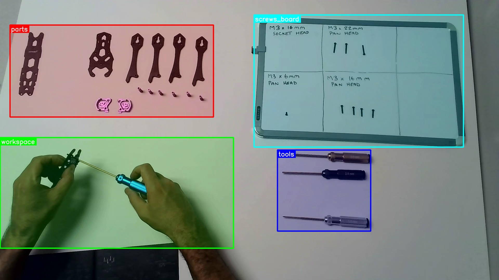  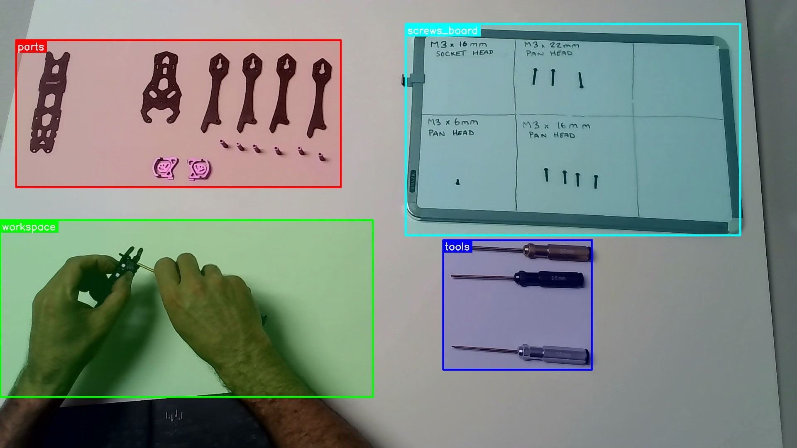    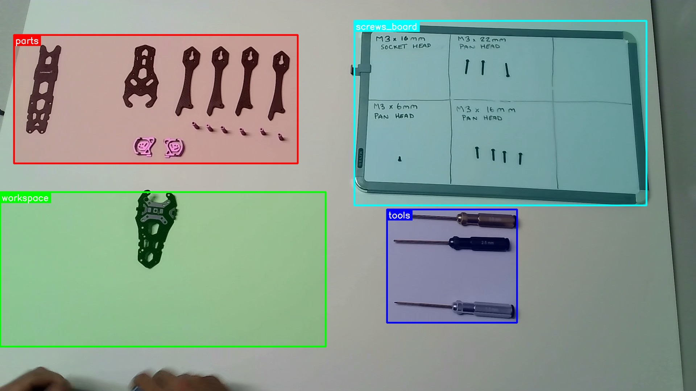  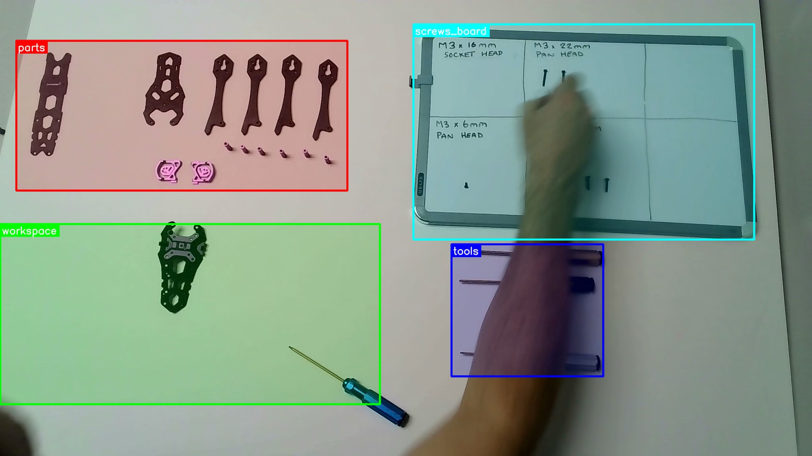  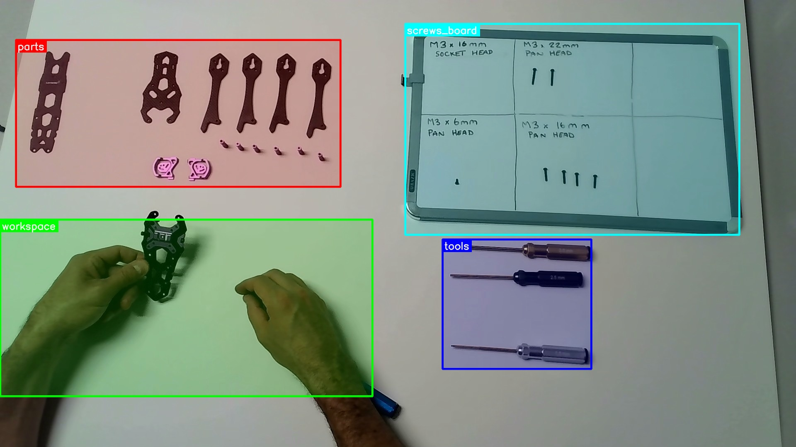

| Zone | Bbox | Objects |
|---|---|---|
| workspace | (0.00, 0.49, 0.47, 0.89) | hands, screwdriver, frame components |
| tools | (0.56, 0.54, 0.74, 0.82) | screwdrivers, hex drivers |
| parts | (0.02, 0.09, 0.43, 0.42) | frame components, standoffs |
| screws_board | (0.51, 0.05, 0.93, 0.53) | whiteboard, screws |

**Description**: The person is assembling the bottom plate of the drone frame. They attach the first standoff to the bottom plate using a screw, then pick up another screw to attach the second standoff. The end result is the bottom plate with two standoffs attached.

**Movement**:
[TOOL: hex screwdriver 2.0mm @ workspace]
[PART: M3x16mm pan head screw @ screws_board -> workspace]
[PART: bottom plate @ workspace]
[PART: standoff @ workspace]
[PART: M3x16mm pan head screw @ screws_board -> workspace]

**Zone States**:
- workspace: The bottom plate with two standoffs attached is being held.
- tools: The 2.0mm hex screwdriver is being used. The 2.5mm and 1.5mm hex screwdrivers are present.
- parts: All frame components, standoffs, and structural parts are present except for two standoffs that are now attached to the bottom plate.
- screws_board: Two M3x16mm pan head screws have been removed.

**Tools & Parts Summary**:
Tools: [TOOL: hex screwdriver 2.0mm @ workspace]
Parts: [PART: bottom plate @ workspace], [PART: standoff @ workspace]

## Segment 12 [06:00.00 - 06:30.00]

  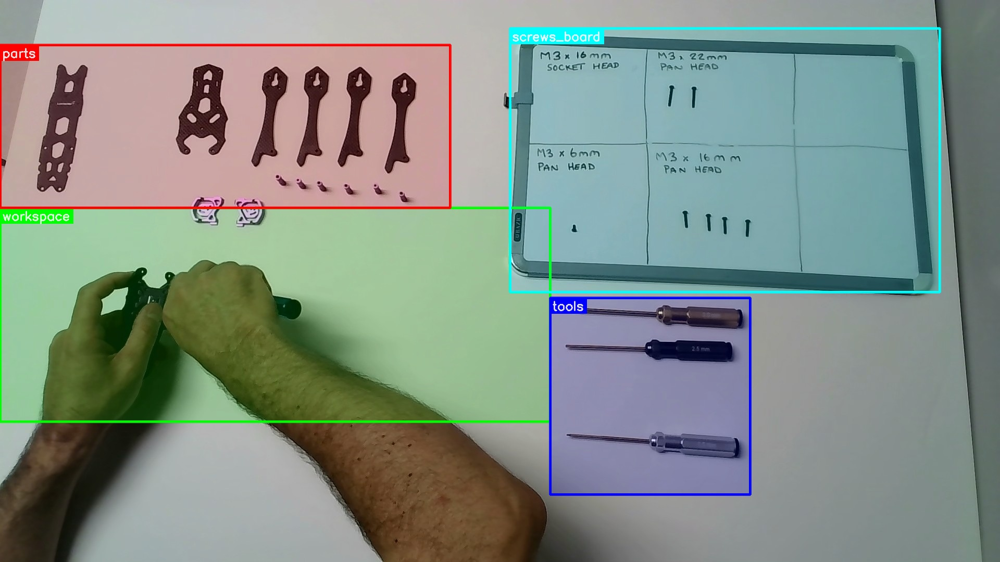    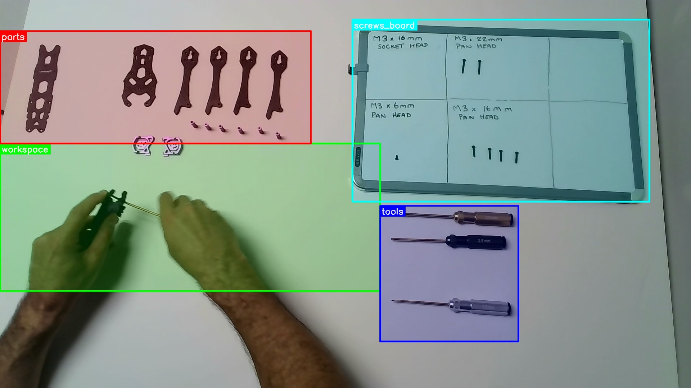  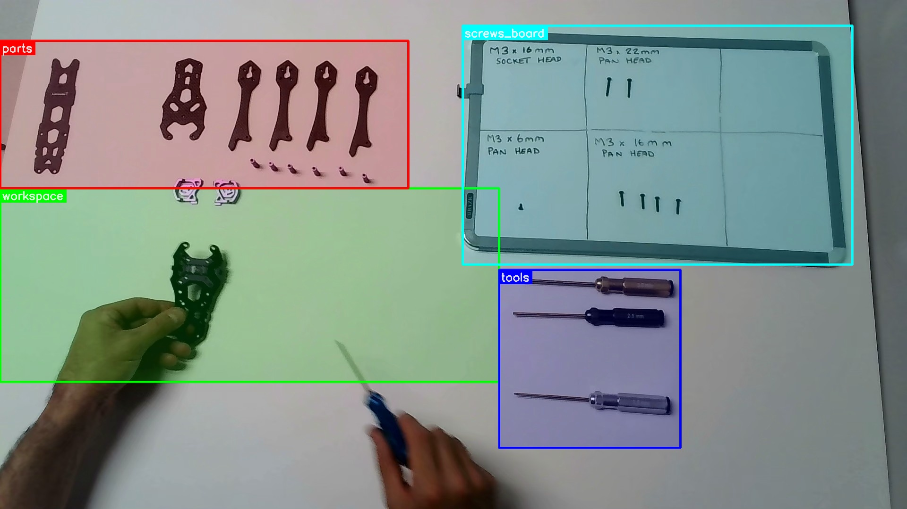  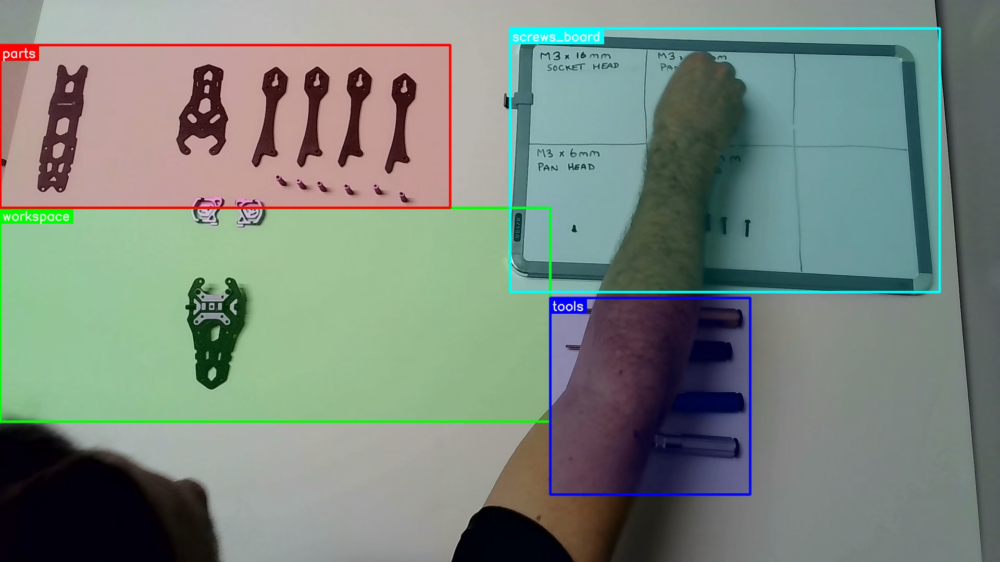

| Zone | Bbox | Objects |
|---|---|---|
| workspace | (0.00, 0.37, 0.55, 0.75) | hands, purple frame components, screwdriver |
| tools | (0.55, 0.53, 0.75, 0.88) | three screwdrivers |
| parts | (0.00, 0.08, 0.45, 0.37) | black frame components, small purple standoffs, small screws |
| screws_board | (0.51, 0.05, 0.94, 0.52) | whiteboard with screw types and sizes |

**Description**: The person is assembling the bottom plate of the drone frame. They attach two purple standoffs to the bottom plate using M3x16mm pan head screws, securing them with a hex driver. This step prepares the bottom plate for further assembly.

**Movement**:
  [PART: bottom plate @ parts -> workspace]
  [PART: standoff (purple) @ parts -> workspace]
  [PART: standoff (purple) @ parts -> workspace]
  [TOOL: hex driver 2.0mm @ tools -> workspace]
  [PART: M3x16mm pan head screw @ screws_board -> workspace]
  [PART: M3x16mm pan head screw @ screws_board -> workspace]
  [TOOL: hex driver 2.0mm @ workspace -> tools]

**Zone States**:
  - workspace: The bottom plate with two purple standoffs attached.
  - tools: All three hex drivers are present. The 2.0mm hex driver is back in its resting place.
  - parts: All frame components, standoffs, and structural parts are present, except for two purple standoffs that have been used.
  - screws_board: Two M3x16mm pan head screws have been removed from the board.

**Tools & Parts Summary**:
  Tools: [TOOL: hex driver 2.0mm @ tools]
  Parts: [PART: bottom plate @ workspace], [PART: standoff (purple) @ workspace]

## Segment 13 [06:30.00 - 07:00.00]

      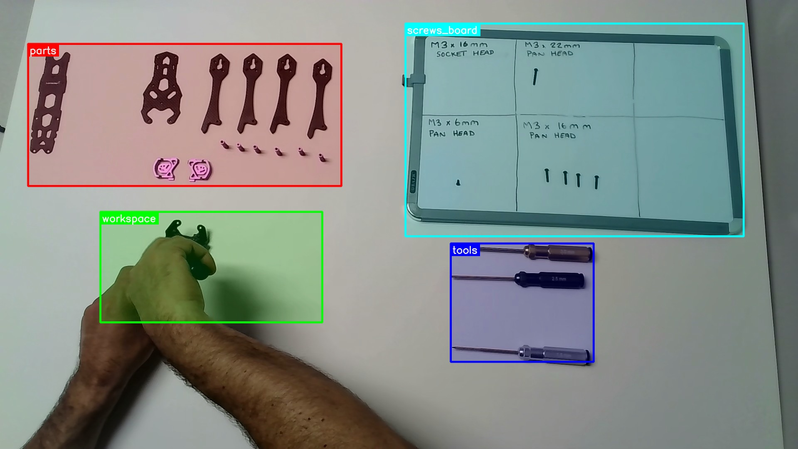  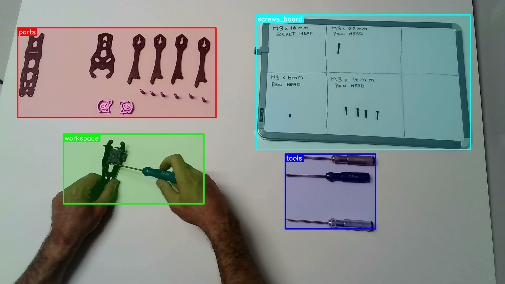  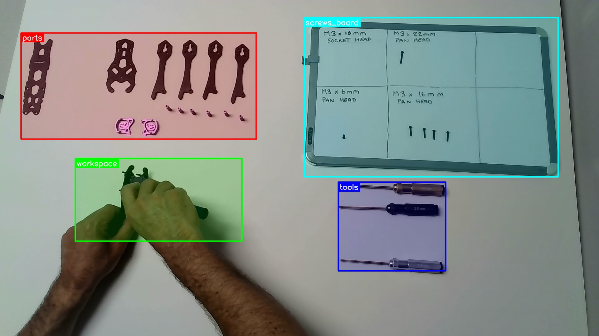

| Zone | Bbox | Objects |
|---|---|---|
| workspace | (0.13, 0.47, 0.40, 0.72) | hands, screwdriver, frame component |
| tools | (0.56, 0.54, 0.74, 0.81) | screwdrivers, hex drivers |
| parts | (0.04, 0.10, 0.43, 0.41) | drone frame components, standoffs |
| screws_board | (0.51, 0.05, 0.93, 0.53) | whiteboard, screws |

**Description**:
The person is assembling the bottom plate of the drone frame. They are attaching the bottom plate to the frame using a screw and a hex driver. This step involves securing one of the frame components.

**Movement**:
  [PART: bottom plate @ parts -> workspace]
  [TOOL: hex driver 2.0mm @ tools -> workspace]
  [PART: M3x16mm pan head screw @ screws_board -> workspace]
  [TOOL: hex driver 2.0mm @ workspace -> tools]

**Zone States**:
  - workspace: The bottom plate of the drone frame is being held, with one M3x16mm pan head screw partially inserted.
  - tools: The 2.0mm hex driver is present. The 2.5mm and 1.5mm hex drivers are also present.
  - parts: All frame components, standoffs, and structural parts are still present, except for the bottom plate.
  - screws_board: One M3x16mm pan head screw has been removed from the board.

**Tools & Parts Summary**:
  Tools: [TOOL: hex driver 2.0mm @ tools]
  Parts: [PART: bottom plate @ workspace], [PART: M3x16mm pan head screw @ workspace]

## Segment 14 [07:00.00 - 07:30.00]

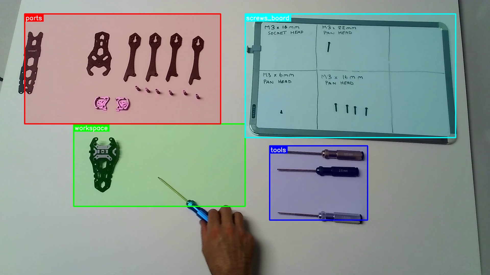  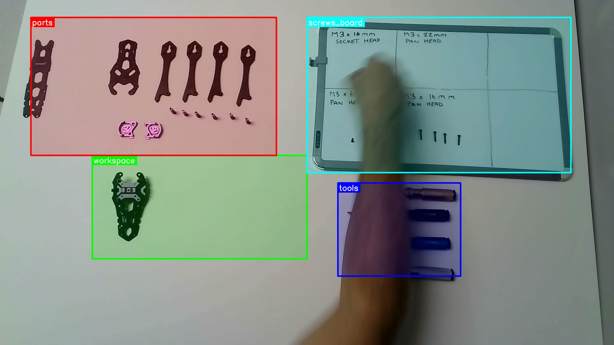      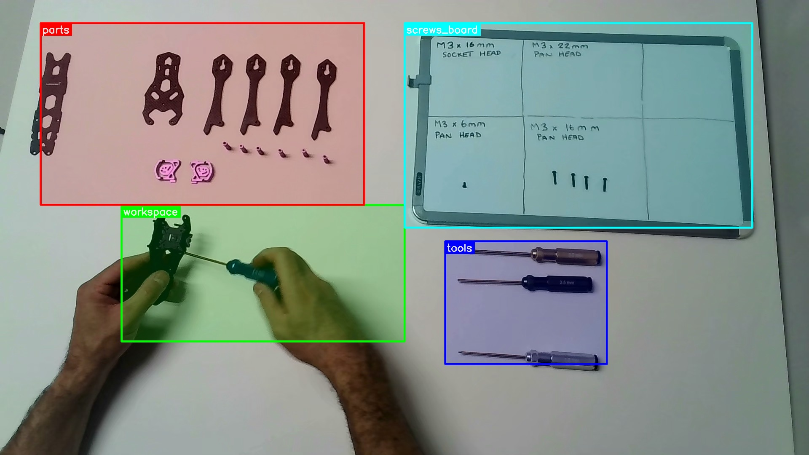  

| Zone | Bbox | Objects |
|---|---|---|
| workspace | (0.15, 0.45, 0.50, 0.75) | hands, frame components, screwdriver |
| tools | (0.55, 0.53, 0.75, 0.80) | screwdrivers |
| parts | (0.05, 0.05, 0.45, 0.45) | frame components, standoffs |
| screws_board | (0.50, 0.05, 0.93, 0.50) | whiteboard, screws |

**Description**: The person is attaching the top plate of the drone frame to the bottom plate using screws. They pick up a screw from the screws board, insert it into the frame, and then use a hex driver to tighten it. This process is repeated for a second screw.

**Movement**:
  [TOOL: hex driver 2.0mm @ workspace]
  [PART: M3x16mm socket head screw @ screws_board -> workspace]
  [TOOL: hex driver 2.0mm @ workspace]
  [PART: M3x16mm socket head screw @ screws_board -> workspace]
  [TOOL: hex driver 2.0mm @ workspace -> tools]

**Zone States**:
  - workspace: The drone frame (bottom plate with top plate attached by two screws) is present.
  - tools: All three hex drivers are present. The 2.0mm hex driver has been returned to the tools zone.
  - parts: The remaining frame components, standoffs, and structural parts are still in the parts zone.
  - screws_board: Two M3x16mm socket head screws have been removed from the screws board.

**Tools & Parts Summary**:
  Tools: [TOOL: hex driver 2.0mm @ tools]
  Parts: [PART: drone frame @ workspace]

## Segment 15 [07:30.00 - 08:00.00]

          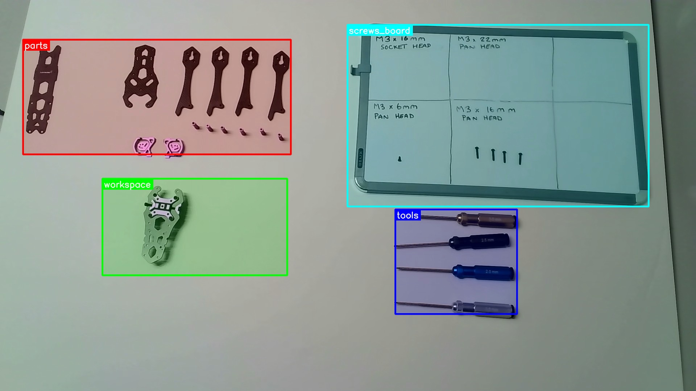

| Zone | Bbox | Objects |
|---|---|---|
| workspace | (0.15, 0.46, 0.41, 0.70) | hands, screwdriver, drone frame part |
| tools | (0.57, 0.54, 0.74, 0.80) | screwdrivers, hex drivers |
| parts | (0.03, 0.10, 0.42, 0.40) | drone frame components, standoffs, screws |
| screws_board | (0.50, 0.06, 0.93, 0.53) | whiteboard, screws |

**Description**:
The person is assembling the bottom plate of the drone frame. They are attaching the two purple camera mounts to the bottom plate using a hex screwdriver and M3x6mm pan head screws. This step secures the camera mounts to the main frame structure.

**Movement**:
[TOOL: hex screwdriver 2.0mm @ workspace]
[PART: assembled bottom plate with camera mounts @ workspace]
[SCREW: M3x6mm pan head screw @ screws_board -> workspace]

**Zone States**:
- **workspace**: The assembled bottom plate with two purple camera mounts attached is being held and worked on. The hex screwdriver 2.0mm is actively being used.
- **tools**: The 2.5mm hex screwdriver and the silver hex screwdriver remain in the tools zone. The 2.0mm hex screwdriver is currently in use.
- **parts**: All frame components, standoffs, and structural parts remain in the parts zone.
- **screws_board**: One M3x6mm pan head screw has been removed from the screws_board.

**Tools & Parts Summary**:
Tools: [TOOL: hex screwdriver 2.0mm @ workspace]
Parts: [PART: assembled bottom plate with camera mounts @ workspace], [SCREW: M3x6mm pan head screw @ workspace]

## Segment 16 [08:00.00 - 08:30.00]

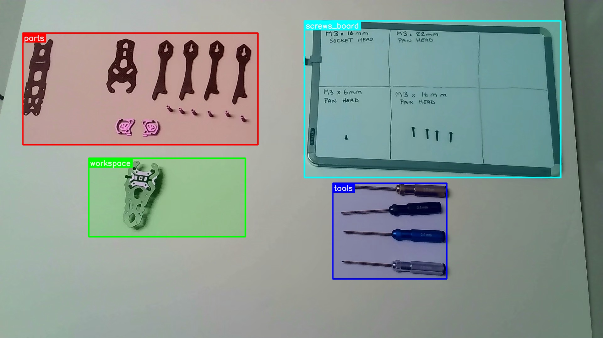      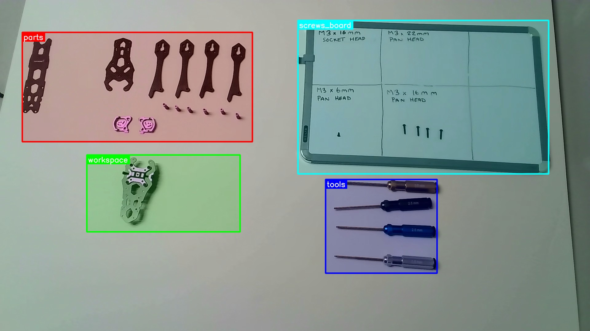    

| Zone | Bbox | Objects |
|---|---|---|
| workspace | (0.15, 0.47, 0.41, 0.70) | assembled drone part |
| tools | (0.55, 0.54, 0.74, 0.82) | screwdrivers |
| parts | (0.04, 0.10, 0.43, 0.43) | drone frame components, standoffs |
| screws_board | (0.51, 0.06, 0.93, 0.53) | whiteboard with screw organization |

**Description**: The person is preparing to attach the arms to the drone frame. They pick up one of the frame arms and then a standoff, placing them into the workspace. They then pick up a screw from the screws board and use a hex driver to attach the standoff to the arm.

**Movement**:
  [PART: frame arm @ parts -> workspace]
  [PART: standoff @ parts -> workspace]
  [TOOL: hex screwdriver 2.0mm @ tools -> workspace]
  [PART: M3x6mm pan head screw @ screws_board -> workspace]
  [TOOL: hex screwdriver 2.0mm @ workspace -> tools]

**Zone States**:
  - workspace: A frame arm with a standoff attached by one screw.
  - tools: All hex screwdrivers are present.
  - parts: One frame arm and one standoff are missing.
  - screws_board: One M3x6mm pan head screw is missing.

**Tools & Parts Summary**:
  Tools: [TOOL: hex screwdriver 2.0mm @ workspace]
  Parts: [PART: frame arm @ workspace], [PART: standoff @ workspace], [PART: M3x6mm pan head screw @ workspace]

## Segment 17 [08:30.00 - 09:00.00]

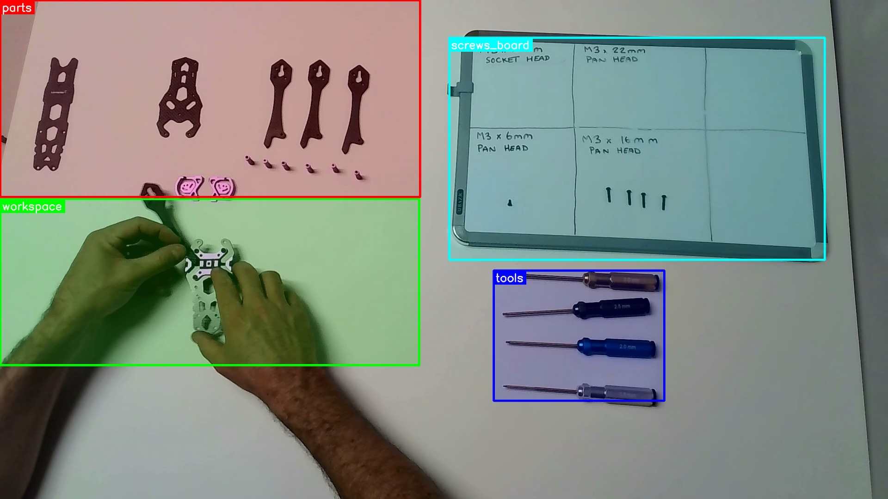        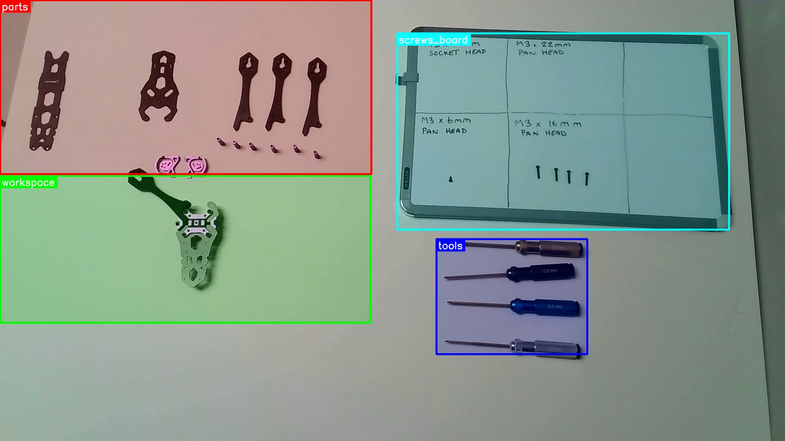  

| Zone | Bbox | Objects |
|---|---|---|
| workspace | (0.00, 0.40, 0.47, 0.73) | hands, drone frame parts, screws |
| tools | (0.56, 0.54, 0.75, 0.80) | screwdrivers, hex drivers |
| parts | (0.00, 0.00, 0.47, 0.40) | drone frame components, standoffs |
| screws_board | (0.51, 0.07, 0.93, 0.52) | whiteboard, screws |

Here's an analysis of the provided keyframes:

**Description**:
The person is assembling the drone frame by attaching the arms to the main body. They are carefully aligning each arm with the designated slots on the frame. This segment focuses on the initial placement of the arms before any screws are introduced.

**Movement**:
* [PART: frame arm @ parts -> workspace]
* [PART: frame arm @ parts -> workspace]
* [PART: frame arm @ parts -> workspace]
* [PART: frame arm @ parts -> workspace]
* [PART: frame body @ workspace] (remains in workspace)

**Zone States**:
*   **workspace**: The drone frame body with four arms attached (not yet secured with screws) is present.
*   **tools**: All four hex drivers (gold, black, blue, silver) are present and resting in the tools zone.
*   **parts**: The remaining frame components (top plate, bottom plate, and standoffs) are still in the parts zone. All four frame arms have been moved from this zone.
*   **screws_board**: All screws are still on the screws_board.

**Tools & Parts Summary**:
*   Tools: [TOOL: hex driver 2.0mm @ tools], [TOOL: hex driver 2.5mm (black) @ tools], [TOOL: hex driver 2.5mm (gold) @ tools], [TOOL: hex driver 1.5mm @ tools]
*   Parts: [PART: frame body @ workspace], [PART: frame arm @ workspace]

## Segment 18 [09:00.00 - 09:30.00]

    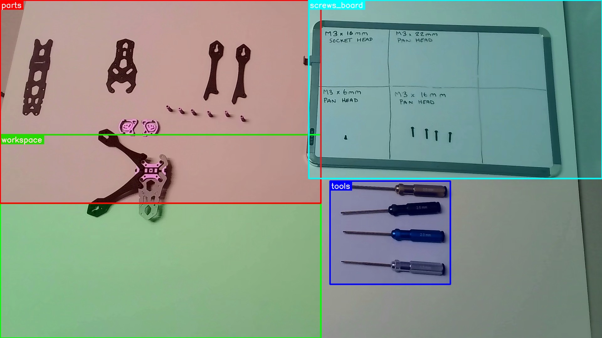  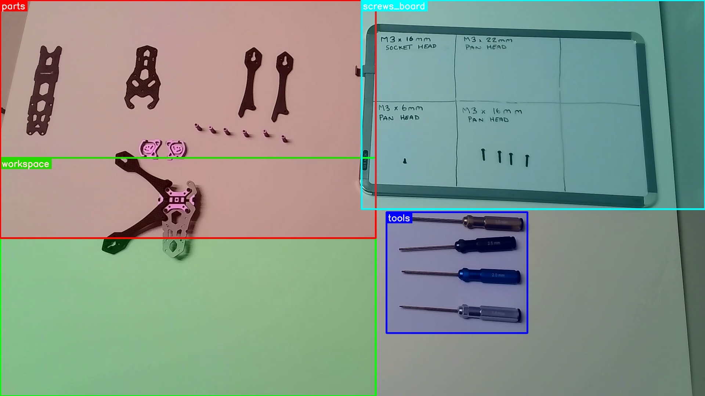  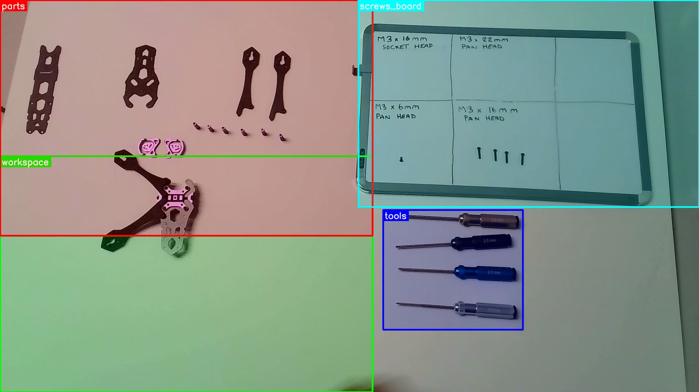  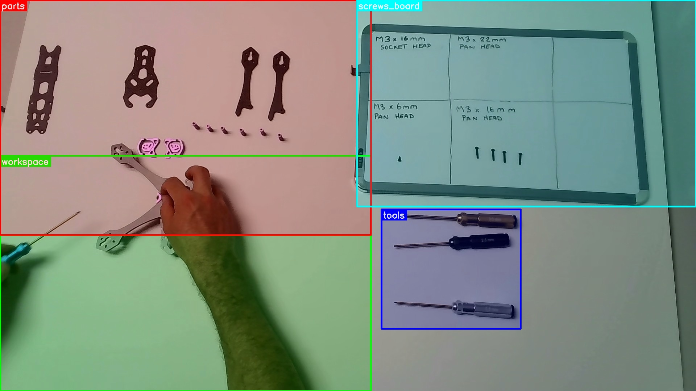

| Zone | Bbox | Objects |
|---|---|---|
| workspace | (0.00, 0.40, 0.53, 1.00) | hand, screwdriver, drone frame |
| tools | (0.55, 0.54, 0.75, 0.84) | screwdrivers |
| parts | (0.00, 0.00, 0.53, 0.60) | drone frame components, standoffs, small purple parts |
| screws_board | (0.51, 0.00, 1.00, 0.53) | whiteboard, screws |

**Description**: The person is assembling the frame of a drone. They are attaching the arms to the main body of the frame using screws and a hex driver. The end result is a partially assembled drone frame with two arms attached.

**Movement**:
  [TOOL: hex screwdriver 2.0mm @ tools -> workspace]
  [PART: M3x16mm pan head screw @ screws_board -> workspace]
  [PART: M3x16mm pan head screw @ screws_board -> workspace]
  [PART: M3x16mm pan head screw @ screws_board -> workspace]
  [PART: M3x16mm pan head screw @ screws_board -> workspace]
  [TOOL: hex screwdriver 2.0mm @ workspace -> tools]

**Zone States**:
  - workspace: A partially assembled drone frame with two arms attached.
  - tools: All four hex screwdrivers are present.
  - parts: All frame components, standoffs, and structural parts are present.
  - screws_board: Four M3x16mm pan head screws have been removed.

**Tools & Parts Summary**:
  Tools: [TOOL: hex screwdriver 2.0mm @ tools].
  Parts: [PART: drone frame @ workspace].

## Segment 19 [09:30.00 - 10:00.00]

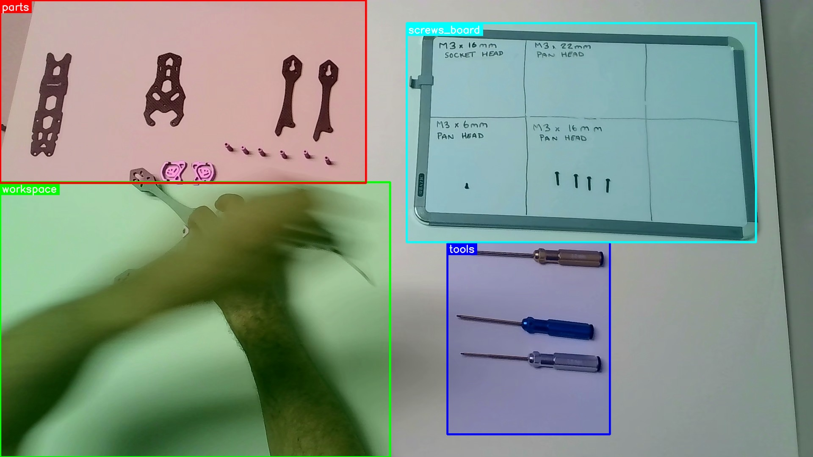  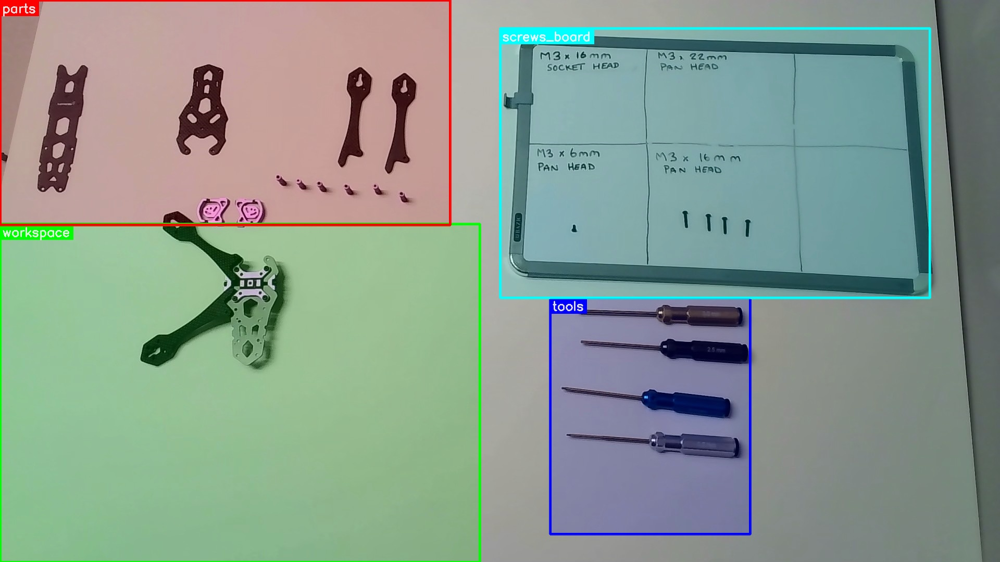      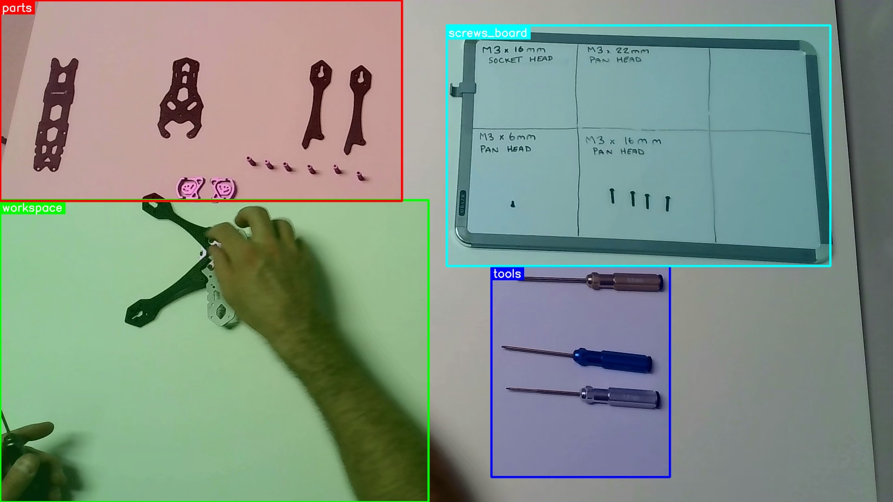  

| Zone | Bbox | Objects |
|---|---|---|
| workspace | (0.00, 0.40, 0.48, 1.00) | hands, drone frame |
| tools | (0.55, 0.53, 0.75, 0.95) | screwdrivers |
| parts | (0.00, 0.00, 0.45, 0.40) | drone frame components, standoffs |
| screws_board | (0.50, 0.05, 0.93, 0.53) | whiteboard, screws |

Here's an analysis of the video segment:

**Description**:
The person is assembling the frame of a drone. They are attaching the arms to the bottom plate using screws and a hex driver. The goal is to secure all four arms to the main frame.

**Movement**:
[PART: frame arm @ parts -> workspace]
[PART: frame arm @ parts -> workspace]
[PART: frame arm @ parts -> workspace]
[PART: frame arm @ parts -> workspace]
[TOOL: hex screwdriver 2.0mm @ tools -> workspace]
[PART: M3x16mm pan head screw @ screws_board -> workspace]
[PART: M3x16mm pan head screw @ screws_board -> workspace]
[PART: M3x16mm pan head screw @ screws_board -> workspace]
[PART: M3x16mm pan head screw @ screws_board -> workspace]
[TOOL: hex screwdriver 2.0mm @ workspace -> tools]

**Zone States**:
- **workspace**: The drone frame with all four arms attached to the bottom plate.
- **tools**: All three hex screwdrivers are present.
- **parts**: The top plate, camera mounts, and standoffs remain.
- **screws_board**: Four M3x16mm pan head screws have been removed.

**Tools & Parts Summary**:
Tools: [TOOL: hex screwdriver 2.0mm @ tools].
Parts: [PART: frame arm @ workspace], [PART: M3x16mm pan head screw @ workspace].

## Segment 20 [10:00.00 - 10:30.00]

  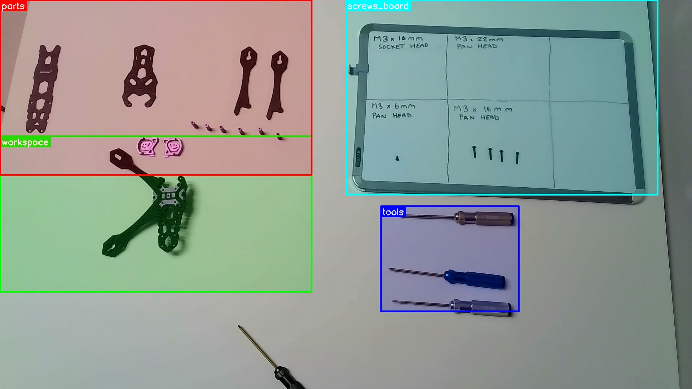        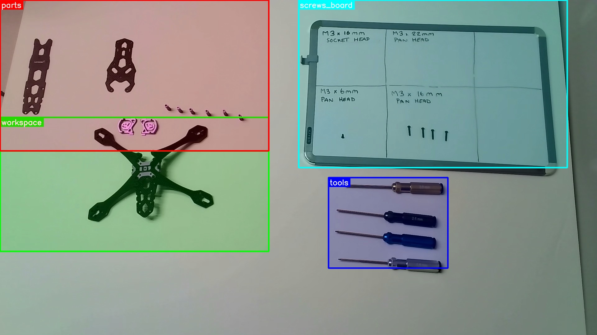

| Zone | Bbox | Objects |
|---|---|---|
| workspace | (0.00, 0.35, 0.45, 0.75) | hands, drone frame |
| tools | (0.55, 0.53, 0.75, 0.80) | screwdrivers |
| parts | (0.00, 0.00, 0.45, 0.45) | drone frame components, standoffs |
| screws_board | (0.50, 0.00, 0.95, 0.50) | whiteboard, screws |

**Description**: The person is assembling the frame of a drone. They are attaching the arms to the main body of the frame using screws and a hex driver. The end result is a partially assembled drone frame with four arms attached.

**Movement**:
  [TOOL: hex driver 2.0mm @ tools -> workspace]
  [PART: M3x16mm screw @ screws_board -> workspace]
  [TOOL: hex driver 2.0mm @ workspace -> tools]
  [TOOL: hex driver 2.0mm @ tools -> workspace]
  [PART: M3x16mm screw @ screws_board -> workspace]
  [TOOL: hex driver 2.0mm @ workspace -> tools]
  [TOOL: hex driver 2.0mm @ tools -> workspace]
  [PART: M3x16mm screw @ screws_board -> workspace]
  [TOOL: hex driver 2.0mm @ workspace -> tools]
  [TOOL: hex driver 2.0mm @ tools -> workspace]
  [PART: M3x16mm screw @ screws_board -> workspace]
  [TOOL: hex driver 2.0mm @ workspace -> tools]

**Zone States**:
  - workspace: A partially assembled drone frame with four arms attached.
  - tools: The gold, blue, and silver hex drivers are present. The black hex driver is missing (being used).
  - parts: All frame components, standoffs, and structural parts are present.
  - screws_board: Four M3x16mm pan head screws have been removed from the board.

**Tools & Parts Summary**:
  Tools: [TOOL: hex driver 2.0mm @ workspace].
  Parts: [PART: drone frame @ workspace].

## Segment 21 [10:30.00 - 11:00.00]

  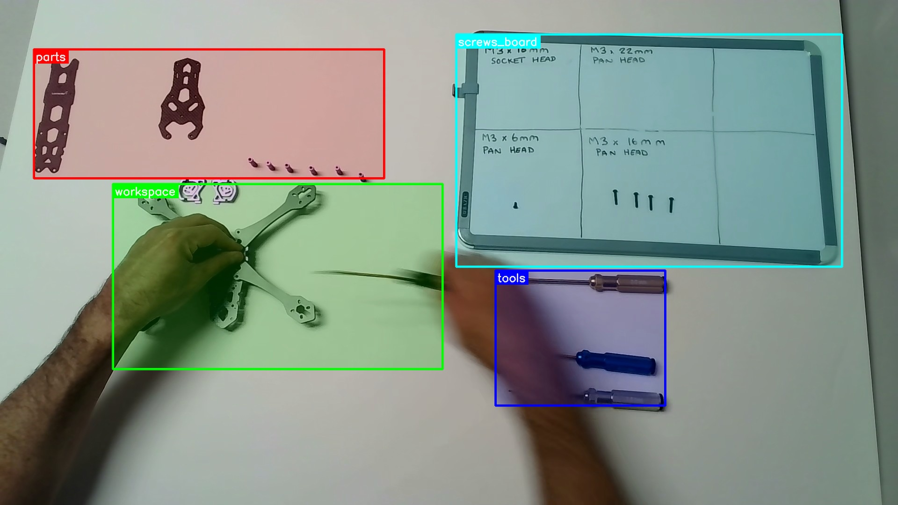    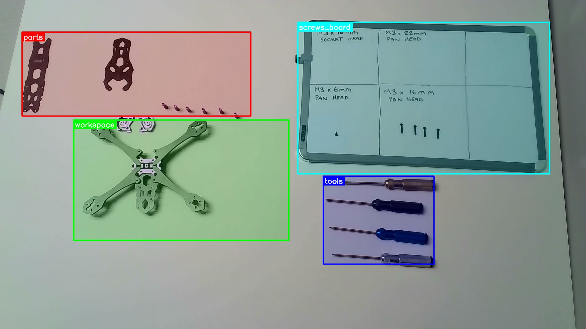    

| Zone | Bbox | Objects |
|---|---|---|
| workspace | (0.13, 0.36, 0.49, 0.73) | hands, drone frame |
| tools | (0.55, 0.54, 0.74, 0.80) | screwdrivers, hex drivers |
| parts | (0.04, 0.10, 0.43, 0.35) | drone frame parts, standoffs |
| screws_board | (0.51, 0.07, 0.94, 0.53) | whiteboard, screws |

**Description**: The person is continuing to assemble the drone frame. They are attaching the top plate to the frame using a hex screwdriver and M3x16mm pan head screws. This step secures the main structure of the drone.

**Movement**:
  [TOOL: hex screwdriver 2.0mm @ tools -> workspace]
  [PART: M3x16mm pan head screw @ screws_board -> workspace]
  [TOOL: hex screwdriver 2.0mm @ workspace -> tools]

**Zone States**:
  - workspace: The drone frame with the top plate attached, and one M3x16mm pan head screw partially inserted.
  - tools: All hex screwdrivers are present.
  - parts: All frame components, standoffs, and structural parts are present.
  - screws_board: One M3x16mm pan head screw has been removed from the board.

**Tools & Parts Summary**:
  Tools: [TOOL: hex screwdriver 2.0mm @ tools]
  Parts: [PART: M3x16mm pan head screw @ workspace]

## Segment 22 [11:00.00 - 11:30.00]

  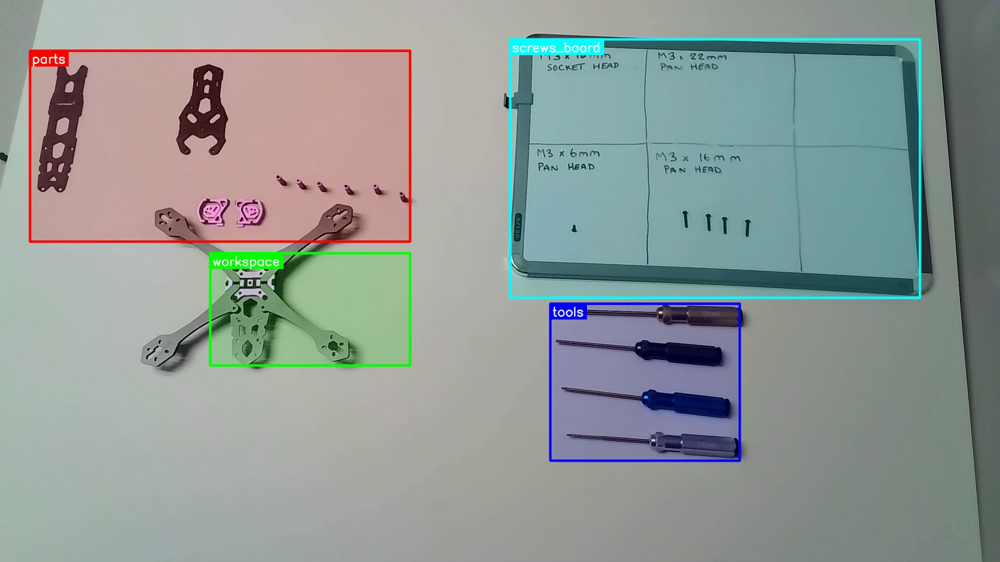    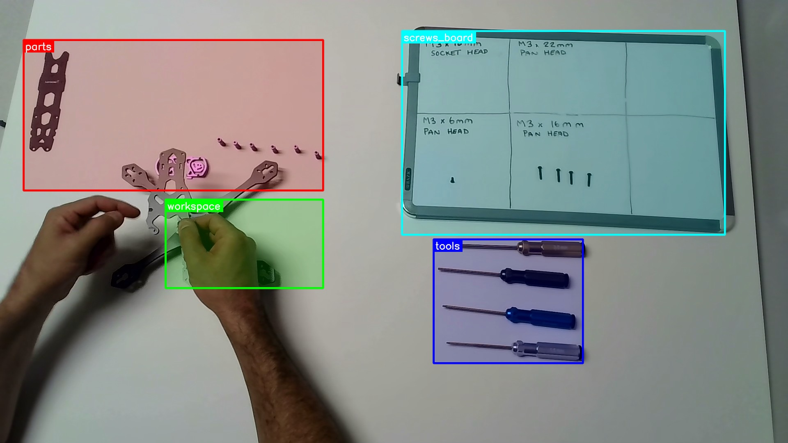  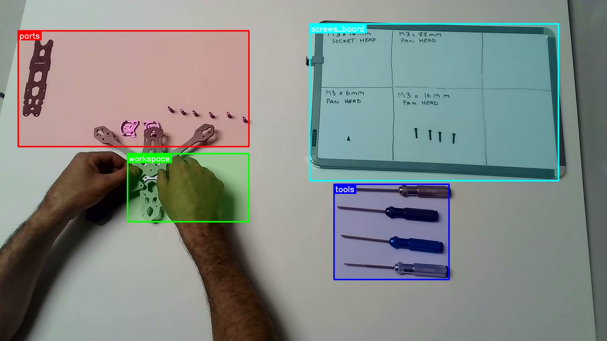  

| Zone | Bbox | Objects |
|---|---|---|
| workspace | (0.21, 0.45, 0.41, 0.65) | drone frame, hands |
| tools | (0.55, 0.54, 0.74, 0.82) | screwdrivers |
| parts | (0.03, 0.09, 0.41, 0.43) | drone frame components, standoffs |
| screws_board | (0.51, 0.07, 0.92, 0.53) | whiteboard, screws |

**Description**: The person is assembling the frame of a drone. They are attaching the top plate of the frame to the main body, aligning the holes and securing it in place. This step involves fitting the top plate onto the frame.

**Movement**:
  [PART: top plate @ parts -> workspace]
  [PART: frame @ workspace]

**Zone States**:
  - workspace: The drone frame with the top plate attached.
  - tools: All screwdrivers are present.
  - parts: The two carbon fiber plates remain.
  - screws_board: All screws are present.

**Tools & Parts Summary**:
  Tools: [TOOL: none].
  Parts: [PART: top plate @ workspace], [PART: frame @ workspace].

## Segment 23 [11:30.00 - 12:00.00]

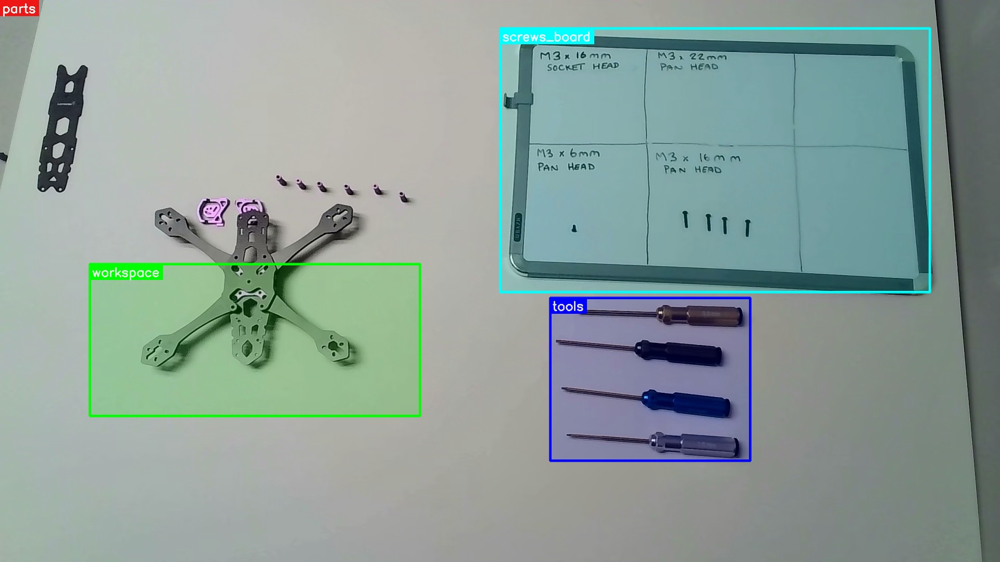  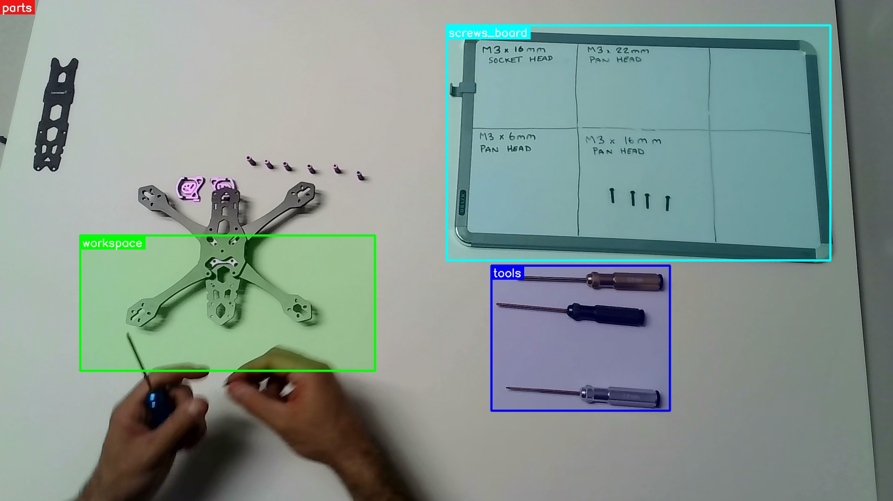  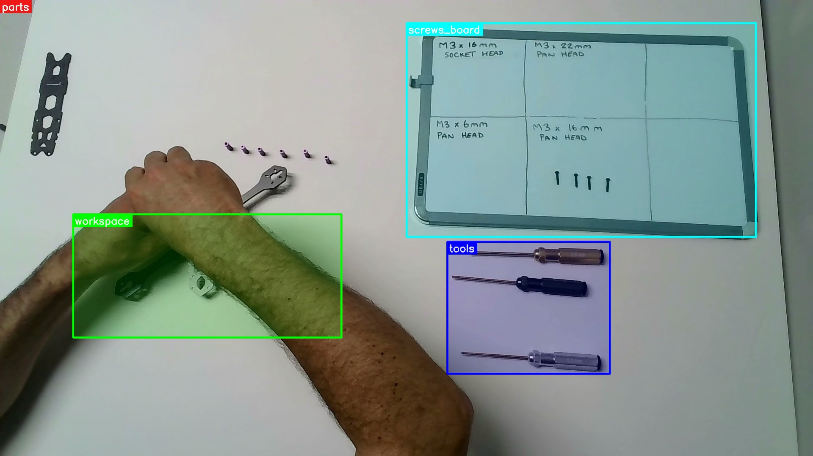  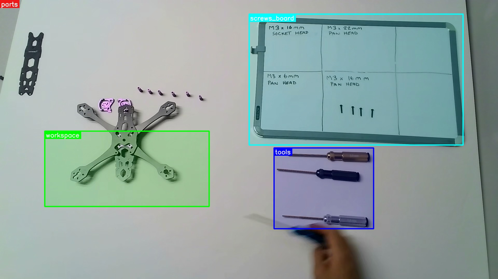    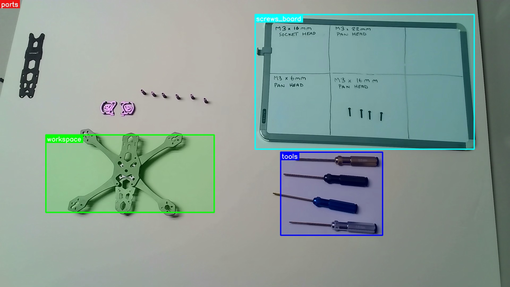

| Zone | Bbox | Objects |
|---|---|---|
| workspace | (0.09, 0.47, 0.42, 0.74) | drone frame, hands, screwdriver |
| tools | (0.55, 0.53, 0.75, 0.82) | screwdrivers, hex drivers |
| parts | (0.00, 0.00, 0.00, 0.00) |  |
| screws_board | (0.50, 0.05, 0.93, 0.52) | whiteboard, screws |

**Description**:
The person is assembling the drone frame by attaching a small purple standoff to the main frame. They use a hex driver to secure the standoff in place. This step involves picking up the standoff, positioning it on the frame, and then tightening it with the appropriate tool.

**Movement**:
[TOOL: hex driver (blue) @ tools -> workspace]
[PART: purple standoff @ workspace]
[TOOL: hex driver (blue) @ workspace -> tools]

**Zone States**:
  - workspace: The drone frame with one purple standoff attached.
  - tools: All hex drivers are present, with the blue hex driver returned to its spot.
  - parts: No parts were taken from the parts zone.
  - screws_board: No screws were removed from the screws board.

**Tools & Parts Summary**:
  Tools: [TOOL: hex driver (blue) @ tools]
  Parts: [PART: purple standoff @ workspace]

## Segment 24 [12:00.00 - 12:30.00]

  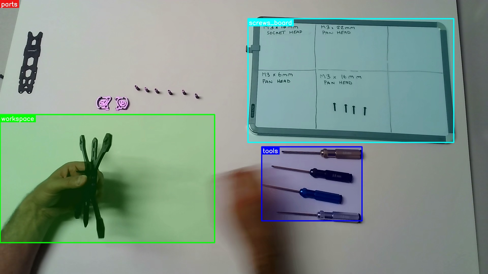  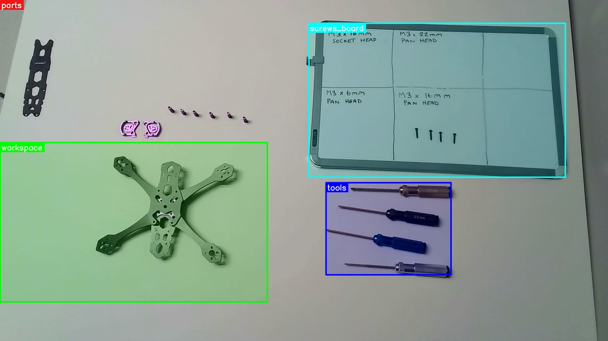  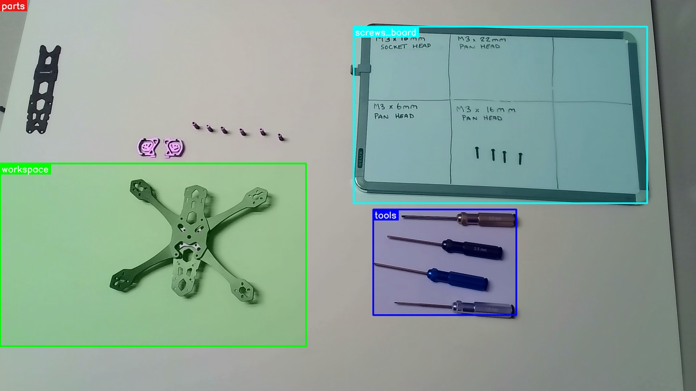    

| Zone | Bbox | Objects |
|---|---|---|
| workspace | (0.00, 0.42, 0.44, 0.89) | hands, drone frame |
| tools | (0.54, 0.54, 0.74, 0.81) | screwdrivers |
| parts | (0.00, 0.00, 0.00, 0.00) |  |
| screws_board | (0.51, 0.07, 0.93, 0.52) | whiteboard, screws |

**Description**:
The person is assembling the drone frame. They are attaching the bottom plate to the frame arms, which were previously assembled. This involves aligning the parts and securing them together.

**Movement**:
[PART: drone frame @ workspace]
[PART: bottom plate @ workspace]

**Zone States**:
  - workspace: The drone frame with the bottom plate attached is present.
  - tools: All four hex drivers are present.
  - parts: The frame arms and bottom plate have been taken.
  - screws_board: All screws are still on the board.

**Tools & Parts Summary**:
  Tools: [TOOL: hex driver (gold) @ tools], [TOOL: hex driver (black) @ tools], [TOOL: hex driver (blue) @ tools], [TOOL: hex driver (silver) @ tools]
  Parts: [PART: drone frame @ workspace], [PART: bottom plate @ workspace]

## Segment 25 [12:30.00 - 13:00.00]

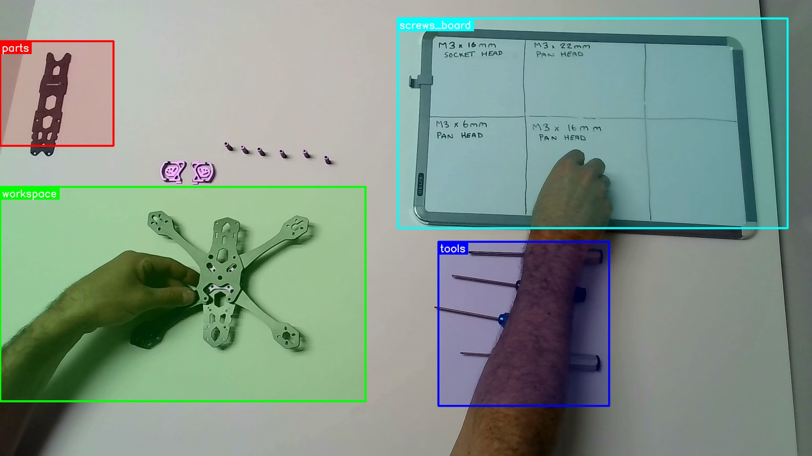      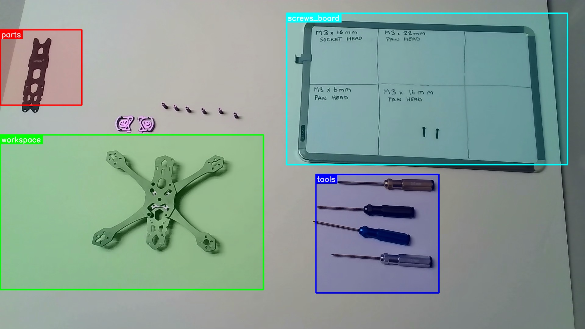  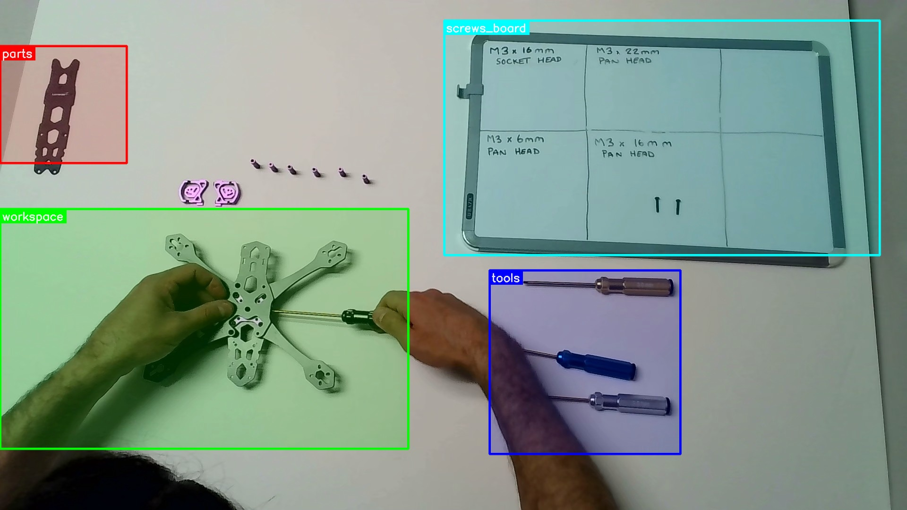  

| Zone | Bbox | Objects |
|---|---|---|
| workspace | (0.00, 0.41, 0.45, 0.88) | hands, drone frame, screwdriver |
| tools | (0.54, 0.53, 0.75, 0.89) | screwdrivers |
| parts | (0.00, 0.09, 0.14, 0.32) | drone frame parts |
| screws_board | (0.49, 0.04, 0.97, 0.50) | whiteboard, screws |

**Description**: The person is assembling the frame of a drone. They are attaching the bottom plate to the main frame using screws. They retrieve the correct screws from the screws board and use a hex driver to secure them.

**Movement**:
  [PART: M3 x 16mm pan head screws @ screws_board -> workspace]
  [TOOL: hex driver 2.0mm @ tools -> workspace]
  [TOOL: hex driver 2.0mm @ workspace -> tools]
  [PART: M3 x 16mm pan head screws @ screws_board -> workspace]
  [TOOL: hex driver 2.0mm @ tools -> workspace]
  [TOOL: hex driver 2.0mm @ workspace -> tools]

**Zone States**:
  - workspace: The drone frame with the bottom plate partially attached.
  - tools: All hex drivers are present.
  - parts: All frame components and standoffs are present.
  - screws_board: Two M3 x 16mm pan head screws have been removed.

**Tools & Parts Summary**:
  Tools: [TOOL: hex driver 2.0mm @ workspace]
  Parts: [PART: M3 x 16mm pan head screws @ workspace]

## Segment 26 [13:00.00 - 13:30.00]

  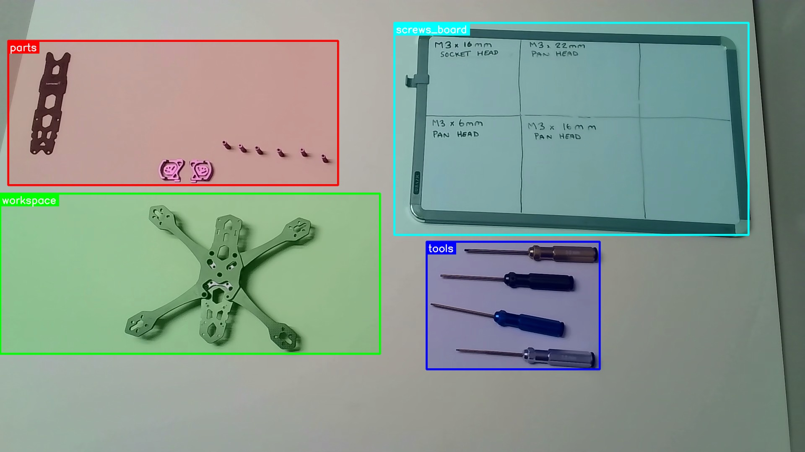      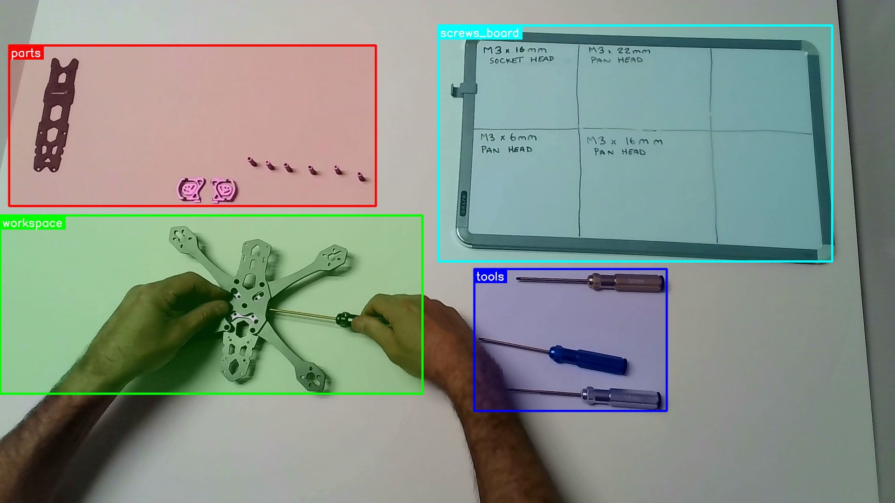  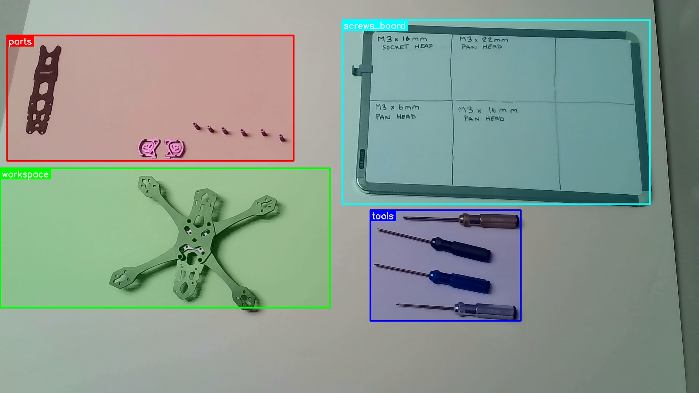

| Zone | Bbox | Objects |
|---|---|---|
| workspace | (0.00, 0.43, 0.47, 0.78) | hands, drone frame |
| tools | (0.53, 0.54, 0.74, 0.82) | screwdrivers, hex drivers |
| parts | (0.01, 0.09, 0.42, 0.41) | drone frame components, standoffs |
| screws_board | (0.49, 0.05, 0.93, 0.52) | whiteboard, screw types |

**Description**: The person is assembling the drone frame by attaching the top plate to the main body. They use a hex driver to secure the top plate with screws, ensuring a stable and complete frame structure.

**Movement**:
  [PART: top plate @ parts -> workspace]
  [TOOL: hex driver (black) @ tools -> workspace]
  [PART: M3x6mm pan head screw @ screws_board -> workspace]
  [TOOL: hex driver (black) @ workspace -> tools]

**Zone States**:
  - workspace: The drone frame is assembled with the top plate attached.
  - tools: All four hex drivers are present.
  - parts: The carbon fiber plate and two small purple parts remain.
  - screws_board: The M3x6mm pan head screws are missing from the board.

**Tools & Parts Summary**:
  Tools: [TOOL: hex driver (black) @ tools]
  Parts: [PART: top plate @ workspace], [PART: M3x6mm pan head screw @ workspace]

## Segment 27 [13:30.00 - 14:00.00]

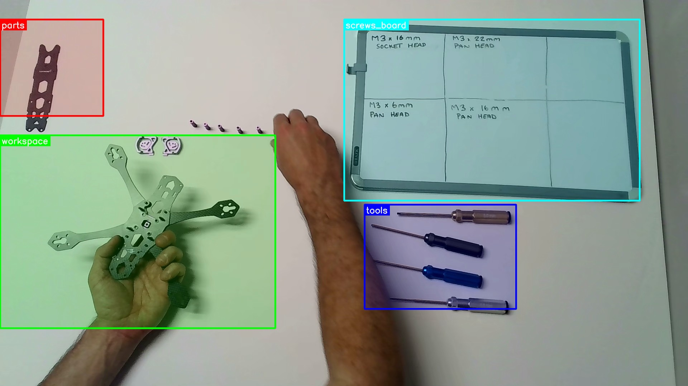  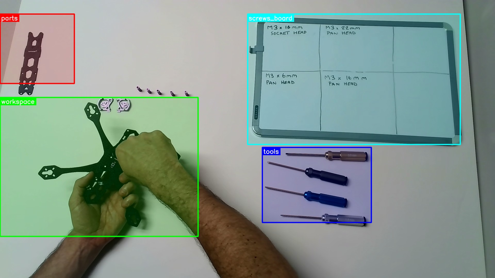    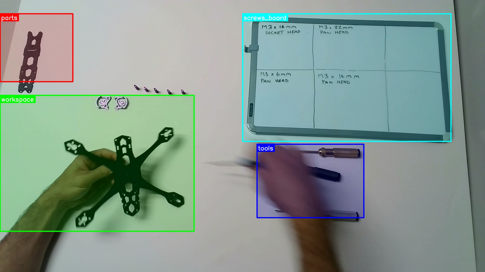  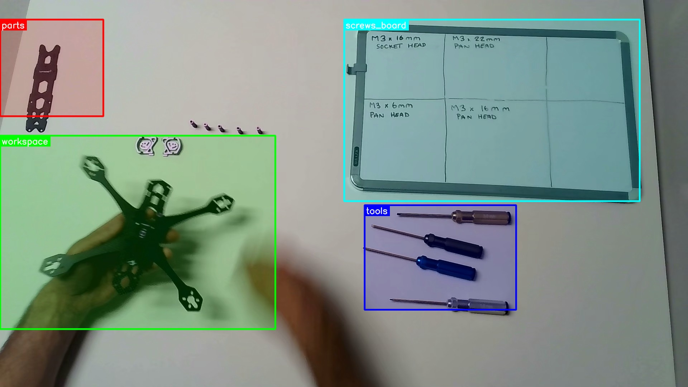  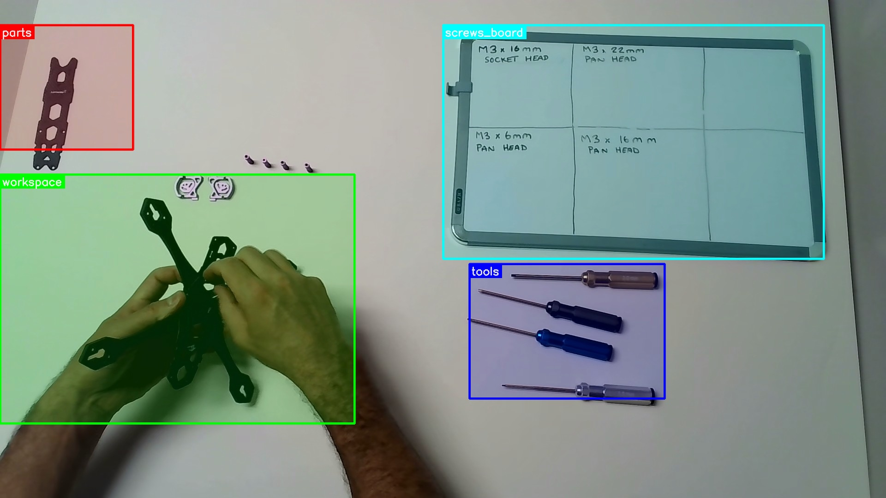

| Zone | Bbox | Objects |
|---|---|---|
| workspace | (0.00, 0.35, 0.40, 0.85) | hands, drone frame |
| tools | (0.53, 0.53, 0.75, 0.80) | screwdrivers, hex drivers |
| parts | (0.00, 0.05, 0.15, 0.30) | drone frame parts |
| screws_board | (0.50, 0.05, 0.93, 0.52) | whiteboard, text labels |

Here's an analysis of the provided keyframes:

**Description**:
The person is assembling the frame of a drone. They are attaching the top plate to the bottom plate using standoffs and screws. The process involves aligning the components, inserting standoffs, and then securing them with screws.

**Movement**:
  [PART: frame bottom plate @ workspace]
  [PART: frame top plate @ workspace]
  [PART: standoff @ workspace]
  [PART: M3x16mm socket head screw @ screws_board -> workspace]
  [TOOL: hex screwdriver 2.0mm @ tools -> workspace]

**Zone States**:
  - workspace: The partially assembled drone frame (bottom plate, top plate, and some standoffs and screws) is being held and worked on.
  - tools: The hex screwdriver 2.0mm is currently in use. The other screwdrivers (gold, black, silver) remain in the tools zone.
  - parts: The remaining frame components are still in the parts zone.
  - screws_board: Some M3x16mm socket head screws have been removed from the board.

**Tools & Parts Summary**:
  Tools: [TOOL: hex screwdriver 2.0mm @ workspace], [TOOL: gold screwdriver @ tools], [TOOL: black screwdriver @ tools], [TOOL: silver screwdriver @ tools]
  Parts: [PART: frame bottom plate @ workspace], [PART: frame top plate @ workspace], [PART: standoff @ workspace], [PART: M3x16mm socket head screw @ workspace]

## Segment 28 [14:00.00 - 14:30.00]

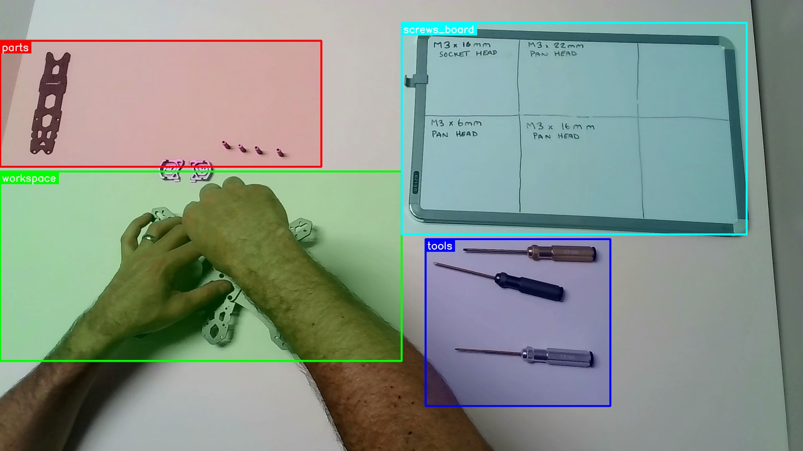    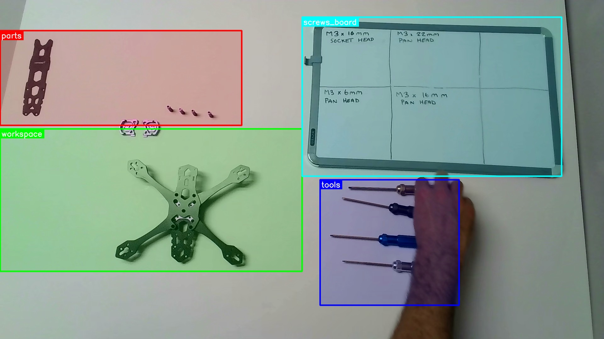    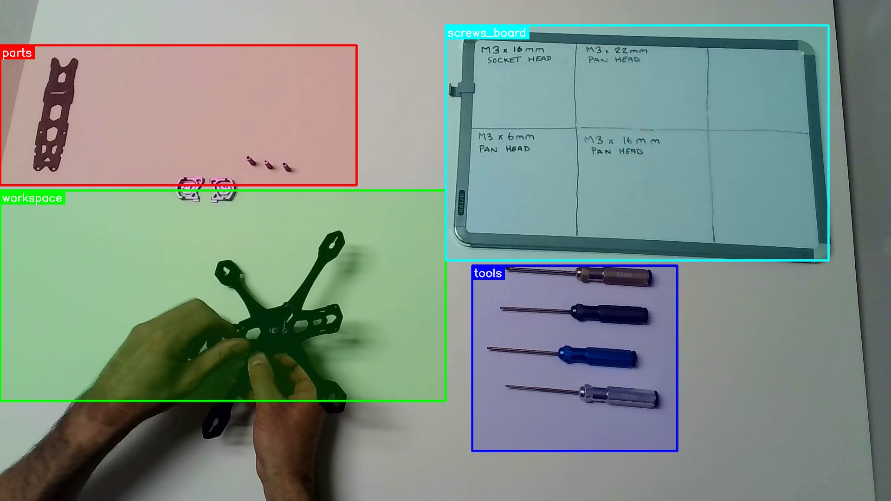  

| Zone | Bbox | Objects |
|---|---|---|
| workspace | (0.00, 0.38, 0.50, 0.80) | hands, drone frame, screwdriver |
| tools | (0.53, 0.53, 0.76, 0.90) | screwdrivers, hex drivers |
| parts | (0.00, 0.09, 0.40, 0.37) | drone frame components, standoffs |
| screws_board | (0.50, 0.05, 0.93, 0.52) | whiteboard, screw types, screw sizes |

**Description**: The person is assembling the drone frame by attaching the top plate to the bottom plate using standoffs and screws. They carefully align the components and secure them, ensuring the frame is rigid and ready for further assembly.

**Movement**:
  [TOOL: hex driver 2.0mm (blue) @ tools -> workspace]
  [PART: drone frame (partially assembled) @ workspace]
  [PART: standoff @ parts -> workspace]
  [PART: M3x16mm pan head screw @ screws_board -> workspace]
  [TOOL: hex driver 2.0mm (blue) @ workspace -> tools]
  [PART: drone frame (partially assembled) @ workspace]

**Zone States**:
  - workspace: The drone frame is assembled with the top plate, bottom plate, and standoffs, and some screws are tightened.
  - tools: All four hex drivers (gold, black, blue, silver) are present. The blue hex driver has been returned to the tools zone.
  - parts: The remaining frame components and standoffs are still in the parts zone.
  - screws_board: The M3x16mm pan head screws have been removed from the screws_board.

**Tools & Parts Summary**:
  Tools: [TOOL: hex driver 2.0mm (blue) @ tools]
  Parts: [PART: drone frame (partially assembled) @ workspace], [PART: standoff @ parts], [PART: M3x16mm pan head screw @ screws_board]

## Segment 29 [14:30.00 - 15:00.00]

  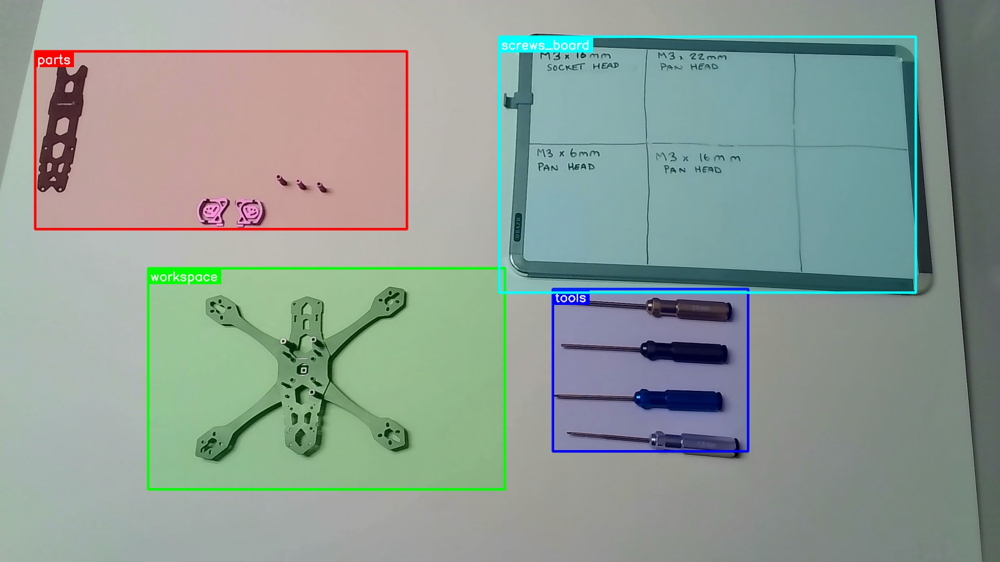  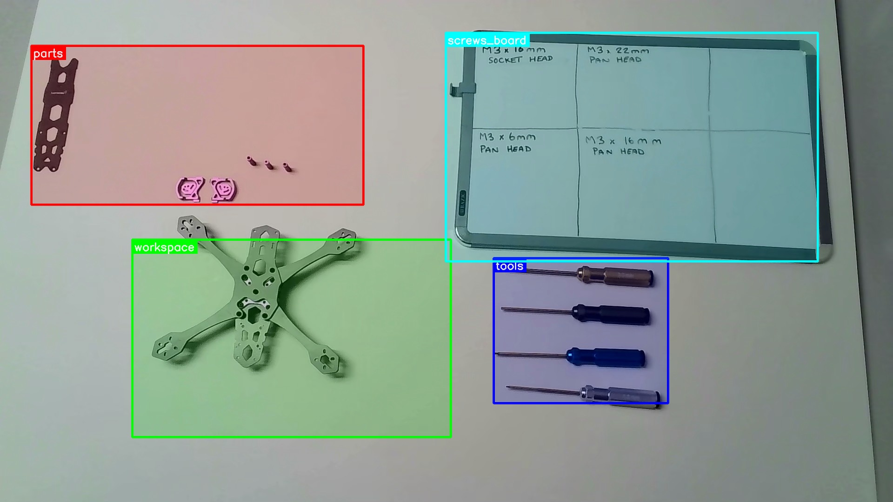      

| Zone | Bbox | Objects |
|---|---|---|
| workspace | (0.15, 0.48, 0.51, 0.87) | hands, drone frame, screwdriver |
| tools | (0.55, 0.51, 0.75, 0.80) | screwdrivers |
| parts | (0.04, 0.09, 0.41, 0.41) | drone frame components, standoffs, small screws |
| screws_board | (0.50, 0.07, 0.92, 0.52) | whiteboard, text describing screws |

Here's an analysis of the provided keyframes:

**Description**:
The person is assembling the drone frame by attaching the top plate. They first align the top plate with the rest of the frame and then use a hex driver to secure it with a standoff. This action completes the basic structural assembly of the drone frame.

**Movement**:
  [TOOL: hex driver (blue) @ tools -> workspace]
  [PART: drone frame (partially assembled) @ workspace]
  [PART: top plate @ parts -> workspace]
  [PART: standoff (purple) @ parts -> workspace]
  [TOOL: hex driver (blue) @ workspace -> tools]

**Zone States**:
  - **workspace**: The drone frame is now fully assembled with the top plate attached.
  - **tools**: All four hex drivers are present. The blue hex driver has been returned to this zone.
  - **parts**: The remaining parts are two purple standoffs and one long black frame component.
  - **screws_board**: No screws have been removed from the board in this segment.

**Tools & Parts Summary**:
  Tools: [TOOL: hex driver (blue) @ tools].
  Parts: [PART: top plate @ workspace], [PART: standoff (purple) @ workspace].

## Segment 30 [15:00.00 - 15:29.84]

  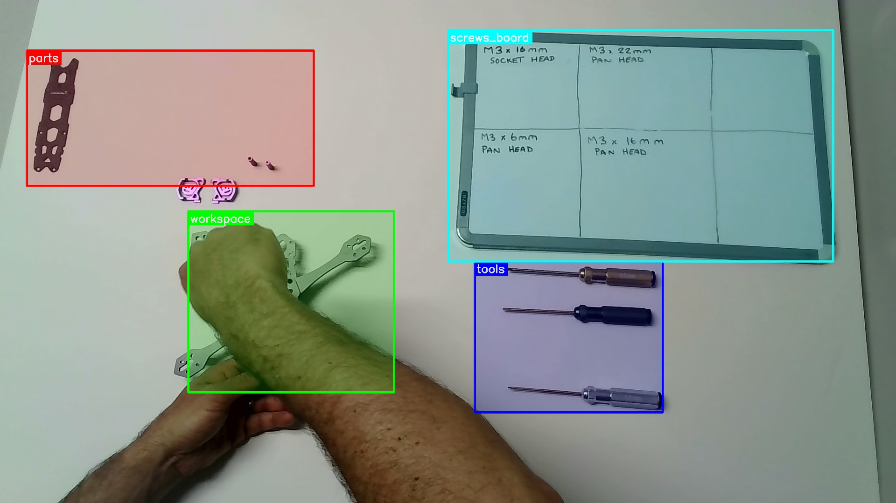  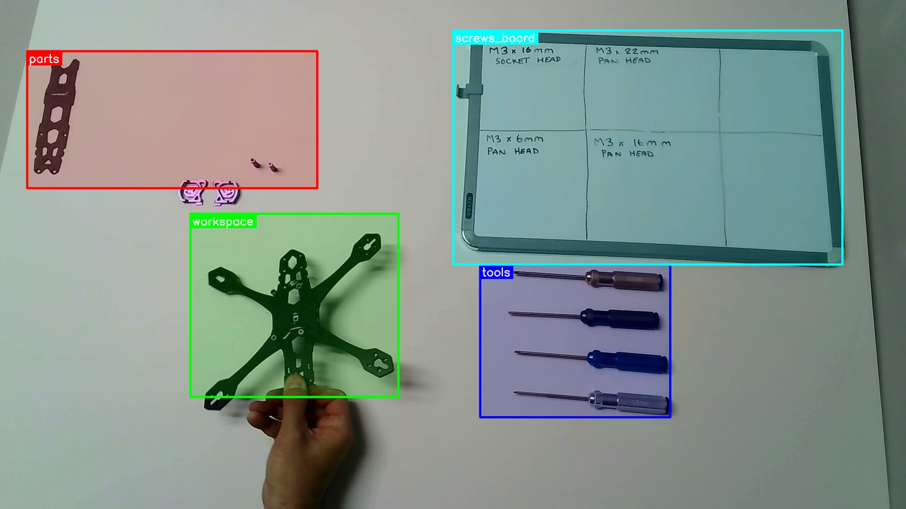      

| Zone | Bbox | Objects |
|---|---|---|
| workspace | (0.21, 0.42, 0.44, 0.78) | drone frame, hand |
| tools | (0.53, 0.52, 0.74, 0.82) | screwdrivers |
| parts | (0.03, 0.10, 0.35, 0.37) | carbon fiber plates, standoffs |
| screws_board | (0.50, 0.06, 0.93, 0.52) | whiteboard with screw types |

**Description**:
The person is assembling the drone frame by attaching the top plate to the bottom plate. They carefully align the two frame components and secure them together using screws. This step forms the basic structure of the drone's body.

**Movement**:
  [PART: top plate @ parts -> workspace]
  [PART: bottom plate @ workspace]
  [PART: top plate @ workspace]
  [PART: M3x6mm pan head screws @ screws_board -> workspace]

**Zone States**:
  - workspace: The drone frame, consisting of the bottom plate and top plate, is assembled and held by the person.
  - tools: All four hex drivers are present.
  - parts: The long carbon fiber plate and two small purple parts remain.
  - screws_board: The M3x6mm pan head screws have been removed from the board.

**Tools & Parts Summary**:
  Tools: [TOOL: none]
  Parts: [PART: top plate @ workspace], [PART: bottom plate @ workspace], [PART: M3x6mm pan head screws @ workspace]

