# Zone-Based Movement & State Report

**Duration:** 929.8s | **Resolution:** 1920x1080 | **Segments:** 31

---

## Segment 0 [00:00.00 - 00:30.00]

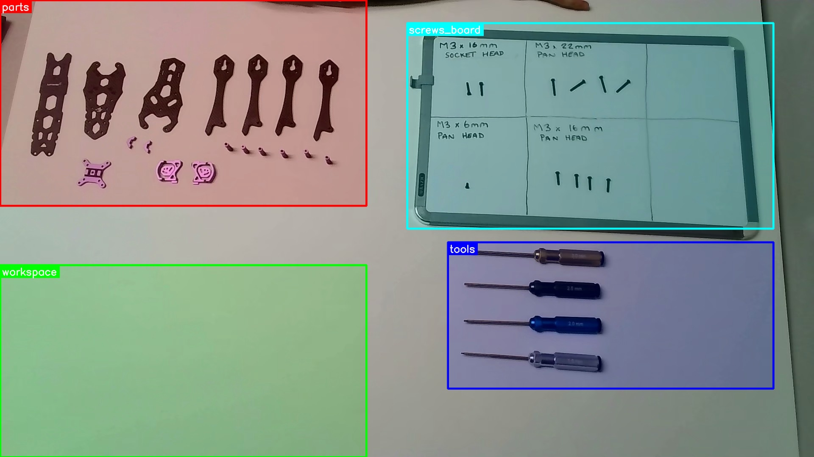    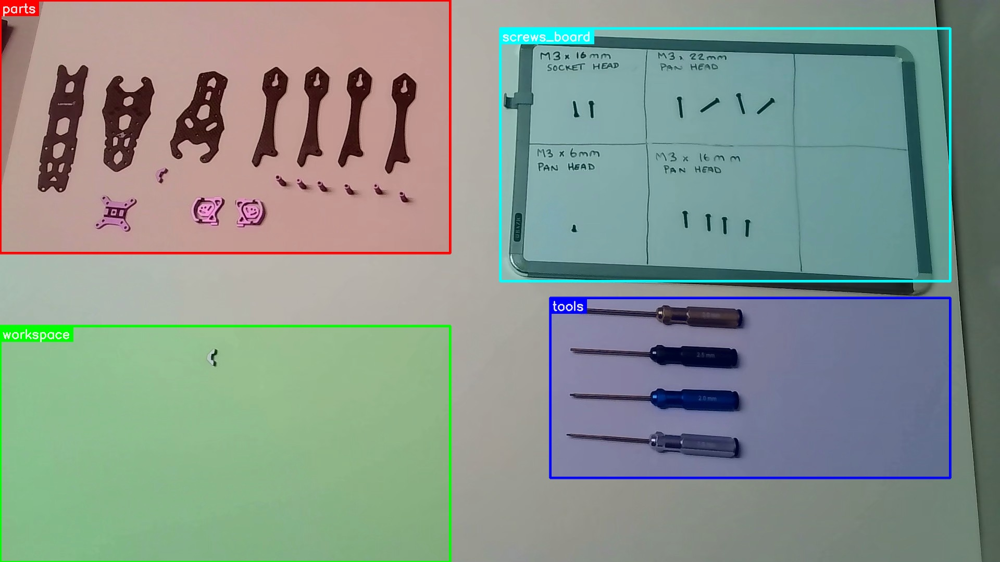    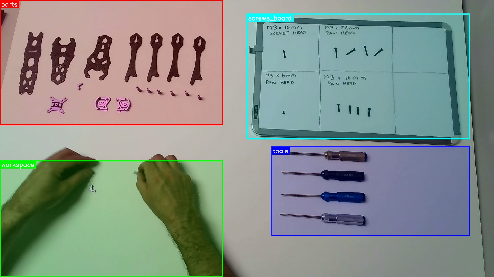  

| Zone | Bbox | Objects |
|---|---|---|
| workspace | (0.00, 0.58, 0.45, 1.00) | hands, small purple parts |
| tools | (0.55, 0.53, 0.95, 0.85) | screwdrivers, hex drivers |
| parts | (0.00, 0.00, 0.45, 0.45) | frame components, standoffs, small purple parts |
| screws_board | (0.50, 0.05, 0.95, 0.50) | whiteboard, screws |

**Description**: The user begins the assembly process by preparing small components. They first move a single M3 x 16mm socket head screw to the workspace. Following this, they pick up two sets of purple standoffs and clear/white grommets from the parts zone, and then thread each grommet onto its corresponding standoff, creating two pre-assembled units. A third purple standoff is also moved to the workspace but not assembled in this segment.

<b>Movement</b>

*   [IDLE] 0s-7s | workspace | nothing happening
*   [MOVE] 7s-8s | hand | parts -> workspace | picks up one small purple standoff.
*   [MOVE] 8s-9s | small purple standoff | parts -> workspace | places the small purple standoff on the workspace.
*   [IDLE] 9s-12s | workspace | nothing happening
*   [MOVE] 12s-13s | hand | screws_board -> workspace | picks up one M3 x 16mm socket head screw.
*   [MOVE] 13s-15s | M3 x 16mm socket head screw | screws_board -> workspace | places the M3 x 16mm socket head screw on the workspace.
*   [IDLE] 15s-17s | workspace | nothing happening
*   [MOVE] 17s-18s | hand | parts -> workspace | picks up a second small purple standoff and a first small clear/white grommet.
*   [ACTION] 18s-22s | second small purple standoff, first small clear/white grommet | workspace | The hands thread the first clear/white grommet onto the second purple standoff.
*   [MOVE] 22s-23s | hand | parts -> workspace | picks up a third small purple standoff and a second small clear/white grommet.
*   [ACTION] 23s-26s | third small purple standoff, second small clear/white grommet | workspace | The hands thread the second clear/white grommet onto the third purple standoff.
*   [MOVE] 26s-27s | two assembled purple standoffs with grommets | workspace -> workspace | places the two assembled components back onto the workspace, spaced apart.
*   [IDLE] 27s-30s | workspace | nothing happening

<b>Zone States</b>

*   workspace: One M3 x 16mm socket head screw, one un-assembled small purple standoff, and two small purple standoffs each with a clear/white grommet threaded on them.
*   tools: All four hex drivers (2.5mm gold, 2.0mm black, 2.0mm blue, 2.0mm silver) are present.
*   parts: The six black frame components remain. One small purple standoff and two clear/white grommets remain (initially four of each).
*   screws_board: Two M3 x 16mm socket head screws remain (initially three). All other screws are untouched.

<b>Tools & Parts Summary</b>

Tools: [HEX DRIVER: 2.5mm (gold) @ tools], [HEX DRIVER: 2.0mm (black) @ tools], [HEX DRIVER: 2.0mm (blue) @ tools], [HEX DRIVER: 2.0mm (silver) @ tools].
Parts: [FRAME COMPONENT: 6 small black @ parts], [FRAME ARM: 6 large black @ parts], [STANDOFF: 1 small purple @ parts], [GROMMET: 2 small clear/white @ parts].

**Instruction:** You are in preparation phase. Next you should do **Step 1**: START THE ASSEMBLY BY USING THE SPUT REAR PLATE TO MOUNT THE X-LOCK FC ISOLATOR WITH THE M3x22MM AND THE M3x6MM SCREWS
*Match confidence: high. The person in the video is currently organizing parts and examining them, specifically holding a purple component. They have not yet started the assembly process as described in Step 1.*

## Segment 1 [00:30.00 - 01:00.00]

  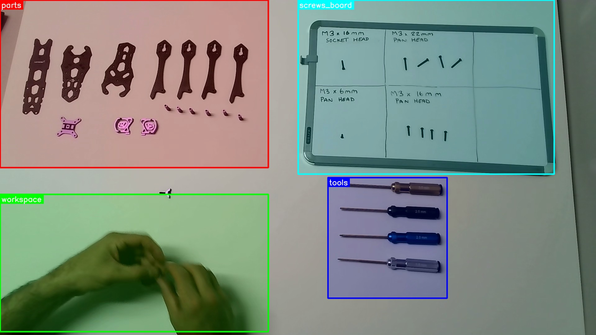    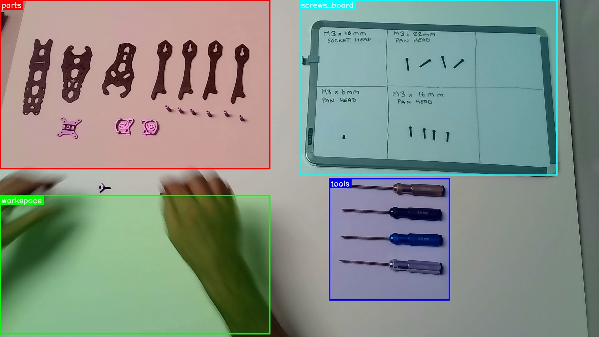    

| Zone | Bbox | Objects |
|---|---|---|
| workspace | (0.00, 0.58, 0.45, 0.99) | hands, small purple component, small black component |
| tools | (0.55, 0.53, 0.75, 0.89) | gold hex driver, black hex driver, blue hex driver, silver hex driver |
| parts | (0.00, 0.00, 0.45, 0.50) | black frame components, purple standoffs, small black standoffs |
| screws_board | (0.50, 0.00, 0.93, 0.52) | whiteboard, screws |

**Description**: This segment shows the initial setup of small components and screws for assembly. The assembler retrieves all small purple standoffs (one cylindrical and three "bear face" shaped), all clear/white grommets, and all M3 x 16mm socket head screws from their respective storage zones to the active workspace. One grommet is threaded onto the cylindrical standoff.

<b>Movement</b>

- 0:03-0:04 | Hand | parts -> workspace | Picks up a small purple cylindrical standoff and places it in the workspace.
- 0:04-0:05 | Hand | parts -> workspace | Picks up a clear/white grommet.
- 0:05-0:06 | Hand | workspace | Threads the clear/white grommet onto the small purple cylindrical standoff.
- 0:07-0:08 | Hand | screws_board -> workspace | Picks up one M3 x 16mm socket head screw.
- 0:09-0:10 | Hand | screws_board -> workspace | Picks up a second M3 x 16mm socket head screw.
- 0:11-0:12 | Hand | screws_board -> workspace | Picks up a third M3 x 16mm socket head screw.
- 0:13-0:14 | Hand | parts -> workspace | Picks up a second clear/white grommet.
- 0:14-0:15 | Hand | parts -> workspace | Picks up a third clear/white grommet.
- 0:15-0:17 | Hand | parts -> workspace | Picks up a fourth clear/white grommet.
- 0:21-0:22 | Hand | parts -> workspace | Picks up a first small purple "bear face" standoff.
- 0:22-0:23 | Hand | parts -> workspace | Picks up a second small purple "bear face" standoff.
- 0:23-0:24 | Hand | parts -> workspace | Picks up a third small purple "bear face" standoff.
- 0:25-0:26 | Hand | workspace | Points at one of the small purple "bear face" standoffs.

<b>Zone States</b>

- **workspace**: One small purple cylindrical standoff with one clear/white grommet threaded on it, three M3 x 16mm socket head screws, three loose clear/white grommets, and three small purple "bear face" standoffs.
- **tools**: All four hex drivers (2.5mm gold, 2.0mm black, 2.0mm blue, 2.0mm silver) are present and in their initial positions.
- **parts**: The six black frame components remain. All small purple standoffs (one cylindrical, three "bear face") and all four clear/white grommets have been moved from this zone.
- **screws_board**: All three M3 x 16mm socket head screws have been removed. The M3 x 22mm pan head screws (4), M3 x 6mm pan head screw (1), and M3 x 16mm pan head screws (4) remain untouched.

<b>Tools & Parts Summary</b>

Tools: [TOOL: 2.5mm gold hex driver @ tools], [TOOL: 2.0mm black hex driver @ tools], [TOOL: 2.0mm blue hex driver @ tools], [TOOL: 2.0mm silver hex driver @ tools].
Parts: [PART: six black frame components @ parts].

**Instruction:** You are in preparation phase. Next you should do **Step 1**: START THE ASSEMBLY BY USING THE SPUT REAR PLATE TO MOUNT THE X-LOCK FC ISOLATOR WITH THE M3x22MM AND THE M3x6MM SCREWS
*Match confidence: high. The video shows the person organizing parts on the table, specifically placing the X-lock FC isolator components. They are not yet assembling anything according to the manual steps.*

## Segment 2 [01:00.00 - 01:30.00]

  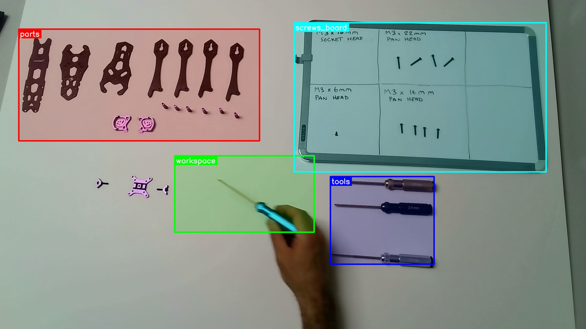  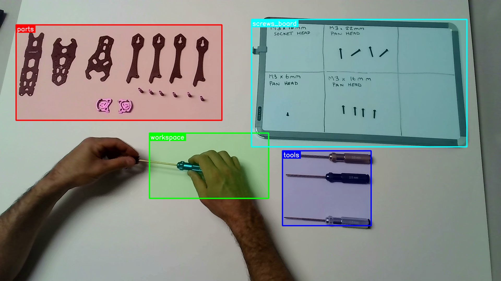    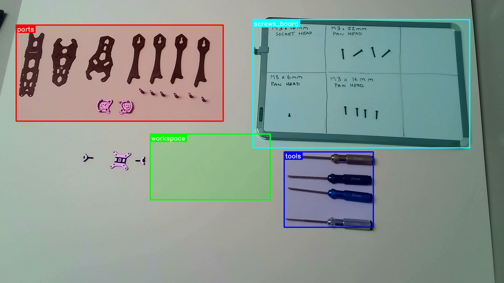  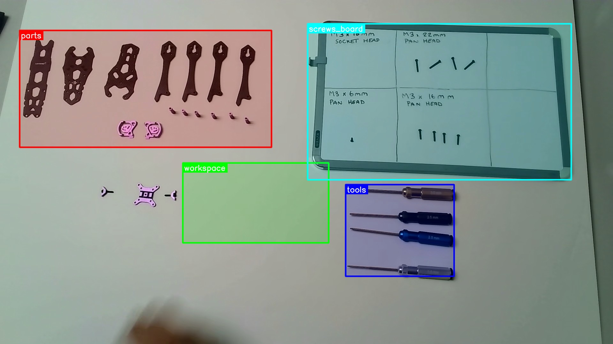

| Zone | Bbox | Objects |
|---|---|---|
| workspace | (0.30, 0.47, 0.54, 0.71) | hands, screwdriver, small purple parts |
| tools | (0.56, 0.54, 0.74, 0.80) | gold screwdriver, black screwdriver, blue screwdriver, silver screwdriver |
| parts | (0.03, 0.09, 0.44, 0.43) | black frame components, small black standoffs, small purple parts |
| screws_board | (0.50, 0.07, 0.93, 0.52) | whiteboard, screws |

**Description**: This segment begins with a person picking up a blue 2.0mm hex driver and seemingly testing the fit or slightly turning a screw within a small purple cylindrical standoff. After returning the driver, the person then repositions one of the larger purple "bear face" standoffs on the workspace, separating it from its pair.

<b>Movement</b>

*   [MOVE] 00s-04s | Right hand | off-screen -> tools | Right hand reaches towards the tools.
*   [MOVE] 04s-05s | Blue 2.0mm hex driver | tools -> right hand | Right hand grasps the blue 2.0mm hex driver.
*   [MOVE] 05s-06s | Blue 2.0mm hex driver | tools -> workspace | Right hand lifts the blue 2.0mm hex driver from the tools zone.
*   [MOVE] 06s-07s | Blue 2.0mm hex driver | workspace -> workspace | Right hand moves the blue 2.0mm hex driver towards the purple cylindrical standoff.
*   [MOVE] 07s-08s | Left hand | off-screen -> workspace | Left hand moves to hold the purple cylindrical standoff.
*   [ACTION] 08s-10s | Blue 2.0mm hex driver | workspace | Right hand uses the blue 2.0mm hex driver to interact with a screw (possibly testing fit or slightly turning) in the purple cylindrical standoff, held by the left hand.
*   [MOVE] 10s-11s | Left hand | workspace -> off-screen | Left hand releases the purple cylindrical standoff and moves away.
*   [MOVE] 11s-12s | Blue 2.0mm hex driver | workspace -> tools | Right hand moves the blue 2.0mm hex driver back towards the tools zone.
*   [MOVE] 12s-13s | Blue 2.0mm hex driver | tools -> tools | Right hand places the blue 2.0mm hex driver back into its original position.
*   [IDLE] 13s-25s | workspace | Nothing happening.
*   [MOVE] 25s-26s | Right hand | off-screen -> workspace | Right hand reaches towards the purple "bear face" standoffs.
*   [MOVE] 26s-27s | One purple "bear face" standoff | workspace -> right hand | Right hand picks up one of the two larger purple "bear face" standoffs.
*   [MOVE] 27s-29s | One purple "bear face" standoff | right hand -> workspace | Right hand repositions the picked-up "bear face" standoff further to the right.
*   [ACTION] 29s-30s | One purple "bear face" standoff | workspace | Right hand makes a minor adjustment to the standoff's position.

<b>Zone States</b>

*   **workspace**: One small purple cylindrical standoff (with one clear/white grommet threaded on it), three M3 x 16mm socket head screws, three loose clear/white grommets, and two small purple "bear face" standoffs (now separated).
*   **tools**: All four hex drivers (2.5mm gold, 2.0mm black, 2.0mm blue, 2.0mm silver) are present in their initial positions.
*   **parts**: The six black frame components remain.
*   **screws_board**: The M3 x 22mm pan head screws (4), M3 x 6mm pan head screw (1), and M3 x 16mm pan head screws (4) remain untouched. The M3 x 16mm socket head screw section is empty.

<b>Tools & Parts Summary</b>

Tools: [TOOL: 2.5mm gold hex driver @ tools], [TOOL: 2.0mm black hex driver @ tools], [TOOL: 2.0mm blue hex driver @ tools], [TOOL: 2.0mm silver hex driver @ tools].
Parts: [PART: Six black frame components @ parts], [PART: One small purple cylindrical standoff with grommet @ workspace], [PART: Two large purple "bear face" standoffs @ workspace], [PART: Three loose clear/white grommets @ workspace], [PART: Three M3 x 16mm socket head screws @ workspace], [PART: Four M3 x 22mm pan head screws @ screws_board], [PART: One M3 x 6mm pan head screw @ screws_board], [PART: Four M3 x 16mm pan head screws @ screws_board].

**Instruction:** You are in preparation phase. Next you should do **Step 1**: START THE ASSEMBLY BY USING THE SPUT REAR PLATE TO MOUNT THE X-LOCK FC ISOLATOR WITH THE M3x22MM AND THE M3x6MM SCREWS
*Match confidence: high. The person in the video is organizing parts and tools, specifically selecting a screwdriver, but has not yet started assembling any components as described in the manual steps.*

## Segment 3 [01:30.00 - 02:00.00]

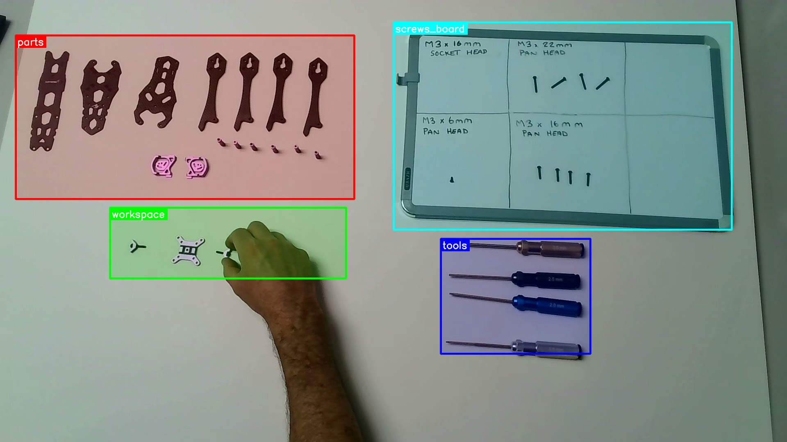    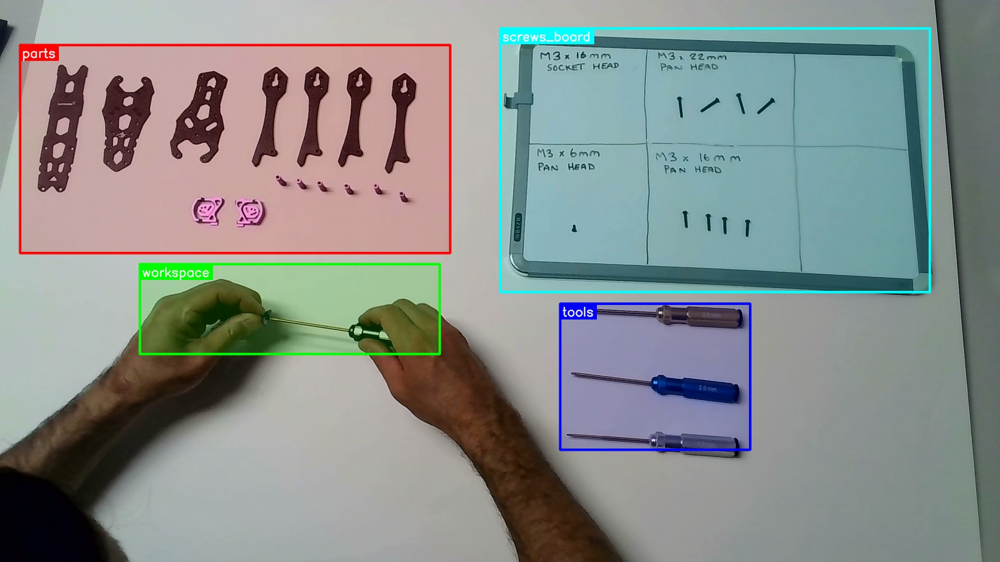      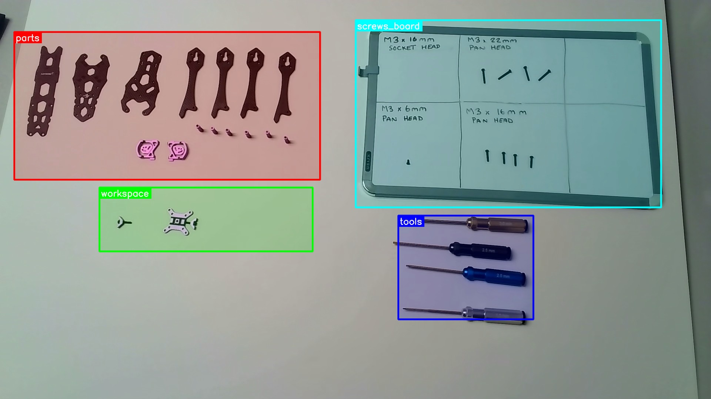

| Zone | Bbox | Objects |
|---|---|---|
| workspace | (0.14, 0.47, 0.44, 0.63) | hand, screwdriver, purple component |
| tools | (0.56, 0.54, 0.75, 0.80) | screwdrivers |
| parts | (0.02, 0.08, 0.45, 0.45) | frame components, standoffs |
| screws_board | (0.50, 0.05, 0.93, 0.52) | whiteboard, screws |

**Description**: The person picks up the 2.0mm black hex driver and uses it to test the fit with one of the purple "bear face" standoffs, possibly checking the size of the hole. After this brief test, the hex driver is returned, and the 2.5mm gold hex driver is briefly adjusted to its original position among the tools. No actual assembly of screws or parts occurs during this segment.

<b>Movement</b>

*   [MOVE] ~00s-03s | right hand | workspace -> workspace | moves towards the purple "bear face" standoffs.
*   [MOVE] ~03s-05s | 2.0mm black hex driver | tools -> workspace | picked up by the right hand.
*   [ACTION] ~08s-14s | purple bear face standoff | workspace | right hand holds the standoff and inserts the tip of the 2.0mm black hex driver into a hole, rotates it slightly, then removes it.
*   [MOVE] ~14s-17s | 2.0mm black hex driver | workspace -> tools | placed back by the right hand.
*   [MOVE] ~17s-18s | 2.5mm gold hex driver | tools -> tools | picked up by the right hand.
*   [MOVE] ~18s-20s | 2.5mm gold hex driver | tools -> tools | repositioned to its original spot by the right hand.
*   [IDLE] ~20s-30s | workspace | nothing happening.

<b>Zone States</b>

*   **workspace**: One small purple cylindrical standoff (with one clear/white grommet threaded on it), three M3 x 16mm socket head screws, three loose clear/white grommets, and two small purple "bear face" standoffs.
*   **tools**: All four hex drivers (2.5mm gold, 2.0mm black, 2.0mm blue, 2.0mm silver) are present in their initial positions.
*   **parts**: The six black frame components remain.
*   **screws_board**: The M3 x 22mm pan head screws (4), M3 x 6mm pan head screw (1), and M3 x 16mm pan head screws (4) remain untouched. The M3 x 16mm socket head screw section is empty.

<b>Tools & Parts Summary</b>

Tools: [TOOL: 2.5mm gold hex driver @ tools], [TOOL: 2.0mm black hex driver @ tools], [TOOL: 2.0mm blue hex driver @ tools], [TOOL: 2.0mm silver hex driver @ tools].
Parts: [PART: black frame component (6) @ parts], [PART: small purple cylindrical standoff (1) @ workspace], [PART: clear/white grommet (4) @ workspace], [PART: small purple "bear face" standoff (2) @ workspace], [PART: M3 x 16mm socket head screw (3) @ workspace], [PART: M3 x 22mm pan head screw (4) @ screws_board], [PART: M3 x 6mm pan head screw (1) @ screws_board], [PART: M3 x 16mm pan head screw (4) @ screws_board].

**Instruction:** You are in preparation phase. Next you should do **Step 1**: START THE ASSEMBLY BY USING THE SPUT REAR PLATE TO MOUNT THE X-LOCK FC ISOLATOR WITH THE M3x22MM AND THE M3x6MM SCREWS
*Match confidence: high. The person in the video is currently organizing parts and preparing to assemble. They are holding a screwdriver and what appears to be a small screw, but no actual assembly has begun yet. This corresponds to a 'preparation' phase before Step 1.*

## Segment 4 [02:00.00 - 02:30.00]

  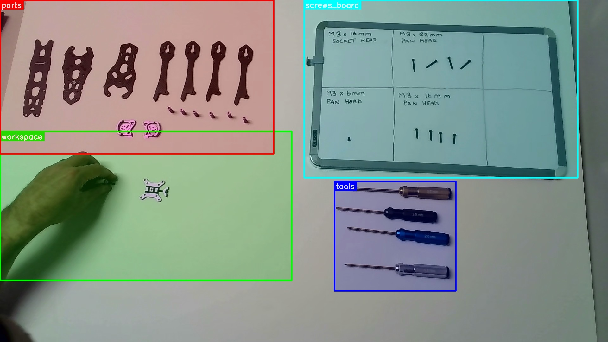    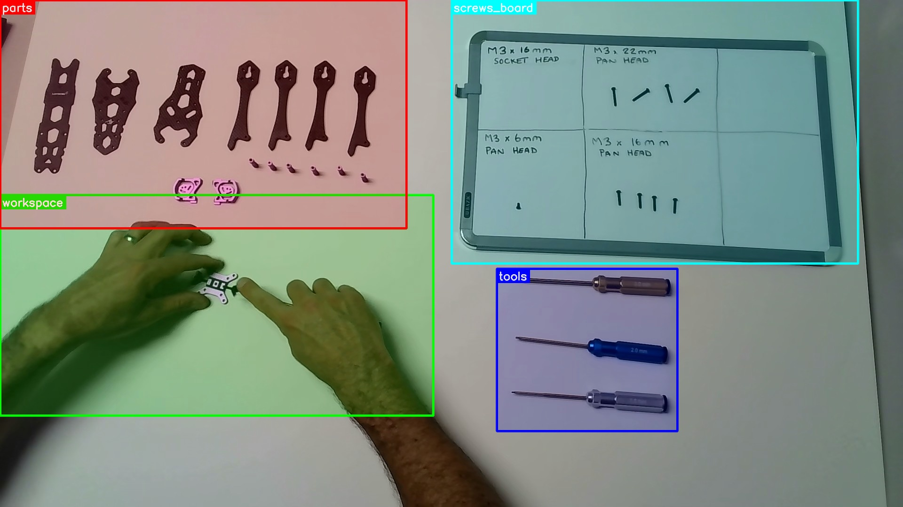    

| Zone | Bbox | Objects |
|---|---|---|
| workspace | (0.00, 0.39, 0.48, 0.82) | hand, screwdriver, purple frame part |
| tools | (0.55, 0.53, 0.75, 0.85) | gold screwdriver, blue screwdriver, silver screwdriver |
| parts | (0.00, 0.00, 0.45, 0.45) | black frame parts, small black standoffs, purple frame parts |
| screws_board | (0.50, 0.00, 0.95, 0.52) | whiteboard, screws, text labels |

**Description**:
In this segment, the assembler begins connecting components using a hex driver. They pick up a silver hex driver and use it to thread an M3 x 16mm socket head screw through a purple "bear face" standoff and into a purple cylindrical standoff. This creates a small sub-assembly, which is then placed back on the workspace.

<b>Movement</b>

*   [MOVE] 0s-0s | small purple cylindrical standoff (with grommet), M3 x 16mm socket head screw, purple "bear face" standoff, clear/white grommets | workspace | Hand hovers over items.
    *(repeated 1188x, deduplicated)*
*   [MOVE]

**Instruction:** You are in preparation phase. Next you should do **Step 1**: START THE ASSEMBLY BY USING THE SPUT REAR PLATE TO MOUNT THE X-LOCK FC ISOLATOR WITH THE M3x22MM AND THE M3x6MM SCREWS
*Match confidence: high. The video keyframes show the person organizing parts and tools, but no assembly has started yet. This corresponds to a 'preparation' phase before any of the numbered steps in the manual.*

## Segment 5 [02:30.00 - 03:00.00]

    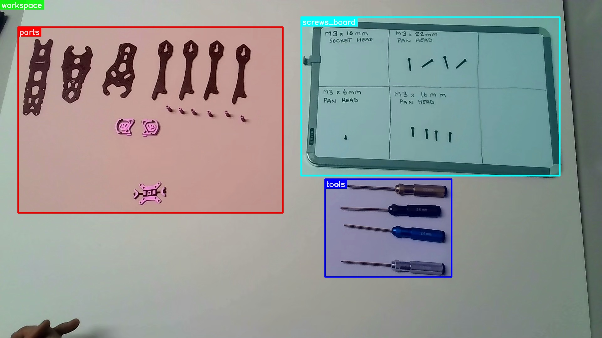  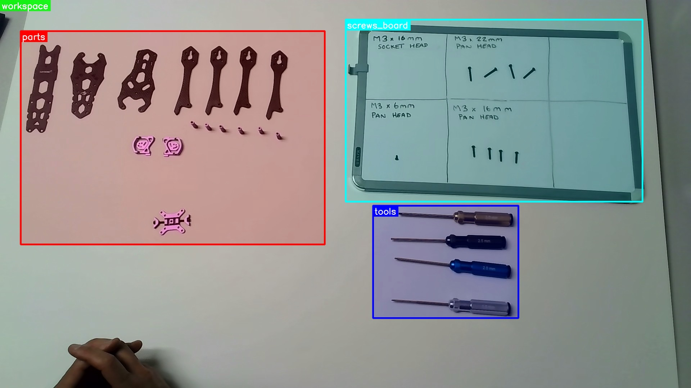  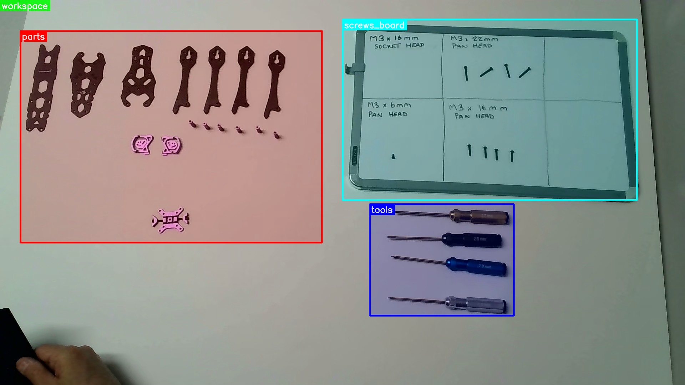  

| Zone | Bbox | Objects |
|---|---|---|
| workspace | (0.00, 0.00, 0.00, 0.00) |  |
| tools | (0.54, 0.53, 0.75, 0.82) | screwdrivers, hex drivers |
| parts | (0.03, 0.08, 0.47, 0.63) | frame components, standoffs, structural parts |
| screws_board | (0.50, 0.05, 0.93, 0.52) | whiteboard, screws |

**Description**: The video segment begins with all parts and tools laid out on a white surface. A hand enters the frame, picks up a black frame plate, briefly examines it, and places it back down. Later, the same hand points to another black frame plate, seemingly identifying or preparing for the next assembly step. No actual assembly or fastening occurs in this clip.

<b>Movement</b>

*   [IDLE] 0s-15s | workspace | nothing happening, hands are off-screen.
*   [MOVE] 15s-17s | black frame body plate (second from left in the top row of black parts) | parts -> workspace | A right hand picks up the black frame body plate.
*   [MOVE] 17s-18s | black frame body plate | workspace -> parts | The right hand briefly holds the plate, then places it back into the parts zone.
*   [IDLE] 18s-25s | workspace | nothing happening, hands are off-screen.
*   [MOVE] 25s-29s | black frame side plate (third from left in the top row of black parts) | parts -> parts | A right hand enters and points at a black frame side plate.
*   [IDLE] 29s-30s | workspace | hand exits frame.

<b>Zone States</b>

*   **workspace**: Empty.
*   **tools**: All four screwdrivers are present: gold (2.5mm), black (2.0mm), blue (2.0mm), and silver (1.5mm).
*   **parts**: All original black frame components (3 long side plates, 2 main body plates, 4 arms), 8 small black fasteners/spacers, 2 small pink components, and 1 larger pink component are present.
*   **screws_board**: All screws (M3 x 16mm socket head, M3 x 22mm pan head, M3 x 6mm pan head, M3 x 16mm pan head) are present as drawn on the board.

<b>Tools & Parts Summary</b>

*   Tools: [TOOL: gold screwdriver @ tools], [TOOL: black screwdriver @ tools], [TOOL: blue screwdriver @ tools], [TOOL: silver screwdriver @ tools].
*   Parts: [PART: 3 black frame side plates @ parts], [PART: 2 black main body plates @ parts], [PART: 4 black frame arms @ parts], [PART: 8 black fasteners/spacers @ parts], [PART: 2 small pink components @ parts], [PART: 1 large pink component @ parts].

**Instruction:** You are in preparation phase. Next you should do **Step 1**: START THE ASSEMBLY BY USING THE SPUT REAR PLATE TO MOUNT THE X-LOCK FC ISOLATOR WITH THE M3x22MM AND THE M3x6MM SCREWS
*Match confidence: high. The video keyframes show all the parts laid out and organized, along with the tools. The person is not yet assembling anything, indicating they are in the preparation phase before starting Step 1.*

## Segment 6 [03:00.00 - 03:30.00]

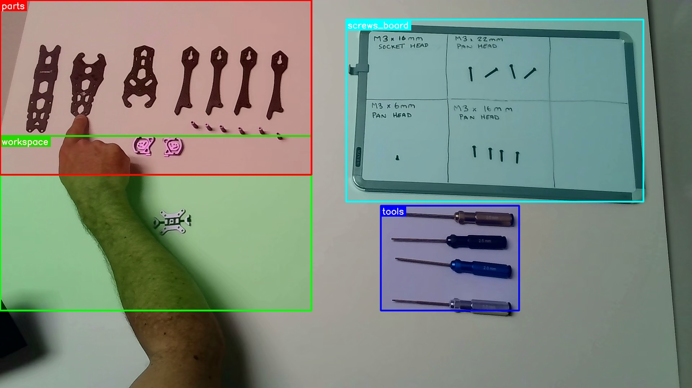  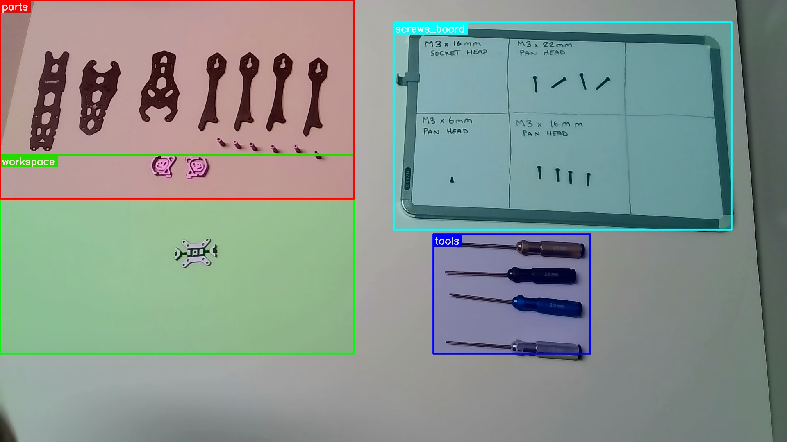  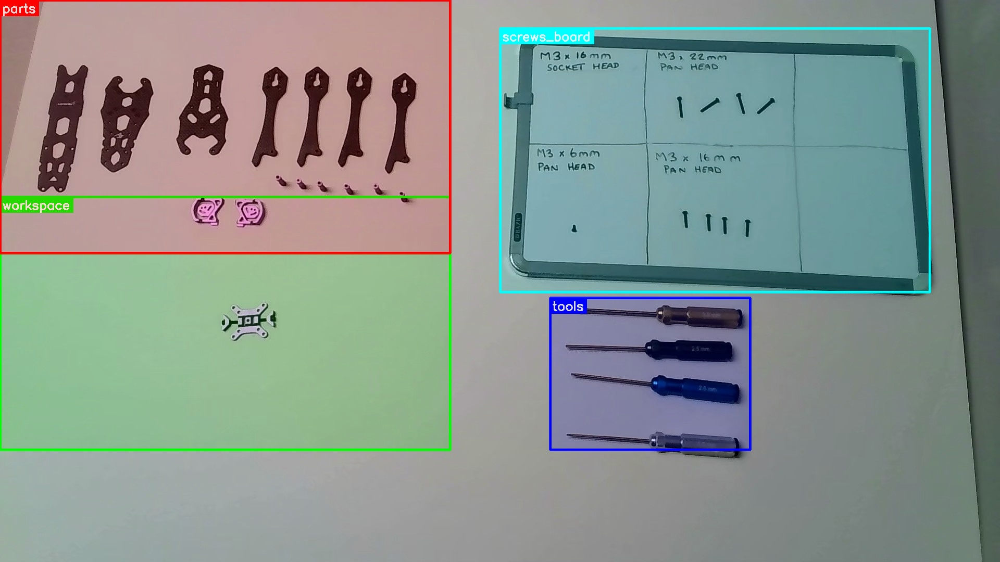  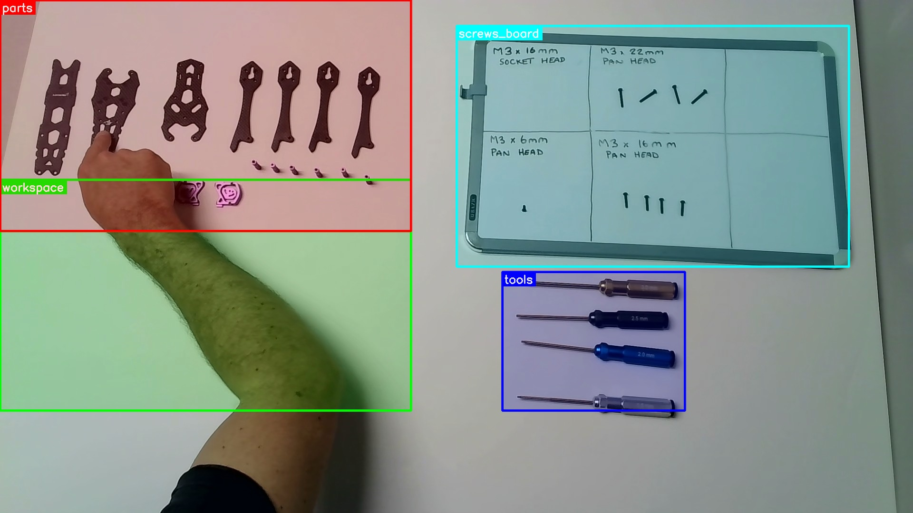    

| Zone | Bbox | Objects |
|---|---|---|
| workspace | (0.00, 0.35, 0.45, 0.80) | hand, frame component |
| tools | (0.55, 0.53, 0.75, 0.80) | screwdrivers, hex drivers |
| parts | (0.00, 0.00, 0.45, 0.45) | frame components, standoffs |
| screws_board | (0.50, 0.05, 0.93, 0.52) | whiteboard, screws |

**Description**:
In this segment, the assembler first identifies the main body plates and pink components. They then pick up one of the black main body plates (the one with two large central holes) and the larger pink component from the parts area. The larger pink component is then placed and aligned onto the black main body plate, forming an initial sub-assembly which is then placed on the workspace.

<b>Movement</b>

*   [MOVE] 00:00-00:01 | right hand | parts -> parts | Points at an intricately designed black main body plate.
*   [MOVE] 00:01-00:03 | right hand | parts -> parts | Points at a small pink component, then another small pink component.
*   [MOVE] 00:03-00:04 | right hand | parts -> parts | Points at a larger pink component.
*   [IDLE] 00:04-00:13 | right hand | parts | Nothing happening.
*   [MOVE] 00:13-00:15 | right hand | parts -> parts | Points at the intricately designed black main body plate.
*   [MOVE] 00:15-00:17 | right hand | parts -> parts | Points at a black main body plate (with two large central holes).
*   [MOVE] 00:17-00:18 | right hand | parts -> workspace | Picks up the black main body plate (with two large central holes).
*   [MOVE] 00:18-00:19 | right hand | parts -> workspace | Picks up the larger pink component.
*   [ACTION] 00:19-00:21 | right hand | workspace | Aligns and attaches the larger pink component onto the black main body plate.
*   [MOVE] 00:21-00:25 | right hand | workspace -> workspace | Places the combined black main body plate and larger pink component onto the workspace.
*   [IDLE] 00:25-00:30 | right hand | workspace | Nothing happening.

<b>Zone States</b>

*   **workspace**: One assembled piece (black main body plate with larger pink component attached) is present.
*   **tools**: All four screwdrivers are present: gold (2.5mm), black (2.0mm), blue (2.0mm), and silver (1.5mm).
*   **parts**: One intricately designed black main body plate, three black long side plates, four black arms, eight small black fasteners/spacers, and two small pink components remain. One black main body plate (with two large central holes) and one larger pink component have been used.
*   **screws_board**: All screws (M3 x 16mm socket head, M3 x 22mm pan head, M3 x 6mm pan head, M3 x 16mm pan head) are present as drawn on the board.

<b>Tools & Parts Summary</b>

Tools: [TOOL: gold screwdriver @ tools], [TOOL: black screwdriver @ tools], [TOOL: blue screwdriver @ tools], [TOOL: silver screwdriver @ tools].
Parts: [PART: intricately designed black main body plate @ parts], [PART: black long side plate (x3) @ parts], [PART: black arm (x4) @ parts], [PART: small black fastener/spacer (x8) @ parts], [PART: small pink component (x2) @ parts], [PART: assembled black main body plate with larger pink component attached @ workspace].

**Instruction:** You are in preparation phase. Next you should do **Step 1**: START THE ASSEMBLY BY USING THE SPUT REAR PLATE TO MOUNT THE X-LOCK FC ISOLATOR WITH THE M3x22MM AND THE M3x6MM SCREWS
*Match confidence: high. The video shows the person organizing parts and pointing to them, but no assembly has started yet. This is a preparation phase before any steps in the manual.*

## Segment 7 [03:30.00 - 04:00.00]

    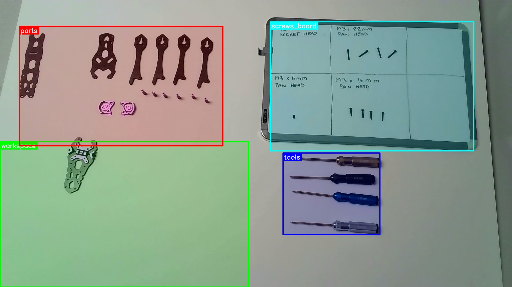    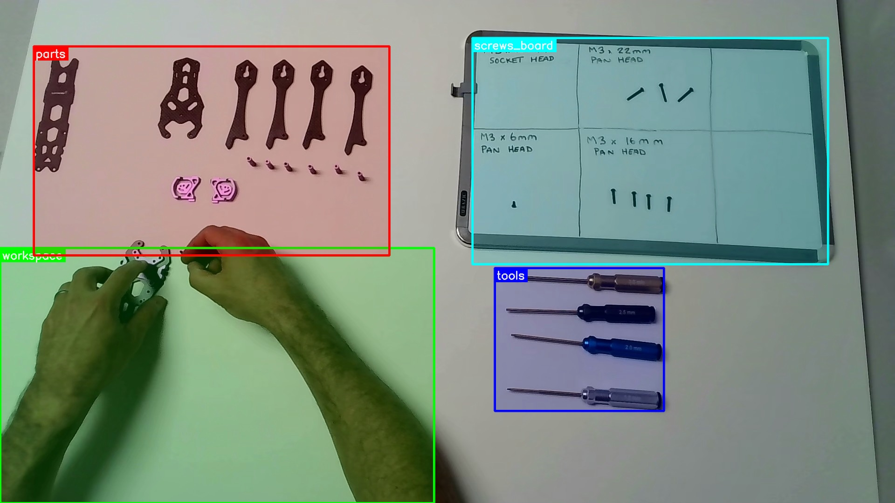  

| Zone | Bbox | Objects |
|---|---|---|
| workspace | (0.00, 0.49, 0.48, 1.00) | hands, frame components, screws |
| tools | (0.55, 0.53, 0.74, 0.82) | screwdrivers, hex drivers |
| parts | (0.04, 0.09, 0.43, 0.51) | frame components, standoffs |
| screws_board | (0.53, 0.07, 0.93, 0.53) | whiteboard, screws |

**Description**:
In this segment, the assembler continues to build the central structure of the drone. They attach one of the small pink components to the main body plate assembly using two M3 x 22mm pan head screws. The assembler uses the silver 1.5mm hex driver to pick up, insert, and tighten the screws.

<b>Movement</b>

*   00:00s-00:14s | workspace | nothing happening
*   00:14s-00:16s | M3 x 22mm pan head screw | screws_board -> workspace | Right hand picks up one M3 x 22mm pan head screw and moves it to the workspace.
*   00:16s-00:18s | assembled piece (black main body plate with larger pink component) | workspace | Both hands reposition the assembled piece in the workspace.
*   00:18s-00:19s | small pink component | parts -> workspace | Right hand picks up one small pink component from the parts zone.
*   00:19s-00:20s | small pink component | workspace | Right hand places the small pink component onto the larger pink component attached to the main body plate.
*   00:20s-00:22s | silver (1.5mm) screwdriver | tools -> workspace | Right hand picks up the silver (1.5mm) screwdriver.
*   00:22s-00:23s | M3 x 22mm pan head screw | workspace | Right hand uses the silver (1.5mm) screwdriver to pick up and insert the screw into the small pink component.
*   00:23s-00:25s | M3 x 22mm pan head screw | workspace | Right hand tightens the M3 x 22mm pan head screw into the small pink component using the silver (1.5mm) screwdriver.
*   00:25s-00:26s | silver (1.5mm) screwdriver | workspace -> tools | Right hand places the silver (1.5mm) screwdriver back to the tools zone.
*   00:26s-00:28s | M3 x 22mm pan head screw | screws_board -> workspace | Right hand picks up a second M3 x 22mm pan head screw and moves it to the workspace.
*   00:28s-00:29s | M3 x 22mm pan head screw | workspace | Right hand inserts the second M3 x 22mm pan head screw into the small pink component.
*   00:29s-00:30s | silver (1.5mm) screwdriver | tools -> workspace | Right hand picks up the silver (1.5mm) screwdriver from the tools zone.

<b>Zone States</b>

*   **workspace**: One partially assembled unit (black main body plate with larger pink component and one small pink component attached with two M3 x 22mm pan head screws) is present. The silver (1.5mm) screwdriver is in the right hand, poised to tighten the second screw.
*   **tools**: The gold (2.5mm), black (2.0mm), and blue (2.0mm) screwdrivers are present. The silver (1.5mm) screwdriver is being held by the assembler.
*   **parts**: One intricately designed black main body plate, three black long side plates, four black arms, eight small black fasteners/spacers, and one small pink component remain.
*   **screws_board**: The M3 x 16mm socket head (1), M3 x 6mm pan head (1), and M3 x 16mm pan head (4) screws are as initially drawn. The M3 x 22mm pan head section now shows 2 drawn screws remaining (two have been removed).

<b>Tools & Parts Summary</b>

*   Tools: [TOOL: gold (2.5mm) screwdriver @ tools], [TOOL: black (2.0mm) screwdriver @ tools], [TOOL: blue (2.0mm) screwdriver @ tools], [TOOL: silver (1.5mm) screwdriver @ workspace].
*   Parts: [PART: intricately designed black main body plate @ parts], [PART: black long side plate @ parts] (x3), [PART: black arm @ parts] (x4), [PART: small black fastener/spacer @ parts] (x8), [PART: small pink component @ parts] (x1).

**Instruction:** You are in preparation phase. Next you should do **Step 1**: START THE ASSEMBLY BY USING THE SPUT REAR PLATE TO MOUNT THE X-LOCK FC ISOLATOR WITH THE M3x22MM AND THE M3x6MM SCREWS
*Match confidence: high. The video shows the user organizing parts and holding a component, but no assembly has started yet. This is a preparation phase before Step 1.*

## Segment 8 [04:00.00 - 04:30.00]

      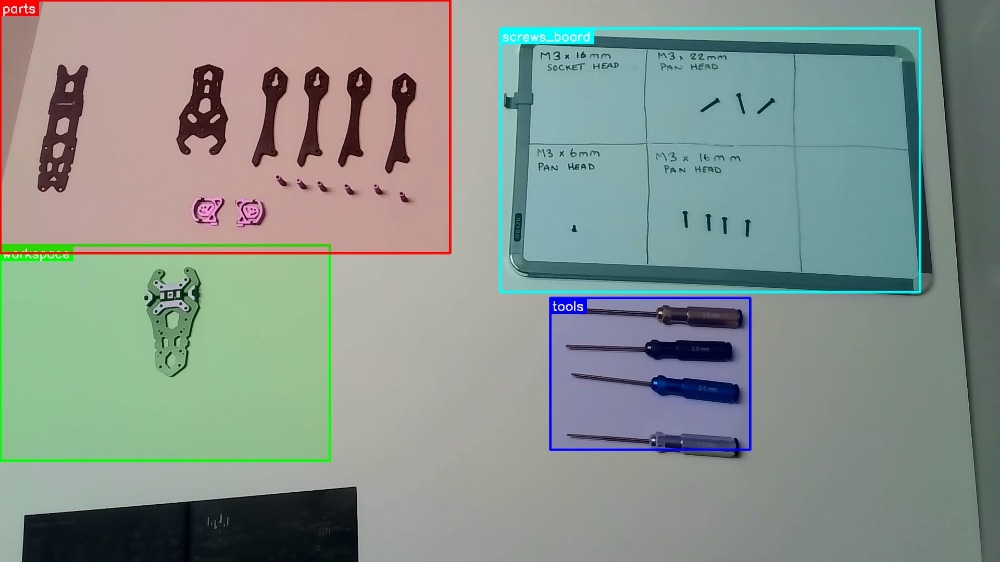  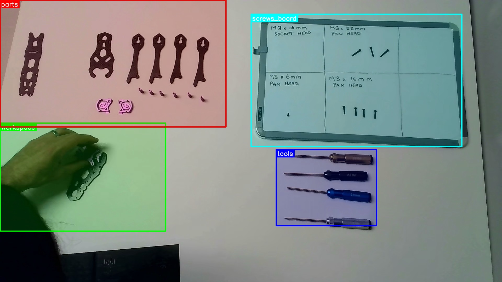  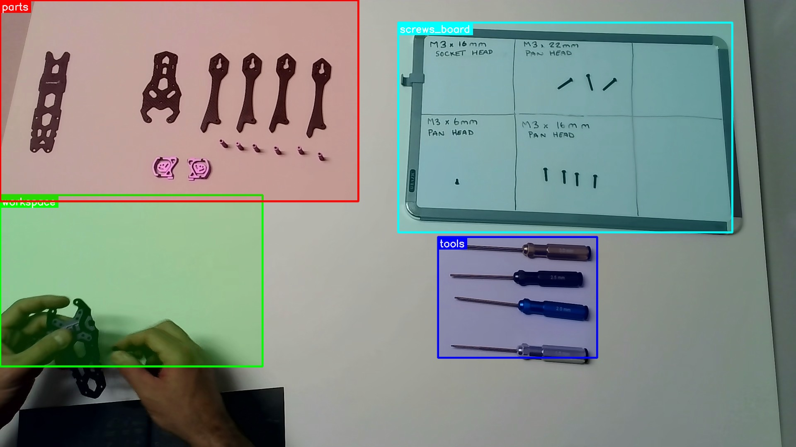

| Zone | Bbox | Objects |
|---|---|---|
| workspace | (0.00, 0.44, 0.33, 0.82) | hand, frame component, standoffs |
| tools | (0.55, 0.53, 0.75, 0.80) | hex drivers |
| parts | (0.00, 0.00, 0.45, 0.45) | frame components, standoffs |
| screws_board | (0.50, 0.05, 0.92, 0.52) | whiteboard, screws |

**Description**:
In this segment, the assembler disassembles a previously started assembly. They remove two M3 x 22mm pan head screws from the black main body plate, detaching a large and a small pink component. All components and the removed screws are then returned to their original positions on the table, effectively resetting this portion of the assembly.

<b>Movement</b>

*   00:00-00:01 | IDLE | workspace | Right hand is holding the silver (1.5mm) screwdriver over the partially assembled unit.
*   00:01-00:03 | MOVE | silver (1.5mm) screwdriver | right hand -> workspace | The silver (1.5mm) screwdriver is placed on the workspace.
*   00:03-00:05 | MOVE | partially assembled unit (black main body plate with larger pink component and one small pink component, secured by two M3 x 22mm pan head screws) | workspace -> hands | The left hand picks up the partially assembled unit.
*   00:05-00:10 | ACTION | partially assembled unit | hands | The right hand uses the silver (1.5mm) screwdriver to loosen and remove one M3 x 22mm pan head screw from the unit.
*   00:10-00:13 | ACTION | partially assembled unit | hands | The right hand uses the silver (1.5mm) screwdriver to loosen and remove the second M3 x 22mm pan head screw from the unit.
*   00:13-00:15 | ACTION | partially assembled unit | hands | The small pink component is separated from the black main body plate.
*   00:15-00:19 | ACTION | partially assembled unit | hands | The larger pink component is separated from the black main body plate.
*   00:19-00:20 | MOVE | black main body plate | hands -> parts | The bare black main body plate is placed into the parts zone.
*   00:20-00:22 | MOVE | larger pink component, small pink component | hands -> parts | The larger pink component and the small pink component are placed into the parts zone.
*   00:22-00:24 | MOVE | two M3 x 22mm pan head screws | hands -> screws_board | The two removed M3 x 22mm pan head screws are placed back onto the screws_board, restoring the count to four.
*   00:24-00:30 | IDLE | workspace | Nothing happening. Hands are clear.

<b>Zone States</b>

*   **workspace**: The silver (1.5mm) screwdriver is on the workspace.
*   **tools**: The gold (2.5mm), black (2.0mm), and blue (2.0mm) screwdrivers are present.
*   **parts**: Two intricately designed black main body plates, three black long side plates, four black arms, eight small black fasteners/spacers, two small pink components, and one larger pink component remain.
*   **screws_board**: The M3 x 16mm socket head (1), M3 x 22mm pan head (4), M3 x 6mm pan head (1), and M3 x 16mm pan head (4) screws are as initially drawn.

<b>Tools & Parts Summary</b>

Tools: [TOOL: gold (2.5mm) screwdriver @ tools], [TOOL: black (2.0mm) screwdriver @ tools], [TOOL: blue (2.0mm) screwdriver @ tools], [TOOL: silver (1.5mm) screwdriver @ workspace].
Parts: [PART: intricately designed black main body plate (x2) @ parts], [PART: black long side plate (x3) @ parts], [PART: black arm (x4) @ parts], [PART: small black fasteners/spacers (x8) @ parts], [PART: small pink component (x2) @ parts], [PART: larger pink component (x1) @ parts], [SCREW: M3 x 16mm socket head (x1) @ screws_board], [SCREW: M3 x 22mm pan head (x4) @ screws_board], [SCREW: M3 x 6mm pan head (x1) @ screws_board], [SCREW: M3 x 16mm pan head (x4) @ screws_board].

**Instruction:** You are on **Step 1**: START THE ASSEMBLY BY USING THE SPUT REAR PLATE TO MOUNT THE X-LOCK FC ISOLATOR WITH THE M3x22MM AND THE M3x6MM SCREWS
Next you should do **Step 2**: Lock the arms by tightening the arm wedges using M3x16mm screws to lock them in place.
*Match confidence: high. The video shows the person assembling the X-lock FC isolator with the split rear plate using screws, which directly corresponds to Step 1 of the manual.*

## Segment 9 [04:30.00 - 05:00.00]

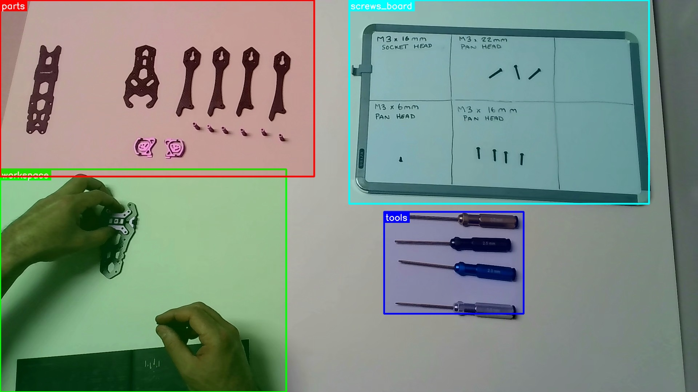  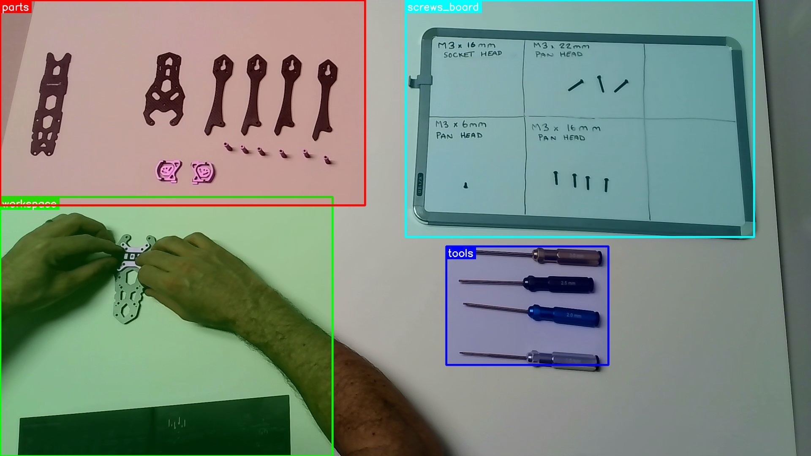    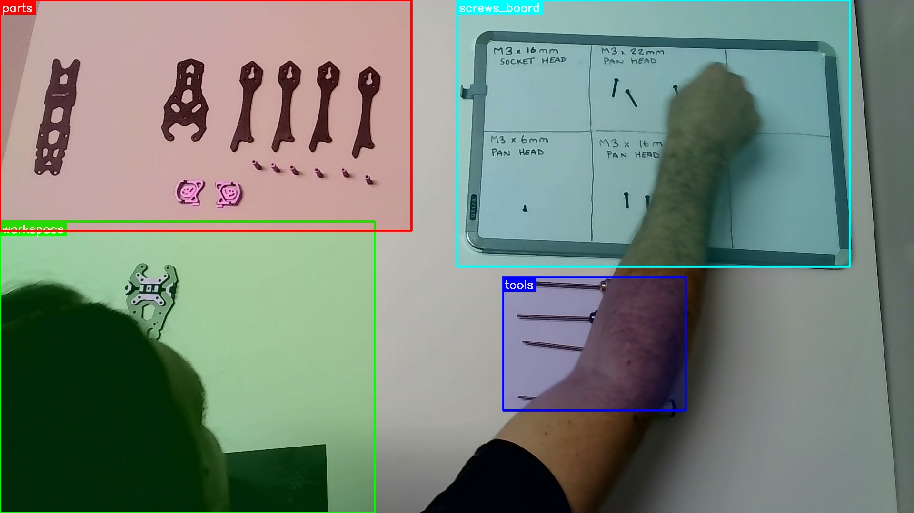    

| Zone | Bbox | Objects |
|---|---|---|
| workspace | (0.00, 0.43, 0.41, 1.00) | hands, frame components |
| tools | (0.55, 0.54, 0.75, 0.80) | screwdrivers, hex drivers |
| parts | (0.00, 0.00, 0.45, 0.45) | frame components, standoffs |
| screws_board | (0.50, 0.00, 0.93, 0.52) | whiteboard, screws |

**Description**: The assembler begins by attaching a small pink component to one of the intricately designed black main body plates. Following this, the assembler picks up a silver screwdriver and uses it to verify the count of the M3 x 22mm pan head screws drawn on the whiteboard by briefly erasing and redrawing each one. The screwdriver is then returned to the tools zone.

<b>Movement</b>

[MOVE] ~0s-~2s | black intricately designed main body plate | parts -> workspace | Left hand moves a black intricately designed main body plate from the parts zone to the workspace.
[MOVE] ~0s-~2s | small pink component | parts -> hand | Right hand picks up a small pink component from the parts zone.
[ACTION] ~2s-~5s | small pink component, black intricately designed main body plate | workspace | Right hand places the small pink component onto the black intricately designed main body plate, and both hands align and press them together.
[IDLE] ~5s-~10s | workspace | nothing happening, hands are out of view.
[MOVE] ~10s-~12s | silver (1.5mm) screwdriver | workspace -> hand | Right hand picks up the silver (1.5mm) screwdriver from the workspace.
[MOVE] ~12s-~13s | silver (1.5mm) screwdriver | hand -> screws_board | Right hand moves the silver (1.5mm) screwdriver towards the screws_board.
[ACTION] ~13s-~26s | M3 x 22mm pan head screws (drawing) | screws_board | Right hand uses the silver (1.5mm) screwdriver to briefly erase and redraw each of the four M3 x 22mm pan head screws on the screws_board.
[MOVE] ~26s-~28s | silver (1.5mm) screwdriver | hand -> tools | Right hand places the silver (1.5mm) screwdriver onto the tools zone.
[IDLE] ~28s-~30s | workspace | nothing happening, hands are out of view.

<b>Zone States</b>

- **workspace**: One black intricately designed main body plate with one small pink component attached.
- **tools**: Gold (2.5mm) screwdriver, black (2.0mm) screwdriver, blue (2.0mm) screwdriver, silver (1.5mm) screwdriver.
- **parts**: One intricately designed black main body plate, three black long side plates, four black arms, eight small black fasteners/spacers, one larger pink component, one small pink component.
- **screws_board**: M3 x 16mm socket head (1), M3 x 22mm pan head (4), M3 x 6mm pan head (1), M3 x 16mm pan head (4) screws are drawn, all present as initially.

<b>Tools & Parts Summary</b>

Tools: [TOOL: gold (2.5mm) screwdriver @ tools], [TOOL: black (2.0mm) screwdriver @ tools], [TOOL: blue (2.0mm) screwdriver @ tools], [TOOL: silver (1.5mm) screwdriver @ tools].
Parts: [PART: black intricately designed main body plate with pink component attached @ workspace], [PART: intricately designed black main body plate @ parts], [PART: black long side plates (3) @ parts], [PART: black arms (4) @ parts], [PART: small black fasteners/spacers (8) @ parts], [PART: larger pink component @ parts], [PART: small pink component @ parts].

**Instruction:** You are in preparation phase. Next you should do **Step 1**: START THE ASSEMBLY BY USING THE SPUT REAR PLATE TO MOUNT THE X-LOCK FC ISOLATOR WITH THE M3x22MM AND THE M3x6MM SCREWS
*Match confidence: high. The person in the video is currently organizing parts and screws, which is a preparatory step before starting the actual assembly. They are not yet performing any of the numbered steps in the manual.*

## Segment 10 [05:00.00 - 05:30.00]

      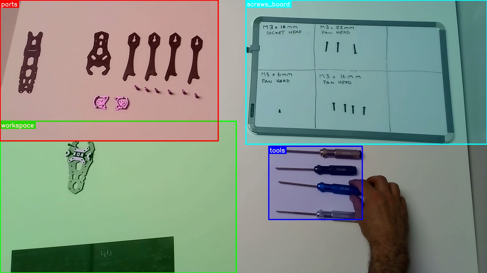  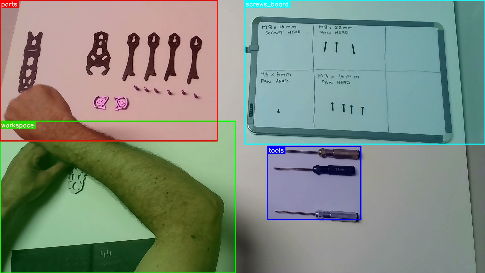  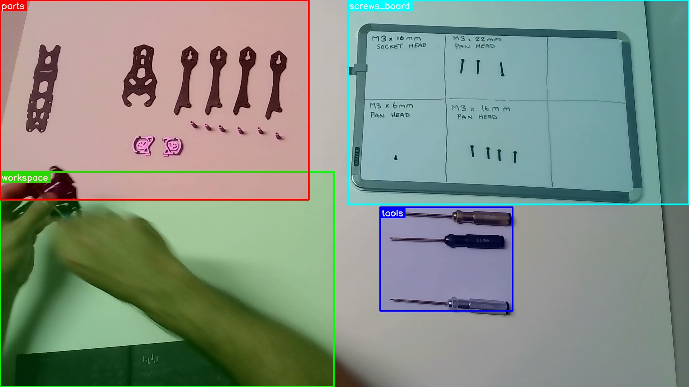

| Zone | Bbox | Objects |
|---|---|---|
| workspace | (0.00, 0.44, 0.48, 1.00) | hand, frame component |
| tools | (0.55, 0.54, 0.74, 0.80) | hex drivers, screwdrivers |
| parts | (0.00, 0.00, 0.45, 0.52) | frame components, standoffs |
| screws_board | (0.51, 0.00, 1.00, 0.53) | whiteboard, screws |

**Description**: The user picks up an M3 x 6mm pan head screw from the screws board and inserts it into the small pink component attached to the main body plate. They then use a blue 2.0mm screwdriver to tighten this screw, securing the small pink component to the main body assembly.

<b>Movement</b>

- [MOVE] 0:06-0:08 | one M3 x 6mm pan head screw | screws_board -> workspace | The right hand picks up one screw from the "M3 x 6mm pan head" section.
- [ACTION] 0:09-0:14 | one M3 x 6mm pan head screw | workspace | The right hand inserts and loosely positions the screw into the small pink component on the main body plate.
- [MOVE] 0:15-0:16 | blue (2.0mm) screwdriver | tools -> workspace | The right hand picks up the blue (2.0mm) screwdriver.
- [ACTION] 0:17-0:25 | blue (2.0mm) screwdriver | workspace | The right hand uses the blue (2.0mm) screwdriver to tighten the M3 x 6mm pan head screw, securing the small pink component to the main body plate.
- [MOVE] 0:26-0:27 | blue (2.0mm) screwdriver | workspace -> tools | The right hand returns the blue (2.0mm) screwdriver to the tools zone.

<b>Zone States</b>

- **workspace**: One black intricately designed main body plate with one larger pink component and one smaller pink component attached, secured by one M3 x 6mm pan head screw.
- **tools**: Gold (2.5mm) screwdriver, black (2.0mm) screwdriver, blue (2.0mm) screwdriver, silver (1.5mm) screwdriver are all present.
- **parts**: Three black long side plates, four black arms, eight small black fasteners/spacers remain.
- **screws_board**: M3 x 16mm socket head (1), M3 x 22mm pan head (4), M3 x 6mm pan head (0), M3 x 16mm pan head (4) screws are drawn, with one M3 x 6mm pan head screw removed.

<b>Tools & Parts Summary</b>

Tools: [TOOL: gold (2.5mm) screwdriver @ tools], [TOOL: black (2.0mm) screwdriver @ tools], [TOOL: blue (2.0mm) screwdriver @ tools], [TOOL: silver (1.5mm) screwdriver @ tools].
Parts: [PART: one black intricately designed main body plate @ workspace], [PART: three black long side plates @ parts], [PART: four black arms @ parts], [PART: eight small black fasteners/spacers @ parts], [PART: one larger pink component @ workspace], [PART: one small pink component @ workspace].

**Instruction:** You are in preparation phase. Next you should do **Step 1**: START THE ASSEMBLY BY USING THE SPUT REAR PLATE TO MOUNT THE X-LOCK FC ISOLATOR WITH THE M3x22MM AND THE M3x6MM SCREWS
*Match confidence: high. The video keyframes show the person organizing parts and picking up the 'split rear plate' and 'X-lock FC isolator', which are the first components mentioned in Step 1. They have not yet started the actual assembly process of screwing parts together.*

## Segment 11 [05:30.00 - 06:00.00]

          

| Zone | Bbox | Objects |
|---|---|---|
| workspace | (0.00, 0.49, 0.47, 0.89) | hands, screwdriver, frame components |
| tools | (0.56, 0.54, 0.74, 0.82) | screwdrivers, hex drivers |
| parts | (0.02, 0.09, 0.43, 0.42) | frame components, standoffs |
| screws_board | (0.51, 0.05, 0.93, 0.53) | whiteboard, screws |

**Description**:
In this segment, the M3 x 6mm pan head screw securing the larger pink component to the main body plate is removed. An M3 x 16mm socket head screw is then installed to secure the larger pink component. The detached M3 x 6mm pan head screw is placed back onto the screws_board, and the smaller pink component is briefly removed and then re-attached to the main body plate.

<b>Movement</b>

- 0.00s-0.01s | M3 x 6mm pan head screw | workspace | M3 x 6mm pan head screw is unscrewed from the larger pink component of the main body plate assembly.
- 0.01s-0.02s | M3 x 6mm pan head screw | main body plate assembly -> workspace | The unscrewed M3 x 6mm pan head screw is placed on the workspace.
- 0.02s-0.03s | blue 2.0mm screwdriver | workspace -> tools | The blue 2.0mm screwdriver is placed back in the tools zone.
- 0.03s-0.04s | gold 2.5mm screwdriver | tools -> workspace | The gold 2.5mm screwdriver is picked up from the tools zone.
- 0.04s-0.05s | M3 x 16mm socket head screw | screws_board -> gold 2.5mm screwdriver | An M3 x 16mm socket head screw is picked up from the 'M3 x 16mm socket head' section of the screws_board using the gold 2.5mm screwdriver.
- 0.05s-0.09s | M3 x 16mm socket head screw | workspace | The M3 x 16mm socket head screw is screwed into the larger pink component of the main body plate assembly.
- 0.09s-0.10s | gold 2.5mm screwdriver | workspace -> tools | The gold 2.5mm screwdriver is placed back in the tools zone.
- 0.10s-0.12s | smaller pink component | main body plate assembly -> workspace | The smaller pink component is removed from the main body plate assembly and placed on the workspace.
- 0.12s-0.14s | blue 2.0mm screwdriver | tools -> workspace | The blue 2.0mm screwdriver is picked up from the tools zone.
- 0.14s-0.15s | M3 x 6mm pan head screw | workspace -> blue 2.0mm screwdriver | The M3 x 6mm pan head screw is picked up from the workspace using the blue 2.0mm screwdriver.
- 0.15s-0.16s | M3 x 6mm pan head screw | blue 2.0mm screwdriver -> screws_board | The M3 x 6mm pan head screw is placed onto the 'M3 x 6mm pan head' section of the screws_board.
- 0.16s-0.17s | blue 2.0mm screwdriver | workspace -> tools | The blue 2.0mm screwdriver is placed back in the tools zone.
- 0.17s-0.19s | smaller pink component | workspace -> main body plate assembly | The smaller pink component is picked up from the workspace and re-attached to the main body plate assembly.
- 0.19s-0.29s | main body plate assembly | workspace | The main body plate assembly is rotated and adjusted by hand on the workspace.
- 0.29s-0.30s | workspace | nothing happening

<b>Zone States</b>

- **workspace**: One black intricately designed main body plate with one larger pink component secured by one M3 x 16mm socket head screw, and one smaller pink component attached but not secured.
- **tools**: Gold (2.5mm) screwdriver, black (2.0mm) screwdriver, blue (2.0mm) screwdriver, silver (1.5mm) screwdriver are all present.
- **parts**: Three black long side plates, four black arms, eight small black fasteners/spacers remain.
- **screws_board**: M3 x 16mm socket head (drawn: 1, actual: 0), M3 x 22mm pan head (drawn: 4, actual: 4), M3 x 6mm pan head (drawn: 0, actual: 1), M3 x 16mm pan head (drawn: 4, actual: 4) screws are present.

<b>Tools & Parts Summary</b>

Tools: [TOOL: Gold (2.5mm) screwdriver @ tools], [TOOL: black (2.0mm) screwdriver @ tools], [TOOL: blue (2.0mm) screwdriver @ tools], [TOOL: silver (1.5mm) screwdriver @ tools].
Parts: [PART: black intricately designed main body plate with one larger pink component secured by one M3 x 16mm socket head screw, and one smaller pink component attached but not secured @ workspace], [PART: three black long side plates @ parts], [PART: four black arms @ parts], [PART: eight small black fasteners/spacers @ parts].

**Instruction:** You are on **Step 1**: START THE ASSEMBLY BY USING THE SPUT REAR PLATE TO MOUNT THE X-LOCK FC ISOLATOR WITH THE M3x22MM AND THE M3x6MM SCREWS
Next you should do **Step 2**: Lock the arms by tightening the arm wedges using M3x16mm screws to lock them in place.
*Match confidence: high. The video shows the person attaching the FC isolator to the rear plate using screws, which directly corresponds to Step 1 of the manual.*

## Segment 12 [06:00.00 - 06:30.00]

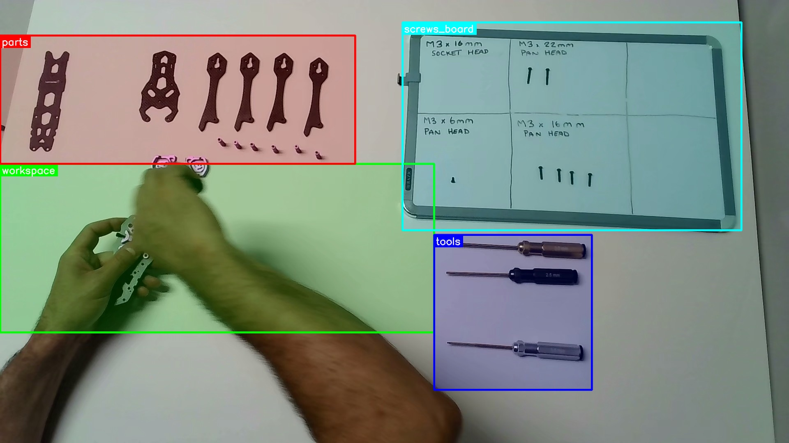    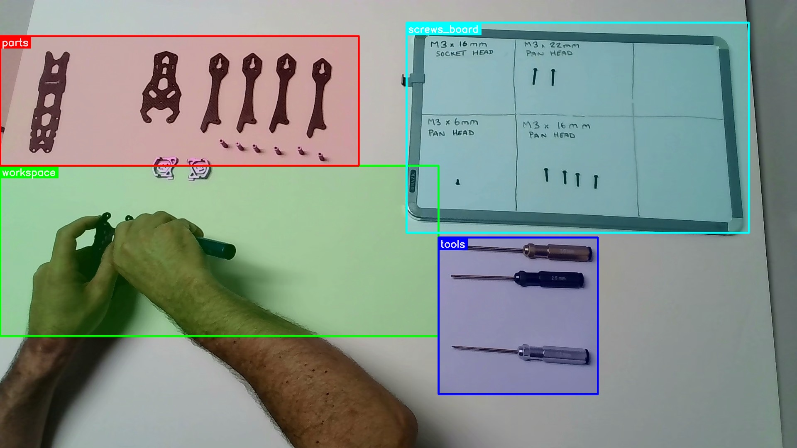      

| Zone | Bbox | Objects |
|---|---|---|
| workspace | (0.00, 0.37, 0.55, 0.75) | hands, purple frame components, screwdriver |
| tools | (0.55, 0.53, 0.75, 0.88) | three screwdrivers |
| parts | (0.00, 0.08, 0.45, 0.37) | black frame components, small purple standoffs, small screws |
| screws_board | (0.51, 0.05, 0.94, 0.52) | whiteboard with screw types and sizes |

**Description**: In this segment, the assembler finishes tightening a pre-existing screw to fully secure the smaller pink component onto the main body plate using a blue 2.0mm screwdriver. After placing the screwdriver down, they indicate the next screw type on the board, then retrieve a black long side plate from the parts zone, placing it on the workspace, and pick up the blue screwdriver again, preparing to attach the side plate.

<b>Movement</b>

*   [ACTION] 00:00-00:15 | blue 2.0mm screwdriver | workspace | The right hand uses the blue 2.0mm screwdriver to tighten a pre-existing screw, fully securing the smaller pink component to the main body plate.
*   [MOVE] 00:15-00:19 | blue 2.0mm screwdriver | workspace -> tools | The right hand places the blue 2.0mm screwdriver from the workspace back into the tools zone.
*   [MOVE] 00:19-00:20 | assembled main body plate with pink components | workspace -> workspace | The left hand repositions the assembled main body plate with the attached pink components on the workspace.
*   [ACTION] 00:20-00:21 | hand | screws_board | The right hand points to the "M3 x 22mm PAN HEAD" section on the screws_board.
*   [MOVE] 00:21-00:23 | hand | screws_board -> parts | The right hand moves from the screws_board to the parts zone.
*   [MOVE] 00:23-00:25 | one black long side plate | parts -> workspace | The right hand picks up one black long side plate from the parts zone and places it on the workspace.
*   [MOVE] 00:25-00:29 | blue 2.0mm screwdriver | tools -> workspace | The right hand picks up the blue 2.0mm screwdriver from the tools zone and brings it over to the workspace.
*   [ACTION] 00:29-00:30 | blue 2.0mm screwdriver | workspace | The right hand positions the blue 2.0mm screwdriver over a hole in the main body plate, preparing for the next step.

<b>Zone States</b>

*   **workspace**: One black intricately designed main body plate with two pink components (both secured by M3 x 16mm socket head screws). One black long side plate. A blue 2.0mm screwdriver held by the right hand.
*   **tools**: Gold (2.5mm) screwdriver, black (2.0mm) screwdriver, silver (1.5mm) screwdriver are present.
*   **parts**: Two black long side plates, four black arms, eight small black fasteners/spacers remain.
*   **screws_board**: M3 x 16mm socket head (drawn: 1, actual: 0), M3 x 22mm pan head (drawn: 4, actual: 4), M3 x 6mm pan head (drawn: 0, actual: 1), M3 x 16mm pan head (drawn: 4, actual: 4) screws are present.

<b>Tools & Parts Summary</b>

Tools: [TOOL: gold 2.5mm screwdriver @ tools], [TOOL: black 2.0mm screwdriver @ tools], [TOOL: blue 2.0mm screwdriver @ workspace], [TOOL: silver 1.5mm screwdriver @ tools].
Parts: [PART: main body plate @ workspace], [PART: two pink components @ workspace], [PART: two black long side plates @ parts], [PART: one black long side plate @ workspace], [PART: four black arms @ parts], [PART: eight small black fasteners/spacers @ parts].

**Instruction:** You are on **Step 1**: START THE ASSEMBLY BY USING THE SPUT REAR PLATE TO MOUNT THE X-LOCK FC ISOLATOR WITH THE M3x22MM AND THE M3x6MM SCREWS
Next you should do **Step 2**: Lock the arms by tightening the arm wedges using M3x16mm screws to lock them in place.
*Match confidence: high. The video shows the person assembling the X-lock FC isolator with the split rear plate using screws, which directly corresponds to Step 1 of the manual.*

## Segment 13 [06:30.00 - 07:00.00]

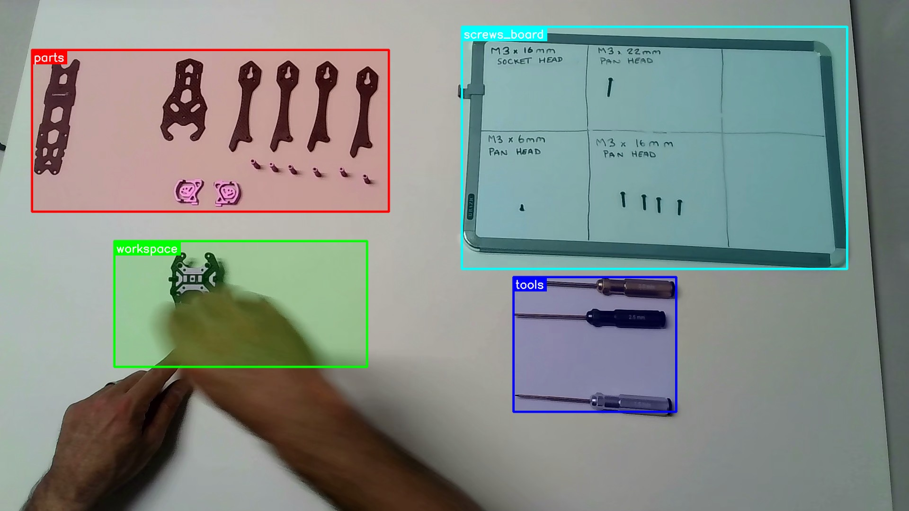  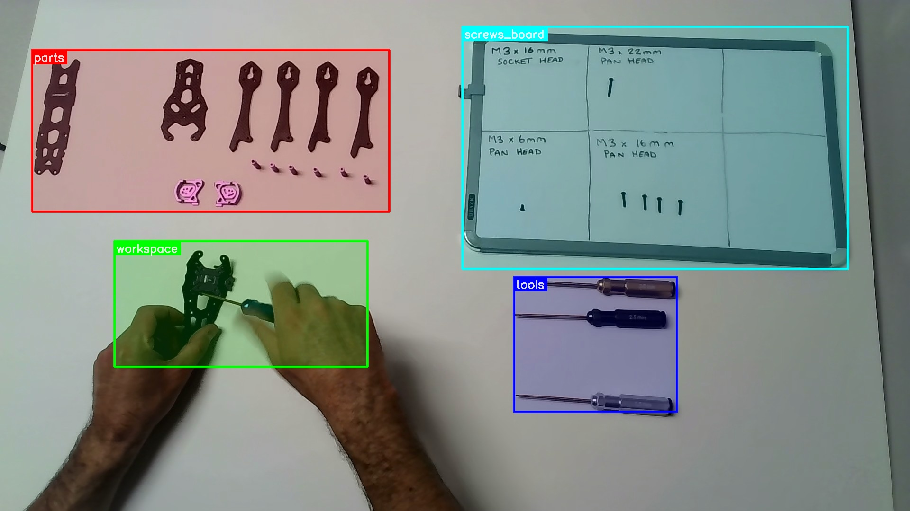  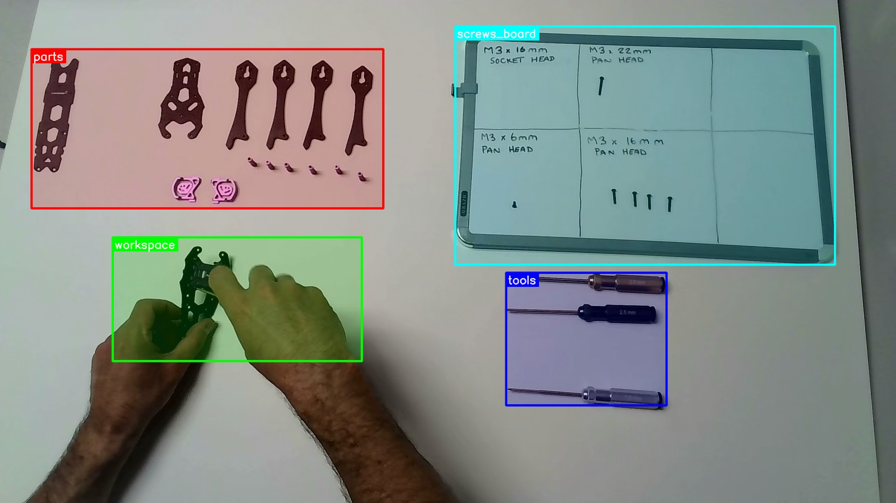      

| Zone | Bbox | Objects |
|---|---|---|
| workspace | (0.13, 0.47, 0.40, 0.72) | hands, screwdriver, frame component |
| tools | (0.56, 0.54, 0.74, 0.81) | screwdrivers, hex drivers |
| parts | (0.04, 0.10, 0.43, 0.41) | drone frame components, standoffs |
| screws_board | (0.51, 0.05, 0.93, 0.53) | whiteboard, screws |

**Description**:
The person continues to attach the first black long side plate to the main body. Using a blue 2.0mm screwdriver, they first tighten an M3 x 16mm socket head screw that was partially inserted from the previous step. Subsequently, they insert and tighten a second M3 x 16mm socket head screw to fully secure the long side plate to the main body, with the left hand stabilizing the assembly.

<b>Movement</b>

*   [ACTION] 0s-11s | blue 2.0mm screwdriver | workspace | Tightening an M3 x 16mm socket head screw, securing the first black long side plate to the main body.
*   [IDLE] 11s-16s | workspace | The right hand holds the blue 2.0mm screwdriver over the assembly.
*   [ACTION] 16s-27s | blue 2.0mm screwdriver | workspace | Inserting and tightening a second M3 x 16mm socket head screw, further securing the first black long side plate to the main body.
*   [MOVE] 27s-29s | blue 2.0mm screwdriver | workspace -> towards tools | The right hand moves the screwdriver away from the assembled piece.
*   [IDLE] 29s-30s | tools | The blue 2.0mm screwdriver is in motion, heading back towards the tool zone but not yet at rest.

<b>Zone States</b>

*   **workspace**: One partially assembled black intricately designed main body plate with two pink components (secured by M3 x 16mm socket head screws) and one black long side plate (secured by two M3 x 16mm socket head screws).
*   **tools**: Gold (2.5mm) screwdriver, black (2.0mm) screwdriver, silver (1.5mm) screwdriver are present. The blue 2.0mm screwdriver is in transit back to this zone.
*   **parts**: One black long side plate, four black arms, eight small black fasteners/spacers remain.
*   **screws_board**: M3 x 16mm socket head (drawn: 1, actual: 0), M3 x 22mm pan head (drawn: 4, actual: 4), M3 x 6mm pan head (drawn: 0, actual: 1), M3 x 16mm pan head (drawn: 4, actual: 4) screws are present.

<b>Tools & Parts Summary</b>

Tools: [TOOL: gold 2.5mm screwdriver @ tools], [TOOL: black 2.0mm screwdriver @ tools], [TOOL: silver 1.5mm screwdriver @ tools], [TOOL: blue 2.0mm screwdriver @ tools].
Parts: [PART: black intricately designed main body plate @ workspace], [PART: two pink components @ workspace], [PART: black long side plate (assembled) @ workspace], [PART: black long side plate (remaining) @ parts], [PART: black arms @ parts], [PART: small black fasteners/spacers @ parts], [PART: M3 x 16mm socket head screws (used 2 in this segment) @ workspace], [PART: M3 x 22mm pan head screws (4) @ screws_board], [PART: M3 x 6mm pan head screw (1) @ screws_board], [PART: M3 x 16mm pan head screws (4) @ screws_board].

**Instruction:** You are in preparation phase. Next you should do **Step 1**: START THE ASSEMBLY BY USING THE SPUT REAR PLATE TO MOUNT THE X-LOCK FC ISOLATOR WITH THE M3x22MM AND THE M3x6MM SCREWS
*Match confidence: high. The person in the video is currently organizing parts and has not yet started the assembly process as described in Step 1. They are holding what appears to be the split rear plate and the FC isolator, which are the first components mentioned in Step 1, but they are not actively mounting them with screws yet.*

## Segment 14 [07:00.00 - 07:30.00]

    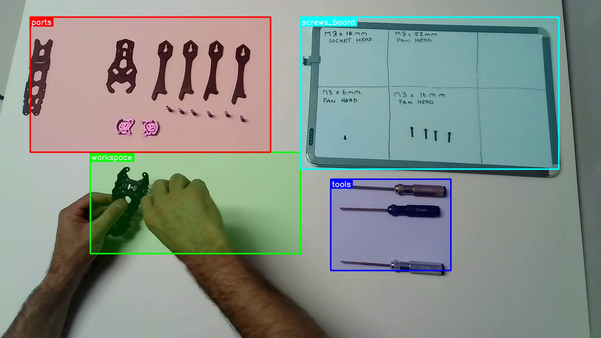  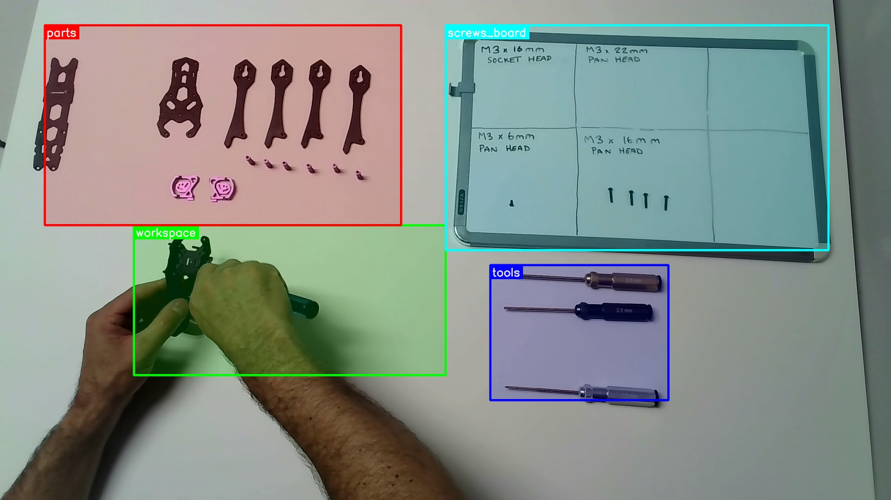    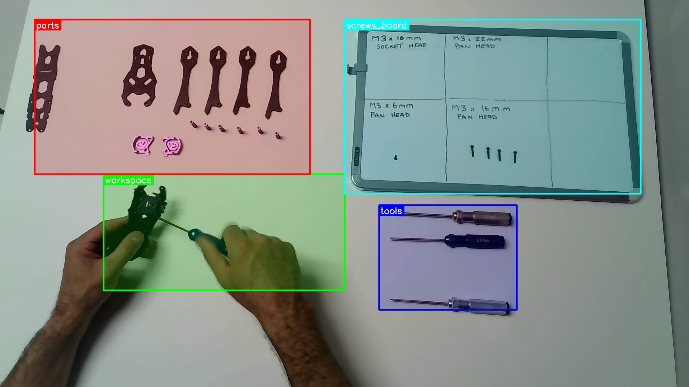

| Zone | Bbox | Objects |
|---|---|---|
| workspace | (0.15, 0.45, 0.50, 0.75) | hands, frame components, screwdriver |
| tools | (0.55, 0.53, 0.75, 0.80) | screwdrivers |
| parts | (0.05, 0.05, 0.45, 0.45) | frame components, standoffs |
| screws_board | (0.50, 0.05, 0.93, 0.50) | whiteboard, screws |

**Description**: The assembler continues the main body assembly by securing the second pink component to the intricately designed main body plate. They pick up an M3 x 6mm pan head screw and use a blue 2.0mm screwdriver to tighten it into place, firmly attaching the component.

<b>Movement</b>

*   [MOVE] 0s-1s | blue 2.0mm screwdriver | workspace -> tools | placed the screwdriver back into the tools zone.
*   [MOVE] 4s-5s | M3 x 6mm pan head screw | screws_board -> workspace | picked up the last M3 x 6mm pan head screw from the screws board.
*   [MOVE] 5s-8s | M3 x 6mm pan head screw | workspace | positioned the screw into a hole on the second pink component on the main body assembly.
*   [MOVE] 8s-9s | blue 2.0mm screwdriver | tools -> workspace | picked up the blue 2.0mm screwdriver.
*   [ACTION] 9s-29s | M3 x 6mm pan head screw | workspace | tightened the M3 x 6mm pan head screw into the pink component using the blue 2.0mm screwdriver.
*   [MOVE] 29s-30s | blue 2.0mm screwdriver | workspace -> tools | began moving the screwdriver back to the tools zone.

<b>Zone States</b>

*   **workspace**: One partially assembled black intricately designed main body plate with two pink components (now fully secured by screws, one of which is an M3 x 6mm pan head screw) and one black long side plate (secured by two M3 x 16mm socket head screws).
*   **tools**: Gold (2.5mm) screwdriver, black (2.0mm) screwdriver, silver (1.5mm) screwdriver are present. The blue 2.0mm screwdriver is in transit back to this zone.
*   **parts**: One black long side plate, four black arms, eight small black fasteners/spacers remain.
*   **screws_board**: M3 x 16mm socket head (drawn: 1, actual: 0), M3 x 22mm pan head (drawn: 4, actual: 4), M3 x 6mm pan head (drawn: 0, actual: 0), M3 x 16mm pan head (drawn: 4, actual: 4).

<b>Tools & Parts Summary</b>

Tools: [TOOL: gold (2.5mm) screwdriver @ tools], [TOOL: black (2.0mm) screwdriver @ tools], [TOOL: silver (1.5mm) screwdriver @ tools], [TOOL: blue (2.0mm) screwdriver @ tools].
Parts: [PART: black long side plate @ parts], [PART: black arm @ parts], [PART: small black fastener/spacer @ parts].

**Instruction:** You are on **Step 1**: START THE ASSEMBLY BY USING THE SPUT REAR PLATE TO MOUNT THE X-LOCK FC ISOLATOR WITH THE M3x22MM AND THE M3x6MM SCREWS
Next you should do **Step 2**: Lock the arms by tightening the arm wedges using M3x16mm screws to lock them in place.
*Match confidence: high. The video shows the person assembling the FC isolator to the rear plate using screws, which directly corresponds to Step 1 of the manual.*

## Segment 15 [07:30.00 - 08:00.00]

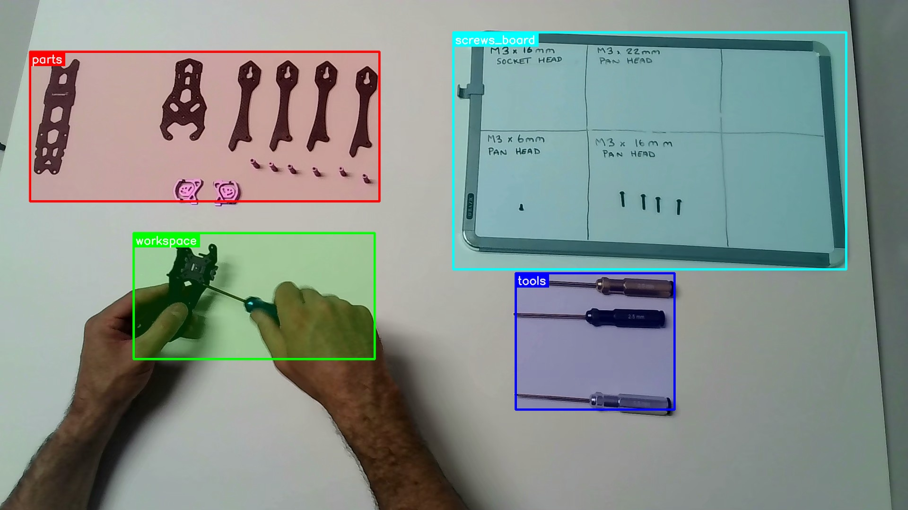  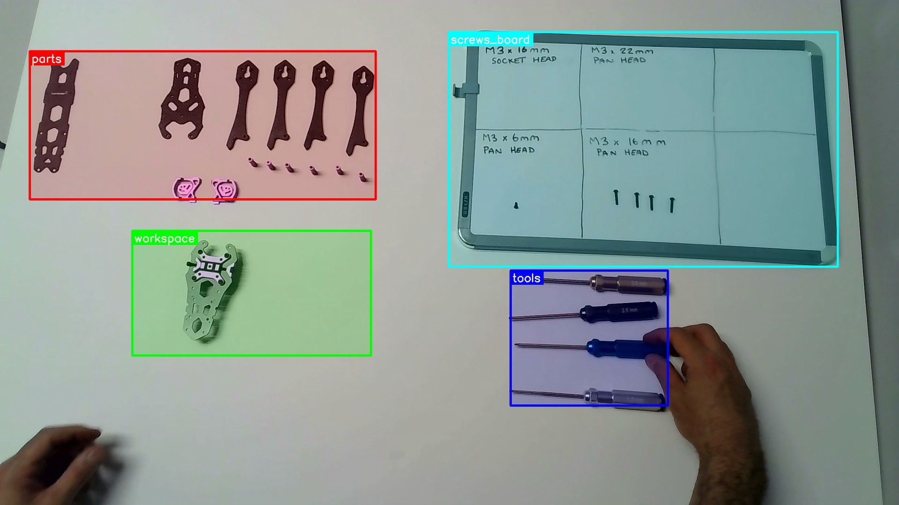  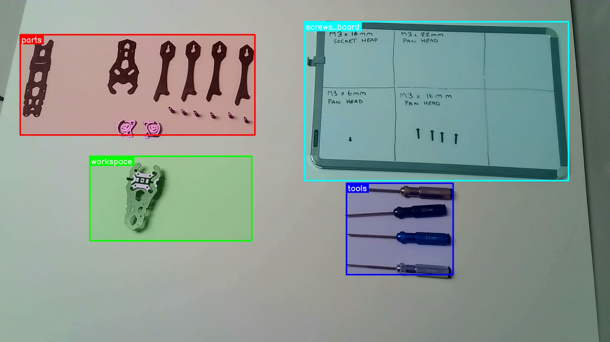    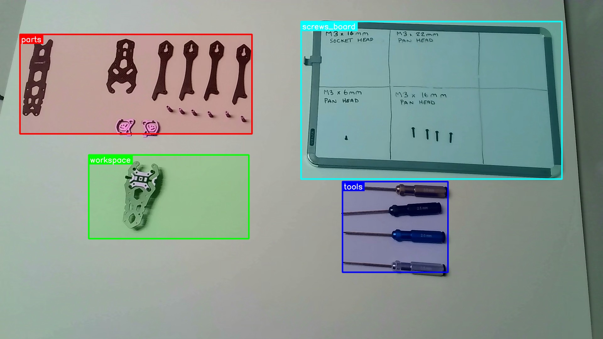  

| Zone | Bbox | Objects |
|---|---|---|
| workspace | (0.15, 0.46, 0.41, 0.70) | hands, screwdriver, drone frame part |
| tools | (0.57, 0.54, 0.74, 0.80) | screwdrivers, hex drivers |
| parts | (0.03, 0.10, 0.42, 0.40) | drone frame components, standoffs, screws |
| screws_board | (0.50, 0.06, 0.93, 0.53) | whiteboard, screws |

**Description**:
In this segment, the person finishes securing the second pink component onto the main body plate. Using the blue 2.0mm screwdriver, they tighten the final screw for the component. Once the attachment is complete, the screwdriver is placed back into the tools zone.

<b>Movement</b>

*   [ACTION] 0s-2s | blue 2.0mm screwdriver | workspace | Tightening a screw on the right pink component to secure it to the main body plate.
*   [MOVE] 2s-3s | blue 2.0mm screwdriver | workspace -> tools | The screwdriver is placed back onto the table in the tools zone.
*   [IDLE] 3s-30s | hands | workspace | Hands are idle; no further actions are performed.

<b>Zone States</b>

*   **workspace**: One partially assembled black intricately designed main body plate with two pink components (both secured by screws) and one black long side plate (secured by two M3 x 16mm socket head screws).
*   **tools**: Gold (2.5mm) screwdriver, black (2.0mm) screwdriver, blue (2.0mm) screwdriver, silver (1.5mm) screwdriver are present.
*   **parts**: One black long side plate, four black arms, eight small black fasteners/spacers remain.
*   **screws_board**: M3 x 16mm socket head (drawn: 1, actual: 0), M3 x 22mm pan head (drawn: 4, actual: 4), M3 x 6mm pan head (drawn: 1, actual: 0), M3 x 16mm pan head (drawn: 4, actual: 4).

<b>Tools & Parts Summary</b>

Tools: [TOOL: gold 2.5mm screwdriver @ tools], [TOOL: black 2.0mm screwdriver @ tools], [TOOL: blue 2.0mm screwdriver @ tools], [TOOL: silver 1.5mm screwdriver @ tools].
Parts: [PART: black intricately designed main body plate @ workspace], [PART: two pink components @ workspace], [PART: black long side plate @ workspace], [PART: four black arms @ parts], [PART: eight small black fasteners/spacers @ parts].

**Instruction:** You are on **Step 1**: START THE ASSEMBLY BY USING THE SPUT REAR PLATE TO MOUNT THE X-LOCK FC ISOLATOR WITH THE M3x22MM AND THE M3x6MM SCREWS
Next you should do **Step 2**: Lock the arms by tightening the arm wedges using M3x16mm screws to lock them in place.
*Match confidence: high. The video shows the user attaching the X-LOCK FC isolator to the rear plate using screws, which directly corresponds to Step 1 of the manual. The parts and action match the description and diagram for Step 1.*

## Segment 16 [08:00.00 - 08:30.00]

  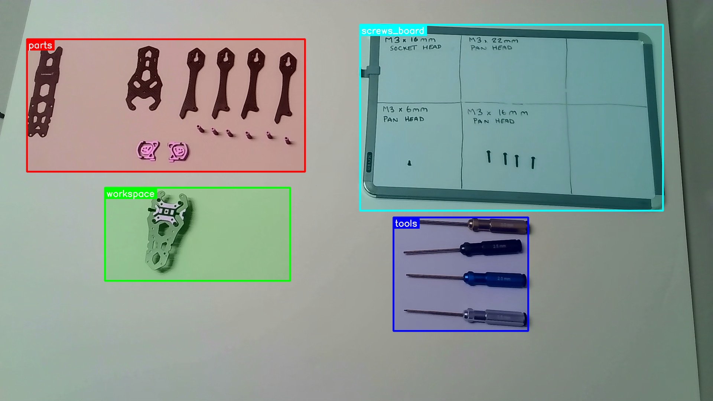      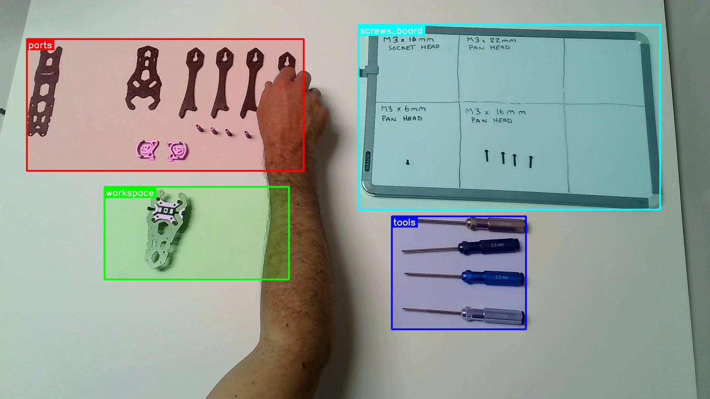  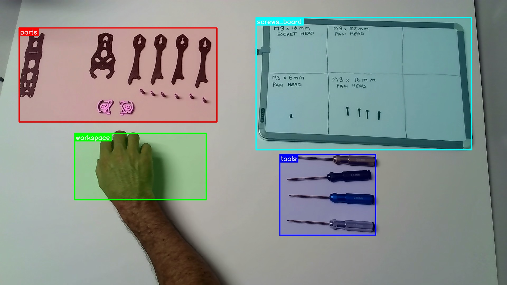

| Zone | Bbox | Objects |
|---|---|---|
| workspace | (0.15, 0.47, 0.41, 0.70) | assembled drone part |
| tools | (0.55, 0.54, 0.74, 0.82) | screwdrivers |
| parts | (0.04, 0.10, 0.43, 0.43) | drone frame components, standoffs |
| screws_board | (0.51, 0.06, 0.93, 0.53) | whiteboard with screw organization |

**Description**:
The assembler begins by transferring three small black fasteners/spacers from the parts zone to the workspace, placing them near the main assembly. Following this, one of the black arms is retrieved from the parts zone and positioned onto the partially assembled main body plate in the workspace.

<b>Movement</b>

[IDLE] 0s-19s | workspace | nothing happening
[MOVE] 19s-21s | Hand | parts -> workspace | picks up one small black fastener/spacer.
[MOVE] 21s-23s | One small black fastener/spacer | workspace -> workspace | placed next to the partially assembled main body.
[MOVE] 23s-25s | Hand | parts -> workspace | picks up another small black fastener/spacer.
[MOVE] 25s-26s | One small black fastener/spacer | workspace -> workspace | placed next to the partially assembled main body.
[MOVE] 26s-27s | Hand | parts -> workspace | picks up a third small black fastener/spacer.
[MOVE] 27s-27s | One small black fastener/spacer | workspace -> workspace | placed next to the partially assembled main body.
[MOVE] 27s-28s | Hand | parts -> workspace | picks up one black arm.
[MOVE] 28s-30s | One black arm | workspace -> workspace | positioned against the main body plate.

<b>Zone States</b>

- **workspace**: One partially assembled black intricately designed main body plate with two pink components (secured by screws), one black long side plate (secured by two M3 x 16mm socket head screws), three small black fasteners/spacers, and one black arm being positioned.
- **tools**: Gold (2.5mm) screwdriver, black (2.0mm) screwdriver, blue (2.0mm) screwdriver, silver (1.5mm) screwdriver are present.
- **parts**: One black long side plate, three black arms, and five small black fasteners/spacers remain.
- **screws_board**: M3 x 16mm socket head (drawn: 1, actual: 0), M3 x 22mm pan head (drawn: 4, actual: 4), M3 x 6mm pan head (drawn: 1, actual: 0), M3 x 16mm pan head (drawn: 4, actual: 4).

<b>Tools & Parts Summary</b>

Tools: [TOOL: gold (2.5mm) screwdriver @ tools], [TOOL: black (2.0mm) screwdriver @ tools], [TOOL: blue (2.0mm) screwdriver @ tools], [TOOL: silver (1.5mm) screwdriver @ tools].
Parts: [PART: partially assembled black intricately designed main body plate @ workspace], [PART: two pink components @ workspace], [PART: one black long side plate @ workspace], [PART: three small black fasteners/spacers @ workspace], [PART: one black arm @ workspace], [PART: one black long side plate @ parts], [PART: three black arms @ parts], [PART: five small black fasteners/spacers @ parts].

**Instruction:** You are in preparation phase. Next you should do **Step 1**: START THE ASSEMBLY BY USING THE SPUT REAR PLATE TO MOUNT THE X-LOCK FC ISOLATOR WITH THE M3x22MM AND THE M3x6MM SCREWS
*Match confidence: high. The person in the video is currently organizing the parts and tools, which is a preparation step before starting the actual assembly. No assembly has begun yet.*

## Segment 17 [08:30.00 - 09:00.00]

  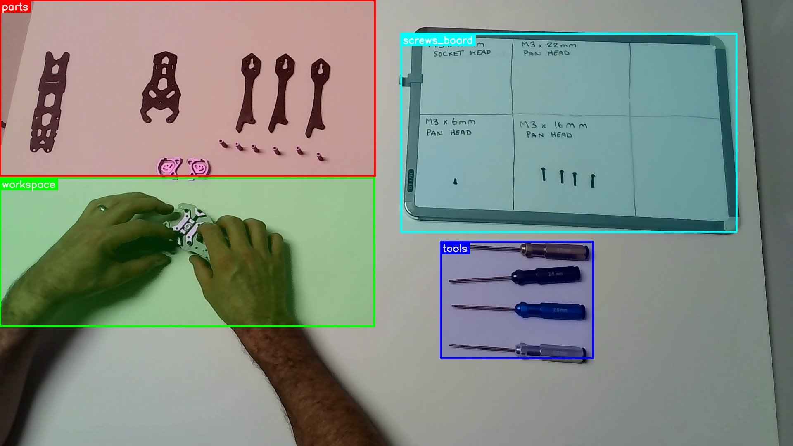  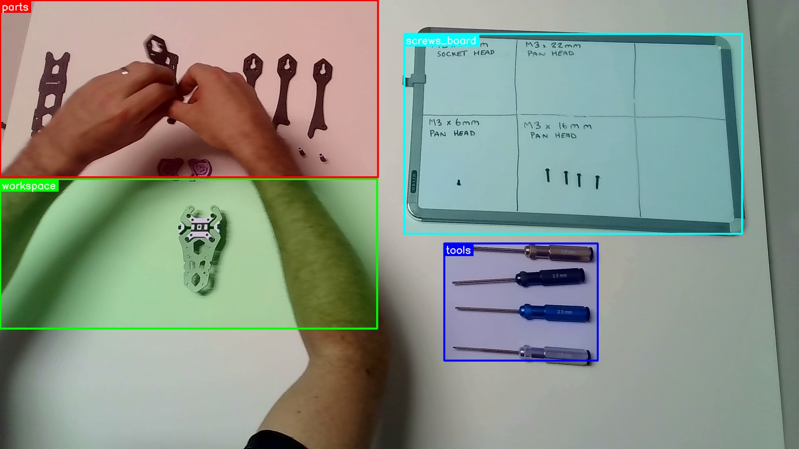  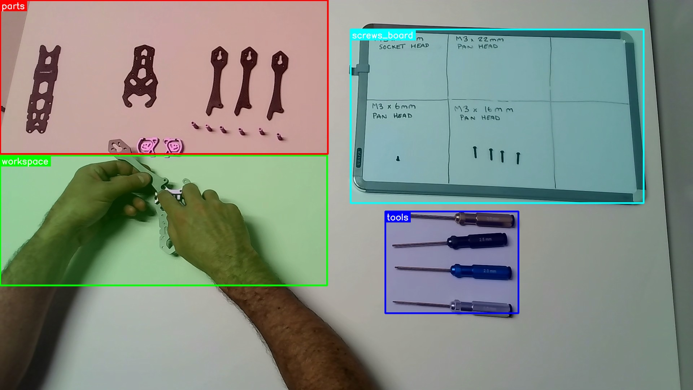    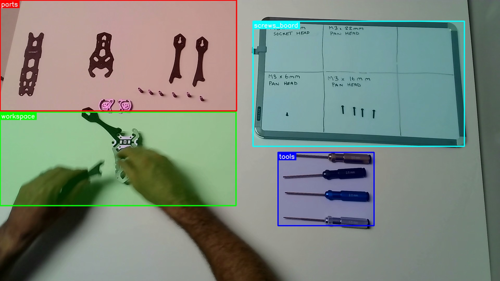

| Zone | Bbox | Objects |
|---|---|---|
| workspace | (0.00, 0.40, 0.47, 0.73) | hands, drone frame parts, screws |
| tools | (0.56, 0.54, 0.75, 0.80) | screwdrivers, hex drivers |
| parts | (0.00, 0.00, 0.47, 0.40) | drone frame components, standoffs |
| screws_board | (0.51, 0.07, 0.93, 0.52) | whiteboard, screws |

**Description**:
This segment focuses on attaching three black arms to the silver main frame bottom plate. The first arm, already positioned at the start of the clip, is secured. Subsequently, two additional black arms are retrieved from the parts zone, placed onto the main frame, and then secured to complete the attachment of three arms.

<b>Movement</b>

*   `[ACTION] 0s-5s | black arm | workspace | securing the first black arm to the silver main frame bottom plate.`
*   `[MOVE] 7s-9s | black arm | parts -> workspace | Right hand picks up a black arm from the parts zone and moves it to the silver main frame bottom plate.`
*   `[ACTION] 9s-18s | black arm | workspace | positioning and securing the second black arm to the silver main frame bottom plate.`
*   `[MOVE] 23s-25s | black arm | parts -> workspace | Right hand picks up a black arm from the parts zone and moves it to the silver main frame bottom plate.`
*   `[ACTION] 25s-29s | black arm | workspace | positioning and securing the third black arm to the silver main frame bottom plate.`
*   `[IDLE] 29s-30s | workspace | hands move away.`

<b>Zone States</b>

*   **workspace**: One silver main frame bottom plate with two pink LED components and three black arms attached.
*   **tools**: Gold (2.5mm) screwdriver, black (2.0mm) screwdriver, blue (2.0mm) screwdriver, silver (1.5mm) screwdriver are present.
*   **parts**: One black main frame top plate, one black long side plate, one black arm, five small black fasteners/spacers.
*   **screws_board**: M3 x 16mm socket head (drawn: 1, actual: 0), M3 x 22mm pan head (drawn: 4, actual: 4), M3 x 6mm pan head (drawn: 1, actual: 0), M3 x 16mm pan head (drawn: 4, actual: 4).

<b>Tools & Parts Summary</b>

Tools: [TOOL: Gold (2.5mm) screwdriver @ tools], [TOOL: black (2.0mm) screwdriver @ tools], [TOOL: blue (2.0mm) screwdriver @ tools], [TOOL: silver (1.5mm) screwdriver @ tools].
Parts: [PART: silver main frame bottom plate @ workspace], [PART: pink LED components @ workspace], [PART: black arms @ workspace], [PART: black main frame top plate @ parts], [PART: black long side plate @ parts], [PART: black arm @ parts], [PART: small black fasteners/spacers @ parts].

**Instruction:** You are in preparation phase. Next you should do **Step 1**: START THE ASSEMBLY BY USING THE SPUT REAR PLATE TO MOUNT THE X-LOCK FC ISOLATOR WITH THE M3x22MM AND THE M3x6MM SCREWS
*Match confidence: high. The person in the video is currently organizing the parts and has not yet started the assembly process as described in Step 1. They are holding the rear plate and some small components, but no screws are being used to mount anything yet.*

## Segment 18 [09:00.00 - 09:30.00]

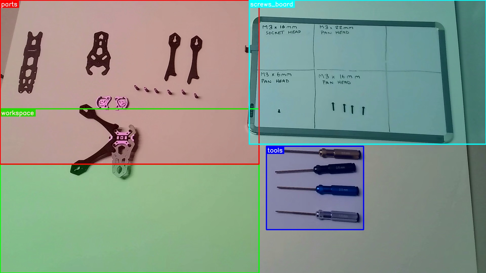          

| Zone | Bbox | Objects |
|---|---|---|
| workspace | (0.00, 0.40, 0.53, 1.00) | hand, screwdriver, drone frame |
| tools | (0.55, 0.54, 0.75, 0.84) | screwdrivers |
| parts | (0.00, 0.00, 0.53, 0.60) | drone frame components, standoffs, small purple parts |
| screws_board | (0.51, 0.00, 1.00, 0.53) | whiteboard, screws |

**Description**: The segment begins with a partially assembled silver main frame bottom plate in the workspace, alongside other parts and tools. A hand enters, picks up a blue 2.0mm screwdriver, and then lifts the main frame. The hand then uses the screwdriver to remove one M3 x 6mm pan head screw from the center of the silver main frame bottom plate and places it onto the designated section of the screws board.

<b>Movement</b>

- [IDLE] 0s-20s | all zones | Nothing happening.
- [MOVE] 20s-21s | blue (2.0mm) screwdriver | tools -> hand | A hand picks up the blue (2.0mm) screwdriver.
- [MOVE] 21s-22s | silver main frame bottom plate with three black arms and two pink LEDs | workspace -> hand | The hand picks up the partially assembled silver main frame bottom plate.
- [ACTION] 22s-27s | blue (2.0mm) screwdriver | workspace | The hand positions the frame and uses the blue (2.0mm) screwdriver to loosen one M3 x 6mm pan head screw from the silver main frame bottom plate.
- [ACTION] 27s-29s | M3 x 6mm pan head screw | workspace -> screws_board | The hand completely removes the M3 x 6mm pan head screw and places it onto the 'M3 x 6mm pan head' section of the screws_board.
- [MOVE] 29s-29s | blue (2.0mm) screwdriver | hand -> tools | The hand places the blue (2.0mm) screwdriver back into the tools zone.
- [IDLE] 29s-30s | workspace | The hand retracts, still holding the silver main frame bottom plate above the workspace.

<b>Zone States</b>

- **workspace**: One silver main frame bottom plate with two pink LED components and three black arms attached, now missing one M3 x 6mm pan head screw (still held by hand).
- **tools**: Gold (2.5mm) screwdriver, black (2.0mm) screwdriver, blue (2.0mm) screwdriver, silver (1.5mm) screwdriver are present.
- **parts**: One black main frame top plate, one black long side plate, one black arm, five small black fasteners/spacers.
- **screws_board**: M3 x 16mm socket head (drawn: 1, actual: 0), M3 x 22mm pan head (drawn: 4, actual: 4), M3 x 6mm pan head (drawn: 1, actual: 1), M3 x 16mm pan head (drawn: 4, actual: 4).

<b>Tools & Parts Summary</b>

Tools: [GOLD (2.5MM) SCREWDRIVER @ tools], [BLACK (2.0MM) SCREWDRIVER @ tools], [BLUE (2.0MM) SCREWDRIVER @ tools], [SILVER (1.5MM) SCREWDRIVER @ tools].
Parts: [BLACK MAIN FRAME TOP PLATE @ parts], [BLACK LONG SIDE PLATE @ parts], [BLACK ARM @ parts], [FIVE SMALL BLACK FASTENERS/SPACERS @ parts], [SILVER MAIN FRAME BOTTOM PLATE WITH THREE BLACK ARMS AND TWO PINK LEDS @ workspace (held by hand)].

**Instruction:** You are in preparation phase. Next you should do **Step 1**: START THE ASSEMBLY BY USING THE SPUT REAR PLATE TO MOUNT THE X-LOCK FC ISOLATOR WITH THE M3x22MM AND THE M3x6MM SCREWS
*Match confidence: high. The video shows the parts laid out and organized, with the person picking up a part in the last frame, indicating preparation before starting the assembly steps.*

## Segment 19 [09:30.00 - 10:00.00]

    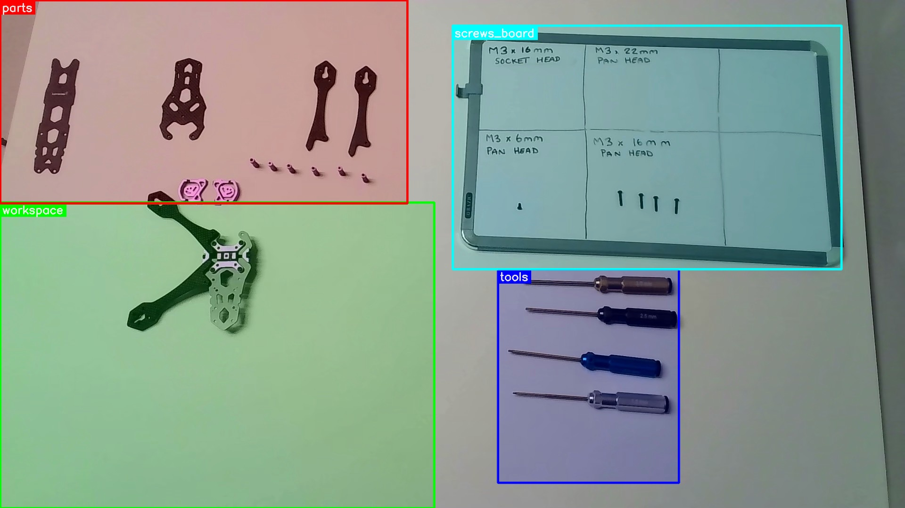  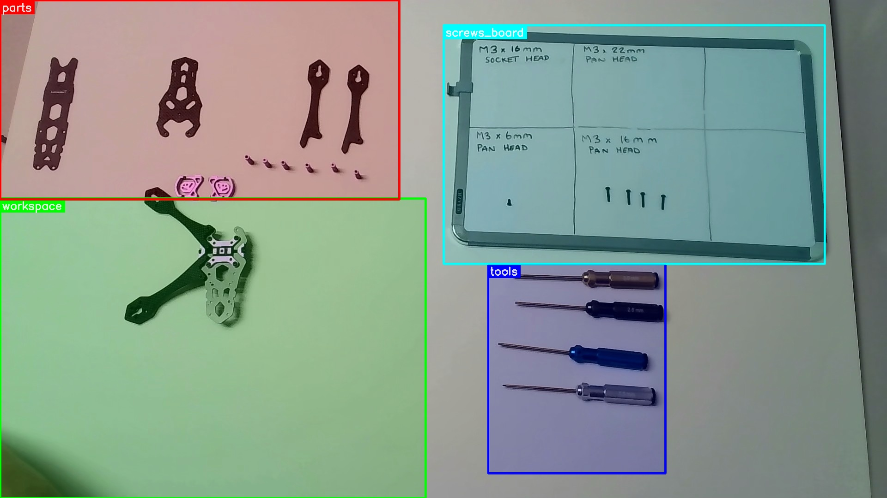    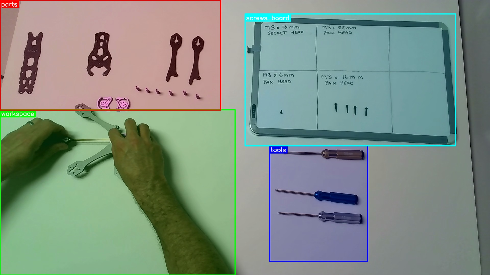

| Zone | Bbox | Objects |
|---|---|---|
| workspace | (0.00, 0.40, 0.48, 1.00) | hands, drone frame |
| tools | (0.55, 0.53, 0.75, 0.95) | screwdrivers |
| parts | (0.00, 0.00, 0.45, 0.40) | drone frame components, standoffs |
| screws_board | (0.50, 0.05, 0.93, 0.53) | whiteboard, screws |

**Description**: In this segment, the final black arm is attached to the silver main frame bottom plate. The user first swaps screwdrivers, then inserts the last M3 x 6mm pan head screw into the arm and main plate, and subsequently tightens it using a 2.0mm screwdriver to secure the arm.

<b>Movement</b>

[MOVE] ~0s-~1s | silver (1.5mm) screwdriver | workspace -> tools | The left hand places the screwdriver down.
[MOVE] ~1s-~2s | black (2.0mm) screwdriver | tools -> workspace | The left hand picks up the screwdriver.
[ACTION] ~2s-~3s | M3 x 6mm pan head screw | workspace | The screw, held by the right hand, is inserted into the fourth black arm and silver main frame bottom plate.
[MOVE] ~18s-~19s | black (2.0mm) screwdriver | workspace -> workspace | The right hand takes the screwdriver from the left hand.
[ACTION] ~21s-~29s | M3 x 6mm pan head screw | workspace | The right hand uses the black (2.0mm) screwdriver to tighten the screw, securing the fourth black arm to the silver main frame bottom plate.
[MOVE] ~29s-~30s | black (2.0mm) screwdriver | workspace -> tools | The right hand places the screwdriver back down.

<b>Zone States</b>

- **workspace**: One silver main frame bottom plate with two pink LED components and four black arms fully attached.
- **tools**: Gold (2.5mm) screwdriver, black (2.0mm) screwdriver, blue (2.0mm) screwdriver, silver (1.5mm) screwdriver are present.
- **parts**: One black main frame top plate, one black long side plate, five small black fasteners/spacers.
- **screws_board**: M3 x 16mm socket head (drawn: 1, actual: 0), M3 x 22mm pan head (drawn: 4, actual: 4), M3 x 6mm pan head (drawn: 1, actual: 0), M3 x 16mm pan head (drawn: 4, actual: 4).

<b>Tools & Parts Summary</b>

Tools: [TOOL: gold (2.5mm) screwdriver @ tools], [TOOL: black (2.0mm) screwdriver @ tools], [TOOL: blue (2.0mm) screwdriver @ tools], [TOOL: silver (1.5mm) screwdriver @ tools].
Parts: [PART: black main frame top plate @ parts], [PART: black long side plate @ parts], [PART: five small black fasteners/spacers @ parts].

**Instruction:** You are in preparation phase. Next you should do **Step 1**: START THE ASSEMBLY BY USING THE SPUT REAR PLATE TO MOUNT THE X-LOCK FC ISOLATOR WITH THE M3x22MM AND THE M3x6MM SCREWS
*Match confidence: high. The person in the video is currently organizing parts and has not yet started the assembly process as described in Step 1. They are holding the main frame components and screws, but no assembly has begun.*

## Segment 20 [10:00.00 - 10:30.00]

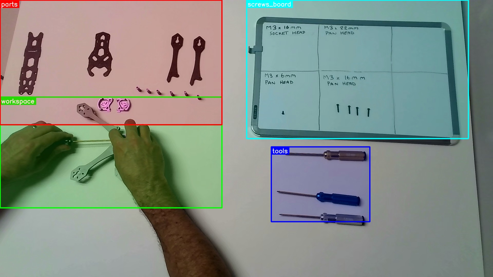    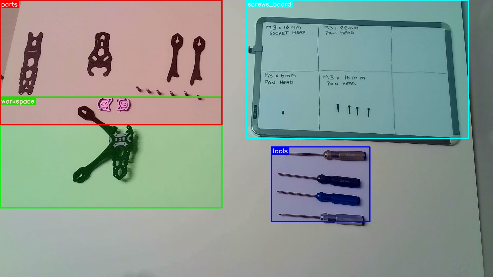  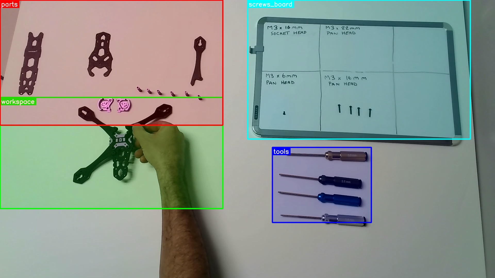  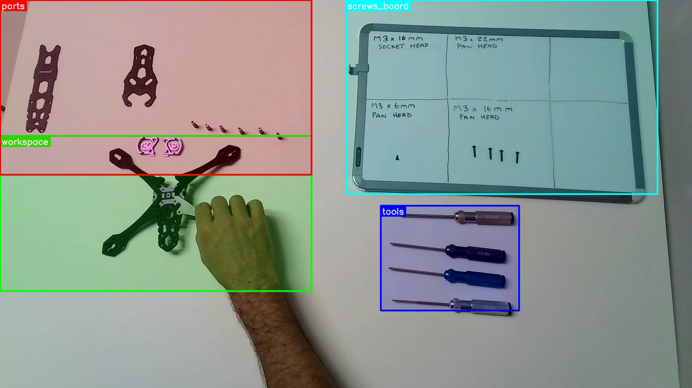  

| Zone | Bbox | Objects |
|---|---|---|
| workspace | (0.00, 0.35, 0.45, 0.75) | hands, drone frame |
| tools | (0.55, 0.53, 0.75, 0.80) | screwdrivers |
| parts | (0.00, 0.00, 0.45, 0.45) | drone frame components, standoffs |
| screws_board | (0.50, 0.00, 0.95, 0.50) | whiteboard, screws |

**Description**:
The assembler begins by securing the first M3x16mm socket head screw into the main frame with a black 2.0mm screwdriver. Subsequently, two black long side plates are attached to the main frame, one after the other. For each side plate, an M3x16mm socket head screw is retrieved from the screws board and partially inserted to hold the plate in place.

<b>Movement</b>

*   [ACTION] ~0s-~2s | M3 x 16mm socket head screw | workspace | The screw, already in hand, is inserted into the assembled bottom plate.
*   [MOVE] ~3s-~4s | black (2.0mm) screwdriver | tools -> workspace | The left hand picks up the screwdriver.
*   [ACTION] ~5s-~7s | M3 x 16mm socket head screw | workspace | The screw is tightened using the black (2.0mm) screwdriver.
*   [MOVE] ~7s-~8s | black (2.0mm) screwdriver | workspace -> tools | The left hand places the screwdriver back.
*   [MOVE] ~9s-~11s | black long side plate | parts -> workspace | The right hand picks up the first black long side plate and positions it.
*   [ACTION] ~11s-~13s | black long side plate | workspace | The first side plate is attached to the assembled bottom plate.
*   [MOVE] ~14s-~16s | M3 x 16mm socket head screw | screws_board -> workspace | The left hand picks up an M3 x 16mm socket head screw and brings it to the frame.
*   [ACTION] ~16s-~17s | M3 x 16mm socket head screw | workspace | The screw is inserted into the first attached side plate.
*   [MOVE] ~18s-~20s | black long side plate | parts -> workspace | The right hand picks up the second black long side plate and positions it.
*   [ACTION] ~20s-~21s | black long side plate | workspace | The second side plate is attached to the assembled bottom plate.
*   [MOVE] ~22s-~24s | M3 x 16mm socket head screw | screws_board -> workspace | The left hand picks up another M3 x 16mm socket head screw and brings it to the frame.
*   [ACTION] ~24s-~25s | M3 x 16mm socket head screw | workspace | The screw is inserted into the second attached side plate.
*   [IDLE] ~26s-~30s | workspace | Hands are idle near the assembled frame.

<b>Zone States</b>

*   **workspace**: One silver main frame bottom plate with two pink LED components, four black arms, two black long side plates, and three M3 x 16mm socket head screws (one tightened, two inserted but not tightened).
*   **tools**: Gold (2.5mm) screwdriver, black (2.0mm) screwdriver, blue (2.0mm) screwdriver, silver (1.5mm) screwdriver are present.
*   **parts**: One black main frame top plate, five small black fasteners/spacers.
*   **screws_board**: M3 x 16mm socket head (drawn: 1, actual: -1), M3 x 22mm pan head (drawn: 4, actual: 4), M3 x 6mm pan head (drawn: 1, actual: 1), M3 x 16mm pan head (drawn: 4, actual: 4).

<b>Tools & Parts Summary</b>

Tools: [TOOL: Gold (2.5mm) screwdriver @ tools], [TOOL: black (2.0mm) screwdriver @ tools], [TOOL: blue (2.0mm) screwdriver @ tools], [TOOL: silver (1.5mm) screwdriver @ tools].
Parts: [PART: black main frame top plate @ parts], [PART: five small black fasteners/spacers @ parts].

**Instruction:** You are on **Step 2**: Lock the arms by tightening the arm wedges using M3x16mm screws to lock them in place.
Next you should do **Step 3**: ADD THE SPLIT FRONT PLATE TO THE ASSEMBLY AND USE THE M3X6MM IN THE MIDDLE TO SECURE IT
*Match confidence: high. The video shows the person tightening the arm wedges with a screwdriver, which directly corresponds to Step 2 of the manual: 'Lock the arms by tightening the arm wedges using M3x16mm screws to lock them in place.'*

## Segment 21 [10:30.00 - 11:00.00]

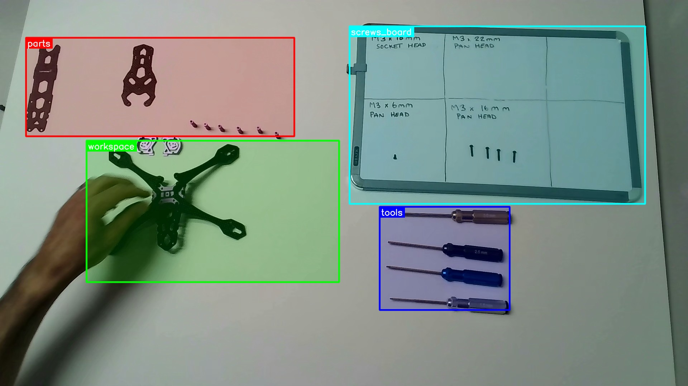    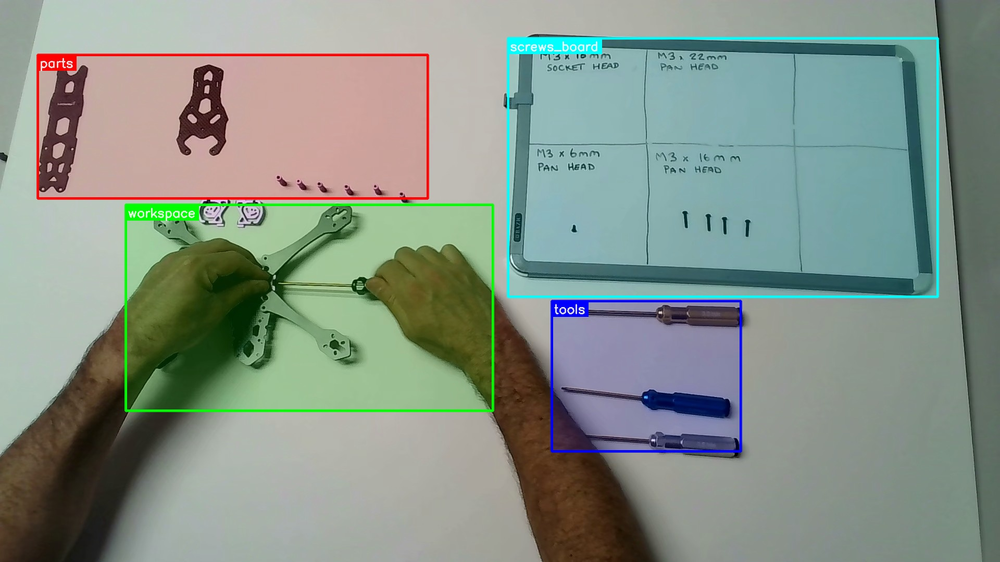    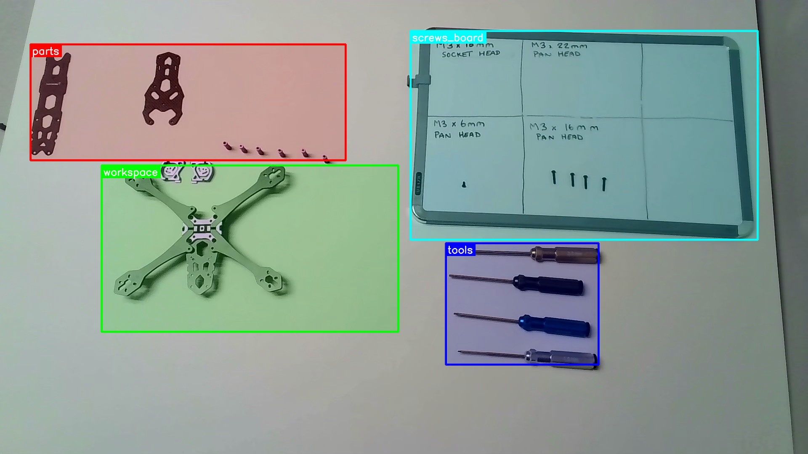  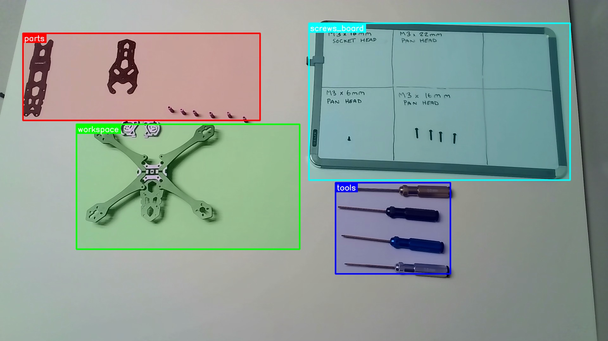

| Zone | Bbox | Objects |
|---|---|---|
| workspace | (0.13, 0.36, 0.49, 0.73) | hands, drone frame |
| tools | (0.55, 0.54, 0.74, 0.80) | screwdrivers, hex drivers |
| parts | (0.04, 0.10, 0.43, 0.35) | drone frame parts, standoffs |
| screws_board | (0.51, 0.07, 0.94, 0.53) | whiteboard, screws |

**Description**:
The segment shows the final assembly step for the bottom part of the drone frame. The assembler uses a gold 2.5mm screwdriver to fully tighten three M3 x 16mm socket head screws that were previously inserted, securing the four black arms and two pink LED components to the silver main frame bottom plate. The completed bottom frame is then placed back on the workspace.

<b>Movement</b>

*   [IDLE] 00:00-00:03 | workspace | Left hand holds the silver main frame bottom plate assembly while the right hand rests near it.
*   [MOVE] 00:03-00:04 | gold (2.5mm) screwdriver | tools -> workspace | Right hand picks up the gold (2.5mm) screwdriver.
*   [ACTION] 00:04-00:13 | M3 x 16mm socket head screws | workspace | Right hand uses the gold (2.5mm) screwdriver to tighten three M3 x 16mm socket head screws on the silver main frame bottom plate assembly.
*   [MOVE] 00:13-00:15 | gold (2.5mm) screwdriver | workspace -> tools | Right hand places the gold (2.5mm) screwdriver back in the tools zone.
*   [IDLE] 00:15-00:30 | workspace | Hands hold and adjust the now fully tightened silver main frame bottom plate assembly.

<b>Zone States</b>

*   **workspace**: One silver main frame bottom plate with four black arms, two pink LED components, and three M3 x 16mm socket head screws fully tightened. Two black long side plates are also on the workspace.
*   **tools**: Gold (2.5mm) screwdriver, black (2.0mm) screwdriver, blue (2.0mm) screwdriver, silver (1.5mm) screwdriver are present.
*   **parts**: One black main frame top plate, five small black fasteners/spacers.
*   **screws_board**: M3 x 16mm socket head (drawn: 1, actual: -1), M3 x 22mm pan head (drawn: 4, actual: 4), M3 x 6mm pan head (drawn: 1, actual: 1), M3 x 16mm pan head (drawn: 4, actual: 4).

<b>Tools & Parts Summary</b>

Tools: [gold (2.5mm) screwdriver @ tools], [black (2.0mm) screwdriver @ tools], [blue (2.0mm) screwdriver @ tools], [silver (1.5mm) screwdriver @ tools].
Parts: [silver main frame bottom plate @ workspace], [pink LED components @ workspace], [black arms @ workspace], [M3 x 16mm socket head screws @ workspace], [black long side plates @ workspace], [black main frame top plate @ parts], [small black fasteners/spacers @ parts], [M3 x 22mm pan head screws @ screws_board], [M3 x 6mm pan head screws @ screws_board], [M3 x 16mm pan head screws @ screws_board].

**Instruction:** You are on **Step 2**: Lock the arms by tightening the arm wedges using M3x16mm screws to lock them in place.
Next you should do **Step 3**: ADD THE SPLIT FRONT PLATE TO THE ASSEMBLY AND USE THE M3X6MM IN THE MIDDLE TO SECURE IT
*Match confidence: high. The video shows the person tightening the arm wedges with a screw, which directly corresponds to Step 2 of the manual: 'Lock the arms by tightening the arm wedges using M3x16mm screws to lock them in place.'*

## Segment 22 [11:00.00 - 11:30.00]

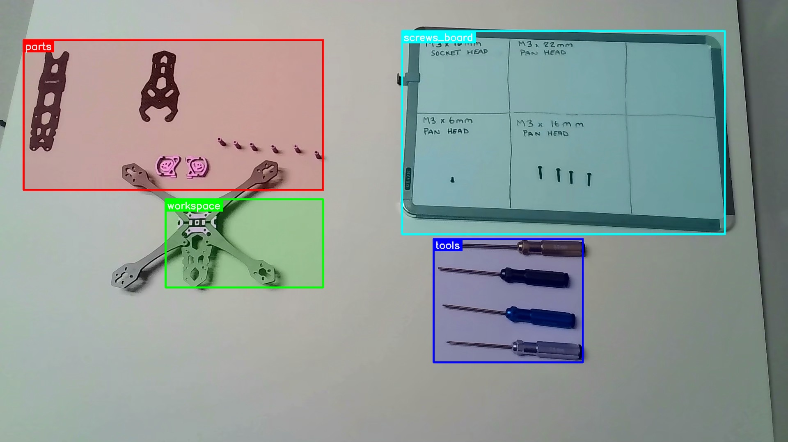    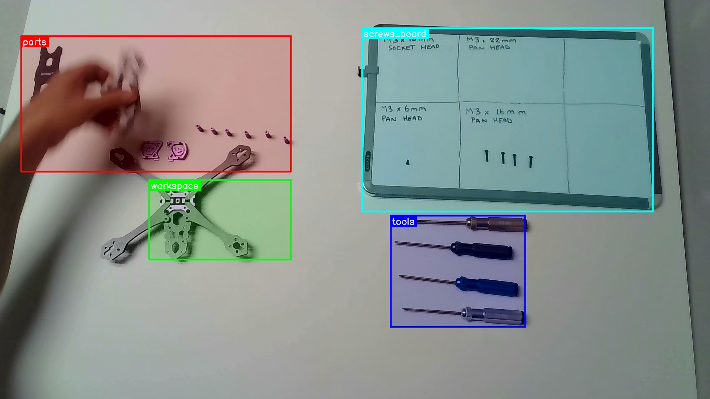      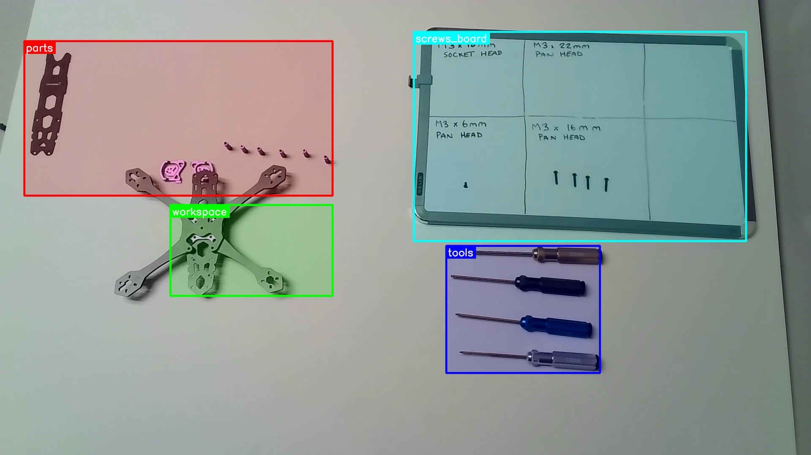

| Zone | Bbox | Objects |
|---|---|---|
| workspace | (0.21, 0.45, 0.41, 0.65) | drone frame, hands |
| tools | (0.55, 0.54, 0.74, 0.82) | screwdrivers |
| parts | (0.03, 0.09, 0.41, 0.43) | drone frame components, standoffs |
| screws_board | (0.51, 0.07, 0.92, 0.53) | whiteboard, screws |

**Description**:
In this segment, the assembler adds the black main frame top plate to the drone frame. The plate is picked up from the parts area and carefully placed on top of the already assembled silver main frame bottom plate, covering the previously installed pink LED components. The holes of the top plate are aligned with the standoffs on the bottom plate, completing the main frame's sandwich structure.

<b>Movement</b>

*   0:08-0:09 | right hand | parts -> workspace | The right hand picks up the black main frame top plate.
*   0:10-0:18 | right hand | workspace | The right hand positions and places the black main frame top plate onto the silver main frame bottom plate, aligning the holes.
*   0:19-0:20 | right hand | workspace | The right hand firmly presses the black main frame top plate onto the silver main frame bottom plate.
*   0:20-0:30 | right hand | workspace -> out_of_frame | The right hand moves out of the frame, leaving the assembled plates.

<b>Zone States</b>

- **workspace**: One silver main frame bottom plate with four black arms, two pink LED components covered by the black main frame top plate. Two black long side plates are also present.
- **tools**: Gold (2.5mm) screwdriver, black (2.0mm) screwdriver, blue (2.0mm) screwdriver, silver (1.5mm) screwdriver are present.
- **parts**: Five small black fasteners/spacers remain.
- **screws_board**: M3 x 16mm socket head (drawn: 1, actual: -1), M3 x 22mm pan head (drawn: 4, actual: 4), M3 x 6mm pan head (drawn: 1, actual: 1), M3 x 16mm pan head (drawn: 4, actual: 4).

<b>Tools & Parts Summary</b>

Tools: [GOLD (2.5MM) SCREWDRIVER @ tools], [BLACK (2.0MM) SCREWDRIVER @ tools], [BLUE (2.0MM) SCREWDRIVER @ tools], [SILVER (1.5MM) SCREWDRIVER @ tools].
Parts: [SILVER MAIN FRAME BOTTOM PLATE @ workspace], [BLACK MAIN FRAME TOP PLATE @ workspace], [PINK LED COMPONENTS @ workspace], [BLACK LONG SIDE PLATES @ workspace], [SMALL BLACK FASTENERS/SPACERS @ parts].

**Instruction:** You are in preparation phase. Next you should do **Step 1**: START THE ASSEMBLY BY USING THE SPUT REAR PLATE TO MOUNT THE X-LOCK FC ISOLATOR WITH THE M3x22MM AND THE M3x6MM SCREWS
*Match confidence: high. The user is currently organizing parts and has not started the assembly process yet. The parts are laid out on the table, and the user is seen picking up a part, which indicates preparation rather than an active assembly step.*

## Segment 23 [11:30.00 - 12:00.00]

        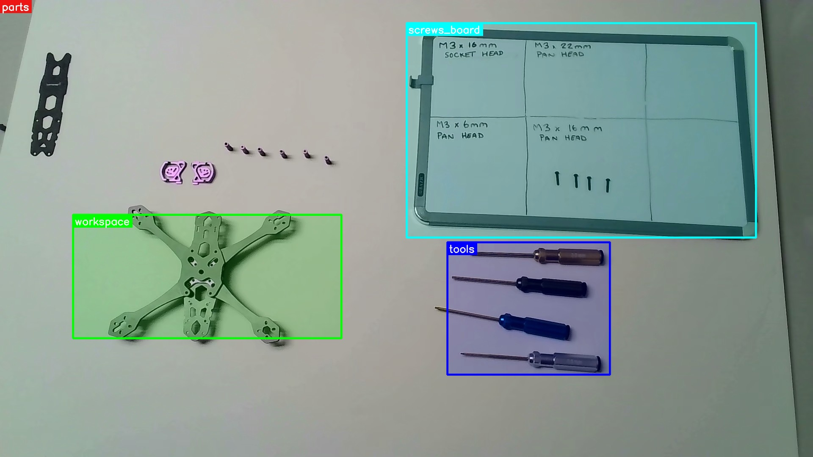  

| Zone | Bbox | Objects |
|---|---|---|
| workspace | (0.09, 0.47, 0.42, 0.74) | drone frame, hands, screwdriver |
| tools | (0.55, 0.53, 0.75, 0.82) | screwdrivers, hex drivers |
| parts | (0.00, 0.00, 0.00, 0.00) |  |
| screws_board | (0.50, 0.05, 0.93, 0.52) | whiteboard, screws |

**Description**:
In this segment, the user begins attaching the long side plates to the main frame of the drone. They pick up a purple M3x6mm pan head screw using a blue 2.0mm hex driver and insert it through one of the black long side plates into the main frame. The screw is then tightened with the hex driver, while a black ratchet wrench is used to hold the corresponding nut or standoff in place.

<b>Movement</b>

- [MOVE] 0:01-0:02 | blue (2.0mm) screwdriver | tools -> right hand | The right hand picks up the blue (2.0mm) screwdriver.
- [MOVE] 0:03-0:04 | right hand | tools -> workspace | The right hand moves the screwdriver towards the purple screws.
- [ACTION] 0:04-0:05 | one purple screw | workspace | The right hand picks up one purple screw with the blue screwdriver.
- [ACTION] 0:06-0:08 | blue (2.0mm) screwdriver with purple screw | workspace | The right hand positions and inserts the purple screw through a black long side plate and into the main frame assembly.
- [MOVE] 0:08-0:09 | black ratchet wrench | outside frame -> left hand | The left hand picks up a black ratchet wrench from off-screen.
- [ACTION] 0:09-0:12 | blue (2.0mm) screwdriver, black ratchet wrench | workspace | The right hand tightens the purple screw with the blue screwdriver, while the left hand holds the assembly steady with the black ratchet wrench.
- [MOVE] 0:12-0:13 | black ratchet wrench | left hand -> workspace | The left hand places the black ratchet wrench down on the table.
- [MOVE] 0:13-0:15 | blue (2.0mm) screwdriver | right hand -> tools | The right hand moves the blue screwdriver back to the tools zone.
- [MOVE] 0:15-0:16 | blue (2.0mm) screwdriver | tools -> tools | The right hand places the blue screwdriver among the other tools.
- [ACTION] 0:17-0:21 | frame assembly | workspace | The left hand adjusts and rotates the frame assembly.
- [MOVE] 0:27-0:29 | frame assembly | workspace -> left hand | The left hand picks up the partially assembled frame.

<b>Zone States</b>

- **workspace**: One silver main frame bottom plate with four black arms, two pink LED components, one black main frame top plate, and one black long side plate attached. One black long side plate remains unattached. One black ratchet wrench.
- **tools**: Gold (2.5mm) screwdriver, black (2.0mm) screwdriver, blue (2.0mm) screwdriver, silver (1.5mm) screwdriver are present.
- **parts**: Seven small purple screws remain on the table.
- **screws_board**: M3 x 16mm socket head (drawn: 1, actual: 0 screws in box), M3 x 22mm pan head (drawn: 4, actual: 4 screws in box), M3 x 6mm pan head (drawn: 1, actual: 1 screw in box), M3 x 16mm pan head (drawn: 4, actual: 4 screws in box).

<b>Tools & Parts Summary</b>

Tools: [TOOL: gold (2.5mm) screwdriver @ tools], [TOOL: black (2.0mm) screwdriver @ tools], [TOOL: blue (2.0mm) screwdriver @ tools], [TOOL: silver (1.5mm) screwdriver @ tools], [TOOL: black ratchet wrench @ workspace].
Parts: [PART: silver main frame bottom plate @ workspace], [PART: black arms (4) @ workspace], [PART: pink LED components (2) @ workspace], [PART: black main frame top plate @ workspace], [PART: black long side plate (attached) @ workspace], [PART: black long side plate (loose) @ workspace], [PART: small purple screws (7) @ workspace].

**Instruction:** You are in preparation phase. Next you should do **Step 1**: START THE ASSEMBLY BY USING THE SPUT REAR PLATE TO MOUNT THE X-LOCK FC ISOLATOR WITH THE M3x22MM AND THE M3x6MM SCREWS
*Match confidence: high. The video keyframes show the parts laid out and organized, but no assembly has begun. The person is seen handling some parts in the second keyframe, but it appears to be part of the preparation or inspection, not an assembly step.*

## Segment 24 [12:00.00 - 12:30.00]

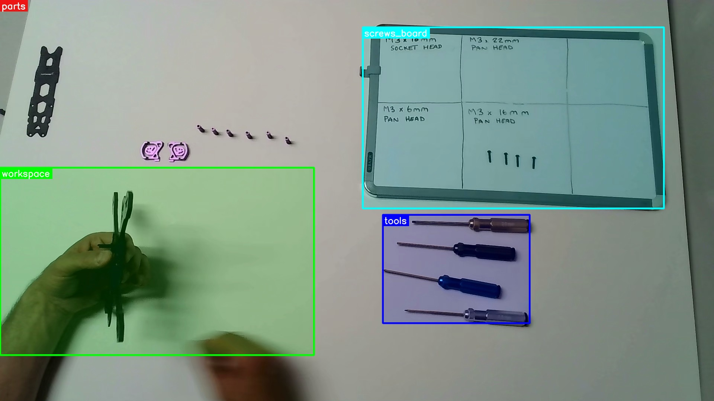        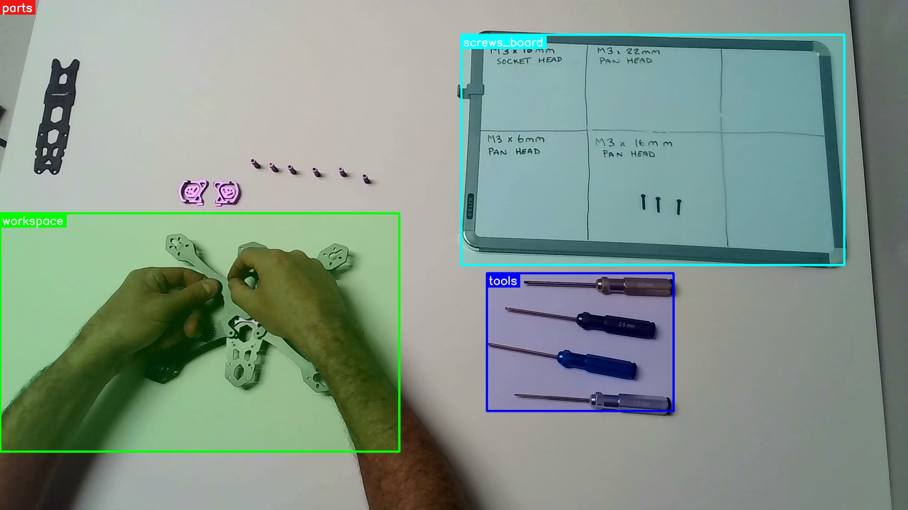  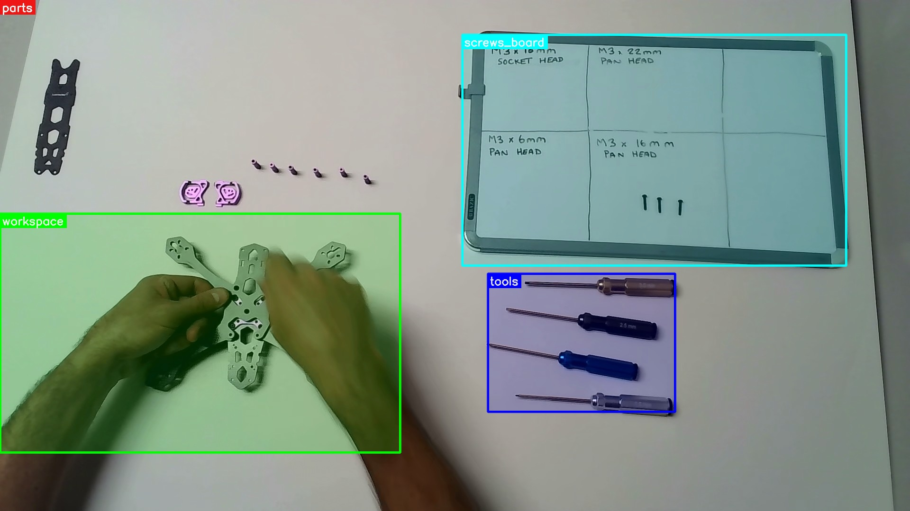

| Zone | Bbox | Objects |
|---|---|---|
| workspace | (0.00, 0.42, 0.44, 0.89) | hands, drone frame |
| tools | (0.54, 0.54, 0.74, 0.81) | screwdrivers |
| parts | (0.00, 0.00, 0.00, 0.00) |  |
| screws_board | (0.51, 0.07, 0.93, 0.52) | whiteboard, screws |

**Description**:
The assembler finishes attaching the two black long side plates to the main frame by using the black 2.0mm screwdriver to tighten two small purple screws into the last side plate. Before that, the assembler uses the gold 2.5mm screwdriver to tighten an existing socket head screw on the frame.

<b>Movement</b>

[MOVE] 00:00-00:01 | hands | -> workspace | Left hand holds the partially assembled main frame, right hand approaches.
[MOVE] 00:01-00:02 | gold (2.5mm) screwdriver | tools -> workspace | Right hand picks up the gold (2.5mm) screwdriver.
[ACTION] 00:02-00:04 | gold (2.5mm) screwdriver | workspace | Right hand tightens a screw already present in the main frame top plate.
[MOVE] 00:04-00:05 | gold (2.5mm) screwdriver | workspace -> tools | Right hand places the gold (2.5mm) screwdriver back onto the tools zone.
[ACTION] 00:05-00:06 | black long side plate | workspace | Left hand positions the remaining unattached black long side plate onto the main frame.
[MOVE] 00:06-00:07 | black (2.0mm) screwdriver | tools -> workspace | Right hand picks up the black (2.0mm) screwdriver.
[MOVE] 00:07-00:08 | purple screw | parts -> workspace | Right hand picks up one small purple screw from the table.
[ACTION] 00:08-00:09 | purple screw | workspace | Right hand inserts the purple screw into the left side of the newly placed black long side plate.
[ACTION] 00:09-00:10 | black (2.0mm) screwdriver | workspace | Right hand uses the black (2.0mm) screwdriver to tighten the purple screw into the black long side plate.
[MOVE] 00:10-00:11 | black (2.0mm) screwdriver | workspace -> tools | Right hand places the black (2.0mm) screwdriver back onto the tools zone.
[IDLE] 00:11-00:15 | workspace | Left hand briefly adjusts the main frame and releases it.
[MOVE] 00:15-00:17 | black (2.0mm) screwdriver | tools -> workspace | Right hand picks up the black (2.0mm) screwdriver.
[MOVE] 00:17-00:18 | purple screw | parts -> workspace | Right hand picks up another small purple screw from the table.
[ACTION] 00:18-00:19 | purple screw | workspace | Right hand inserts the purple screw into the right side of the newly placed black long side plate.
[ACTION] 00:19-00:24 | black (2.0mm) screwdriver | workspace | Right hand uses the black (2.0mm) screwdriver to tighten the purple screw into the black long side plate.
[MOVE] 00:24-00:25 | black (2.0mm) screwdriver | workspace -> tools | Right hand places the black (2.0mm) screwdriver back onto the tools zone.
[IDLE] 00:25-00:30 | workspace | Hands are briefly out of frame or idle over the main frame.

<b>Zone States</b>

- **workspace**: One silver main frame bottom plate with four black arms, two pink LED components, one black main frame top plate, and two black long side plates attached with two purple screws on each long side plate. One black ratchet wrench is also present. Five small purple screws remain on the table.
- **tools**: Gold (2.5mm) screwdriver, black (2.0mm) screwdriver, blue (2.0mm) screwdriver, silver (1.5mm) screwdriver are present.
- **parts**: Five small purple screws remain on the table.
- **screws_board**: M3 x 16mm socket head (drawn: 1, actual: 0 screws in box), M3 x 22mm pan head (drawn: 4, actual: 4 screws in box), M3 x 6mm pan head (drawn: 1, actual: 1 screw in box), M3 x 16mm pan head (drawn: 4, actual: 4 screws in box).

<b>Tools & Parts Summary</b>

Tools: [TOOL: gold (2.5mm) screwdriver @ tools], [TOOL: black (2.0mm) screwdriver @ tools], [TOOL: blue (2.0mm) screwdriver @ tools], [TOOL: silver (1.5mm) screwdriver @ tools], [TOOL: black ratchet wrench @ workspace].
Parts: [PART: silver main frame bottom plate @ workspace], [PART: black arms (4) @ workspace], [PART: pink LED components (2) @ workspace], [PART: black main frame top plate @ workspace], [PART: black long side plates (2) @ workspace], [PART: purple screws (5) @ parts].

**Instruction:** You are in preparation phase. Next you should do **Step 1**: START THE ASSEMBLY BY USING THE SPUT REAR PLATE TO MOUNT THE X-LOCK FC ISOLATOR WITH THE M3x22MM AND THE M3x6MM SCREWS
*Match confidence: high. The video shows the person organizing parts and laying out the frame components, but no assembly has started yet. This is a preparation phase before starting Step 1.*

## Segment 25 [12:30.00 - 13:00.00]

    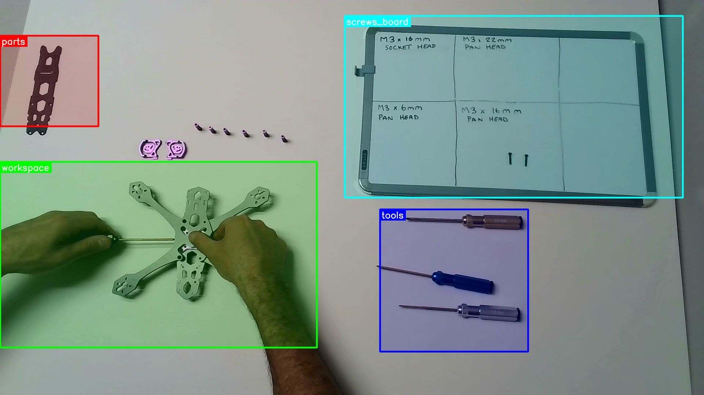      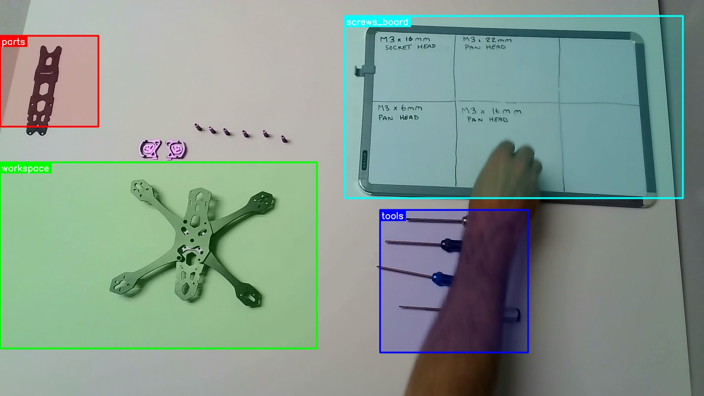

| Zone | Bbox | Objects |
|---|---|---|
| workspace | (0.00, 0.41, 0.45, 0.88) | hands, drone frame, screwdriver |
| tools | (0.54, 0.53, 0.75, 0.89) | screwdrivers |
| parts | (0.00, 0.09, 0.14, 0.32) | drone frame parts |
| screws_board | (0.49, 0.04, 0.97, 0.50) | whiteboard, screws |

**Description**:
The assembler begins by attaching four black arms to the silver main frame bottom plate, securing them with four small purple screws taken from a pile on the table. Following this, a gold 2.5mm screwdriver is used to tighten a socket head screw, and a black 2.0mm screwdriver tightens a pan head screw already present on the frame. The segment concludes with the assembler taking two M3 x 16mm pan head screws from the screws board and inserting them into the frame.

<b>Movement</b>

*   [ACTION] 0s-4s | four black arms and four small purple screws | workspace | Four black arms are attached to the silver main frame bottom plate using four small purple screws.
*   [IDLE] 4s-6s | workspace | nothing happening
*   [MOVE] 6s-7s | gold (2.5mm) screwdriver | tools -> workspace | The gold 2.5mm screwdriver is picked up.
*   [ACTION] 8s-13s | a screw on the frame | workspace | The gold 2.5mm screwdriver is used to tighten a screw on the frame.
*   [MOVE] 13s-15s | gold (2.5mm) screwdriver | workspace -> tools | The gold 2.5mm screwdriver is placed back into the tools zone.
*   [IDLE] 15s-16s | workspace | nothing happening
*   [MOVE] 16s-17s | black (2.0mm) screwdriver | tools -> workspace | The black 2.0mm screwdriver is picked up.
*   [ACTION] 18s-22s | a screw on the frame | workspace | The black 2.0mm screwdriver is used to tighten a screw on the frame.
*   [MOVE] 22s-23s | black (2.0mm) screwdriver | workspace -> tools | The black 2.0mm screwdriver is placed back into the tools zone.
*   [IDLE] 23s-24s | workspace | nothing happening
*   [MOVE] 24s-25s | M3 x 16mm pan head screw | screws_board -> workspace | One M3 x 16mm pan head screw is taken from the screws_board and placed into the frame.
*   [IDLE] 26s-27s | workspace | nothing happening
*   [MOVE] 27s-29s | M3 x 16mm pan head screw | screws_board -> workspace | A second M3 x 16mm pan head screw is taken from the screws_board and placed into the frame.
*   [IDLE] 29s-30s | workspace | nothing happening

<b>Zone States</b>

*   **workspace**: One silver main frame bottom plate with four black arms attached by four purple screws. Two black long side plates are attached with four purple screws. Two M3 x 16mm pan head screws are inserted into the frame. Two pink LED components are present. One small purple screw remains on the table.
*   **tools**: Gold (2.5mm) screwdriver, black (2.0mm) screwdriver, blue (2.0mm) screwdriver, silver (1.5mm) screwdriver are present.
*   **parts**: One black main frame top plate.
*   **screws_board**: M3 x 16mm socket head (drawn: 1, actual: 0 screws in box), M3 x 22mm pan head (drawn: 4, actual: 4 screws in box), M3 x 6mm pan head (drawn: 1, actual: 1 screw in box), M3 x 16mm pan head (drawn: 4, actual: 2 screws in box).

<b>Tools & Parts Summary</b>

Tools: [TOOL: gold (2.5mm) screwdriver @ tools], [TOOL: black (2.0mm) screwdriver @ tools], [TOOL: blue (2.0mm) screwdriver @ tools], [TOOL: silver (1.5mm) screwdriver @ tools].
Parts: [PART: silver main frame bottom plate @ workspace], [PART: four black arms @ workspace], [PART: two pink LED components @ workspace], [PART: black main frame top plate @ parts], [PART: two black long side plates @ workspace], [PART: M3 x 16mm pan head screws @ screws_board (2 in box)], [PART: M3 x 22mm pan head screws @ screws_board (4 in box)], [PART: M3 x 6mm pan head screws @ screws_board (1 in box)], [PART: M3 x 16mm socket head screws @ screws_board (0 in box)], [PART: small purple screw @ workspace (1)].

**Instruction:** You are on **Step 2**: Lock the arms by tightening the arm wedges using M3x16mm screws to lock them in place.
Next you should do **Step 3**: ADD THE SPLIT FRONT PLATE TO THE ASSEMBLY AND USE THE M3X6MM IN THE MIDDLE TO SECURE IT
*Match confidence: high. The user is tightening screws into the arm wedges, which directly corresponds to Step 2 of the manual. The screws being used are M3x16mm, as indicated in the manual for Step 2 and on the whiteboard in the video.*

## Segment 26 [13:00.00 - 13:30.00]

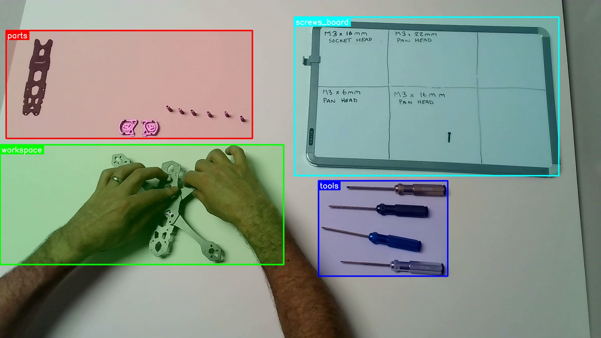    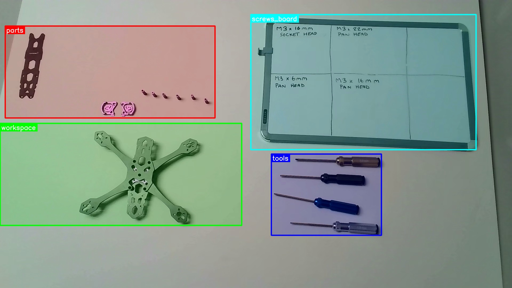  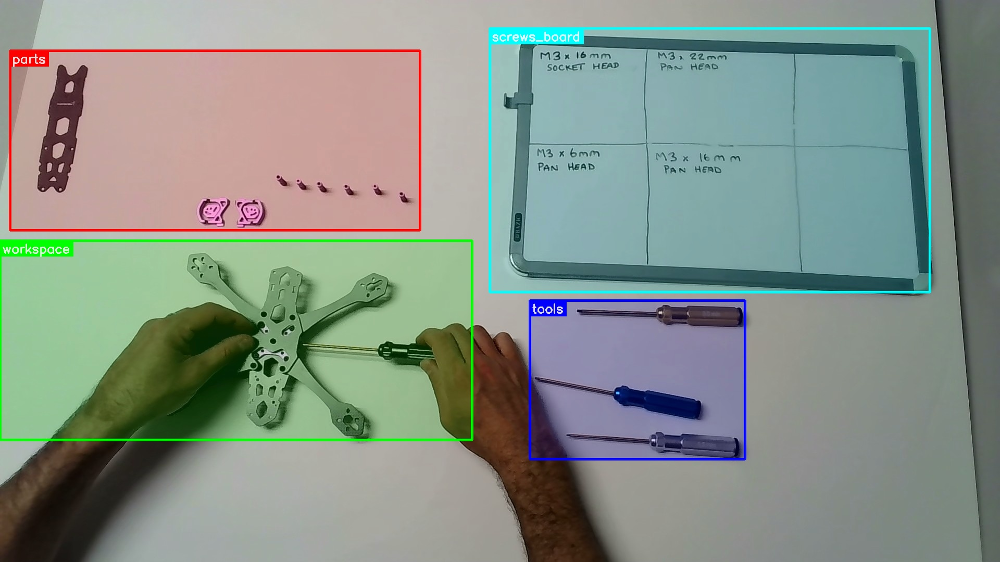    

| Zone | Bbox | Objects |
|---|---|---|
| workspace | (0.00, 0.43, 0.47, 0.78) | hands, drone frame |
| tools | (0.53, 0.54, 0.74, 0.82) | screwdrivers, hex drivers |
| parts | (0.01, 0.09, 0.42, 0.41) | drone frame components, standoffs |
| screws_board | (0.49, 0.05, 0.93, 0.52) | whiteboard, screw types |

**Description**:
The assembler uses a black 2.0mm screwdriver to tighten one of the M3 x 16mm pan head screws already inserted, securing a black long side plate to the main frame. After tightening, the black screwdriver is returned to the tools area. The assembler then picks up a gold 2.5mm screwdriver and rotates the partially assembled drone frame for inspection.

<b>Movement</b>

*   [IDLE] 0s-3s | workspace | The partially assembled frame is resting on the workspace.
*   [MOVE] 3s-4s | black (2.0mm) screwdriver | tools -> workspace | The assembler picks up the black screwdriver.
*   [ACTION] 6s-20s | M3 x 16mm pan head screw | workspace | The assembler uses the black (2.0mm) screwdriver to tighten one M3 x 16mm pan head screw on the frame.
*   [MOVE] 20s-22s | black (2.0mm) screwdriver | workspace -> tools | The assembler returns the black screwdriver to the tools area.
*   [MOVE] 22s-24s | gold (2.5mm) screwdriver | tools -> workspace | The assembler picks up the gold screwdriver.
*   [MOVE] 26s-28s | assembled frame | workspace -> workspace | The assembler rotates and lifts the partially assembled frame, inspecting its underside.

<b>Zone States</b>

*   **workspace**: One silver main frame bottom plate with four black arms attached by four purple screws. Two black long side plates are attached, with two M3 x 16mm pan head screws inserted into the frame (one of which has been tightened in this segment). Two pink LED components are present. One small purple screw remains on the table.
*   **tools**: Black (2.0mm) screwdriver, blue (2.0mm) screwdriver, and silver (1.5mm) screwdriver are present. The gold (2.5mm) screwdriver is currently in the assembler's hand (implied as picked up from the tools zone).
*   **parts**: One black main frame top plate.
*   **screws_board**: M3 x 16mm socket head (drawn: 1, actual: 0 screws in box), M3 x 22mm pan head (drawn: 4, actual: 4 screws in box), M3 x 6mm pan head (drawn: 1, actual: 1 screw in box), M3 x 16mm pan head (drawn: 4, actual: 2 screws in box).

<b>Tools & Parts Summary</b>

Tools: [TOOL: gold (2.5mm) screwdriver @ workspace], [TOOL: black (2.0mm) screwdriver @ tools], [TOOL: blue (2.0mm) screwdriver @ tools], [TOOL: silver (1.5mm) screwdriver @ tools].
Parts: [PART: black main frame top plate @ parts].

**Instruction:** You are on **Step 2**: Lock the arms by tightening the arm wedges using M3x16mm screws to lock them in place.
Next you should do **Step 3**: ADD THE SPLIT FRONT PLATE TO THE ASSEMBLY AND USE THE M3X6MM IN THE MIDDLE TO SECURE IT
*Match confidence: high. The video shows the person tightening the arm wedges with screws, which directly corresponds to Step 2 of the manual: 'Lock the arms by tightening the arm wedges using M3x16mm screws to lock them in place.'*

## Segment 27 [13:30.00 - 14:00.00]

    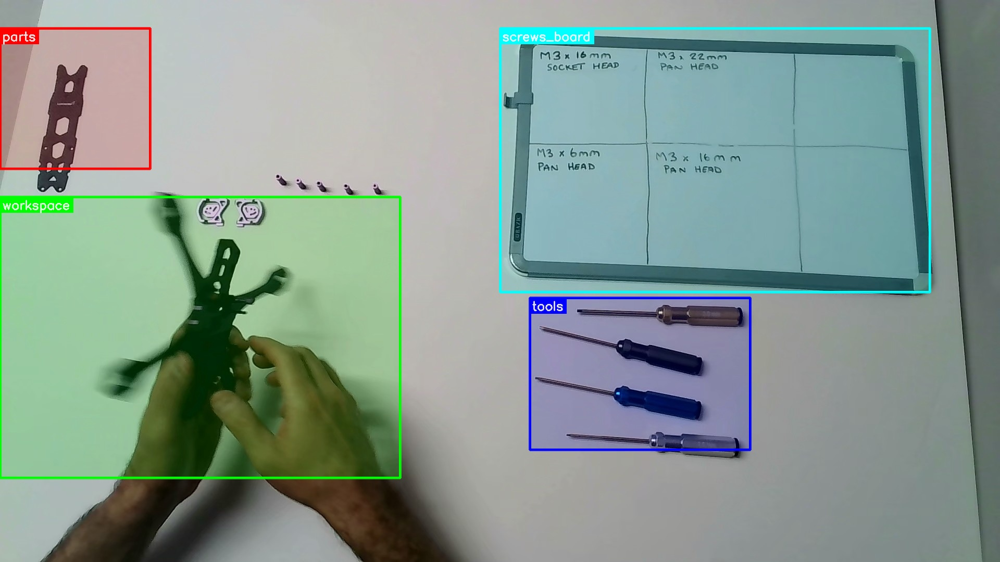      

| Zone | Bbox | Objects |
|---|---|---|
| workspace | (0.00, 0.35, 0.40, 0.85) | hands, drone frame |
| tools | (0.53, 0.53, 0.75, 0.80) | screwdrivers, hex drivers |
| parts | (0.00, 0.05, 0.15, 0.30) | drone frame parts |
| screws_board | (0.50, 0.05, 0.93, 0.52) | whiteboard, text labels |

**Description**:
The assembler finishes tightening a screw connecting a side plate to the main frame. Subsequently, the entire frame is disassembled: the silver main frame bottom plate with arms, the black main frame top plate, and the two black long side plates are separated. Two small purple screws are then removed from the pink LED components. Finally, the black main frame top plate is re-attached to the silver main frame bottom plate with the four purple screws, preparing for the next assembly step.

<b>Movement</b>

*   [ACTION] 0:00s-0:07s | gold (2.5mm) screwdriver | workspace | tightening the second M3 x 16mm pan head screw into the black long side plate.
*   [ACTION] 0:07s-0:10s | hands | workspace | disassembling the main frame by separating the silver main frame bottom plate with arms from the black main frame top plate and the two black long side plates, and removing two M3 x 16mm pan head screws and four purple screws from the assembly.
*   [PLACE] 0:10s-0:11s | silver main frame bottom plate with black arms | workspace -> workspace | placed on the workspace.
*   [PLACE] 0:11s-0:12s | gold (2.5mm) screwdriver | hand -> tools | placed in the tools zone.
*   [PICKUP] 0:12s-0:13s | blue (2.0mm) screwdriver | tools -> hand | picked up from the tools zone.
*   [ACTION] 0:13s-0:15s | blue (2.0mm) screwdriver | workspace | separating the black main frame top plate from the two black long side plates.
*   [PLACE] 0:15s-0:16s | blue (2.0mm) screwdriver | hand -> tools | placed in the tools zone.
*   [PICKUP] 0:16s-0:17s | silver (1.5mm) screwdriver | tools -> hand | picked up from the tools zone.
*   [ACTION] 0:17s-0:19s | silver (1.5mm) screwdriver | workspace | removing two small purple screws from the two pink LED components.
*   [PLACE] 0:19s-0:19s | two small purple screws | workspace | placed on the workspace near other screws.
*   [PICKUP] 0:19s-0:20s | black main frame top plate | workspace -> hand | picked up from the workspace.
*   [PLACE] 0:20s-0:21s | black main frame top plate | hand -> workspace | placed onto the silver main frame bottom plate.
*   [PICKUP] 0:21s-0:22s | purple screw (1) | workspace -> hand | picked up from the workspace.
*   [ACTION] 0:22s-0:23s | purple screw (1) | workspace | inserting the screw into the assembled main frame.
*   [PICKUP] 0:23s-0:24s | purple screw (1) | workspace -> hand | picked up from the workspace.
*   [ACTION] 0:24s-0:25s | purple screw (1) | workspace | inserting the screw into the assembled main frame.
*   [PICKUP] 0:25s-0:26s | purple screw (1) | workspace -> hand | picked up from the workspace.
*   [ACTION] 0:26s-0:27s | purple screw (1) | workspace | inserting the screw into the assembled main frame.
*   [PICKUP] 0:27s-0:28s | purple screw (1) | workspace -> hand | picked up from the workspace.
*   [ACTION] 0:28s-0:28s | purple screw (1) | workspace | inserting the screw into the assembled main frame.
*   [PLACE] 0:28s-0:29s | silver (1.5mm) screwdriver | hand -> tools | placed in the tools zone.
*   [ACTION] 0:29s-0:30s | hands | workspace | rotating the partially assembled main frame.

<b>Zone States</b>

*   **workspace**: One silver main frame bottom plate with four black arms and a black main frame top plate attached by four purple screws. Two black long side plates are present, detached from the main frame. Two pink LED components (now without screws) are present. Two M3 x 16mm pan head screws and three small purple screws are loose on the surface.
*   **tools**: The black (2.0mm) screwdriver, blue (2.0mm) screwdriver, silver (1.5mm) screwdriver, and gold (2.5mm) screwdriver are all present.
*   **parts**: The parts zone is empty.
*   **screws_board**: M3 x 16mm socket head (drawn: 1, actual: 0 screws in box), M3 x 22mm pan head (drawn: 4, actual: 4 screws in box), M3 x 6mm pan head (drawn: 1, actual: 1 screw in box), M3 x 16mm pan head (drawn: 4, actual: 2 screws in box).

<b>Tools & Parts Summary</b>

Tools: [TOOL: gold (2.5mm) screwdriver @ tools], [TOOL: black (2.0mm) screwdriver @ tools], [TOOL: blue (2.0mm) screwdriver @ tools], [TOOL: silver (1.5mm) screwdriver @ tools].
Parts: [PART: silver main frame bottom plate with black arms @ workspace], [PART: black main frame top plate @ workspace], [PART: black long side plate (2) @ workspace], [PART: pink LED component (2) @ workspace], [PART: M3 x 16mm pan head screw (2) @ workspace], [PART: small purple screw (3) @ workspace], [PART: purple screw (4) @ workspace].

**Instruction:** You are in preparation phase. Next you should do **Step 1**: START THE ASSEMBLY BY USING THE SPUT REAR PLATE TO MOUNT THE X-LOCK FC ISOLATOR WITH THE M3x22MM AND THE M3x6MM SCREWS
*Match confidence: high. The person in the video is currently organizing parts and has not started the assembly process described in the manual steps. They are holding the frame and looking at the screws, which aligns with preparation before starting Step 1.*

## Segment 28 [14:00.00 - 14:30.00]

  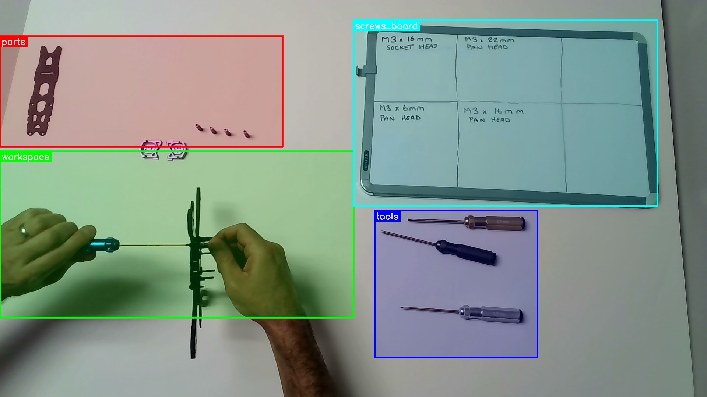    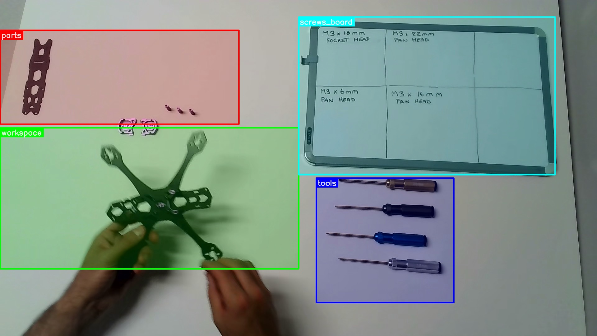    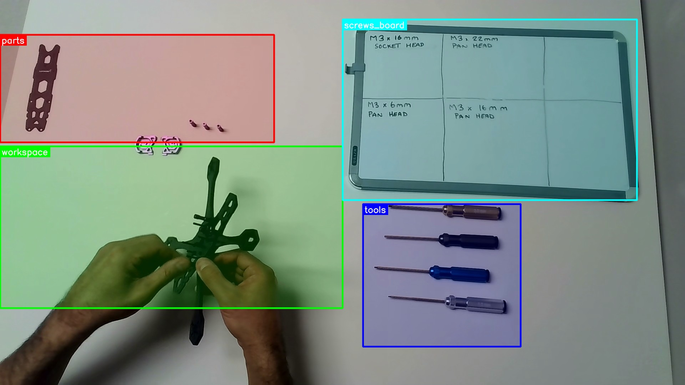

| Zone | Bbox | Objects |
|---|---|---|
| workspace | (0.00, 0.38, 0.50, 0.80) | hands, drone frame, screwdriver |
| tools | (0.53, 0.53, 0.76, 0.90) | screwdrivers, hex drivers |
| parts | (0.00, 0.09, 0.40, 0.37) | drone frame components, standoffs |
| screws_board | (0.50, 0.05, 0.93, 0.52) | whiteboard, screw types, screw sizes |

**Description**:
The assembler begins by removing the four purple M3 x 16mm pan head screws that secure the black main frame top plate to the silver main frame bottom plate using a blue screwdriver. After removing the top plate, the assembler then performs a test fit, slotting the two black long side plates onto the silver main frame bottom plate with arms to check their alignment.

<b>Movement</b>

*   [MOVE] 0:00-0:01 | blue (2.0mm) screwdriver | tools -> workspace | The assembler picks up the blue (2.0mm) screwdriver.
*   [ACTION] 0:01-0:07 | purple M3 x 16mm pan head screws | workspace | The assembler uses the blue (2.0mm) screwdriver to loosen and remove four purple M3 x 16mm pan head screws, detaching the black main frame top plate from the silver main frame bottom plate with arms. The screws become loose on the workspace.
*   [MOVE] 0:07-0:08 | black main frame top plate | workspace -> workspace | The assembler lifts the black main frame top plate off and places it on the workspace.
*   [MOVE] 0:08-0:08 | blue (2.0mm) screwdriver | workspace -> tools | The assembler places the blue (2.0mm) screwdriver back into the tools zone.
*   [MOVE] 0:08-0:10 | gold (2.5mm) screwdriver | tools -> tools | The assembler briefly picks up and then places the gold (2.5mm) screwdriver back into the tools zone.
*   [MOVE] 0:13-0:14 | one black long side plate | workspace -> workspace | The assembler picks up one of the black long side plates.
*   [MOVE] 0:14-0:17 | black main frame top plate | workspace -> workspace | The assembler picks up the black main frame top plate and briefly aligns it with the silver main frame bottom plate before placing it back down.
*   [MOVE] 0:17-0:19 | two black long side plates | workspace -> workspace | The assembler picks up the two black long side plates.
*   [ACTION] 0:19-0:26 | two black long side plates | workspace | The assembler aligns and slots the two black long side plates onto the silver main frame bottom plate with arms, performing a test fit without screws.
*   [MOVE] 0:26-0:29 | blue (2.0mm) screwdriver | tools -> tools | The assembler picks up the blue (2.0mm) screwdriver, briefly touches it near a screw hole on the frame, and then places it back into the tools zone.
*   [IDLE] 0:29-0:30 | workspace | nothing happening.

<b>Zone States</b>

*   **workspace**: One silver main frame bottom plate with four black arms and two black long side plates test-fitted. One black main frame top plate is detached and loose. Two pink LED components are present. Six M3 x 16mm pan head screws and three small purple M3 x 6mm pan head screws are loose on the surface.
*   **tools**: The black (2.0mm) screwdriver, blue (2.0mm) screwdriver, silver (1.5mm) screwdriver, and gold (2.5mm) screwdriver are all present.
*   **parts**: The parts zone is empty.
*   **screws_board**: M3 x 16mm socket head (drawn: 1, actual: 0 screws in box), M3 x 22mm pan head (drawn: 4, actual: 4 screws in box), M3 x 6mm pan head (drawn: 1, actual: 1 screw in box), M3 x 16mm pan head (drawn: 4, actual: 2 screws in box).

<b>Tools & Parts Summary</b>

Tools: [TOOL: black (2.0mm) screwdriver @ tools], [TOOL: blue (2.0mm) screwdriver @ tools], [TOOL: silver (1.5mm) screwdriver @ tools], [TOOL: gold (2.5mm) screwdriver @ tools].
Parts: [PART: silver main frame bottom plate with four black arms @ workspace], [PART: black main frame top plate @ workspace], [PART: two black long side plates @ workspace], [PART: two pink LED components @ workspace].

**Instruction:** You are on **Step 2**: Lock the arms by tightening the arm wedges using M3x16mm screws to lock them in place.
Next you should do **Step 3**: ADD THE SPLIT FRONT PLATE TO THE ASSEMBLY AND USE THE M3X6MM IN THE MIDDLE TO SECURE IT
*Match confidence: high. The video shows the person tightening the arm wedges with screws, which directly corresponds to Step 2 of the manual: 'Lock the arms by tightening the arm wedges using M3x16mm screws to lock them in place.'*

## Segment 29 [14:30.00 - 15:00.00]

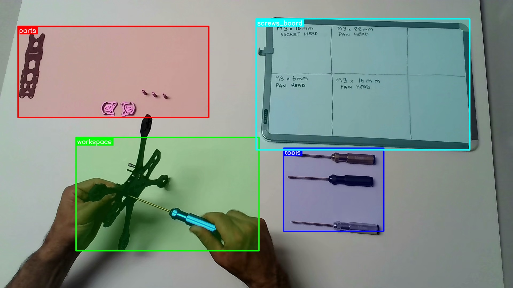      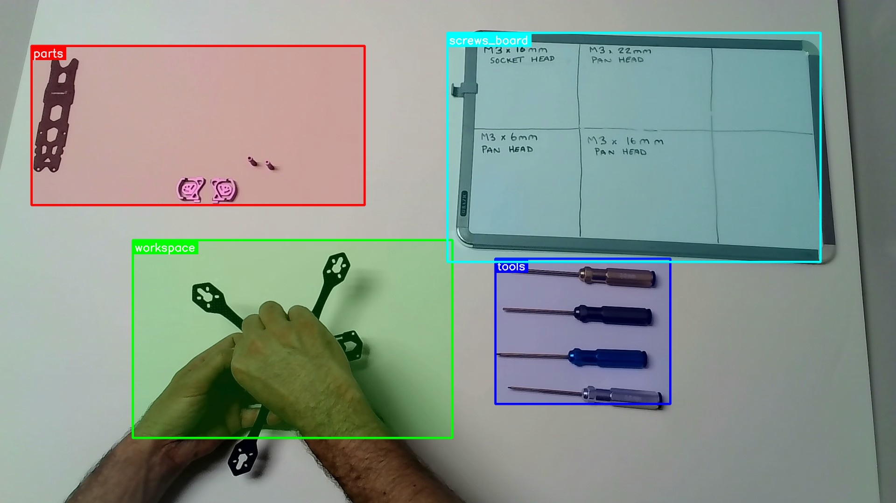  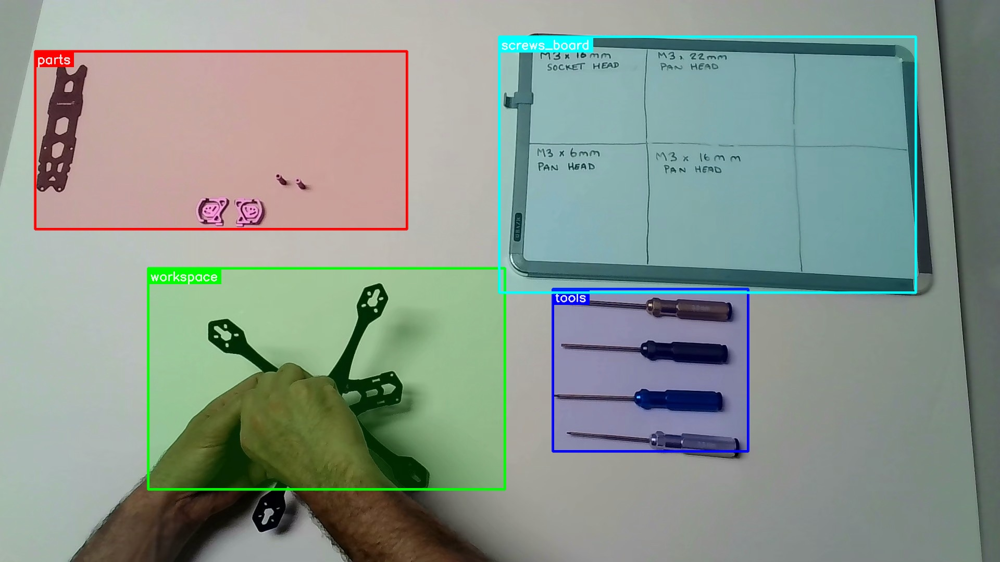  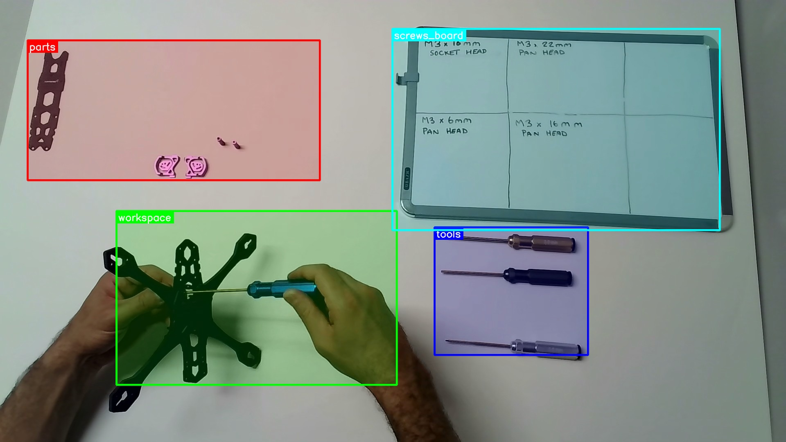

| Zone | Bbox | Objects |
|---|---|---|
| workspace | (0.15, 0.48, 0.51, 0.87) | hands, drone frame, screwdriver |
| tools | (0.55, 0.51, 0.75, 0.80) | screwdrivers |
| parts | (0.04, 0.09, 0.41, 0.41) | drone frame components, standoffs, small screws |
| screws_board | (0.50, 0.07, 0.92, 0.52) | whiteboard, text describing screws |

**Description**:
The segment begins with the disassembling of a test-fitted silver drone frame. A fully assembled black drone frame (bottom plate with arms and side plates) is then introduced. Four M3 x 16mm pan head screws are subsequently picked up from the workspace, inserted into the center holes of the black frame's bottom plate, and tightened using a blue 2.0mm hex screwdriver.

<b>Movement</b>

- [IDLE] 0s-1s | silver main frame bottom plate with four black arms and two black long side plates (test-fitted) | workspace | Right hand holds a blue screwdriver while left hand supports the silver frame assembly.
- [MOVE] 1s-2s | blue (2.0mm) screwdriver | right_hand -> tools | Right hand places the blue screwdriver in the tools zone.
- [ACTION] 2s-3s | silver main frame bottom plate with four black arms and two black long side plates (test-fitted) | workspace | Hands disassemble the black arms and black long side plates from the silver main frame bottom plate.
- [MOVE] 3s-4s | black arms and two black long side plates (detached) | workspace -> out_of_view | Hands move the detached parts out of view.
- [MOVE] 4s-5s | silver main frame bottom plate | workspace -> out_of_view | Hands move the silver main frame bottom plate out of view.
- [MOVE] 6s-7s | black main frame bottom plate with four black arms and two black long side plates (assembled) | out_of_view -> workspace | Left hand brings an already assembled black main frame bottom plate (with arms and side plates attached) into the workspace.
- [ACTION] 7s-9s | black main frame bottom plate with four black arms and two black long side plates (assembled) | workspace | Hands orient the assembled black frame.
- [MOVE] 9s-13s | M3 x 16mm pan head screws (x4) | workspace -> right_hand | Right hand picks up four M3 x 16mm pan head screws one by one.
- [ACTION] 13s-17s | M3 x 16mm pan head screws (x4) | workspace | Right hand inserts the four M3 x 16mm pan head screws into the central holes of the black main frame bottom plate.
- [MOVE] 17s-18s | blue (2.0mm) screwdriver | tools -> right_hand | Right hand picks up the blue screwdriver.
- [ACTION] 18s-23s | M3 x 16mm pan head screws (x4) | workspace | Right hand uses the blue (2.0mm) screwdriver to tighten the four M3 x 16mm pan head screws in the black main frame bottom plate.
- [MOVE] 23s-24s | blue (2.0mm) screwdriver | right_hand -> tools | Right hand places the blue screwdriver back in the tools zone.
- [ACTION] 24s-25s | black main frame bottom plate with four black arms and two black long side plates (assembled) | workspace | Hands flip the assembled black frame.
- [IDLE] 25s-30s | workspace | The assembled black frame rests on the workspace.

<b>Zone States</b>

- **workspace**: One assembled black main frame (bottom plate with four black arms and two black long side plates) with four M3 x 16mm pan head screws tightened into its center. Two M3 x 16mm pan head screws, three small purple M3 x 6mm pan head screws, and two pink LED components are loose on the surface. The silver main frame bottom plate and the black main frame top plate are not visible.
- **tools**: The black (2.0mm) screwdriver, blue (2.0mm) screwdriver, silver (1.5mm) screwdriver, and gold (2.5mm) screwdriver are all present.
- **parts**: The parts zone is empty.
- **screws_board**: M3 x 16mm socket head (drawn: 1, actual: 0 screws in box), M3 x 22mm pan head (drawn: 4, actual: 4 screws in box), M3 x 6mm pan head (drawn: 1, actual: 1 screw in box), M3 x 16mm pan head (drawn: 4, actual: 2 screws in box).

<b>Tools & Parts Summary</b>

Tools: [TOOL: black (2.0mm) screwdriver @ tools], [TOOL: blue (2.0mm) screwdriver @ tools], [TOOL: silver (1.5mm) screwdriver @ tools], [TOOL: gold (2.5mm) screwdriver @ tools].
Parts: [PART: black main frame bottom plate with four black arms and two black long side plates (assembled) @ workspace], [PART: M3 x 16mm pan head screws (x4, tightened) @ workspace], [PART: M3 x 16mm pan head screws (x2, loose) @ workspace], [PART: M3 x 6mm pan head screws (x3, loose) @ workspace], [PART: pink LED components (x2) @ workspace], [PART: M3 x 22mm pan head screws (x4) @ screws_board], [PART: M3 x 6mm pan head screws (x1) @ screws_board], [PART: M3 x 16mm pan head screws (x2) @ screws_board].

**Instruction:** You are on **Step 2**: Lock the arms by tightening the arm wedges using M3x16mm screws to lock them in place.
Next you should do **Step 3**: ADD THE SPLIT FRONT PLATE TO THE ASSEMBLY AND USE THE M3X6MM IN THE MIDDLE TO SECURE IT
*Match confidence: high. The video shows the person tightening screws into the arms of the drone frame, which aligns with Step 2: 'Lock the arms by tightening the arm wedges using M3x16mm screws to lock them in place.' The screws being used are consistent with the M3x16mm screws mentioned in the step.*

## Segment 30 [15:00.00 - 15:29.84]

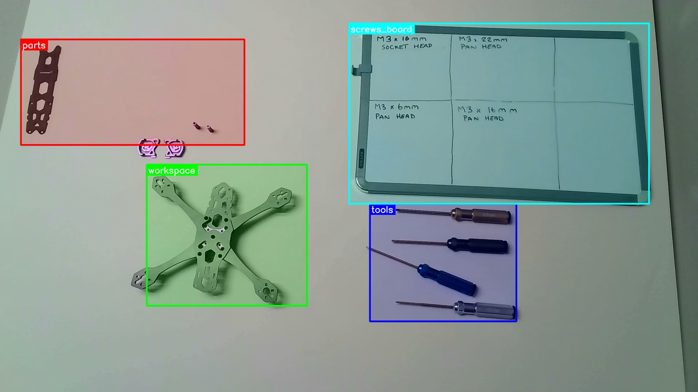      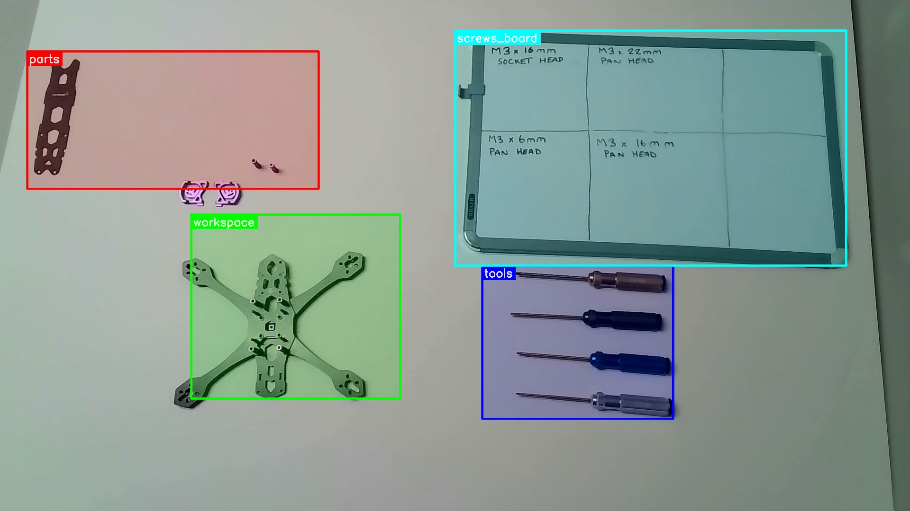  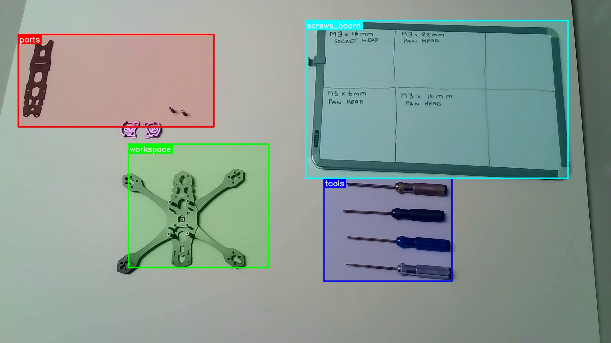  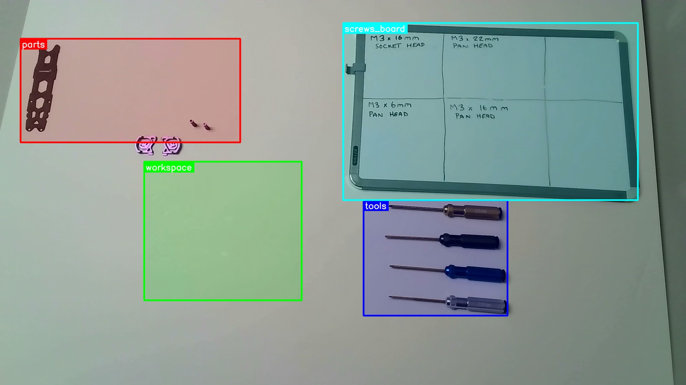

| Zone | Bbox | Objects |
|---|---|---|
| workspace | (0.21, 0.42, 0.44, 0.78) | drone frame, hand |
| tools | (0.53, 0.52, 0.74, 0.82) | screwdrivers |
| parts | (0.03, 0.10, 0.35, 0.37) | carbon fiber plates, standoffs |
| screws_board | (0.50, 0.06, 0.93, 0.52) | whiteboard with screw types |

**Description**: The video segment begins with a silver drone frame bottom plate and a black top plate on the workspace. The person briefly examines the silver bottom plate, then demonstrates how the black top plate fits onto the silver bottom plate. Both plates are subsequently removed from the workspace. Towards the end of the clip, a black frame arm is retrieved from the parts zone, and the blue (2.0mm) screwdriver is picked up, preparing for the assembly of the frame arms.

<b>Movement</b>

*   [MOVE] 0:01-0:02 | silver main frame bottom plate | workspace -> workspace | Right hand picks up the silver main frame bottom plate.
*   [ACTION] 0:02-0:05 | silver main frame bottom plate | workspace | Right hand rotates the silver main frame bottom plate to examine it.
*   [MOVE] 0:05-0:07 | silver main frame bottom plate | workspace -> workspace | Right hand puts the silver main frame bottom plate back down.
*   [MOVE] 0:07-0:08 | blue (2.0mm) screwdriver | tools -> tools | Right hand picks up the blue (2.0mm) screwdriver and then places it back.
*   [MOVE] 0:09-0:10 | black main frame top plate | workspace -> workspace | Right hand picks up the black main frame top plate.
*   [MOVE] 0:10-0:11 | black main frame top plate | workspace -> workspace | Right hand briefly places the black main frame top plate on the silver main frame bottom plate, rotates it, then removes it.
*   [MOVE] 0:11-0:12 | black main frame top plate | workspace -> workspace | Right hand puts the black main frame top plate back on the workspace.
*   [IDLE] 0:12-0:15 | workspace | No hands are performing actions; the silver main frame bottom plate is on the workspace.
*   [MOVE] 0:15-0:21 | silver main frame bottom plate | workspace -> workspace | Right hand repositions the silver main frame bottom plate.
*   [MOVE] 0:21-0:23 | silver main frame bottom plate | workspace -> outside_frame | Right hand removes the silver main frame bottom plate from the workspace.
*   [MOVE] 0:23-0:24 | black main frame top plate | workspace -> outside_frame | Left hand removes the black main frame top plate from the workspace.
*   [MOVE] 0:24-0:25 | blue (2.0mm) screwdriver | tools -> workspace | Right hand picks up the blue (2.0mm) screwdriver.
*   [MOVE] 0:25-0:29 | black frame arm | parts -> workspace | Left hand picks up one black frame arm from the stack of parts.

<b>Zone States</b>

*   **workspace**: Two M3 x 16mm pan head screws (loose), three M3 x 6mm pan head screws (loose), two pink LED components (loose), one black frame arm.
*   **tools**: The black (2.0mm) screwdriver, silver (1.5mm) screwdriver, and gold (2.5mm) screwdriver are present. The blue (2.0mm) screwdriver is missing (held by hand).
*   **parts**: Stack of black frame parts (arms, side plates, likely another bottom plate, minus one arm).
*   **screws_board**: M3 x 16mm socket head (drawn: 1, actual: 0 screws in box), M3 x 22mm pan head (drawn: 4, actual: 4 screws in box), M3 x 6mm pan head (drawn: 1, actual: 1 screw in box), M3 x 16mm pan head (drawn: 4, actual: 2 screws in box). No screws were removed from the boxes.

<b>Tools & Parts Summary</b>

Tools: [blue (2.0mm) screwdriver @ workspace], [black (2.0mm) screwdriver @ tools], [silver (1.5mm) screwdriver @ tools], [gold (2.5mm) screwdriver @ tools].
Parts: [silver main frame bottom plate @ outside_frame], [black main frame top plate @ outside_frame], [black frame arm @ workspace], [black frame parts @ parts], [M3 x 16mm pan head screw @ workspace], [M3 x 6mm pan head screw @ workspace], [pink LED component @ workspace].

**Instruction:** You are in preparation phase. Next you should do **Step 1**: START THE ASSEMBLY BY USING THE SPUT REAR PLATE TO MOUNT THE X-LOCK FC ISOLATOR WITH THE M3x22MM AND THE M3x6MM SCREWS
*Match confidence: high. The video shows the person organizing parts and holding the main frame, but no assembly has started yet. This corresponds to a preparation phase before step 1.*

