# Zone-Based Movement & State Report

**Duration:** 1179.7s | **Resolution:** 480x270 | **Segments:** 40

---

## Segment 0 [00:00.00 - 00:30.00]

  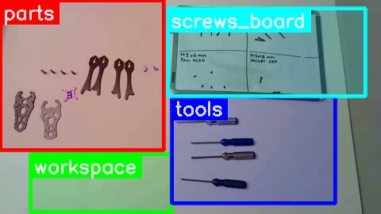  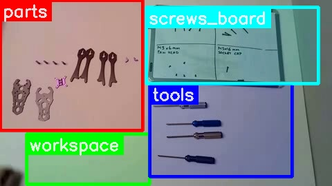  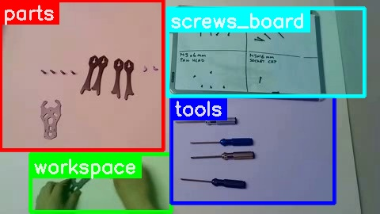  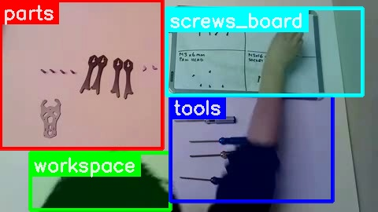  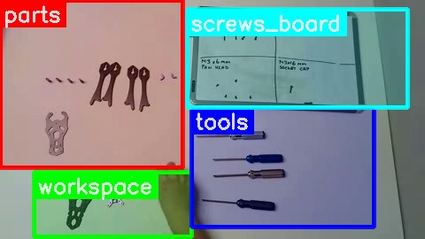

| Zone | Bbox | Objects |
|---|---|---|
| workspace | (0.08, 0.72, 0.45, 0.99) | hand, grey drone frame plate, purple drone frame piece, small black screws |
| tools | (0.45, 0.45, 0.88, 0.95) | silver screwdriver, blue screwdriver, gold screwdriver, black screwdriver |
| parts | (0.00, 0.00, 0.43, 0.70) | two grey drone frame plates, one purple drone frame plate, four black drone arms, small purple standoffs |
| screws_board | (0.44, 0.04, 0.96, 0.45) | whiteboard, M3 x 16mm pan head screws, M3 x 22mm pan head screws, M3 x 6mm pan head screws, M3 x 16mm socket cap screws |

**Description**:
The video segment shows the preparation phase for assembling a drone frame. A person moves several frame components and various screws from their designated storage zones to the main workspace. The screws are specifically sorted from a whiteboard display to ensure the correct types and quantities are gathered.

<b>Movement</b>

- 0:12-0:14 | grey frame base plate | parts -> workspace | A large grey frame base plate is moved to the workspace.
- 0:16-0:17 | small black screws | parts -> workspace | A pile of small black screws (approx. 8) is moved from the parts zone to the workspace.
- 0:18-0:19 | small purple frame component | parts -> workspace | A small purple frame component is moved to the workspace.
- 0:20-0:23 | M3 x 22mm pan head screws | screws_board (top right) -> workspace | 5 M3 x 22mm pan head screws are taken from the top right quadrant of the screws board and placed in the workspace.
- 0:25-0:26 | M3 x 6mm pan head screws | screws_board (bottom left) -> workspace | 5 M3 x 6mm pan head screws are taken from the bottom left quadrant of the screws board and placed in the workspace.
- 0:31-0:34 | M3 x 6mm pan head screw | screws_board (bottom left) -> workspace | 1 M3 x 6mm pan head screw is taken from the bottom left quadrant of the screws board and placed in the workspace.

<b>Zone States</b>

- **workspace**: Contains one grey frame base plate, approximately 8 small black screws, one small purple frame component, 5 M3 x 22mm pan head screws, and 6 M3 x 6mm pan head screws.
- **tools**: All four screwdrivers (silver, blue, gold, black) are present.
- **parts**: Contains one grey frame base plate and four black arm pieces.
- **screws_board**: The 'M3 x 22mm Pan Head' section has 1 screw remaining. The 'M3 x 6mm Pan Head' section has 0 screws remaining. The 'M3 x 16mm Pan Head' section has 6 screws remaining. The 'M3 x 16mm Socket Cap' section has 2 screws remaining.

<b>Tools & Parts Summary</b>

Tools: [SCREWDRIVER: silver @ tools], [SCREWDRIVER: blue @ tools], [SCREWDRIVER: gold @ tools], [SCREWDRIVER: black @ tools].
Parts: [FRAME_COMPONENT: grey frame base plate @ workspace], [SCREW: small black screws @ workspace], [FRAME_COMPONENT: small purple frame component @ workspace], [SCREW: M3 x 22mm pan head screws @ workspace], [SCREW: M3 x 6mm pan head screws @ workspace], [FRAME_COMPONENT: grey frame base plate @ parts], [FRAME_COMPONENT: black arm pieces (4) @ parts].

**Instruction:** You are in preparation phase. Next you should do **Step 1**: START THE ASSEMBLY BY USING THE SPUT REAR PLATE TO MOUNT THE X-LOCK FC ISOLATOR WITH THE M3x22MM AND THE M3x6MM SCREWS (high: The video shows the person organizing and preparing the parts and screws for assembly, which is a preparatory step before starting the actual assembly process outlined in Step 1 of the manual. The person is selecting screws from a whiteboard, indicating preparation rather than active assembly.)

## Segment 1 [00:30.00 - 01:00.00]

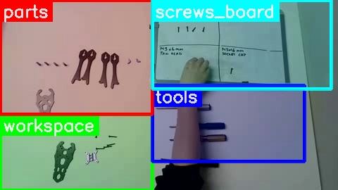  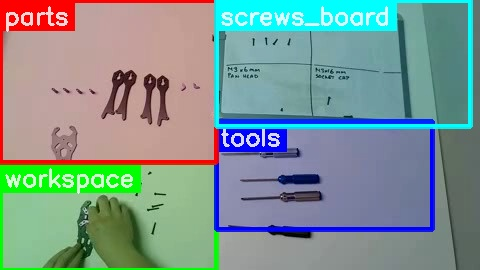  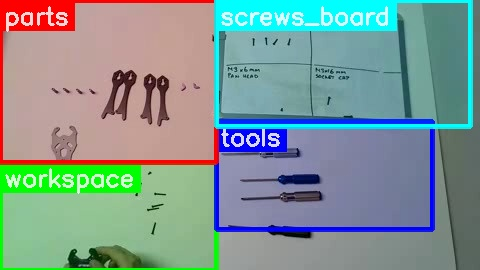    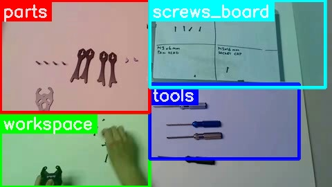  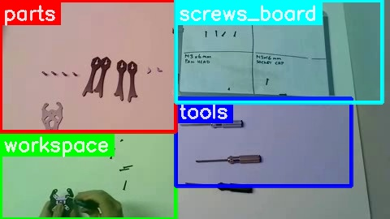

| Zone | Bbox | Objects |
|---|---|---|
| workspace | (0.00, 0.60, 0.45, 1.00) | hands, purple drone component, black drone frame plate, small screw, hex driver (blue handle) |
| tools | (0.45, 0.45, 0.90, 0.85) | hex drivers, screwdrivers |
| parts | (0.00, 0.00, 0.45, 0.60) | drone arms (black), main frame plates (grey and black), purple drone component, small screws (scattered) |
| screws_board | (0.45, 0.00, 0.98, 0.47) | whiteboard, M3x16mm pan head screws, M4x22mm pan head screws, M3x6mm pan head screws, M3x16mm socket cap screws |

**Description**: In this segment, the assembler attaches a small purple frame component to a grey frame base plate using four small black M3 x 6mm Pan Head screws. After securing the purple component with all four screws, the assembler picks up a blue screwdriver and begins tightening the inserted screws to fully secure the attachment.

<b>Movement</b>

*   00:00-00:03 | small black screws | workspace | Hand collects and organizes a scattered pile of small black M3 x 6mm Pan Head screws.
*   00:04-00:05 | purple frame component | workspace | Hand picks up the small purple frame component.
*   00:05-00:06 | purple frame component | workspace | Hand places the purple frame component onto the grey frame base plate, aligning the screw holes.
*   00:06-00:07 | small black screw (M3 x 6mm Pan Head) | workspace | Hand picks up one small black M3 x 6mm Pan Head screw.
*   00:07-00:08 | assembled purple component & grey plate | workspace | Hand attempts to insert the screw but drops it.
*   00:09-00:11 | small black screw (M3 x 6mm Pan Head) | workspace | Hand picks up another small black M3 x 6mm Pan Head screw and inserts it into the assembled purple component and grey plate.
*   00:11-00:12 | assembled purple component & grey plate | workspace | Hand picks up the assembled pieces and flips them over.
*   00:12-00:13 | assembled purple component & grey plate | workspace | Hand places the assembled pieces back down on the workspace.
*   00:13-00:15 | small black screw (M3 x 6mm Pan Head) | workspace | Hand picks up a small black M3 x 6mm Pan Head screw and inserts it into the assembly.
*   00:15-00:17 | assembled purple component & grey plate | workspace | Hand adjusts the position of the purple component on the grey plate.
*   00:17-00:19 | small black screw (M3 x 6mm Pan Head) | workspace | Hand picks up a small black M3 x 6mm Pan Head screw and inserts it into the assembly.
*   00:19-00:21 | small black screw (M3 x 6mm Pan Head) | workspace | Hand picks up a small black M3 x 6mm Pan Head screw and inserts it into the assembly.
*   00:21-00:23 | assembled purple component & grey plate | workspace | Hand re-positions the assembly.
*   00:25-00:26 | blue screwdriver | tools -> workspace | Hand picks up the blue screwdriver.
*   00:26-00:28 | blue screwdriver | workspace | Hand positions the blue screwdriver over a screw in the assembly.
*   00:28-00:29 | assembled purple component & grey plate | workspace | Hand uses the blue screwdriver to tighten one of the M3 x 6mm Pan Head screws.
*   00:29-00:30 | assembled purple component & grey plate | workspace | Hand continues to use the blue screwdriver to tighten a second M3 x 6mm Pan Head screw.

<b>Zone States</b>

*   **workspace**: Contains one grey frame base plate with a purple frame component attached by four M3 x 6mm Pan Head screws, and a pile of approximately 4-5 remaining small black M3 x 6mm Pan Head screws. The blue screwdriver is currently in use over the assembly.
*   **tools**: The silver, gold, and black screwdrivers are present. The blue screwdriver is missing (in use).
*   **parts**: Contains one grey frame base plate and four black arm pieces.
*   **screws_board**: The 'M3 x 16mm Pan Head' section has 6 screws remaining. The 'M3 x 22mm Pan Head' section has 1 screw remaining. The 'M3 x 6mm Pan Head' section has 0 screws remaining (empty box). The 'M3 x 16mm Socket Cap' section has 2 screws remaining.

<b>Tools & Parts Summary</b>

Tools: [SCREWDRIVER: silver @ tools], [SCREWDRIVER: blue @ workspace], [SCREWDRIVER: gold @ tools], [SCREWDRIVER: black @ tools].
Parts: [FRAME_BASE_PLATE: grey @ workspace (assembled)], [FRAME_COMPONENT: purple @ workspace (assembled)], [FRAME_BASE_PLATE: grey @ parts], [ARM_PIECE: black @ parts (x4)].

**Instruction:** You are on **Step 1**: START THE ASSEMBLY BY USING THE SPUT REAR PLATE TO MOUNT THE X-LOCK FC ISOLATOR WITH THE M3x22MM AND THE M3x6MM SCREWS (high: The video shows the assembler attaching the X-LOCK FC Isolator (purple component) to the split rear plate (grey frame base plate) using M3x6mm screws, which directly corresponds to the first part of Step 1 in the manual. The manual mentions M3x22mm screws as well, but the video only shows the M3x6mm screws being used for this specific attachment, which is consistent with the initial part of Step 1.)

## Segment 2 [01:00.00 - 01:30.00]

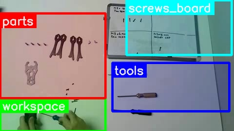  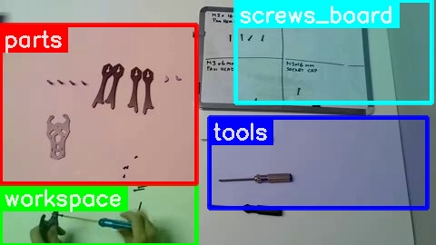  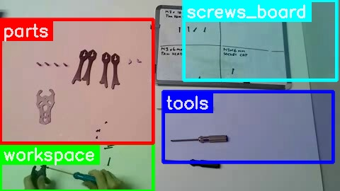  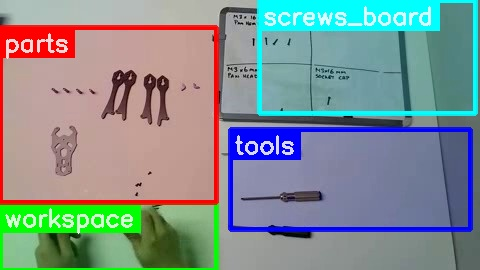  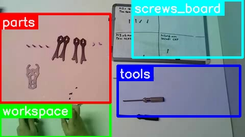  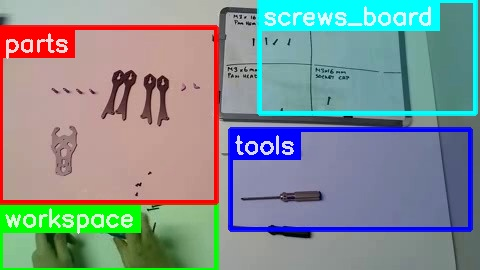

| Zone | Bbox | Objects |
|---|---|---|
| workspace | (0.00, 0.75, 0.45, 1.00) | hands, blue_screwdriver, black_drone_arm, screw |
| tools | (0.48, 0.48, 0.98, 0.85) | screwdriver_with_silver_handle, screwdriver_with_gold_handle, screwdriver_with_black_handle |
| parts | (0.00, 0.10, 0.45, 0.75) | drone_arms_black, drone_main_plate_grey, small_screws_scattered, small_white_spacers |
| screws_board | (0.54, 0.00, 0.99, 0.42) | whiteboard, marker_drawings, screws_diagram, text_labels |

**Description**:
The assembler spends the first part of this segment tightening four previously inserted M3 x 6mm Pan Head screws on the purple frame component. Once all four are secure, they position the purple component onto the grey frame base plate. The assembler then picks up one M3 x 6mm Pan Head screw from a pile on the workspace and begins to screw it in, attaching the purple component to the base plate.

<b>Movement</b>

*   [ACTION] 00:00-00:05 | blue screwdriver | workspace | tightening one M3 x 6mm Pan Head screw on the purple frame component.
*   [ACTION] 00:05-00:10 | blue screwdriver | workspace | tightening a second M3 x 6mm Pan Head screw on the purple frame component.
*   [ACTION] 00:10-00:15 | blue screwdriver | workspace | tightening a third M3 x 6mm Pan Head screw on the purple frame component.
*   [ACTION] 00:15-00:20 | blue screwdriver | workspace | tightening a fourth M3 x 6mm Pan Head screw on the purple frame component.
*   [MOVE] 00:20-00:24 | purple frame component | workspace -> workspace | hands manipulate and position the purple frame component onto the grey frame base plate.
*   [MOVE] 00:24-00:26 | blue screwdriver | workspace -> workspace | picks up one small black M3 x 6mm Pan Head screw from the pile.
*   [ACTION] 00:26-00:30 | blue screwdriver with screw | workspace | starts screwing in the M3 x 6mm Pan Head screw to attach the purple component to the grey base plate.

<b>Zone States</b>

*   **workspace**: Contains one grey frame base plate with the purple frame component attached by four tightened M3 x 6mm Pan Head screws, and one M3 x 6mm Pan Head screw partially screwed in. A pile of approximately 3-4 remaining small black M3 x 6mm Pan Head screws is also present. The blue screwdriver is in use over the assembly.
*   **tools**: The silver, gold, and black screwdrivers are present. The blue screwdriver is missing (in use).
*   **parts**: Contains one grey frame base plate and four black arm pieces.
*   **screws_board**: No screws were taken from the board in this segment.
    *   M3 x 16mm Pan Head: 6 screws remaining
    *   M3 x 22mm Pan Head: 1 screw remaining
    *   M3 x 6mm Pan Head: 0 screws remaining (empty box)
    *   M3 x 16mm Socket Cap: 2 screws remaining

<b>Tools & Parts Summary</b>

Tools: [TOOL: silver screwdriver @ tools], [TOOL: gold screwdriver @ tools], [TOOL: black screwdriver @ tools], [TOOL: blue screwdriver @ workspace]. Parts: [PART: grey frame base plate @ workspace], [PART: black arm pieces (x4) @ parts], [PART: purple frame component @ workspace].

**Instruction:** You are on **Step 2**: Lock the arms by tightening the arm wedges using M3x16mm screws to lock them in place. (high: The video shows the assembler tightening screws on a purple component, which is an arm wedge, and then attaching it to the main frame. This aligns with Step 2 of the manual, which describes securing the arms by tightening arm wedges using M3x16mm screws. The text description also mentions tightening four previously inserted M3 x 6mm Pan Head screws on the purple frame component and then attaching it to the grey frame base plate with another M3 x 6mm Pan Head screw, which is consistent with the process of securing the arms.)

## Segment 3 [01:30.00 - 02:00.00]

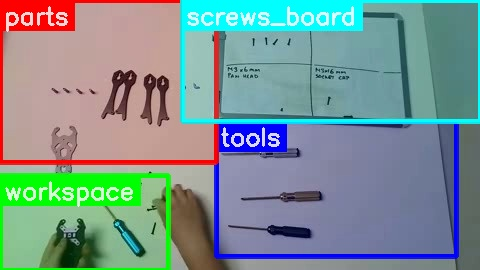  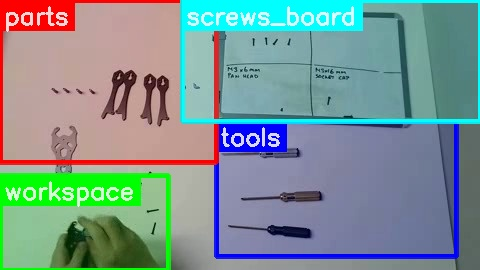  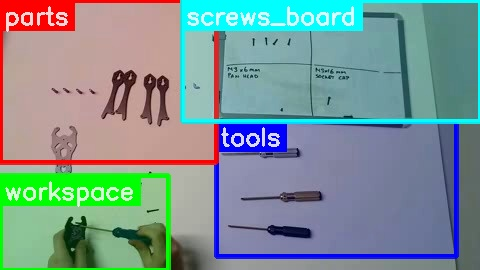  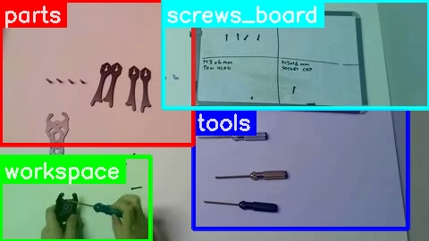    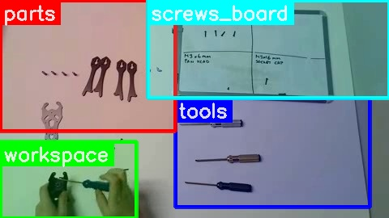

| Zone | Bbox | Objects |
|---|---|---|
| workspace | (0.00, 0.65, 0.35, 1.00) | hands, purple drone part, small blue screwdriver, small screws |
| tools | (0.45, 0.45, 0.95, 0.95) | silver screwdriver, gold screwdriver, black screwdriver |
| parts | (0.00, 0.00, 0.45, 0.60) | drone arms, drone body plate, scattered small screws |
| screws_board | (0.38, 0.00, 1.00, 0.45) | whiteboard, M3x16mm pan head screws graphic, M3x22mm pan head screws graphic, M3x6mm pan head screws graphic, M3x16mm socket cap screws graphic |

**Description**:
The assembler continues attaching the purple frame component to the grey frame base plate. They pick up and secure additional M3 x 6mm Pan Head screws, progressively tightening them into the purple component using the blue screwdriver. By the end of the segment, almost all screws required to secure the purple component are either fully tightened or in the process of being tightened.

<b>Movement</b>

*   [ACTION] 0s-0.03s | blue screwdriver | workspace | tightening an M3 x 6mm Pan Head screw into the purple frame component
*   [MOVE] 0.04s-0.05s | M3 x 6mm Pan Head screw | workspace -> workspace | picking up one small black M3 x 6mm Pan Head screw from the pile
*   [ACTION] 0.05s-0.15s | blue screwdriver, M3 x 6mm Pan Head screw | workspace | inserting and tightening an M3 x 6mm Pan Head screw into the purple frame component
*   [MOVE] 0.15s-0.16s | M3 x 6mm Pan Head screw | workspace -> workspace | picking up one small black M3 x 6mm Pan Head screw from the pile
*   [ACTION] 0.16s-0.27s | blue screwdriver, M3 x 6mm Pan Head screw | workspace | inserting and tightening an M3 x 6mm Pan Head screw into the purple frame component
*   [MOVE] 0.27s-0.28s | M3 x 6mm Pan Head screw | workspace -> workspace | picking up one small black M3 x 6mm Pan Head screw from the pile
*   [ACTION] 0.28s-0.35s | blue screwdriver, M3 x 6mm Pan Head screw | workspace | inserting and screwing in an M3 x 6mm Pan Head screw into the purple frame component

<b>Zone States</b>

*   **workspace**: Contains one grey frame base plate with the purple frame component attached by seven tightened M3 x 6mm Pan Head screws, and one M3 x 6mm Pan Head screw being screwed in. There are no remaining M3 x 6mm Pan Head screws in a pile. The blue screwdriver is in use over the assembly.
*   **tools**: The silver, gold, and black screwdrivers are present. The blue screwdriver is missing (in use).
*   **parts**: Contains one grey frame base plate and four black arm pieces.
*   **screws_board**: No screws were taken from the board in this segment.

<b>Tools & Parts Summary</b>

Tools: [TOOL: silver screwdriver @ tools], [TOOL: gold screwdriver @ tools], [TOOL: black screwdriver @ tools], [TOOL: blue screwdriver @ workspace]. Parts: [PART: grey frame base plate @ workspace], [PART: purple frame component @ workspace], [PART: grey frame base plate @ parts], [PART: black arm pieces @ parts].

**Instruction:** You are on **Step 1**: START THE ASSEMBLY BY USING THE SPUT REAR PLATE TO MOUNT THE X-LOCK FC ISOLATOR WITH THE M3x22MM AND THE M3x6MM SCREWS | Next: **Step 2**: Lock the arms by tightening the arm wedges using M3x16mm screws to lock them in place. (high: The video shows the assembler attaching the purple X-LOCK FC isolator to the rear plate using screws, which directly corresponds to Step 1 of the manual: 'START THE ASSEMBLY BY USING THE SPUT REAR PLATE TO MOUNT THE X-LOCK FC ISOLATOR WITH THE M3x22MM AND THE M3x6MM SCREWS'.)

## Segment 4 [02:00.00 - 02:30.00]

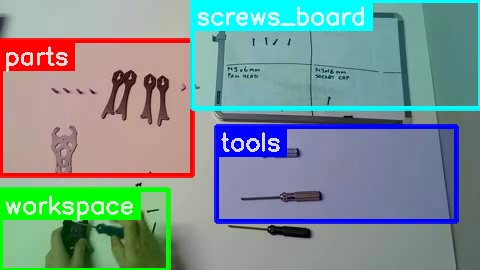    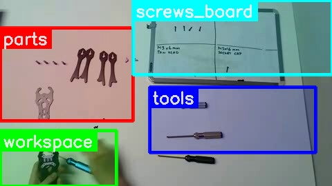  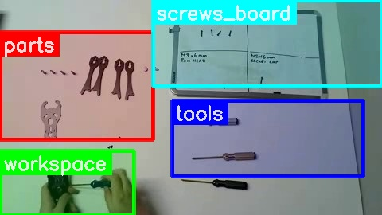  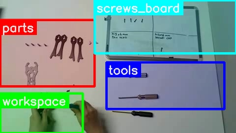  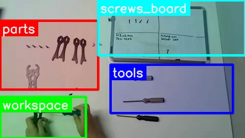

| Zone | Bbox | Objects |
|---|---|---|
| workspace | (0.00, 0.70, 0.35, 1.00) | hands, purple drone frame component, blue screwdriver, M3 x 6mm pan head screws |
| tools | (0.45, 0.47, 0.95, 0.82) | silver screwdriver, gold screwdriver, black screwdriver |
| parts | (0.00, 0.15, 0.40, 0.65) | four black drone arms, silver drone main plate, small purple standoffs |
| screws_board | (0.40, 0.00, 1.00, 0.40) | whiteboard, M3 x 16mm pan head screws, M3 x 22mm pan head screws, M3 x 6mm pan head screws, M3 x 16mm socket cap screws |

**Description**: The assembly process continues by tightening the final M3 x 6mm Pan Head screw that secures the purple frame component to the grey frame base plate. After this screw is fully tightened, one of the previously inserted M3 x 6mm Pan Head screws is repositioned and then further tightened to ensure a secure attachment.

<b>Movement</b>

*   [ACTION] 0s-10s | blue screwdriver | workspace | Tightening an M3 x 6mm Pan Head screw in the bottom-right hole of the purple frame component.
*   [MOVE] 10s-11s | blue screwdriver | workspace -> workspace | The blue screwdriver is removed from the bottom-right screw and placed briefly next to the assembly.
*   [ACTION] 11s-13s | M3 x 6mm Pan Head screw | workspace | The right hand repositions an M3 x 6mm Pan Head screw in the top-right hole of the purple frame component.
*   [MOVE] 13s-14s | blue screwdriver | workspace -> workspace | The right hand picks up the blue screwdriver from the workspace.
*   [ACTION] 14s-30s | blue screwdriver | workspace | Tightening the M3 x 6mm Pan Head screw in the top-right hole of the purple frame component.

<b>Zone States</b>

*   **workspace**: Contains one grey frame base plate with the purple frame component attached by eight M3 x 6mm Pan Head screws (one is currently being tightened). There is also a pile of M3 x 6mm Pan Head screws. The blue screwdriver is in use over the assembly.
*   **tools**: The silver screwdriver, gold screwdriver, and black screwdriver are present. The blue screwdriver is missing (in use).
*   **parts**: Contains four black arm pieces.
*   **screws_board**: No screws were taken from the board in this segment. The M3 x 6mm Pan Head section on the board still indicates 4 screws.

<b>Tools & Parts Summary</b>

Tools: [TOOL: silver screwdriver @ tools], [TOOL: gold screwdriver @ tools], [TOOL: black screwdriver @ tools], [TOOL: blue screwdriver @ workspace].
Parts: [PART: grey frame base plate @ workspace], [PART: purple frame component @ workspace], [PART: black arm pieces @ parts].

**Instruction:** You are on **Step 1**: START THE ASSEMBLY BY USING THE SPUT REAR PLATE TO MOUNT THE X-LOCK FC ISOLATOR WITH THE M3x22MM AND THE M3x6MM SCREWS (high: The video shows the person tightening screws to attach the purple frame component to the grey frame base plate, which aligns with Step 1 of the manual that describes starting the assembly by mounting the X-LOCK FC isolator to the split rear plate using M3x22mm and M3x6mm screws. The screws being used are M3x6mm Pan Head screws, as indicated in the whiteboard in the video and consistent with the manual's description for Step 1.)

## Segment 5 [02:30.00 - 03:00.00]

    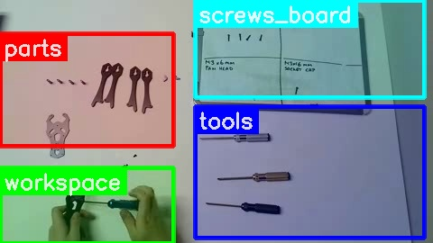  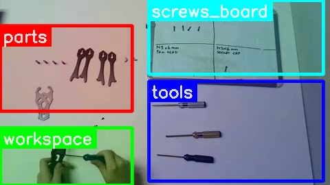    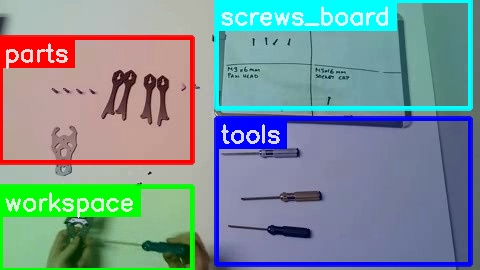

| Zone | Bbox | Objects |
|---|---|---|
| workspace | (0.00, 0.69, 0.40, 1.00) | hands, purple frame part, black frame part, screwdriver, screw |
| tools | (0.45, 0.44, 0.98, 0.98) | screwdriver with silver handle, screwdriver with gold handle, screwdriver with black handle |
| parts | (0.00, 0.14, 0.40, 0.60) | black frame arms, silver frame component, small nuts/standoffs |
| screws_board | (0.45, 0.00, 0.98, 0.40) | whiteboard, M3x16mm pan head screws, M3x22mm pan head screws, M3x6mm pan head screws, M3x16mm socket cap screws |

**Description**:
The person finishes attaching the purple frame component to the grey frame base plate by fully tightening the eighth and final M3 x 6mm Pan Head screw. After securing the component, the assembly is briefly rotated to check the overall fit. The person then uses the blue screwdriver to re-check the tightness of several already installed M3 x 6mm Pan Head screws on the purple component.

<b>Movement</b>

*   [ACTION] 0s-25s | blue screwdriver | workspace | Tightening the last M3 x 6mm Pan Head screw on the purple frame component, securing it to the grey frame base plate.
*   [MOVE] 25s-27s | assembled grey plate and purple component | workspace -> workspace | Rotating the assembled piece slightly to inspect it.
*   [ACTION] 28s-30s | blue screwdriver | workspace | Re-checking the tightness of existing M3 x 6mm Pan Head screws on the purple frame component.

<b>Zone States</b>

*   **workspace**: Contains one grey frame base plate with the purple frame component securely attached by eight M3 x 6mm Pan Head screws. A small pile of M3 x 6mm Pan Head screws remains on the surface. The blue screwdriver is in the hands, over the assembly.
*   **tools**: The silver screwdriver, gold screwdriver, and black screwdriver are present. The blue screwdriver is missing (in use).
*   **parts**: Contains four black arm pieces and one un-used grey frame base plate.
*   **screws_board**: The M3 x 6mm Pan Head section on the board still indicates 4 screws, as no screws were taken from the board in this segment. All other sections also remain unchanged.

<b>Tools & Parts Summary</b>

Tools: [blue screwdriver @ workspace], [silver screwdriver @ tools], [gold screwdriver @ tools], [black screwdriver @ tools].
Parts: [four black arm pieces @ parts], [one grey frame base plate @ parts].

**Instruction:** You are on **Step 1**: START THE ASSEMBLY BY USING THE SPUT REAR PLATE TO MOUNT THE X-LOCK FC ISOLATOR WITH THE M3x22MM AND THE M3x6MM SCREWS | Next: **Step 2**: Lock the arms by tightening the arm wedges using M3x16mm screws to lock them in place. (high: The video shows the person attaching the purple X-LOCK FC isolator to the split rear plate using screws, which directly corresponds to Step 1 of the manual. The text context also mentions tightening the M3 x 6mm Pan Head screws on the purple component, which is part of securing the isolator.)

## Segment 6 [03:00.00 - 03:30.00]

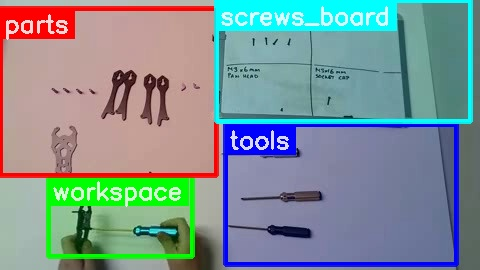  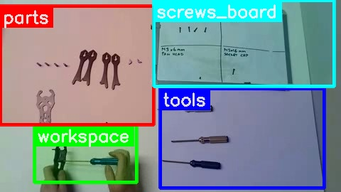  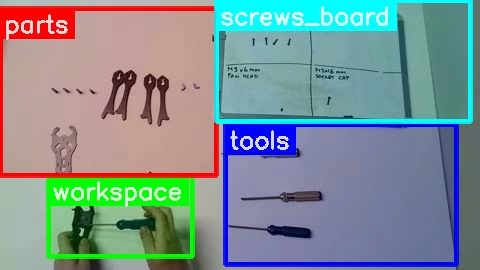    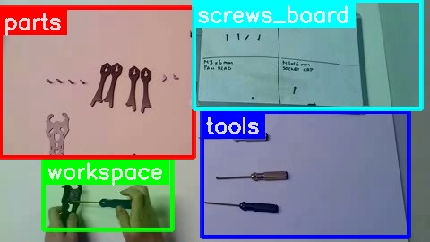  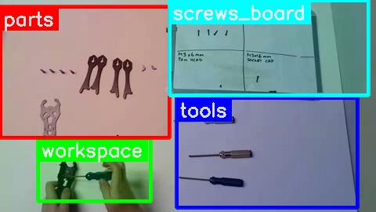

| Zone | Bbox | Objects |
|---|---|---|
| workspace | (0.10, 0.65, 0.40, 0.95) | hands, black frame part, blue screwdriver, small screws |
| tools | (0.47, 0.46, 0.95, 0.98) | silver screwdriver, gold screwdriver, black/green screwdriver |
| parts | (0.00, 0.03, 0.45, 0.65) | four black frame arms, one silver frame plate, small piles of screws |
| screws_board | (0.45, 0.00, 0.98, 0.45) | whiteboard, M3 x 16mm pan head screws, M3 x 22mm pan head screws, M3 x 6mm pan head screws, M3 x 16mm socket cap screws |

**Description**: The user continues the assembly of the drone frame. Initially, a previously placed M3 x 6mm Pan Head screw, which attaches the purple frame component to the grey base plate, is given a final tightening with the blue screwdriver. Subsequently, two more M3 x 6mm Pan Head screws are taken from a pile on the workspace and fastened into remaining holes on the frame. A third screw is picked up and is in the process of being positioned as the segment ends.

<b>Movement</b>

[ACTION] ~0s-~4s | blue screwdriver | workspace | Tightening an M3 x 6mm Pan Head screw already securing the purple frame component to the grey base plate.
[MOVE] ~4s-~5s | hands | workspace -> pile of screws | Move hands to pick up a screw from the pile of M3 x 6mm Pan Head screws.
[MOVE] ~5s-~6s | M3 x 6mm Pan Head screw | pile of screws -> blue screwdriver tip | Pick up one M3 x 6mm Pan Head screw with the tip of the blue screwdriver.
[MOVE] ~6s-~7s | M3 x 6mm Pan Head screw | blue screwdriver tip -> workspace | Position the screw into an empty screw hole on the purple frame component.
[ACTION] ~7s-~15s | blue screwdriver | workspace | Fasten the M3 x 6mm Pan Head screw into the purple frame component and grey base plate.
[IDLE] ~15s-~17s | workspace | Hands briefly pause over the assembly.
[MOVE] ~17s-~18s | hands | workspace -> pile of screws | Move hands to pick up another screw from the pile of M3 x 6mm Pan Head screws.
[MOVE] ~18s-~19s | M3 x 6mm Pan Head screw | pile of screws -> blue screwdriver tip | Pick up one M3 x 6mm Pan Head screw with the tip of the blue screwdriver.
[MOVE] ~19s-~19s | M3 x 6mm Pan Head screw | blue screwdriver tip -> workspace | Position the screw into another empty screw hole on the purple frame component.
[ACTION] ~19s-~28s | blue screwdriver | workspace | Fasten the M3 x 6mm Pan Head screw into the purple frame component and grey base plate.
[MOVE] ~28s-~29s | hands | workspace -> pile of screws | Move hands to pick up a third screw from the pile of M3 x 6mm Pan Head screws.
[MOVE] ~29s-~30s | M3 x 6mm Pan Head screw | pile of screws -> blue screwdriver tip | Pick up one M3 x 6mm Pan Head screw with the tip of the blue screwdriver, holding it at the end of the clip.

<b>Zone States</b>

- **workspace**: Contains one grey frame base plate with the purple frame component further attached by multiple M3 x 6mm Pan Head screws (at least two more fastened in this segment, and one being prepared for insertion). A small pile of M3 x 6mm Pan Head screws remains on the surface. The blue screwdriver is in the hands, holding a screw above the assembly.
- **tools**: The silver screwdriver, gold screwdriver, and black screwdriver are present. The blue screwdriver is missing (in use).
- **parts**: Contains four black arm pieces and one un-used grey frame base plate.
- **screws_board**: The M3 x 6mm Pan Head section on the board still indicates 4 screws, as no screws were taken from the board. All other sections also remain unchanged.

<b>Tools & Parts Summary</b>

Tools: [TOOL: silver screwdriver @ tools], [TOOL: gold screwdriver @ tools], [TOOL: black screwdriver @ tools], [TOOL: blue screwdriver @ workspace].
Parts: [PART: four black arm pieces @ parts], [PART: one un-used grey frame base plate @ parts], [PART: grey frame base plate (assembled) @ workspace], [PART: purple frame component (assembled) @ workspace].

**Instruction:** You are on **Step 2**: Lock the arms by tightening the arm wedges using M3x16mm screws to lock them in place. (high: The video shows the user tightening screws on the arm wedges, which corresponds to Step 2 of the manual: 'Lock the arms by tightening the arm wedges using M3x16mm screws to lock them in place.')

## Segment 7 [03:30.00 - 04:00.00]

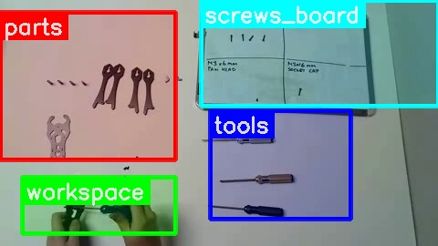  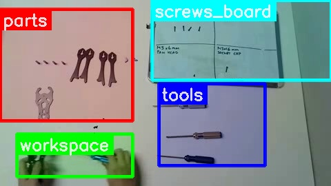  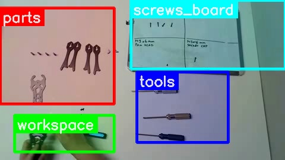  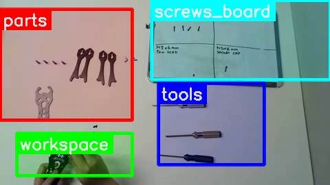  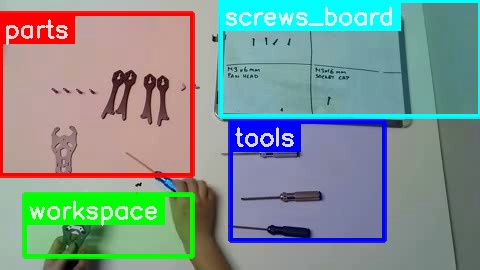  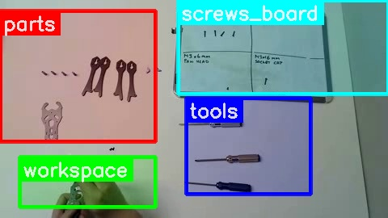

| Zone | Bbox | Objects |
|---|---|---|
| workspace | (0.05, 0.72, 0.40, 0.95) | partially assembled drone frame, blue screwdriver, human hands |
| tools | (0.48, 0.45, 0.80, 0.89) | silver screwdriver, gold screwdriver, black screwdriver |
| parts | (0.00, 0.05, 0.40, 0.65) | four drone arms, drone main plate, small purple standoffs, small black screws |
| screws_board | (0.46, 0.00, 1.00, 0.43) | whiteboard, M3 x 16mm pan head screws diagram, M3 x 22mm pan head screws diagram, M3 x 6mm pan head screws diagram, M3 x 16mm socket cap screws diagram |

**Description**:
In this segment, the assembly of the grey frame base plate and purple frame component continues. The person fastens three more M3 x 6mm Pan Head screws into the purple component using the blue screwdriver. This action further secures the purple component to the grey base plate, bringing the total number of fastened screws to five.

<b>Movement</b>

- [ACTION] 0s-6s | blue screwdriver | workspace | Tightening an M3 x 6mm Pan Head screw into the purple frame component.
- [MOVE] 6s-7s | blue screwdriver | workspace -> workspace | Lifts the screwdriver from the tightened screw.
- [MOVE] 7s-10s | M3 x 6mm Pan Head screw | workspace -> hands | Right hand picks up an M3 x 6mm Pan Head screw from the small pile on the workspace.
- [MOVE] 10s-11s | M3 x 6mm Pan Head screw | hands -> workspace | Right hand places the screw into a designated hole on the purple frame component.
- [MOVE] 11s-13s | blue screwdriver | workspace -> hands | Right hand picks up the blue screwdriver.
- [ACTION] 13s-18s | blue screwdriver | workspace | Tightening the M3 x 6mm Pan Head screw into the purple frame component.
- [MOVE] 18s-19s | blue screwdriver | workspace -> workspace | Lifts the screwdriver from the tightened screw.
- [MOVE] 20s-23s | M3 x 6mm Pan Head screw | workspace -> hands | Right hand picks up another M3 x 6mm Pan Head screw from the pile.
- [MOVE] 23s-25s | M3 x 6mm Pan Head screw | hands -> workspace | Right hand places the screw into a hole on the purple frame component.
- [MOVE] 25s-26s | blue screwdriver | workspace -> hands | Right hand picks up the blue screwdriver.
- [ACTION] 26s-28s | blue screwdriver | workspace | Tightening the M3 x 6mm Pan Head screw into the purple frame component.
- [MOVE] 28s-30s | blue screwdriver | workspace -> workspace | Lifts the screwdriver from the tightened screw and places it down next to the assembly.
- [IDLE] 0s-30s | silver screwdriver, gold screwdriver, black screwdriver | tools | nothing happening
- [IDLE] 0s-30s | four black arm pieces, one un-used grey frame base plate | parts | nothing happening
- [IDLE] 0s-30s | screws_board | screws_board | nothing happening

<b>Zone States</b>

- **workspace**: Contains one grey frame base plate with the purple frame component firmly attached by five M3 x 6mm Pan Head screws. A smaller pile of M3 x 6mm Pan Head screws remains on the surface. The blue screwdriver is resting on the workspace next to the assembled components.
- **tools**: The silver screwdriver, gold screwdriver, and black screwdriver are present. The blue screwdriver is present.
- **parts**: Contains four black arm pieces and one un-used grey frame base plate.
- **screws_board**: The M3 x 6mm Pan Head section on the board still indicates 4 screws. All other sections (M3 x 16mm Pan Head, M3 x 22mm Pan Head, M3 x 16mm Socket Cap) also remain unchanged from the beginning of the video.

<b>Tools & Parts Summary</b>

Tools: [TOOL: silver screwdriver @ tools], [TOOL: gold screwdriver @ tools], [TOOL: black screwdriver @ tools], [TOOL: blue screwdriver @ workspace]. Parts: [PART: four black arm pieces @ parts], [PART: one un-used grey frame base plate @ parts], [PART: one grey frame base plate with purple component attached by five M3 x 6mm Pan Head screws @ workspace], [PART: M3 x 6mm Pan Head screws (pile) @ workspace].

**Instruction:** You are on **Step 1**: START THE ASSEMBLY BY USING THE SPUT REAR PLATE TO MOUNT THE X-LOCK FC ISOLATOR WITH THE M3x22MM AND THE M3x6MM SCREWS | Next: **Step 2**: Lock the arms by tightening the arm wedges using M3x16mm screws to lock them in place. (high: The video shows the person attaching the purple X-LOCK FC isolator to the grey split rear plate using M3x6mm screws, which directly corresponds to the latter part of Step 1 in the manual. The manual specifies using M3x22mm and M3x6mm screws for this step, and the video shows the use of M3x6mm screws to secure the purple component to the grey plate.)

## Segment 8 [04:00.00 - 04:30.00]

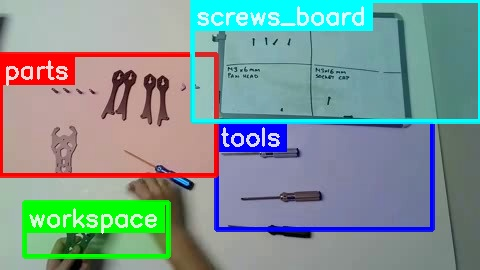  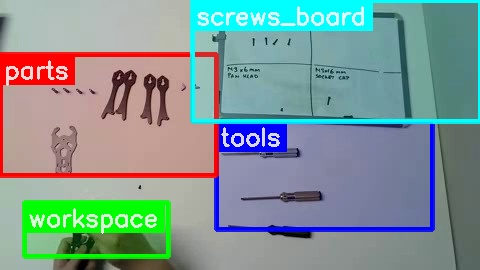  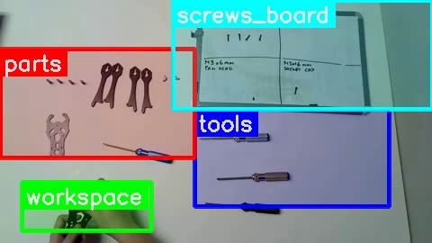  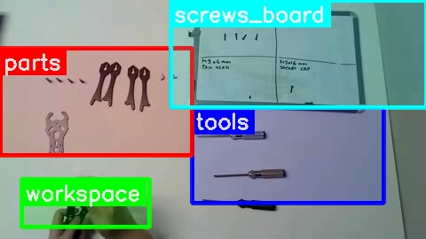  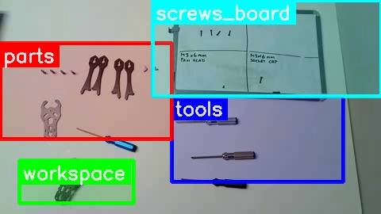  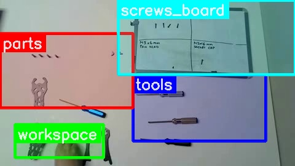

| Zone | Bbox | Objects |
|---|---|---|
| workspace | (0.05, 0.75, 0.35, 0.95) | hands, drone bottom frame component, screwdriver, screw |
| tools | (0.45, 0.45, 0.90, 0.85) | silver screwdriver, gold screwdriver, black screwdriver |
| parts | (0.00, 0.20, 0.45, 0.65) | 4 drone arms, drone top frame component, small standoffs/nuts |
| screws_board | (0.40, 0.00, 1.00, 0.45) | whiteboard, M3 x 16mm pan head screws, M3 x 22mm pan head screws, M3 x 6mm pan head screws, M3 x 16mm socket cap screws |

**Description**:
In this segment, the assembler systematically attaches four black arm pieces to the main frame assembly. Each arm is secured using one M3 x 6mm Pan Head screw, which is picked from a small pile on the workspace and fastened with the blue screwdriver. By the end of the clip, three arm pieces have been fully attached, and the fourth arm piece is in the process of being secured to the frame.

<b>Movement</b>

*   [MOVE] 0s-2s | assembled frame component | workspace -> workspace | Adjusting position of the grey frame base plate with the purple component.
*   [MOVE] 2s-3s | blue screwdriver | workspace -> workspace | Right hand picks up the blue screwdriver.
*   [MOVE] 2s-3s | black arm piece | parts -> workspace | Left hand picks up a black arm piece.
*   [ACTION] 3s-4s | assembled frame component | workspace | Left hand positions the black arm piece against the assembled frame component.
*   [MOVE] 4s-5s | M3 x 6mm Pan Head screw | workspace -> blue screwdriver | Right hand uses the blue screwdriver to pick up an M3 x 6mm Pan Head screw from the pile.
*   [ACTION] 5s-9s | M3 x 6mm Pan Head screw | workspace | Right hand uses the blue screwdriver to screw the black arm piece onto the assembled frame component.
*   [MOVE] 9s-10s | blue screwdriver | workspace -> workspace | Right hand puts down the blue screwdriver.
*   [MOVE] 11s-12s | black arm piece | parts -> workspace | Left hand picks up a second black arm piece.
*   [ACTION] 12s-13s | assembled frame component | workspace | Left hand positions the second black arm piece against the assembled frame component.
*   [MOVE] 13s-14s | blue screwdriver | workspace -> workspace | Right hand picks up the blue screwdriver.
*   [MOVE] 14s-16s | M3 x 6mm Pan Head screw | workspace -> blue screwdriver | Right hand uses the blue screwdriver to pick up an M3 x 6mm Pan Head screw from the pile.
*   [ACTION] 16s-19s | M3 x 6mm Pan Head screw | workspace | Right hand uses the blue screwdriver to screw the second black arm piece onto the assembled frame component.
*   [MOVE] 19s-20s | blue screwdriver | workspace -> workspace | Right hand puts down the blue screwdriver.
*   [MOVE] 20s-21s | black arm piece | parts -> workspace | Left hand picks up a third black arm piece.
*   [ACTION] 21s-22s | assembled frame component | workspace | Left hand positions the third black arm piece against the assembled frame component.
*   [MOVE] 22s-23s | blue screwdriver | workspace -> workspace | Right hand picks up the blue screwdriver.
*   [MOVE] 23s-24s | M3 x 6mm Pan Head screw | workspace -> blue screwdriver | Right hand uses the blue screwdriver to pick up an M3 x 6mm Pan Head screw from the pile.
*   [ACTION] 24s-28s | M3 x 6mm Pan Head screw | workspace | Right hand uses the blue screwdriver to screw the third black arm piece onto the assembled frame component.
*   [MOVE] 28s-29s | blue screwdriver | workspace -> workspace | Right hand puts down the blue screwdriver.
*   [MOVE] 28s-29s | black arm piece | parts -> workspace | Left hand picks up the fourth black arm piece.
*   [ACTION] 29s-30s | assembled frame component | workspace | Left hand positions the fourth black arm piece against the assembled frame component.
*   [MOVE] 29s-30s | blue screwdriver | workspace -> blue screwdriver | Right hand picks up the blue screwdriver.
*   [MOVE] 30s-30s | M3 x 6mm Pan Head screw | workspace -> blue screwdriver | Right hand uses the blue screwdriver to pick up an M3 x 6mm Pan Head screw from the pile.

<b>Zone States</b>

*   **workspace**: Contains one grey frame base plate with the purple frame component firmly attached. Three black arm pieces are now attached to this assembly. One fourth black arm piece is being held in position by the left hand. The blue screwdriver is holding an M3 x 6mm Pan Head screw, ready to screw it in. The small pile of M3 x 6mm Pan Head screws is now empty.
*   **tools**: The silver screwdriver, gold screwdriver, and black screwdriver are present.
*   **parts**: Contains one un-used grey frame base plate.
*   **screws_board**: The M3 x 16mm Pan Head section on the board still indicates 4 screws. The M3 x 22mm Pan Head section still indicates 2 screws. The M3 x 6mm Pan Head section still indicates 4 screws. The M3 x 16mm Socket Cap section still indicates 2 screws.

<b>Tools & Parts Summary</b>

Tools: [TOOL: blue screwdriver @ workspace (in use)], [TOOL: silver screwdriver @ tools], [TOOL: gold screwdriver @ tools], [TOOL: black screwdriver @ tools].
Parts: [PART: grey frame base plate (unassembled) @ parts], [PART: assembled frame (grey base plate + purple component + 3 black arms) @ workspace], [PART: black arm piece (being attached) @ workspace].

**Instruction:** You are on **Step 2**: Lock the arms by tightening the arm wedges using M3x16mm screws to lock them in place. (high: The video shows the assembler attaching the arms to the main frame using screws, which directly corresponds to Step 2 of the manual: 'Lock the arms by tightening the arm wedges using M3x16mm screws to lock them in place.' The video description also mentions attaching the black arm pieces to the main frame assembly.)

## Segment 9 [04:30.00 - 05:00.00]

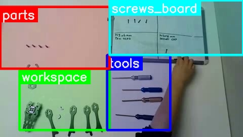  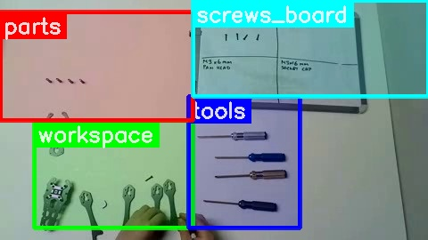  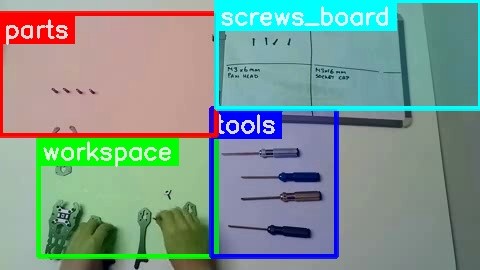  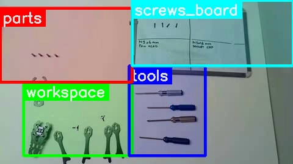    

| Zone | Bbox | Objects |
|---|---|---|
| workspace | (0.08, 0.50, 0.45, 0.95) | hands, drone frame parts (purple), drone arms (black), screws, screwdriver (blue) |
| tools | (0.44, 0.40, 0.70, 0.95) | screwdriver (silver), screwdriver (blue), screwdriver (gold), screwdriver (black/yellow) |
| parts | (0.00, 0.05, 0.45, 0.50) | silver drone frame top plate, black drone arms |
| screws_board | (0.45, 0.00, 1.00, 0.40) | whiteboard, screws (represented on board), text (M3 x 16mm Pan Head, M3 x 22mm Pan Head, M3 x 6mm Pan Head, M3 x 16mm Socket Cap) |

**Description**: In this segment, the person completes the assembly of the drone frame by attaching the fourth black arm piece using an M3 x 6mm Pan Head screw and the blue screwdriver. After securing the arm, the person introduces a small pile of purple screws and purple frame standoffs to the workspace. The top grey frame base plate is then placed onto the assembled frame, and a purple screw is picked up, ready for the next fastening step.

<b>Movement</b>

*   [MOVE] 0s-1s | right hand | workspace -> screws_board | Right hand points to the "M3 x 6mm Pan Head" section on the screws_board.
*   [MOVE] 1s-3s | one M3 x 6mm Pan Head screw | workspace -> right hand | Right hand picks up one black M3 x 6mm Pan Head screw from the pile in the workspace.
*   [MOVE] 3s-4s | M3 x 6mm Pan Head screw | right hand -> left hand | Right hand transfers the M3 x 6mm Pan Head screw to the left hand, which is holding a black arm piece.
*   [MOVE] 4s-6s | blue screwdriver | tools -> right hand | Right hand picks up the blue screwdriver from the tools zone.
*   [ACTION] 6s-8s | M3 x 6mm Pan Head screw | workspace | Right hand uses the blue screwdriver to pick up the M3 x 6mm Pan Head screw from the left hand in the workspace.
*   [MOVE] 8s-10s | black arm piece | workspace -> workspace | Left hand positions the black arm piece against the main assembly (grey frame base plate with purple component and three other arms) in the workspace.
*   [ACTION] 10s-16s | M3 x 6mm Pan Head screw | workspace | Right hand uses the blue screwdriver to screw the M3 x 6mm Pan Head screw into the fourth black arm piece, attaching it to the main assembly.
*   [MOVE] 16s-19s | blue screwdriver | workspace -> tools | Right hand places the blue screwdriver back in the tools zone.
*   [MOVE] 19s-21s | right hand | workspace -> screws_board | Right hand points to the "M3 x 6mm Pan Head" section on the screws_board again.
*   [MOVE] 21s-22s | four purple screws | off-screen -> workspace | Right hand places four small purple screws onto the workspace, forming a small pile near the black arm pieces.
*   [MOVE] 22s-23s | three purple frame standoffs | off-screen -> workspace | Right hand places three purple frame standoffs onto the workspace, near the purple screws.
*   [MOVE] 23s-24s | one grey frame base plate | parts -> right hand | Right hand picks up the un-used grey frame base plate from the parts zone.
*   [MOVE] 24s-26s | one grey frame base plate | right hand -> workspace | Right hand places the grey frame base plate on top of the assembled drone frame in the workspace.
*   [MOVE] 26s-29s | one purple screw | workspace -> right hand | Right hand picks up one purple screw from the small pile of purple screws in the workspace.
*   [MOVE] 29s-30s | right hand | workspace -> tools | Right hand moves towards the blue screwdriver in the tools zone, holding the purple screw.

<b>Zone States</b>

*   **workspace**: Contains one assembled drone frame (grey frame base plate with a purple frame component and all four black arm pieces attached, topped with another grey frame base plate). There is a pile of three black M3 x 6mm Pan Head screws, a pile of three purple screws, and three purple frame standoffs. The right hand is holding one purple screw.
*   **tools**: The silver screwdriver, blue screwdriver, gold screwdriver, and black screwdriver are present.
*   **parts**: The zone is now empty.
*   **screws_board**: The M3 x 16mm Pan Head section still indicates 4 screws. The M3 x 22mm Pan Head section still indicates 2 screws. The M3 x 6mm Pan Head section still indicates 4 screws. The M3 x 16mm Socket Cap section still indicates 2 screws.

<b>Tools & Parts Summary</b>

Tools: [blue screwdriver @ tools], [silver screwdriver @ tools], [gold screwdriver @ tools], [black screwdriver @ tools].
Parts: [grey frame base plate with purple frame component @ workspace (assembled)], [four black arm pieces @ workspace (assembled)], [one grey frame base plate @ workspace (assembled)], [three M3 x 6mm Pan Head screws @ workspace], [three purple screws @ workspace], [one purple screw @ right hand], [three purple frame standoffs @ workspace].

**Instruction:** You are on **Step 2**: Lock the arms by tightening the arm wedges using M3x16mm screws to lock them in place. | Next: **Step 3**: ADD THE SPLIT FRONT PLATE TO THE ASSEMBLY AND USE THE M3X6MM IN THE MIDDLE TO SECURE IT (high: The video shows the person attaching the last arm to the frame using a screw, which corresponds to step 2 of the manual, 'Lock the arms by tightening the arm wedges using M3x16mm screws to lock them in place.' The text description also mentions 'completes the assembly of the drone frame by attaching the fourth black arm piece using an M3 x 6mm Pan Head screw and the blue screwdriver.' The next action of introducing purple screws and standoffs and placing the top plate suggests preparation for step 3.)

## Segment 10 [05:00.00 - 05:30.00]

          

| Zone | Bbox | Objects |
|---|---|---|
| workspace | (0.07, 0.70, 0.25, 0.98) | hands, partially assembled drone frame, blue hex driver |
| tools | (0.45, 0.48, 0.95, 0.90) | silver hex driver, gold hex driver, black hex driver |
| parts | (0.00, 0.05, 0.45, 0.88) | silver frame plate, loose M3 screws, black frame arms, purple standoffs |
| screws_board | (0.45, 0.05, 0.95, 0.45) | whiteboard, screw diagrams, screw type labels |

**Description**:
This segment starts with the final tightening of a purple screw on the already assembled drone frame. A second grey frame base plate, which was previously on the parts zone, is then precisely aligned and placed onto the main frame. Following this, a black M3 x 6mm Pan Head screw is picked from a small pile and inserted into the frame, with the blue screwdriver used to begin tightening it.

<b>Movement</b>

*   [ACTION] 0:00-0:02 | blue screwdriver, purple screw | workspace | The blue screwdriver is used to tighten a purple screw on the assembled drone frame.
*   [MOVE] 0:02-0:03 | blue screwdriver | workspace -> tools | The blue screwdriver is placed back in the tools zone.
*   [MOVE] 0:03-0:06 | grey frame piece | parts -> workspace | The right hand picks up a grey frame piece from the parts zone and places it onto the drone frame in the workspace.
*   [ACTION] 0:06-0:14 | drone frame, grey frame piece | workspace | Both hands adjust and align the grey frame piece on the drone frame.
*   [MOVE] 0:14-0:15 | black M3 x 6mm Pan Head screw | workspace -> workspace | The right hand picks up one black M3 x 6mm Pan Head screw from the pile and moves it to a hole on the drone frame.
*   [ACTION] 0:15-0:18 | black M3 x 6mm Pan Head screw | workspace | The right hand places the black M3 x 6mm Pan Head screw into the drone frame. Both hands adjust the frame and screw.
*   [MOVE] 0:18-0:20 | blue screwdriver | tools -> workspace | The right hand picks up the blue screwdriver from the tools zone.
*   [ACTION] 0:20-0:30 | blue screwdriver, black M3 x 6mm Pan Head screw | workspace | The blue screwdriver is used to tighten the black M3 x 6mm Pan Head screw on the drone frame.

<b>Zone States</b>

*   **workspace**: Contains one assembled drone frame (bottom grey frame base plate, purple frame component, four black arm pieces, and a top grey frame base plate, with all four purple screws and one black M3 x 6mm Pan Head screw installed). There is a pile of two black M3 x 6mm Pan Head screws, a pile of three purple screws, and three purple frame standoffs. The right hand is holding the blue screwdriver and tightening a screw on the drone frame. The left hand is holding the drone frame.
*   **tools**: The silver screwdriver, gold screwdriver, and black screwdriver are present. The blue screwdriver is being used.
*   **parts**: The zone is now empty.
*   **screws_board**: The M3 x 16mm Pan Head section indicates 4 screws. The M3 x 22mm Pan Head section indicates 2 screws. The M3 x 6mm Pan Head section indicates 3 screws. The M3 x 16mm Socket Cap section indicates 2 screws.

<b>Tools & Parts Summary</b>

Tools: [TOOL: silver screwdriver @ tools], [TOOL: blue screwdriver @ workspace], [TOOL: gold screwdriver @ tools], [TOOL: black screwdriver @ tools]. Parts: [PART: drone frame @ workspace], [PART: black M3 x 6mm Pan Head screw @ workspace], [PART: purple screw @ workspace], [PART: purple frame standoff @ workspace].

**Instruction:** You are on **Step 2**: Lock the arms by tightening the arm wedges using M3x16mm screws to lock them in place. | Next: **Step 3**: ADD THE SPLIT FRONT PLATE TO THE ASSEMBLY AND USE THE M3X6MM IN THE MIDDLE TO SECURE IT (high: The video shows the person tightening a screw on the arm, which aligns with Step 2's instruction to 'Lock the arms by tightening the arm wedges using M3x16mm screws to lock them in place.' The subsequent action of placing the second grey frame base plate and inserting a screw for tightening matches the beginning of Step 3, which is to 'ADD THE SPLIT FRONT PLATE TO THE ASSEMBLY AND USE THE M3X6MM IN THE MIDDLE TO SECURE IT.')

## Segment 11 [05:30.00 - 06:00.00]

          

| Zone | Bbox | Objects |
|---|---|---|
| workspace | (0.08, 0.45, 0.45, 0.80) | drone frame, screwdriver, hands |
| tools | (0.45, 0.40, 0.65, 0.90) | three screwdrivers |
| parts | (0.00, 0.10, 0.40, 0.90) | drone frame components (main plate, arms), purple standoffs, loose screws |
| screws_board | (0.45, 0.00, 0.95, 0.38) | whiteboard with screw descriptions and drawings |

**Description**:
The person continues to assemble the drone frame by first finishing the tightening of one of the purple screws using a blue Phillips head screwdriver. After placing the blue screwdriver aside, they pick up a gold hex driver and proceed to install a black M3 x 6mm Pan Head screw into the center of the drone frame. At the very end of the clip, they pick up a black hex driver, possibly to install another screw.

<b>Movement</b>

*   [ACTION] 0s-11s | blue screwdriver | workspace | tightening a purple screw on the drone frame.
*   [MOVE] 11s-14s | blue screwdriver | workspace -> tools | places the blue screwdriver next to the gold screwdriver.
*   [MOVE] 14s-16s | gold screwdriver | tools -> workspace | picks up the gold screwdriver.
*   [MOVE] 18s-19s | black M3 x 6mm Pan Head screw | workspace -> workspace | right hand picks up one screw from the pile of two screws.
*   [ACTION] 19s-28s | gold screwdriver | workspace | installs and tightens a black M3 x 6mm Pan Head screw into the drone frame.
*   [MOVE] 28s-29s | gold screwdriver | workspace -> tools | places the gold screwdriver back on the table.
*   [MOVE] 29s-30s | black screwdriver | tools -> workspace | picks up the black screwdriver.

<b>Zone States</b>

*   **workspace**: Contains one assembled drone frame (bottom grey frame base plate, purple frame component, four black arm pieces, and a top grey frame base plate, with all four purple screws and two black M3 x 6mm Pan Head screws installed). There is a pile of one black M3 x 6mm Pan Head screw, a pile of three purple screws, and three purple frame standoffs. The right hand is holding the black screwdriver. The left hand is holding the drone frame.
*   **tools**: The silver screwdriver, blue screwdriver, and gold screwdriver are present. The black screwdriver is being used/held.
*   **parts**: The zone is now empty.
*   **screws_board**: The M3 x 16mm Pan Head section indicates 4 screws. The M3 x 22mm Pan Head section indicates 2 screws. The M3 x 6mm Pan Head section indicates 4 screws. The M3 x 16mm Socket Cap section indicates 2 screws.

<b>Tools & Parts Summary</b>

Tools: [TOOL: silver screwdriver @ tools], [TOOL: gold screwdriver @ tools], [TOOL: black screwdriver @ workspace], [TOOL: blue screwdriver @ tools].
Parts: [PART: drone frame @ workspace], [PART: black M3 x 6mm Pan Head screw @ workspace (1 remaining in pile)], [PART: purple screw @ workspace (3 remaining in pile)], [PART: purple frame standoff @ workspace (3 remaining in pile)].

**Instruction:** You are on **Step 2**: Lock the arms by tightening the arm wedges using M3x16mm screws to lock them in place. (high: The video shows the person tightening screws on the arms of the drone frame, which aligns with Step 2 of the manual: 'Lock the arms by tightening the arm wedges using M3x16mm screws to lock them in place.' The purple screws and the black M3x6mm screw being installed are consistent with the assembly of the arms and wedges.)

## Segment 12 [06:00.00 - 06:30.00]

          

| Zone | Bbox | Objects |
|---|---|---|
| workspace | (0.05, 0.55, 0.45, 0.98) | partially assembled drone frame, screwdriver being used, human hands |
| tools | (0.45, 0.50, 0.90, 0.75) | four different screwdrivers |
| parts | (0.03, 0.05, 0.45, 0.90) | loose small screws, drone frame top plate, loose black arms, purple standoffs |
| screws_board | (0.45, 0.00, 1.00, 0.48) | whiteboard with screw descriptions and drawings |

**Description**:
In this segment, the assembler continues to build the drone frame. The fourth purple M3 x 16mm Pan Head screw is fully tightened into the frame. Following this, a black M3 x 6mm Pan Head screw is picked up from the workspace and screwed into the drone frame, further securing the components.

<b>Movement</b>

*   **[ACTION] 0s-3s**: right hand | workspace | Tightening the fourth purple M3 x 16mm Pan Head screw into the drone frame using the black screwdriver.
*   **[MOVE] 3s-4s**: black screwdriver | workspace -> workspace | Moving the black screwdriver away from the drone frame after tightening the purple screw.
*   **[MOVE] 4s-7s**: black screwdriver | workspace -> tools | Placing the black screwdriver onto the tools zone.
*   **[MOVE] 8s-10s**: left hand | workspace -> workspace | Rotating the partially assembled drone frame.
*   **[MOVE] 10s-11s**: right hand | workspace -> workspace | Picking up one black M3 x 6mm Pan Head screw from a pile.
*   **[MOVE] 11s-15s**: right hand | workspace -> workspace | Positioning the black M3 x 6mm Pan Head screw into an empty hole on the drone frame.
*   **[MOVE] 18s-20s**: right hand | tools -> workspace | Picking up the black screwdriver from the tools zone.
*   **[ACTION] 20s-29s**: right hand | workspace | Screwing in the black M3 x 6mm Pan Head screw into the drone frame using the black screwdriver.
*   **[MOVE] 29s-30s**: black screwdriver | workspace -> workspace | Moving the black screwdriver away from the drone frame after tightening the black screw.

<b>Zone States</b>

*   **workspace**: Contains one assembled drone frame (bottom grey frame base plate, purple frame component, four black arm pieces, and a top grey frame base plate, with all four purple M3 x 16mm Pan Head screws installed and three black M3 x 6mm Pan Head screws installed). There is a pile of two purple M3 x 16mm Pan Head screws and three purple frame standoffs. The right hand is holding the black screwdriver. The left hand is holding the drone frame.
*   **tools**: The silver screwdriver, blue screwdriver, and gold screwdriver are present. The black screwdriver is being used/held.
*   **parts**: Contains the grey top frame plate and the grey bottom frame plate.
*   **screws_board**: The M3 x 16mm Pan Head section indicates 3 screws. The M3 x 22mm Pan Head section indicates 2 screws. The M3 x 6mm Pan Head section indicates 3 screws. The M3 x 16mm Socket Cap section indicates 2 screws.

<b>Tools & Parts Summary</b>

Tools: [SCREWDRIVER: silver @ tools], [SCREWDRIVER: blue @ tools], [SCREWDRIVER: gold @ tools], [SCREWDRIVER: black @ workspace (held)]. Parts: [DRONE FRAME: assembled @ workspace (held)], [FRAME COMPONENT: grey top plate @ parts], [FRAME COMPONENT: grey bottom plate @ parts], [STANDOFFS: purple @ workspace].

**Instruction:** You are on **Step 2**: Lock the arms by tightening the arm wedges using M3x16mm screws to lock them in place. | Next: **Step 3**: ADD THE SPLIT FRONT PLATE TO THE ASSEMBLY AND USE THE M3X6MM IN THE MIDDLE TO SECURE IT (high: The video shows the assembler tightening the last of the M3x16mm screws to secure the arms, which directly corresponds to Step 2 of the manual. The text description also mentions tightening the fourth purple M3 x 16mm Pan Head screw, which is consistent with securing the arms.)

## Segment 13 [06:30.00 - 07:00.00]

          

| Zone | Bbox | Objects |
|---|---|---|
| workspace | (0.00, 0.45, 0.45, 1.00) | partially assembled drone frame, hands, screwdriver, screw |
| tools | (0.45, 0.48, 0.95, 0.98) | silver screwdriver, blue screwdriver, gold screwdriver, black screwdriver |
| parts | (0.02, 0.02, 0.35, 0.45) | five small black screws, drone frame top plate |
| screws_board | (0.48, 0.03, 0.98, 0.45) | whiteboard, M3x16mm PAN HEAD text, M3x22mm PAN HEAD text, M3x6mm PAN HEAD text, M3x16mm SOCKET CAP text |

**Description**:
In this segment, the final black M3 x 6mm Pan Head screw is installed and tightened on the drone's top grey base plate, completing the main frame assembly. The assembled drone frame is then placed on the workspace. Afterwards, a grey camera mount plate is briefly handled and then returned to the parts zone.

<b>Movement</b>

*   00:01 - 00:02 | black M3 x 6mm Pan Head screw | workspace -> workspace | Right hand picks up a black M3 x 6mm Pan Head screw from the pile.
*   00:02 - 00:04 | black M3 x 6mm Pan Head screw | workspace | Right hand places the black M3 x 6mm Pan Head screw into the remaining empty hole on the top grey base plate of the drone frame.
*   00:04 - 00:05 | black hex screwdriver | tools -> workspace | Right hand picks up the black hex screwdriver.
*   00:05 - 00:19 | black M3 x 6mm Pan Head screw | workspace | Right hand uses the black hex screwdriver to tighten the black M3 x 6mm Pan Head screw on the drone frame. Left hand holds the drone frame steady.
*   00:19 - 00:20 | black hex screwdriver | workspace -> tools | Right hand places the black hex screwdriver back into the tools zone.
*   00:20 - 00:21 | drone frame | workspace | Left hand adjusts its grip on the drone frame.
*   00:21 - 00:25 | drone frame | workspace -> workspace | Left hand places the fully assembled drone frame onto the workspace.
*   00:25 - 00:31 | workspace | nothing happening | The assembled drone frame rests on the workspace.
*   00:31 - 00:32 | grey camera mount plate | parts -> parts | Left hand picks up a grey camera mount plate from the parts zone.
*   00:32 - 00:33 | grey camera mount plate | parts -> parts | Left hand places the grey camera mount plate back into the parts zone.

<b>Zone States</b>

*   **workspace**: Contains one fully assembled drone frame (grey bottom base plate, purple main frame component, four black arm pieces, grey top base plate, all four purple M3 x 16mm Pan Head screws installed, and all four black M3 x 6mm Pan Head screws installed). There is a pile of three black M3 x 6mm Pan Head screws and four purple M3 x 16mm Pan Head screws.
*   **tools**: The silver hex screwdriver, blue hex screwdriver, gold hex screwdriver, and black hex screwdriver are all present.
*   **parts**: Contains two grey frame components (one is a larger, intricately cut plate, and the other is a smaller, flatter plate).
*   **screws_board**: The M3 x 16mm Pan Head section shows 4 drawn screws. The M3 x 22mm Pan Head section shows 2 drawn screws. The M3 x 6mm Pan Head section shows 4 drawn screws with a "4" written below. The M3 x 16mm Socket Cap section shows a horizontal line with a "4" written below it. No physical screws are on the board.

<b>Tools & Parts Summary</b>

Tools: [black hex screwdriver @ tools], [silver hex screwdriver @ tools], [blue hex screwdriver @ tools], [gold hex screwdriver @ tools].
Parts: [drone frame @ workspace], [black M3 x 6mm Pan Head screw @ workspace], [purple M3 x 16mm Pan Head screw @ workspace], [grey camera mount plate @ parts], [grey frame component (smaller) @ parts].

**Instruction:** You are on **Step 2**: Lock the arms by tightening the arm wedges using M3x16mm screws to lock them in place. | Next: **Step 3**: ADD THE SPLIT FRONT PLATE TO THE ASSEMBLY AND USE THE M3X6MM IN THE MIDDLE TO SECURE IT (high: The video shows the person tightening a screw into the arm wedge, which aligns with Step 2 of the manual: 'Lock the arms by tightening the arm wedges using M3x16mm screws to lock them in place.' The text description also mentions the installation of the final black M3 x 6mm Pan Head screw on the drone's top grey base plate, which is consistent with securing the arms to the base plate.)

## Segment 14 [07:00.00 - 07:30.00]

          

| Zone | Bbox | Objects |
|---|---|---|
| workspace | (0.05, 0.45, 0.45, 0.95) | Drone frame, Hand |
| tools | (0.45, 0.50, 1.00, 0.98) | Silver hex driver, Blue hex driver, Gold hex driver, Black hex driver |
| parts | (0.00, 0.05, 0.20, 0.95) | Small black screws, Grey frame component |
| screws_board | (0.44, 0.00, 1.00, 0.45) | Whiteboard, M3 x 16mm Pan Head screws, M4 x 22mm Pan Head screws, M3 x 6mm Pan Head screws, M3 x 16mm Socket Cap screws |

**Description**: In this segment, the assembler continues to build the drone by attaching additional screws to the arms. They pick up individual black M3 x 6mm Pan Head screws from a small pile, position them on the drone's arms, and then use the silver hex screwdriver to tighten them. Two screws are fully installed, and a third is placed on an arm just as the clip ends.

<b>Movement</b>

*   [MOVE] 0s-3s | Hand | (not visible) -> workspace | Hand enters the workspace area to begin assembly.
*   [MOVE] 3s-5s | black M3 x 6mm Pan Head screw | workspace -> hand | Hand picks up one black M3 x 6mm Pan Head screw from the small pile next to the drone frame.
*   [MOVE] 5s-7s | black M3 x 6mm Pan Head screw | hand -> workspace | Hand places the black M3 x 6mm Pan Head screw onto the end of one of the drone's arms.
*   [MOVE] 7s-9s | silver hex screwdriver | tools -> hand | Hand picks up the silver hex screwdriver.
*   [ACTION] 9s-13s | black M3 x 6mm Pan Head screw | workspace | Hand uses the silver hex screwdriver to tighten the black M3 x 6mm Pan Head screw into the drone arm.
*   [MOVE] 13s-15s | silver hex screwdriver | hand -> tools | Hand returns the silver hex screwdriver to the tools zone.
*   [MOVE] 15s-17s | black M3 x 6mm Pan Head screw | workspace -> hand | Hand picks up another black M3 x 6mm Pan Head screw from the remaining pile.
*   [MOVE] 17s-18s | black M3 x 6mm Pan Head screw | hand -> workspace | Hand places the screw onto the end of another drone arm.
*   [MOVE] 18s-20s | silver hex screwdriver | tools -> hand | Hand picks up the silver hex screwdriver.
*   [ACTION] 20s-24s | black M3 x 6mm Pan Head screw | workspace | Hand uses the silver hex screwdriver to tighten the second black M3 x 6mm Pan Head screw into the drone arm.
*   [MOVE] 24s-26s | silver hex screwdriver | hand -> tools | Hand returns the silver hex screwdriver to the tools zone.
*   [MOVE] 26s-28s | black M3 x 6mm Pan Head screw | workspace -> hand | Hand picks up the last black M3 x 6mm Pan Head screw from the pile.
*   [MOVE] 28s-30s | black M3 x 6mm Pan Head screw | hand -> workspace | Hand places the screw onto the end of a third drone arm.

<b>Zone States</b>

*   **workspace**: Contains one fully assembled drone frame (grey bottom base plate, purple main frame component, four black arm pieces, grey top base plate, all four purple M3 x 16mm Pan Head screws installed, four black M3 x 6mm Pan Head screws installed for the top plate, two additional black M3 x 6mm Pan Head screws now installed on two separate arms, and one black M3 x 6mm Pan Head screw placed on a third arm but not yet tightened). A pile of four purple M3 x 16mm Pan Head screws remains.
*   **tools**: The silver hex screwdriver, blue hex screwdriver, gold hex screwdriver, and black hex screwdriver are all present.
*   **parts**: Contains two grey frame components (one is a larger, intricately cut plate, and the other is a smaller, flatter plate).
*   **screws_board**: The M3 x 16mm Pan Head section shows 4 drawn screws. The M3 x 22mm Pan Head section shows 2 drawn screws. The M3 x 6mm Pan Head section shows 4 drawn screws with a "4" written below. The M3 x 16mm Socket Cap section shows a horizontal line with a "4" written below it. No physical screws are on the board.

<b>Tools & Parts Summary</b>

Tools: [TOOL: silver hex screwdriver @ tools], [TOOL: blue hex screwdriver @ tools], [TOOL: gold hex screwdriver @ tools], [TOOL: black hex screwdriver @ tools].
Parts: [PART: larger grey frame component @ parts], [PART: smaller grey frame component @ parts], [PART: drone frame @ workspace], [PART: four purple M3 x 16mm Pan Head screws @ workspace], [PART: one black M3 x 6mm Pan Head screw (on drone arm) @ workspace].

**Instruction:** You are on **Step 2**: Lock the arms by tightening the arm wedges using M3x16mm screws to lock them in place. | Next: **Step 3**: ADD THE SPLIT FRONT PLATE TO THE ASSEMBLY AND USE THE M3X6MM IN THE MIDDLE TO SECURE IT (high: The video shows the assembler tightening screws on the arms, which aligns with Step 2 of the manual: 'Lock the arms by tightening the arm wedges using M3x16mm screws to lock them in place.' The screws being used are M3x6mm pan head, which are used in the next step, but the action of tightening screws on the arms is consistent with step 2.)

## Segment 15 [07:30.00 - 08:00.00]

          

| Zone | Bbox | Objects |
|---|---|---|
| workspace | (0.10, 0.37, 0.39, 0.74) | drone frame, small scattered screws |
| tools | (0.61, 0.42, 0.75, 0.99) | silver hex driver, blue hex driver, gold hex driver, black hex driver |
| parts | (0.05, 0.09, 0.25, 0.23) | small M3 screws |
| screws_board | (0.47, 0.03, 0.99, 0.74) | whiteboard, text (M3x16mm, M3x22mm, M3x6mm, M3x16mm), drawn screw outlines |

**Description**:
The assembler begins by integrating the intricately cut grey frame component (likely a bottom plate) onto the main grey drone frame. Following this, they sequentially attach all four black arm pieces to the main frame, carefully aligning each one. The process concludes with the manual insertion of two purple M3 x 16mm Pan Head screws to secure two of the arms, and the blue hex screwdriver is picked up to tighten them.

<b>Movement</b>

*   [IDLE] 00:00-00:07 | workspace | Left hand enters the frame from the bottom left.
*   [MOVE] 00:07-00:10 | intricately cut grey frame component | parts -> workspace | Left hand picks up the intricately cut grey frame component and places it onto the grey main frame.
*   [MOVE] 00:11-00:13 | black arm piece | workspace -> workspace | Left hand picks up one black arm piece and places it onto an arm slot of the main grey frame.
*   [ACTION] 00:13-00:14 | drone frame assembly | workspace | Both hands align the first black arm piece.
*   [MOVE] 00:14-00:16 | black arm piece | workspace -> workspace | Left hand picks up a second black arm piece and places it onto an arm slot of the main grey frame.
*   [ACTION] 00:16-00:17 | drone frame assembly | workspace | Both hands align the second black arm piece.
*   [MOVE] 00:17-00:19 | black arm piece | workspace -> workspace | Left hand picks up a third black arm piece and places it onto an arm slot of the main grey frame.
*   [ACTION] 00:19-00:20 | drone frame assembly | workspace | Both hands align the third black arm piece.
*   [MOVE] 00:20-00:22 | black arm piece | workspace -> workspace | Left hand picks up the fourth black arm piece and places it onto the last arm slot of the main grey frame.
*   [ACTION] 00:22-00:24 | drone frame assembly | workspace | Both hands align all four black arm pieces with the main grey frame.
*   [MOVE] 00:24-00:26 | purple M3 x 16mm Pan Head screw | workspace -> workspace | Left hand picks up one purple M3 x 16mm Pan Head screw from the pile and manually places it into the central hole of one arm.
*   [MOVE] 00:26-00:28 | purple M3 x 16mm Pan Head screw | workspace -> workspace | Left hand picks up a second purple M3 x 16mm Pan Head screw from the pile and manually places it into the central hole of another arm.
*   [MOVE] 00:28-00:30 | blue hex screwdriver | tools -> workspace | Right hand picks up the blue hex screwdriver.

<b>Zone States</b>

*   **workspace**: Contains a partially assembled drone frame (grey main frame with the intricately cut grey bottom plate attached and all four black arm pieces loosely placed), two purple M3 x 16mm Pan Head screws inserted into two arm holes, a pile of 2 remaining purple M3 x 16mm Pan Head screws, a pile of 4 black M3 x 6mm Pan Head screws, and the blue hex screwdriver held by a hand over the frame.
*   **tools**: The silver hex screwdriver, gold hex screwdriver, and black hex screwdriver are present.
*   **parts**: Contains one grey frame component (the smaller, flatter plate).
*   **screws_board**: The M3 x 16mm Pan Head section shows 4 drawn screws. The M3 x 22mm Pan Head section shows 2 drawn screws. The M3 x 6mm Pan Head section shows 4 drawn screws with a "4" written below. The M3 x 16mm Socket Cap section shows a horizontal line with a "4" written below it. No physical screws are on the board.

<b>Tools & Parts Summary</b>

Tools: [TOOL: silver hex screwdriver @ tools], [TOOL: blue hex screwdriver @ workspace], [TOOL: gold hex screwdriver @ tools], [TOOL: black hex screwdriver @ tools].
Parts: [PART: flatter grey frame component @ parts].

**Instruction:** You are on **Step 2**: Lock the arms by tightening the arm wedges using M3x16mm screws to lock them in place. (high: The video shows the assembler attaching the arms to the main frame and then using screws to secure them, which directly corresponds to Step 2 of the manual: 'Lock the arms by tightening the arm wedges using M3x16mm screws to lock them in place.')

## Segment 16 [08:00.00 - 08:30.00]

          

| Zone | Bbox | Objects |
|---|---|---|
| workspace | (0.12, 0.42, 0.38, 0.62) | hands, black drone frame, blue screwdriver, screw |
| tools | (0.44, 0.50, 0.81, 0.99) | silver screwdriver, blue screwdriver, gold screwdriver, black screwdriver |
| parts | (0.00, 0.00, 0.15, 0.10) | small screws (M3) |
| screws_board | (0.44, 0.00, 0.99, 0.49) | whiteboard, hand-written text (M3 x 16mm Pan Head, M3 x 22mm Pan Head, M3 x 6mm Pan Head, M3 x 16mm Socket Cap), drawn screw diagrams |

**Description**:
This segment begins with tightening two previously inserted purple M3 x 16mm pan head screws on the drone frame's black arm pieces. Following this, a white protective sticker is peeled off the grey top plate of the main frame. The entire assembled black drone frame, including the top plate, bottom plate, and all four arms, is then systematically disassembled and removed from the workspace, after which a new, central grey main frame piece and one black arm are introduced, indicating a transition to a new build or a frame replacement.

<b>Movement</b>

*   [ACTION] 0s-12s | two purple M3 x 16mm Pan Head screws | workspace | tightening the screws on two black arm pieces of the drone frame using the blue hex screwdriver
*   [MOVE] 12s-13s | blue hex screwdriver | workspace -> tools | placing the screwdriver down
*   [ACTION] 14s-18s | white protective sticker | workspace | peeling the sticker from the grey top plate of the drone frame
*   [MOVE] 18s-19s | peeled white sticker | workspace -> off-camera | removing the sticker from the workspace
*   [MOVE] 19s-20s | drone frame (assembled) | workspace -> workspace | rotating the frame
*   [MOVE] 20s-21s | grey top plate | workspace -> off-camera | removing the grey top plate from the black main frame
*   [MOVE] 21s-22s | four black arm pieces (with screws) | workspace -> off-camera | removing the arm pieces from the black main frame
*   [MOVE] 22s-23s | intricately cut grey bottom plate | workspace -> off-camera | removing the bottom plate from the black main frame
*   [MOVE] 23s-26s | black main frame | workspace -> off-camera | removing the black main frame
*   [MOVE] 26s-27s | new grey main frame (central piece) | off-camera -> workspace | introducing a new main frame piece to the workspace
*   [MOVE] 27s-30s | one black arm piece | off-camera -> workspace | bringing one of the previously removed black arm pieces into the workspace

<b>Zone States</b>

*   **workspace**: Contains the new grey main frame (central piece), one black arm piece (held by hand), a pile of 2 purple M3 x 16mm Pan Head screws, and a pile of 4 black M3 x 6mm Pan Head screws.
*   **tools**: The silver hex screwdriver, gold hex screwdriver, black hex screwdriver, and blue hex screwdriver are present.
*   **parts**: Contains one grey frame component (the smaller, flatter plate).
*   **screws_board**: The M3 x 16mm Pan Head section shows 4 drawn screws. The M3 x 22mm Pan Head section shows 2 drawn screws. The M3 x 6mm Pan Head section shows 4 drawn screws with a "4" written below. The M3 x 16mm Socket Cap section shows a horizontal line with a "4" written below it. No physical screws are on the board.

<b>Tools & Parts Summary</b>

Tools: [TOOL: silver hex screwdriver @ tools], [TOOL: blue hex screwdriver @ tools], [TOOL: gold hex screwdriver @ tools], [TOOL: black hex screwdriver @ tools].
Parts: [PART: grey frame component @ parts], [PART: new grey main frame (central piece) @ workspace], [PART: black arm piece @ workspace].

**Instruction:** You are on **Step 2**: Lock the arms by tightening the arm wedges using M3x16mm screws to lock them in place. (high: The video shows the person tightening screws on the drone's arms, which directly corresponds to Step 2 of the manual: 'Lock the arms by tightening the arm wedges using M3x16mm screws to lock them in place.' The subsequent action of peeling a sticker from the top plate and disassembling the frame suggests a preparation or review phase after completing this step, rather than moving to a new assembly step.)

## Segment 17 [08:30.00 - 09:00.00]

          

| Zone | Bbox | Objects |
|---|---|---|
| workspace | (0.07, 0.11, 0.46, 0.94) | hands, drone frame, screws, screwdriver |
| tools | (0.44, 0.50, 0.98, 0.98) | screwdriver (silver), screwdriver (blue), screwdriver (gold), screwdriver (black) |
| parts | (0.01, 0.03, 0.40, 0.60) | small screws, drone frame (top plate), drone frame (bottom plate) |
| screws_board | (0.44, 0.01, 0.98, 0.49) | whiteboard, M3 x 16mm Pan Head screws, M3 x 22mm Pan Head screws, M3 x 6mm Pan Head screws, M3 x 16mm Socket Cap screws |

**Description**:
The assembler begins by placing two black M3x6mm Pan Head screws onto the central section of the grey main frame, which is already sitting on a black base plate. A second black plate (the top frame component) is then positioned atop the grey main frame, aligning the screw holes. Using the blue hex screwdriver, the assembler secures the two black M3x6mm Pan Head screws, tightly sandwiching the grey main frame between the two black plates, before rotating the partially assembled drone frame for inspection.

<b>Movement</b>

*   [MOVE] 00:11-00:12 | Right hand | workspace -> workspace | Picks up two black M3x6mm Pan Head screws from the pile of four black screws.
*   [MOVE] 00:12-00:15 | Right hand | workspace -> workspace | Places the two picked up black M3x6mm Pan Head screws onto the central section of the grey main frame.
*   [MOVE] 00:15-00:17 | Right hand | parts -> workspace | Picks up the black top plate (frame component).
*   [MOVE] 00:17-00:20 | Right hand | workspace -> workspace | Places the black top plate on top of the grey main frame, aligning it to sandwich the frame between the two black plates.
*   [MOVE] 00:20-00:21 | Right hand | tools -> workspace | Picks up the blue hex screwdriver.
*   [ACTION] 00:21-00:23 | Blue hex screwdriver | workspace | Tightens the first black M3x6mm Pan Head screw in the central section of the assembled frame.
*   [ACTION] 00:23-00:26 | Blue hex screwdriver | workspace | Tightens the second black M3x6mm Pan Head screw in the central section of the assembled frame.
*   [MOVE] 00:26-00:30 | Right hand | workspace -> workspace | Rotates the partially assembled frame while still holding the blue hex screwdriver.

<b>Zone States</b>

*   **workspace**: The partially assembled drone frame (grey main frame sandwiched between two black plates, secured by two black M3x6mm Pan Head screws), the blue hex screwdriver (held by hand), 2 remaining black M3x6mm Pan Head screws, and 2 purple M3x16mm Pan Head screws.
*   **tools**: Silver hex screwdriver, gold hex screwdriver, black hex screwdriver.
*   **parts**: Empty.
*   **screws_board**: The M3 x 16mm Pan Head section shows 4 drawn screws. The M3 x 22mm Pan Head section shows 2 drawn screws. The M3 x 6mm Pan Head section shows 4 drawn screws with a "4" written below. The M3 x 16mm Socket Cap section shows a horizontal line with a "4" written below it.

<b>Tools & Parts Summary</b>

Tools: [TOOL: silver hex screwdriver @ tools], [TOOL: blue hex screwdriver @ workspace], [TOOL: gold hex screwdriver @ tools], [TOOL: black hex screwdriver @ tools].
Parts: [PART: partially assembled drone frame @ workspace], [PART: 2 black M3x6mm Pan Head screws @ workspace], [PART: 2 purple M3x16mm Pan Head screws @ workspace].

**Instruction:** You are on **Step 3**: ADD THE SPLIT FRONT PLATE TO THE ASSEMBLY AND USE THE M3X6MM IN THE MIDDLE TO SECURE IT | Next: **Step 4**: USE THE M3x6mm BUTTON HEAD SCREW TO SECURE THE STANDOFFS AND THE FPV CAMERA MOUNTS TO THE SPLIT PLATES. USE THE M3x16mm THROUGH THE ARMS INTO THE STANDOFFS. (high: The video shows the assembler adding the split front plate (the second black plate) to the assembly and securing it with screws, which directly corresponds to Step 3 in the manual: 'ADD THE SPLIT FRONT PLATE TO THE ASSEMBLY AND USE THE M3X6MM IN THE MIDDLE TO SECURE IT'.)

## Segment 18 [09:00.00 - 09:30.00]

          

| Zone | Bbox | Objects |
|---|---|---|
| workspace | (0.00, 0.45, 0.45, 1.00) | hands, drone frame, screwdriver |
| tools | (0.48, 0.50, 0.65, 0.90) | screwdrivers |
| parts | (0.05, 0.07, 0.18, 0.13) | loose screws |
| screws_board | (0.40, 0.00, 1.00, 0.40) | whiteboard, screw diagrams, text |

**Description**: The assembler begins by using a blue hex screwdriver to remove one of the two black M3x6mm Pan Head screws from the top plate of the drone frame. They then use the same screwdriver to install another black M3x6mm Pan Head screw into a different position on the top plate. Finally, the assembler picks up two purple M3x16mm Pan Head screws and manually inserts them into two new holes on the top plate of the drone frame.

<b>Movement</b>

*   [ACTION] 0s-0:07s | blue hex screwdriver | workspace | The right hand uses the blue hex screwdriver to unscrew and remove one black M3x6mm Pan Head screw from the top black plate of the drone frame. The screw is briefly lifted and then placed somewhere out of direct view near the frame.
*   [MOVE] 0:07s-0:08s | blue hex screwdriver | workspace -> tools | The right hand moves the blue hex screwdriver away from the drone frame.
*   [MOVE] 0:08s-0:12s | black M3x6mm Pan Head screw | workspace -> workspace | The right hand picks up one black M3x6mm Pan Head screw from the table and aligns it with a different empty screw hole on the top black plate of the drone frame, inserting it.
*   [ACTION] 0:12s-0:26s | blue hex screwdriver | workspace | The right hand uses the blue hex screwdriver to tighten the black M3x6mm Pan Head screw into the top black plate of the drone frame.
*   [MOVE] 0:26s-0:27s | blue hex screwdriver | workspace -> tools | The right hand places the blue hex screwdriver back onto the table, near the silver hex screwdriver.
*   [MOVE] 0:27s-0:29s | two purple M3x16mm Pan Head screws | workspace -> workspace | The right hand picks up two purple M3x16mm Pan Head screws from the table.
*   [ACTION] 0:29s-0:35s | two purple M3x16mm Pan Head screws | workspace | The right hand manually inserts the two purple M3x16mm Pan Head screws into two distinct holes on the top black plate of the drone frame.

<b>Zone States</b>

*   **workspace**: The partially assembled drone frame (grey main frame sandwiched between two black plates, secured by two black M3x6mm Pan Head screws and two purple M3x16mm Pan Head screws inserted but not yet tightened). Two black M3x6mm Pan Head screws are resting on the table.
*   **tools**: Silver hex screwdriver, gold hex screwdriver, black hex screwdriver, blue hex screwdriver.
*   **parts**: Empty.
*   **screws_board**: The M3 x 16mm Pan Head section shows 4 drawn screws. The M3 x 22mm Pan Head section shows 2 drawn screws. The M3 x 6mm Pan Head section shows 4 drawn screws with a "4" written below. The M3 x 16mm Socket Cap section shows a horizontal line with a "4" written below it.

<b>Tools & Parts Summary</b>

Tools: [TOOL: silver hex screwdriver @ tools], [TOOL: gold hex screwdriver @ tools], [TOOL: black hex screwdriver @ tools], [TOOL: blue hex screwdriver @ tools].
Parts: [PART: drone frame @ workspace], [PART: black M3x6mm Pan Head screw @ workspace], [PART: purple M3x16mm Pan Head screw @ workspace].

**Instruction:** You are in preparation phase. Next you should do **Step 1**: START THE ASSEMBLY BY USING THE SPUT REAR PLATE TO MOUNT THE X-LOCK FC ISOLATOR WITH THE M3x22MM AND THE M3x6MM SCREWS (high: The video shows the person removing and inserting screws into the drone frame, which appears to be a preparation step before starting the actual assembly as described in Step 1. The parts being handled (drone frame, M3x6mm screws, M3x16mm screws) are mentioned in later steps, but the actions in the video do not align with the specific assembly instructions of any numbered step yet. The description mentions 'removing one of the two black M3x6mm Pan Head screws from the top plate' and 'install another black M3x6mm Pan Head screw into a different position on the top plate', which sounds like adjusting or preparing rather than following a specific assembly step from the manual.)

## Segment 19 [09:30.00 - 10:00.00]

          

| Zone | Bbox | Objects |
|---|---|---|
| workspace | (0.00, 0.44, 0.45, 1.00) | hands, drone frame (partially assembled) |
| tools | (0.44, 0.45, 1.00, 0.98) | screwdriver (silver), screwdriver (blue), screwdriver (gold), screwdriver (black) |
| parts | (0.00, 0.04, 0.18, 0.15) | small black screws/spacers |
| screws_board | (0.44, 0.00, 1.00, 0.42) | whiteboard, handwritten text, screws (drawn) |

**Description**: In this segment, the person continues assembling the drone's central frame. They finish inserting the remaining two black M3x6mm Pan Head screws into the top black plate of the frame. With these screws inserted, all four black M3x6mm Pan Head screws are now holding the top plate, and the two purple M3x16mm Pan Head screws are in the bottom plate, completing the initial frame assembly before tightening.

<b>Movement</b>

*   [IDLE] 0s-3s | workspace | Hands are holding the partially assembled drone frame, which has two black M3x6mm Pan Head screws already inserted into the top plate and two purple M3x16mm Pan Head screws inserted into the bottom plate. Two black M3x6mm Pan Head screws are resting on the table.
*   [MOVE] 3s-3s | right hand | workspace -> workspace | Right hand moves to pick up a black M3x6mm Pan Head screw from the table.
*   [ACTION] 3s-5s | black M3x6mm Pan Head screw | workspace | Right hand inserts the black M3x6mm Pan Head screw into a vacant hole on the top black plate of the drone frame.
*   [IDLE] 5s-7s | workspace | Hands are holding the frame.
*   [MOVE] 7s-7s | right hand | workspace -> workspace | Right hand moves to pick up the last black M3x6mm Pan Head screw from the table.
*   [ACTION] 7s-9s | black M3x6mm Pan Head screw | workspace | Right hand inserts the black M3x6mm Pan Head screw into the final vacant hole on the top black plate of the drone frame.
*   [IDLE] 9s-15s | workspace | Both hands hold and adjust the drone frame, pressing lightly on the newly inserted screws on the top plate.
*   [ACTION] 15s-25s | drone frame | workspace | Both hands rotate the drone frame to show the bottom plate and the two purple M3x16mm Pan Head screws inserted there, pressing lightly on the screws.
*   [IDLE] 25s-30s | workspace | Both hands hold and stabilize the fully assembled drone frame.

<b>Zone States</b>

*   **workspace**: The drone frame is fully assembled with the grey main frame sandwiched between the two black plates. All four black M3x6mm Pan Head screws are inserted into the top black plate, and the two purple M3x16mm Pan Head screws are inserted into the bottom black plate. No loose screws are on the table.
*   **tools**: Silver hex screwdriver, blue hex screwdriver, gold hex screwdriver, black hex screwdriver are all present.
*   **parts**: Empty.
*   **screws_board**: The M3 x 16mm Pan Head section shows 4 drawn screws. The M3 x 22mm Pan Head section shows 2 drawn screws. The M3 x 6mm Pan Head section shows 4 drawn screws with a "4" written below. The M3 x 16mm Socket Cap section shows a horizontal line with a "4" written below it. No changes to the drawn screws or markings.

<b>Tools & Parts Summary</b>

Tools: [TOOL: silver hex screwdriver @ tools], [TOOL: blue hex screwdriver @ tools], [TOOL: gold hex screwdriver @ tools], [TOOL: black hex screwdriver @ tools].
Parts: [PART: drone frame (assembled with grey main frame, two black plates, four black M3x6mm Pan Head screws, two purple M3x16mm Pan Head screws) @ workspace].

**Instruction:** You are on **Step 2**: Lock the arms by tightening the arm wedges using M3x16mm screws to lock them in place. (high: The video shows the person assembling the arms to the main body of the drone, which corresponds to Step 2 of the manual, 'Lock the arms by tightening the arm wedges using M3x16mm screws to lock them in place.' The video description also mentions inserting M3x6mm screws into the top plate and M3x16mm screws into the bottom plate, which aligns with the general assembly of the frame and arms.)

## Segment 20 [10:00.00 - 10:30.00]

          

| Zone | Bbox | Objects |
|---|---|---|
| workspace | (0.17, 0.37, 0.31, 0.51) | hands, central drone frame section |
| tools | (0.44, 0.42, 0.95, 0.79) | silver hex driver, blue hex driver, gold hex driver, black hex driver |
| parts | (0.00, 0.00, 0.20, 0.40) | drone frame arm, upper drone frame body |
| screws_board | (0.44, 0.00, 0.95, 0.38) | whiteboard, screw diagrams, M3 x 16mm Pan Head text, M3 x 22mm Pan Head text, M3 x 6mm Pan Head text |

**Description**: The segment shows the user inspecting the fully assembled drone frame. The user holds the frame, rotating it to examine different sides, and then places it down on the workspace. The frame is placed grey-side-up first, adjusted, then picked up, flipped, and placed black-side-up, again adjusted, for continued inspection.

<b>Movement</b>

*   00:00-00:19 | drone frame | workspace -> workspace | Hands hold the assembled drone frame, rotating it to inspect the assembly.
*   00:19-00:20 | drone frame | workspace -> workspace | Hands place the assembled drone frame onto the workspace with the grey mid-plate facing up.
*   00:20-00:27 | drone frame | workspace | Hands adjust the position of the drone frame on the workspace.
*   00:27-00:28 | drone frame | workspace -> workspace | Hands pick up the drone frame, flip it over, and place it back onto the workspace with the black top plate facing up.
*   00:28-00:30 | drone frame | workspace | Hands adjust the position of the drone frame on the workspace.

<b>Zone States</b>

*   **workspace**: The drone frame is fully assembled with the grey main frame sandwiched between the two black plates. It is lying flat on the table with the black top plate facing up. All four black M3x6mm Pan Head screws are inserted into the top black plate. The two purple M3x16mm Pan Head screws are inserted into the bottom black plate (not visible). No loose screws are on the table.
*   **tools**: Silver hex screwdriver, blue hex screwdriver, gold hex screwdriver, black hex screwdriver are all present.
*   **parts**: Empty.
*   **screws_board**: The M3 x 16mm Pan Head section shows 4 drawn screws. The M3 x 22mm Pan Head section shows 2 drawn screws. The M3 x 6mm Pan Head section shows 4 drawn screws with a "4" written below. The M3 x 16mm Socket Cap section shows a horizontal line with a "4" written below it. No changes to the drawn screws or markings.

<b>Tools & Parts Summary</b>

Tools: [TOOL: silver hex screwdriver @ tools], [TOOL: blue hex screwdriver @ tools], [TOOL: gold hex screwdriver @ tools], [TOOL: black hex screwdriver @ tools].
Parts: Empty.

**Instruction:** You are in preparation phase. Next you should do **Step 1**: START THE ASSEMBLY BY USING THE SPUT REAR PLATE TO MOUNT THE X-LOCK FC ISOLATOR WITH THE M3x22MM AND THE M3x6MM SCREWS (high: The video shows the user inspecting the fully assembled drone frame, rotating it to examine different sides. This action does not correspond to any specific assembly step (1-6) but rather to a pre-assembly or post-assembly inspection. The text description also states 'inspecting the fully assembled drone frame'. Therefore, it's best categorized as preparation or inspection before starting the actual assembly steps.)

## Segment 21 [10:30.00 - 11:00.00]

          

**Description**: The person first inspects the partially assembled drone frame, flipping it to observe both sides. Subsequently, they remove the four M3x6mm Pan Head screws that were previously inserted into the black top plate of the drone frame and places them on the workspace.

<b>Movement</b>

[ACTION] 0s-3s | drone frame | workspace | Person adjusts and examines the drone frame.
[ACTION] 3s-5s | drone frame | workspace | The drone frame is flipped from having the grey main frame facing up to having the black top plate facing up.
[ACTION] 5s-7s | drone frame | workspace | The drone frame is flipped back, so the grey main frame is facing up again.
[ACTION] 7s-8s | drone frame | workspace | Person adjusts the drone frame.
[ACTION] 8s-13s | M3x6mm Pan Head screws | workspace | Person removes four M3x6mm Pan Head screws from the black top plate of the drone frame.
[MOVE] 13s-15s | M3x6mm Pan Head screws | drone frame -> workspace | The four removed M3x6mm Pan Head screws are placed on the table next to the drone frame.
[IDLE] 15s-30s | workspace | Hands are idle.

<b>Zone States</b>

- **workspace**: The drone frame is fully assembled with the grey main frame sandwiched between the two black plates. It is lying flat on the table with the grey main frame facing up. Four M3x6mm Pan Head screws are lying loosely on the table next to the drone frame.
- **tools**: Silver hex screwdriver, blue hex screwdriver, gold hex screwdriver, and black hex screwdriver are all present.
- **parts**: Empty.
- **screws_board**: The M3 x 16mm Pan Head section shows 4 drawn screws. The M3 x 22mm Pan Head section shows 2 drawn screws. The M3 x 6mm Pan Head section shows 4 drawn screws with a "4" written below. The M3 x 16mm Socket Cap section shows a horizontal line with a "4" written below it. No changes to the drawn screws or markings.

<b>Tools & Parts Summary</b>

Tools: [TOOL: silver hex screwdriver @ tools], [TOOL: blue hex screwdriver @ tools], [TOOL: gold hex screwdriver @ tools], [TOOL: black hex screwdriver @ tools].
Parts: [PART: drone frame @ workspace], [PART: M3x6mm Pan Head screws @ workspace].

**Instruction:** You are in preparation phase. Next you should do **Step 1**: START THE ASSEMBLY BY USING THE SPUT REAR PLATE TO MOUNT THE X-LOCK FC ISOLATOR WITH THE M3x22MM AND THE M3x6MM SCREWS (high: The video shows the person inspecting the drone frame and then removing screws, which is a preparatory action before starting the assembly process as outlined in the manual. The manual starts with step 1, which involves mounting the FC isolator, a step not yet performed in the video.)

## Segment 22 [11:00.00 - 11:30.00]

          

| Zone | Bbox | Objects |
|---|---|---|
| workspace | (0.05, 0.85, 0.25, 1.00) | hand |
| tools | (0.45, 0.48, 0.65, 0.98) | four screwdrivers |
| parts | (0.00, 0.45, 0.45, 0.80) | drone frame, small screws |
| screws_board | (0.50, 0.00, 0.98, 0.45) | whiteboard, text (M3 x 16mm Pan Head, M3 x 22mm Pan Head, M3 x 6mm Pan Head, M3 x 16mm Socket Cap) |

**Description**:
In this segment, the previously assembled drone frame is picked up, rotated, and placed back onto the workspace, now with the black side facing up. The four M3x6mm Pan Head screws that were next to it are then gathered and neatly arranged in a line. Finally, the silver hex screwdriver is picked up from the tool area and positioned over the drone frame, indicating the next step involves fastening these screws.

<b>Movement</b>

*   [IDLE] 0s-15s | hand | workspace | Hand is resting on the table.
*   [MOVE] 15s-16s | drone frame | workspace -> workspace | Hand picks up the drone frame from the table.
*   [MOVE] 16s-17s | drone frame | workspace -> workspace | Hand rotates the drone frame.
*   [MOVE] 17s-18s | drone frame | workspace -> workspace | Hand places the drone frame back down on the table, now with the black side facing up.
*   [MOVE] 18s-20s | hand | workspace -> workspace | Hand points towards the M3x6mm Pan Head screws.
*   [MOVE] 20s-24s | M3x6mm Pan Head screws (4) | workspace -> workspace | Hand picks up the four M3x6mm Pan Head screws, one by one, and arranges them in a line on the table.
*   [MOVE] 24s-26s | hand | workspace -> tools | Hand moves to the tool area.
*   [MOVE] 26s-28s | silver hex screwdriver | tools -> workspace | Hand picks up the silver hex screwdriver and moves it over the drone frame.
*   [IDLE] 28s-30s | silver hex screwdriver | workspace | Silver hex screwdriver is held by the hand over the drone frame.

<b>Zone States</b>

*   **workspace**: The drone frame is lying flat with its black side facing up. Four M3x6mm Pan Head screws are arranged in a line next to it. The silver hex screwdriver is held by a hand above the drone frame.
*   **tools**: The blue hex screwdriver, gold hex screwdriver, and black hex screwdriver are present. The silver hex screwdriver is missing.
*   **parts**: Empty.
*   **screws_board**: The M3 x 16mm Pan Head section shows 4 drawn screws. The M3 x 22mm Pan Head section shows 2 drawn screws. The M3 x 6mm Pan Head section shows 4 drawn screws with a "4" written below. The M3 x 16mm Socket Cap section shows a horizontal line with a "4" written below it.

<b>Tools & Parts Summary</b>

Tools: [TOOL: silver hex screwdriver @ workspace], [TOOL: blue hex screwdriver @ tools], [TOOL: gold hex screwdriver @ tools], [TOOL: black hex screwdriver @ tools]. Parts: [PART: drone frame @ workspace], [PART: M3x6mm Pan Head screws (4) @ workspace].

**Instruction:** You are in preparation phase. Next you should do **Step 3**: ADD THE SPLIT FRONT PLATE TO THE ASSEMBLY AND USE THE M3X6MM IN THE MIDDLE TO SECURE IT (high: The video shows the user picking up the assembled frame from step 2 and arranging the M3x6mm screws, which are used in step 3. The user is preparing for the next step, but not actively performing it yet.)

## Segment 23 [11:30.00 - 12:00.00]

          

| Zone | Bbox | Objects |
|---|---|---|
| workspace | (0.00, 0.45, 0.45, 0.85) | hands, drone frame |
| tools | (0.45, 0.48, 0.89, 0.98) | silver hex driver, blue hex driver, gold hex driver, black hex driver |
| parts | (0.30, 0.55, 0.40, 0.65) | small screws, small standoffs |
| screws_board | (0.44, 0.00, 0.98, 0.44) | whiteboard, M3x16mm Pan Head text, M3x22mm Pan Head text, M3x6mm Pan Head text, M3x16mm Socket Cap text |

**Description**: The segment showcases the initial process of assembling a drone frame by inserting and tightening screws. A person's hand repeatedly picks up M3x6mm Pan Head screws and manually inserts them into holes on various drone frames (both black and white models are shown). Subsequently, a blue hex screwdriver is used to fully tighten these inserted screws into the frames.

<b>Movement</b>

*   [MOVE] 00:00-00:01 | white drone frame | workspace -> workspace | A hand holds and rotates a white drone frame.
*   [MOVE] 00:01-00:02 | black drone frame | workspace -> workspace | The hand switches to and rotates a black drone frame.
*   [MOVE] 00:02-00:03 | white drone frame | workspace -> workspace | The hand switches back to and rotates a white drone frame.
*   [MOVE] 00:03-00:04 | white drone frame | workspace -> workspace | The hand places the white drone frame flat on the workspace.
*   [MOVE] 00:04-00:05 | white drone frame | workspace -> workspace | The hand picks up and rotates the white drone frame again.
*   [MOVE] 00:05-00:06 | black drone frame | workspace -> workspace | The hand switches to and rotates a black drone frame.
*   [MOVE] 00:06-00:07 | black drone frame | workspace -> workspace | The hand places the black drone frame down.
*   [MOVE] 00:06-00:07 | M3x6mm Pan Head screw (1 of 4) | workspace -> workspace | The hand picks up one M3x6mm Pan Head screw.
*   [ACTION] 00:07-00:08 | M3x6mm Pan Head screw (1 of 4) | workspace | The hand inserts the screw into a hole on the black drone frame.
*   [MOVE] 00:08-00:09 | black drone frame | workspace -> workspace | The hand places the black drone frame down.
*   [MOVE] 00:09-00:10 | black drone frame | workspace -> workspace | The hand picks up the black drone frame.
*   [MOVE] 00:10-00:11 | black drone frame | workspace -> workspace | The hand places the black drone frame down.
*   [MOVE] 00:10-00:11 | white drone frame | workspace -> workspace | The hand picks up the white drone frame.
*   [MOVE] 00:11-00:11 | M3x6mm Pan Head screw (1 of 3) | workspace -> workspace | The hand picks up another M3x6mm Pan Head screw.
*   [ACTION] 00:11-00:12 | M3x6mm Pan Head screw (1 of 3) | workspace | The hand inserts the screw into a hole on the white drone frame.
*   [MOVE] 00:12-00:12 | white drone frame | workspace -> workspace | The hand sets down the white drone frame.
*   [MOVE] 00:12-00:13 | black drone frame | workspace -> workspace | The hand picks up the black drone frame.
*   [MOVE] 00:13-00:13 | M3x6mm Pan Head screw (1 of 2) | workspace -> workspace | The hand picks up another M3x6mm Pan Head screw.
*   [ACTION] 00:13-00:13 | M3x6mm Pan Head screw (1 of 2) | workspace | The hand inserts the screw into a hole on the black drone frame.
*   [MOVE] 00:13-00:14 | blue hex screwdriver | tools -> workspace | The hand picks up the blue hex screwdriver.
*   [ACTION] 00:14-00:15 | blue hex screwdriver | workspace | The hand uses the screwdriver to tighten a screw into the black drone frame.
*   [ACTION] 00:15-00:16 | blue hex screwdriver | workspace | The hand uses the screwdriver to tighten a screw into the white drone frame.
*   [ACTION] 00:16-00:18 | blue hex screwdriver | workspace | The hand uses the screwdriver to tighten a screw into the white drone frame.
*   [ACTION] 00:18-00:21 | blue hex screwdriver | workspace | The hand uses the screwdriver to tighten a screw into the black drone frame.
*   [MOVE] 00:21-00:22 | blue hex screwdriver | workspace -> tools | The hand places the blue hex screwdriver back into the tools zone.
*   [IDLE] 00:22-00:23 | workspace | The hand holds the black drone frame.
*   [MOVE] 00:23-00:24 | M3x6mm Pan Head screw (1 of 1) | workspace -> workspace | The hand picks up the last M3x6mm Pan Head screw.
*   [ACTION] 00:24-00:24 | M3x6mm Pan Head screw (1 of 1) | workspace | The hand inserts the screw into a hole on the black drone frame.
*   [MOVE] 00:24-00:25 | blue hex screwdriver | tools -> workspace | The hand picks up the blue hex screwdriver.
*   [ACTION] 00:25-00:27 | blue hex screwdriver | workspace | The hand uses the screwdriver to tighten a screw into the black drone frame.
*   [ACTION] 00:27-00:28 | blue hex screwdriver | workspace | The hand uses the screwdriver to tighten a screw into the white drone frame.
*   [ACTION] 00:28-00:30 | blue hex screwdriver | workspace | The hand uses the screwdriver to tighten a screw into the black drone frame.

<b>Zone States</b>

*   **workspace**: A hand holds a black drone frame with at least two M3x6mm Pan Head screws partially tightened into it. The blue hex screwdriver is held by the hand, actively tightening a screw. No loose M3x6mm Pan Head screws remain on the table.
*   **tools**: The silver hex screwdriver, gold hex screwdriver, and black hex screwdriver are present. The blue hex screwdriver is missing from this zone.
*   **parts**: Empty.
*   **screws_board**: The M3 x 16mm Pan Head section shows 4 drawn screws. The M3 x 22mm Pan Head section shows 2 drawn screws. The M3 x 6mm Pan Head section shows 4 drawn screws with a "4" written below. The M3 x 16mm Socket Cap section shows a horizontal line with a "4" written below it.

<b>Tools & Parts Summary</b>

Tools: [TOOL: silver hex screwdriver @ tools], [TOOL: blue hex screwdriver @ workspace], [TOOL: gold hex screwdriver @ tools], [TOOL: black hex screwdriver @ tools]. Parts: [PART: black drone frame @ workspace], [PART: white drone frame @ workspace].

**Instruction:** You are on **Step 2**: Lock the arms by tightening the arm wedges using M3x16mm screws to lock them in place. (high: The video shows the person inserting and tightening M3x6mm screws into the drone frame, which aligns with Step 2's instruction to 'Lock the arms by tightening the arm wedges using M3x16mm screws to lock them in place.' Although the manual mentions M3x16mm, the video's whiteboard indicates M3x6mm Pan Head screws are being used, and the action of securing the arms is consistent with Step 2.)

## Segment 24 [12:00.00 - 12:30.00]

          

| Zone | Bbox | Objects |
|---|---|---|
| workspace | (0.00, 0.45, 0.45, 1.00) | hands, black drone frame, hex driver |
| tools | (0.45, 0.45, 0.75, 0.95) | silver screwdriver, gold screwdriver, black screwdriver |
| parts | (0.00, 0.30, 0.30, 0.70) | grey drone frame parts, small T-shaped part |
| screws_board | (0.45, 0.00, 1.00, 0.45) | whiteboard, screw size labels |

**Description**: In this segment, the assembler finishes unscrewing the last M3x6mm Pan Head screw from one of the drone's black arms. The blue hex screwdriver is then placed on the workspace. Subsequently, the assembler proceeds to manually detach all four black drone arms from the main grey drone frame, placing them alongside the frame on the workspace. Towards the end, the previously removed M3x6mm Pan Head screw is picked up.

<b>Movement</b>

*   00:00-00:02 | M3x6mm Pan Head screw | workspace | A hand uses the blue hex screwdriver to unscrew and remove an M3x6mm Pan Head screw from a black drone arm. The screw drops onto the workspace.
*   00:02-00:03 | blue hex screwdriver | workspace -> workspace | The hand releases the blue hex screwdriver, placing it on the workspace near the drone frame.
*   00:03-00:07 | first black drone arm | workspace -> workspace | A hand detaches the first black drone arm from the main grey drone frame and places it on the workspace.
*   00:07-00:12 | second black drone arm | workspace -> workspace | A hand detaches the second black drone arm from the main grey drone frame and places it on the workspace.
*   00:12-00:17 | third black drone arm | workspace -> workspace | A hand detaches the third black drone arm from the main grey drone frame and places it on the workspace.
*   00:17-00:22 | fourth black drone arm | workspace -> workspace | A hand detaches the fourth and final black drone arm from the main grey drone frame and places it on the workspace.
*   00:22-00:29 | grey drone frame | workspace | A hand adjusts the position of the main grey drone frame on the workspace.
*   00:29-00:30 | M3x6mm Pan Head screw | workspace -> hand | A hand picks up the M3x6mm Pan Head screw from the workspace.

<b>Zone States</b>

*   **workspace**: The main grey drone frame, four detached black drone arms, and the blue hex screwdriver are present.
*   **tools**: The silver hex screwdriver, gold hex screwdriver, and black hex screwdriver are present.
*   **parts**: Empty.
*   **screws_board**: The M3 x 16mm Pan Head section shows 4 drawn screws. The M3 x 22mm Pan Head section shows 2 drawn screws. The M3 x 6mm Pan Head section shows 4 drawn screws with a "4" written below. The M3 x 16mm Socket Cap section shows a horizontal line with a "4" written below it.

<b>Tools & Parts Summary</b>

Tools: [TOOL: silver hex screwdriver @ tools], [TOOL: gold hex screwdriver @ tools], [TOOL: black hex screwdriver @ tools], [TOOL: blue hex screwdriver @ workspace].
Parts: [PART: grey drone frame @ workspace], [PART: four black drone arms @ workspace], [PART: M3x6mm Pan Head screw @ hand].

**Instruction:** You are in preparation phase. Next you should do **Step 1**: START THE ASSEMBLY BY USING THE SPUT REAR PLATE TO MOUNT THE X-LOCK FC ISOLATOR WITH THE M3x22MM AND THE M3x6MM SCREWS (high: The video shows the person disassembling the drone, specifically removing the arms, which is the reverse of assembly. This indicates a preparation phase before starting the actual assembly steps outlined in the manual. The manual starts with mounting the FC isolator, not disassembling arms.)

## Segment 25 [12:30.00 - 13:00.00]

          

| Zone | Bbox | Objects |
|---|---|---|
| workspace | (0.00, 0.35, 0.42, 1.00) | person_hands, drone_frame, blue_screwdriver, screw_being_inserted |
| tools | (0.45, 0.47, 0.75, 0.99) | silver_screwdriver, gold_screwdriver, black_screwdriver |
| parts | (0.35, 0.45, 0.45, 0.60) | T_shaped_standoff, small_screws |
| screws_board | (0.48, 0.00, 0.99, 0.47) | whiteboard, text_M3x16mm_PanHead, text_M3x22mm_PanHead, text_M3x6mm_PanHead, text_M3x16mm_SocketCap |

**Description**:
The video details the attachment of the four black drone arms to the central grey drone frame. Initially, a black M3 x 16mm Pan Head screw is removed from the top plate of the grey frame using a blue hex screwdriver. Subsequently, each of the four black drone arms is individually positioned and secured to the grey frame using a black M3 x 16mm Pan Head screw, tightened with the blue hex screwdriver.

<b>Movement</b>

*   [MOVE] 0:00-0:02 | grey drone frame | workspace -> workspace | Hand adjusts and rotates the grey drone frame on the workspace.
*   [MOVE] 0:02-0:03 | blue hex screwdriver | tools -> workspace | Hand picks up the blue hex screwdriver.
*   [ACTION] 0:03-0:05 | black M3 x 16mm Pan Head screw | workspace | Hand uses the blue hex screwdriver to loosen and remove one black M3 x 16mm Pan Head screw from the top plate of the grey drone frame, then places the screw on the workspace.
*   [MOVE] 0:05-0:07 | blue hex screwdriver | workspace -> tools | Hand places the blue hex screwdriver back into the tools zone.
*   [MOVE] 0:07-0:08 | black M3 x 16mm Pan Head screw | workspace -> workspace | Hand picks up one black M3 x 16mm Pan Head screw from the workspace.
*   [MOVE] 0:08-0:09 | black drone arm | workspace -> workspace | Hand positions the first black drone arm onto the grey drone frame.
*   [ACTION] 0:09-0:10 | black M3 x 16mm Pan Head screw | workspace | Hand inserts the black M3 x 16mm Pan Head screw through the first black drone arm into the grey drone frame.
*   [MOVE] 0:10-0:11 | blue hex screwdriver | tools -> workspace | Hand picks up the blue hex screwdriver.
*   [ACTION] 0:11-0:12 | black M3 x 16mm Pan Head screw | workspace | Hand uses the blue hex screwdriver to tighten the black M3 x 16mm Pan Head screw, attaching the first black drone arm.
*   [MOVE] 0:12-0:13 | blue hex screwdriver | workspace -> tools | Hand places the blue hex screwdriver back into the tools zone.
*   [MOVE] 0:13-0:14 | black drone arm | workspace -> workspace | Hand picks up the second black drone arm.
*   [MOVE] 0:14-0:15 | black drone arm | workspace -> workspace | Hand positions the second black drone arm onto the grey drone frame.
*   [ACTION] 0:15-0:16 | black M3 x 16mm Pan Head screw | workspace | Hand inserts a black M3 x 16mm Pan Head screw through the second black drone arm into the grey drone frame.
*   [MOVE] 0:16-0:17 | blue hex screwdriver | tools -> workspace | Hand picks up the blue hex screwdriver.
*   [ACTION] 0:17-0:18 | black M3 x 16mm Pan Head screw | workspace | Hand uses the blue hex screwdriver to tighten the black M3 x 16mm Pan Head screw, attaching the second black drone arm.
*   [MOVE] 0:18-0:19 | blue hex screwdriver | workspace -> tools | Hand places the blue hex screwdriver back into the tools zone.
*   [MOVE] 0:19-0:20 | black drone arm | workspace -> workspace | Hand picks up the third black drone arm.
*   [MOVE] 0:20-0:21 | black drone arm | workspace -> workspace | Hand positions the third black drone arm onto the grey drone frame.
*   [ACTION] 0:21-0:22 | black M3 x 16mm Pan Head screw | workspace | Hand inserts a black M3 x 16mm Pan Head screw through the third black drone arm into the grey drone frame.
*   [MOVE] 0:22-0:23 | blue hex screwdriver | tools -> workspace | Hand picks up the blue hex screwdriver.
*   [ACTION] 0:23-0:24 | black M3 x 16mm Pan Head screw | workspace | Hand uses the blue hex screwdriver to tighten the black M3 x 16mm Pan Head screw, attaching the third black drone arm.
*   [MOVE] 0:24-0:25 | blue hex screwdriver | workspace -> tools | Hand places the blue hex screwdriver back into the tools zone.
*   [MOVE] 0:25-0:26 | black drone arm | workspace -> workspace | Hand picks up the fourth black drone arm.
*   [MOVE] 0:26-0:27 | black drone arm | workspace -> workspace | Hand positions the fourth black drone arm onto the grey drone frame.
*   [ACTION] 0:27-0:28 | black M3 x 16mm Pan Head screw | workspace | Hand inserts a black M3 x 16mm Pan Head screw through the fourth black drone arm into the grey drone frame.
*   [MOVE] 0:28-0:29 | blue hex screwdriver | tools -> workspace | Hand picks up the blue hex screwdriver.
*   [ACTION] 0:29-0:30 | black M3 x 16mm Pan Head screw | workspace | Hand uses the blue hex screwdriver to tighten the black M3 x 16mm Pan Head screw, attaching the fourth black drone arm.
*   [MOVE] 0:30-0:31 | blue hex screwdriver | workspace -> tools | Hand places the blue hex screwdriver back into the tools zone.
*   [MOVE] 0:31-0:35 | grey drone frame with attached arms | workspace | Hand adjusts and rotates the fully assembled drone frame.

<b>Zone States</b>

*   **workspace**: The grey drone frame with all four black drone arms attached, and one loose black M3 x 16mm Pan Head screw are present.
*   **tools**: The silver hex screwdriver, gold hex screwdriver, black hex screwdriver, and the blue hex screwdriver are present.
*   **parts**: Empty.
*   **screws_board**: The M3 x 16mm Pan Head section shows 0 drawn screws. The M3 x 22mm Pan Head section shows 2 drawn screws. The M3 x 6mm Pan Head section shows 4 drawn screws with a "4" written below. The M3 x 16mm Socket Cap section shows a horizontal line with a "4" written below it.

<b>Tools & Parts Summary</b>

Tools: [TOOL: blue hex screwdriver @ tools], [TOOL: silver hex screwdriver @ tools], [TOOL: gold hex screwdriver @ tools], [TOOL: black hex screwdriver @ tools].
Parts: [PART: grey drone frame with attached black arms @ workspace], [PART: black M3 x 16mm Pan Head screw @ workspace].

**Instruction:** You are on **Step 2**: Lock the arms by tightening the arm wedges using M3x16mm screws to lock them in place. (high: The video shows the person attaching the drone arms to the main frame using screws, which directly corresponds to Step 2 of the manual: 'Lock the arms by tightening the arm wedges using M3x16mm screws to lock them in place.' The video description also mentions attaching the four black drone arms to the central grey drone frame using M3 x 16mm Pan Head screws.)

## Segment 26 [13:00.00 - 13:30.00]

          

| Zone | Bbox | Objects |
|---|---|---|
| workspace | (0.00, 0.38, 0.43, 0.99) | hands, drone frame |
| tools | (0.45, 0.45, 0.85, 0.85) | silver screwdriver, gold screwdriver, black screwdriver |
| parts | (0.35, 0.35, 0.45, 0.45) | small black components |
| screws_board | (0.46, 0.00, 0.99, 0.44) | whiteboard, text M3x16mm Pan Head, text M3x22mm Pan Head, text M3x6mm Pan Head, text M3x16mm Socket Cap |

**Description**:
In this segment, the assembler systematically adds four silver standoffs to the central plate of the grey drone frame. Each standoff is manually placed into its designated hole on the frame. After all four standoffs are loosely inserted, a blue hex screwdriver is used to securely tighten each one into the drone frame.

<b>Movement</b>

*   [MOVE] 0s-1s | right hand | workspace -> workspace | picks up a silver standoff from the tabletop.
*   [ACTION] 1s-4s | right hand | workspace | inserts the silver standoff into a hole on the drone frame.
*   [MOVE] 4s-5s | right hand | workspace -> workspace | picks up a second silver standoff from the tabletop.
*   [ACTION] 5s-8s | right hand | workspace | inserts the second silver standoff into a hole on the drone frame.
*   [MOVE] 8s-9s | right hand | workspace -> workspace | picks up a third silver standoff from the tabletop.
*   [ACTION] 9s-12s | right hand | workspace | inserts the third silver standoff into a hole on the drone frame.
*   [MOVE] 12s-13s | right hand | workspace -> workspace | picks up a fourth silver standoff from the tabletop.
*   [ACTION] 13s-17s | right hand | workspace | inserts the fourth silver standoff into a hole on the drone frame.
*   [MOVE] 17s-19s | blue hex screwdriver | tools -> workspace | right hand picks it up.
*   [ACTION] 19s-26s | blue hex screwdriver | workspace | right hand uses it to tighten the four silver standoffs into the drone frame.
*   [MOVE] 26s-28s | blue hex screwdriver | workspace -> tools | right hand places it back.
*   [IDLE] 28s-30s | workspace | right hand adjusts the drone frame's position.

<b>Zone States</b>

*   **workspace**: The grey drone frame with all four black drone arms attached and four silver standoffs securely installed in the central plate. One loose black M3 x 16mm Pan Head screw is also present.
*   **tools**: The silver hex screwdriver, gold hex screwdriver, black hex screwdriver, and the blue hex screwdriver are all present.
*   **parts**: Empty.
*   **screws_board**: The M3 x 16mm Pan Head section shows 0 drawn screws. The M3 x 22mm Pan Head section shows 2 drawn screws. The M3 x 6mm Pan Head section shows 4 drawn screws with a "4" written below. The M3 x 16mm Socket Cap section shows a horizontal line with a "4" written below it.

<b>Tools & Parts Summary</b>

Tools: [TOOL: silver hex screwdriver @ tools], [TOOL: gold hex screwdriver @ tools], [TOOL: black hex screwdriver @ tools], [TOOL: blue hex screwdriver @ tools]. Parts: [PART: grey drone frame @ workspace], [PART: four black drone arms @ workspace], [PART: four silver standoffs @ workspace], [PART: black M3 x 16mm Pan Head screw @ workspace].

**Instruction:** You are on **Step 4**: USE THE M3x6mm BUTTON HEAD SCREW TO SECURE THE STANDOFFS AND THE FPV CAMERA MOUNTS TO THE SPLIT PLATES. USE THE M3x16mm THROUGH THE ARMS INTO THE STANDOFFS. (high: The video shows the person attaching standoffs to the frame, which is explicitly mentioned in Step 4 of the manual: 'USE THE M3x6mm BUTTON HEAD SCREW TO SECURE THE STANDOFFS'.)

## Segment 27 [13:30.00 - 14:00.00]

          

| Zone | Bbox | Objects |
|---|---|---|
| workspace | (0.00, 0.60, 0.40, 1.00) | hands, drone frame (being assembled), blue screwdriver |
| tools | (0.50, 0.45, 0.70, 0.90) | silver screwdriver, gold screwdriver, black screwdriver |
| parts | (0.00, 0.00, 0.40, 0.60) | grey drone frame, black drone frame, small screws |
| screws_board | (0.45, 0.00, 0.95, 0.40) | whiteboard, text (M3 x 16mm Pan Head), text (M3 x 22mm Pan Head), text (M3 x 6mm Pan Head), text (M3 x 16mm Socket Cap) |

**Description**:
The video segment begins with the user re-tightening four M3 x 6mm Pan Head screws that secure the arms to the central plate of a grey drone frame using a blue hex screwdriver. Once the grey frame is secured, it is moved aside. The user then picks up a new, entirely black drone frame and begins to tighten four M3 x 6mm Pan Head screws on its central plate, also using the blue hex screwdriver.

<b>Movement</b>

*   [ACTION] 0s-1s | blue hex screwdriver | workspace | tightening the first pre-installed M3 x 6mm Pan Head screw on the grey drone frame.
*   [ACTION] 1s-3s | blue hex screwdriver | workspace | tightening the second pre-installed M3 x 6mm Pan Head screw on the grey drone frame.
*   [ACTION] 3s-5s | blue hex screwdriver | workspace | tightening the third pre-installed M3 x 6mm Pan Head screw on the grey drone frame.
*   [ACTION] 5s-6s | blue hex screwdriver | workspace | tightening the fourth pre-installed M3 x 6mm Pan Head screw on the grey drone frame.
*   [IDLE] 6s-8s | workspace | hands adjust grip on the grey drone frame.
*   [ACTION] 8s-10s | blue hex screwdriver | workspace | re-tightening the first M3 x 6mm Pan Head screw on the grey drone frame.
*   [ACTION] 10s-12s | blue hex screwdriver | workspace | re-tightening the second M3 x 6mm Pan Head screw on the grey drone frame.
*   [ACTION] 12s-14s | blue hex screwdriver | workspace | re-tightening the third M3 x 6mm Pan Head screw on the grey drone frame.
*   [ACTION] 14s-16s | blue hex screwdriver | workspace | re-tightening the fourth M3 x 6mm Pan Head screw on the grey drone frame.
*   [MOVE] 16s-19s | grey drone frame | workspace -> parts | hands move the grey drone frame, with its arms and tightened screws, to the left side of the workspace (parts zone). The loose black M3 x 16mm Pan Head screw moves with it.
*   [MOVE] 19s-20s | blue hex screwdriver | workspace -> tools | right hand places the blue hex screwdriver back to the tools zone.
*   [MOVE] 20s-21s | black drone frame | parts -> workspace | right hand brings an entirely new black drone frame from the parts zone into the workspace.
*   [MOVE] 21s-22s | blue hex screwdriver | tools -> workspace | right hand picks up the blue hex screwdriver from the tools zone and brings it back to the workspace.
*   [ACTION] 22s-25s | blue hex screwdriver | workspace | tightening the first pre-installed M3 x 6mm Pan Head screw on the new black drone frame.
*   [ACTION] 25s-27s | blue hex screwdriver | workspace | tightening the second pre-installed M3 x 6mm Pan Head screw on the new black drone frame.
*   [ACTION] 27s-29s | blue hex screwdriver | workspace | tightening the third pre-installed M3 x 6mm Pan Head screw on the new black drone frame.
*   [ACTION] 29s-30s | blue hex screwdriver | workspace | tightening the fourth pre-installed M3 x 6mm Pan Head screw on the new black drone frame.

<b>Zone States</b>

*   **workspace**: A black drone frame (central plate with 4 arms) with four M3 x 6mm Pan Head screws being tightened by the blue hex screwdriver.
*   **tools**: The silver hex screwdriver, gold hex screwdriver, and black hex screwdriver are present.
*   **parts**: The fully assembled grey drone frame (with 4 black arms, 4 silver standoffs, and 4 M3 x 6mm Pan Head screws) and one loose black M3 x 16mm Pan Head screw.
*   **screws_board**: The M3 x 16mm Pan Head section shows 0 drawn screws. The M3 x 22mm Pan Head section shows 2 drawn screws. The M3 x 6mm Pan Head section shows 4 drawn screws with a "4" written below. The M3 x 16mm Socket Cap section shows a horizontal line with a "4" written below it.

<b>Tools & Parts Summary</b>

Tools: [TOOL: silver hex screwdriver @ tools], [TOOL: gold hex screwdriver @ tools], [TOOL: black hex screwdriver @ tools], [TOOL: blue hex screwdriver @ workspace].
Parts: [PART: grey drone frame @ parts], [PART: loose black M3 x 16mm Pan Head screw @ parts], [PART: black drone frame @ workspace].

**Instruction:** You are on **Step 2**: Lock the arms by tightening the arm wedges using M3x16mm screws to lock them in place. (high: The video shows the user tightening screws on the drone arms, which directly corresponds to Step 2 of the manual: 'Lock the arms by tightening the arm wedges using M3x16mm screws to lock them in place.' The text context also mentions tightening M3 x 6mm Pan Head screws to secure the arms.)

## Segment 28 [14:00.00 - 14:30.00]

          

| Zone | Bbox | Objects |
|---|---|---|
| workspace | (0.00, 0.42, 0.40, 1.00) | hands, drone frame, blue hex driver |
| tools | (0.46, 0.46, 0.88, 0.78) | silver hex driver, gold hex driver, black hex driver |
| parts | (0.00, 0.00, 0.00, 0.00) |  |
| screws_board | (0.36, 0.00, 0.96, 0.45) | whiteboard, text describing screws, grid lines |

**Description**:
In this segment, the assembler continues to tighten four M3 x 6mm Pan Head screws into the central plate of a black drone frame using a blue hex screwdriver. They methodically tighten each of the four screws that secure the central plate to the arms, completing this sub-assembly step. After tightening the final screw, the blue hex screwdriver is placed back onto the tools zone.

<b>Movement</b>

*   0s-5s | black drone frame, blue hex screwdriver | workspace | Tightening one of the M3 x 6mm Pan Head screws on the black drone frame.
*   5s-10s | black drone frame, blue hex screwdriver | workspace | Tightening another M3 x 6mm Pan Head screw on the black drone frame.
*   10s-14s | black drone frame, blue hex screwdriver | workspace | Tightening a third M3 x 6mm Pan Head screw on the black drone frame.
*   14s-20s | black drone frame, blue hex screwdriver | workspace | Tightening the fourth M3 x 6mm Pan Head screw on the black drone frame.
*   20s-27s | black drone frame, blue hex screwdriver | workspace | Performing a final check/tightening on the M3 x 6mm Pan Head screws on the black drone frame.
*   27s-31s | blue hex screwdriver | workspace -> tools | The assembler places the blue hex screwdriver back onto the tools zone.
*   31s-33s | black drone frame | workspace | The assembler adjusts the orientation of the black drone frame in the workspace.
*   33s-35s | black drone frame | workspace | The assembler rotates the black drone frame to face differently in the workspace.

<b>Zone States</b>

*   **workspace**: A black drone frame (central plate with 4 arms) with four M3 x 6mm Pan Head screws securely tightened.
*   **tools**: The silver hex screwdriver, gold hex screwdriver, black hex screwdriver, and blue hex screwdriver are present.
*   **parts**: The fully assembled grey drone frame (with 4 black arms, 4 silver standoffs, and 4 M3 x 6mm Pan Head screws) and one loose black M3 x 16mm Pan Head screw.
*   **screws_board**: The M3 x 16mm Pan Head section shows 0 drawn screws. The M3 x 22mm Pan Head section shows 2 drawn screws. The M3 x 6mm Pan Head section shows 4 drawn screws with a "4" written below. The M3 x 16mm Socket Cap section shows a horizontal line with a "4" written below it.

<b>Tools & Parts Summary</b>

Tools: [TOOL: silver hex screwdriver @ tools], [TOOL: gold hex screwdriver @ tools], [TOOL: black hex screwdriver @ tools], [TOOL: blue hex screwdriver @ tools].
Parts: [PART: black drone frame @ workspace], [PART: grey drone frame @ parts], [PART: M3 x 16mm Pan Head screw @ parts].

**Instruction:** You are on **Step 2**: Lock the arms by tightening the arm wedges using M3x16mm screws to lock them in place. | Next: **Step 3**: ADD THE SPLIT FRONT PLATE TO THE ASSEMBLY AND USE THE M3X6MM IN THE MIDDLE TO SECURE IT (high: The video shows the person tightening screws to secure the arms to the central plate, which directly corresponds to Step 2 of the manual: 'Lock the arms by tightening the arm wedges using M3x16mm screws to lock them in place.' The text context also mentions tightening M3 x 6mm Pan Head screws into the central plate of a black drone frame, which is consistent with securing the arms.)

## Segment 29 [14:30.00 - 15:00.00]

          

| Zone | Bbox | Objects |
|---|---|---|
| workspace | (0.15, 0.55, 0.35, 0.70) | drone frame, hands |
| tools | (0.28, 0.44, 0.64, 0.90) | blue screwdriver, silver screwdriver, gold screwdriver, black screwdriver |
| parts | (0.15, 0.42, 0.25, 0.49) | small screws |
| screws_board | (0.44, 0.00, 0.99, 0.41) | whiteboard, screw type descriptions |

**Description**:
In this segment, the user begins to disassemble the previously assembled black drone frame. They use a blue hex screwdriver to systematically remove M3 x 6mm Pan Head screws from the frame. Two screws are fully removed and placed on the workspace, while a third screw is in the process of being loosened as the clip ends.

<b>Movement</b>

*   [ACTION] 00:00-00:13 | black drone frame | workspace | Right hand uses the blue hex screwdriver to loosen an M3 x 6mm Pan Head screw from the black drone frame, while the left hand holds the frame.
*   [MOVE] 00:13-00:14 | M3 x 6mm Pan Head screw | black drone frame -> workspace | The first M3 x 6mm Pan Head screw is removed from the frame by the right hand.
*   [MOVE] 00:14-00:15 | M3 x 6mm Pan Head screw | hand -> workspace | The first M3 x 6mm Pan Head screw is placed onto the white workspace surface.
*   [ACTION] 00:15-00:27 | black drone frame | workspace | Right hand uses the blue hex screwdriver to loosen a second M3 x 6mm Pan Head screw from the black drone frame.
*   [MOVE] 00:27-00:28 | M3 x 6mm Pan Head screw | black drone frame -> workspace | The second M3 x 6mm Pan Head screw is removed from the frame by the right hand.
*   [MOVE] 00:28-00:29 | M3 x 6mm Pan Head screw | hand -> workspace | The second M3 x 6mm Pan Head screw is placed onto the white workspace surface.
*   [ACTION] 00:29-00:30 | black drone frame | workspace | Right hand uses the blue hex screwdriver to begin loosening a third M3 x 6mm Pan Head screw from the black drone frame.

<b>Zone States</b>

*   **workspace**: A black drone frame (central plate with 4 arms) with 1 M3 x 6mm Pan Head screw remaining tightened, and 1 M3 x 6mm Pan Head screw being loosened. Two loose black M3 x 6mm Pan Head screws are resting on the surface.
*   **tools**: The silver hex screwdriver, gold hex screwdriver, and black hex screwdriver are present. The blue hex screwdriver is being used.
*   **parts**: One loose black M3 x 16mm Pan Head screw.
*   **screws_board**: The M3 x 16mm Pan Head section shows 0 drawn screws. The M3 x 22mm Pan Head section shows 2 drawn screws. The M3 x 6mm Pan Head section shows 4 drawn screws with a "4" written below. The M3 x 16mm Socket Cap section shows a horizontal line with a "4" written below it.

<b>Tools & Parts Summary</b>

Tools: [TOOL: silver hex screwdriver @ tools], [TOOL: gold hex screwdriver @ tools], [TOOL: black hex screwdriver @ tools], [TOOL: blue hex screwdriver @ workspace].
Parts: [PART: black drone frame @ workspace], [PART: black M3 x 6mm Pan Head screw @ workspace], [PART: black M3 x 16mm Pan Head screw @ parts].

**Instruction:** You are in preparation phase. (high: The video shows the user disassembling the drone frame by removing screws, which is the reverse of assembly. This indicates a preparation or un-assembly phase rather than following any of the provided assembly steps.)

## Segment 30 [15:00.00 - 15:30.00]

          

| Zone | Bbox | Objects |
|---|---|---|
| workspace | (0.00, 0.45, 0.45, 1.00) | hands, drone frame (being assembled), blue hex driver |
| tools | (0.45, 0.50, 0.95, 0.85) | silver hex driver, gold hex driver, black hex driver |
| parts | (0.30, 0.38, 0.45, 0.55) | small screws (pile) |
| screws_board | (0.46, 0.04, 0.95, 0.46) | whiteboard, text (M3x16mm Pan Head), text (M3x22mm Pan Head), text (M3x6mm Pan Head), text (M3x16mm Socket Cap) |

**Description**:
The person continues to loosen the last M3 x 6mm Pan Head screw from the drone frame's central plate using a blue hex screwdriver. After removing the screw and placing it with the others, they separate the central plate from the four arms of the drone frame. Finally, they pick up a loose M3 x 16mm Pan Head screw from the workspace using a silver hex screwdriver.

<b>Movement</b>

*   [ACTION] 0s-7s | M3 x 6mm Pan Head screw | workspace | The person continues loosening the last M3 x 6mm Pan Head screw from the black drone frame's central plate using the blue hex screwdriver.
*   [MOVE] 7s-8s | blue hex screwdriver with M3 x 6mm Pan Head screw | workspace -> workspace | The blue hex screwdriver, now holding the fully loosened screw, is moved away from the drone frame.
*   [ACTION] 8s-9s | M3 x 6mm Pan Head screw | workspace | The M3 x 6mm Pan Head screw is dropped onto the workspace, joining two other loose M3 x 6mm Pan Head screws.
*   [MOVE] 9s-10s | blue hex screwdriver | workspace -> workspace | The blue hex screwdriver is placed back onto the workspace, resting next to the small pile of screws.
*   [ACTION] 10s-22s | black drone frame | workspace | The person holds and adjusts the black drone frame, preparing to separate its components.
*   [ACTION] 22s-25s | black drone frame | workspace | The person separates the central plate from the four arms of the black drone frame.
*   [ACTION] 25s-27s | black drone frame central plate | workspace | The person flips over the separated black drone frame central plate.
*   [MOVE] 27s-28s | hand | workspace -> workspace | A hand reaches towards a loose screw on the workspace.
*   [MOVE] 28s-29s | silver hex screwdriver | tools -> workspace | The silver hex screwdriver is picked up from the tools zone and moved to the workspace.
*   [ACTION] 29s-30s | M3 x 16mm Pan Head screw | workspace | The silver hex screwdriver is used to magnetically pick up one loose black M3 x 16mm Pan Head screw from the workspace.

<b>Zone States</b>

*   **workspace**: The black drone frame is now disassembled into two main parts: the central plate and the four arms, both resting on the surface. Three loose black M3 x 6mm Pan Head screws are grouped on the surface. The blue hex screwdriver is resting on the surface. The silver hex screwdriver is holding one black M3 x 16mm Pan Head screw.
*   **tools**: The gold hex screwdriver and black hex screwdriver are present.
*   **parts**: The parts zone is empty.
*   **screws_board**: The M3 x 16mm Pan Head section shows 0 drawn screws. The M3 x 22mm Pan Head section shows 2 drawn screws. The M3 x 6mm Pan Head section shows 4 drawn screws with a "4" written below. The M3 x 16mm Socket Cap section shows a horizontal line with a "4" written below it.

<b>Tools & Parts Summary</b>

Tools: [TOOL: silver hex screwdriver @ workspace], [TOOL: gold hex screwdriver @ tools], [TOOL: black hex screwdriver @ tools], [TOOL: blue hex screwdriver @ workspace].
Parts: [PART: black drone frame central plate @ workspace], [PART: black drone frame arms @ workspace], [PART: M3 x 6mm Pan Head screw (3 total) @ workspace], [PART: M3 x 16mm Pan Head screw (1 total) @ workspace].

**Instruction:** You are in preparation phase. Next you should do **Step 1**: START THE ASSEMBLY BY USING THE SPUT REAR PLATE TO MOUNT THE X-LOCK FC ISOLATOR WITH THE M3x22MM AND THE M3x6MM SCREWS (high: The video shows the person disassembling the drone, which is the opposite of the assembly instructions. They are removing screws and separating parts, indicating a preparation phase before starting the actual assembly process outlined in the manual. The text description also mentions 'loosening the last M3 x 6mm Pan Head screw' and 'separating the central plate from the four arms', which is a disassembly action.)

## Segment 31 [15:30.00 - 16:00.00]

          

| Zone | Bbox | Objects |
|---|---|---|
| workspace | (0.00, 0.45, 0.45, 1.00) | human hands, drone frame |
| tools | (0.45, 0.45, 0.95, 0.85) | blue screwdriver, silver screwdriver, gold screwdriver, black screwdriver |
| parts | (0.30, 0.30, 0.45, 0.50) | small black screws |
| screws_board | (0.45, 0.00, 0.95, 0.45) | whiteboard, text: M3 x 16mm Pan Head, text: M4 x 22mm Pan Head, text: M3 x 6mm Pan Head, text: M3 x 16mm Socket Cap |

**Description**:
In this segment, the assembler continues to attach the central plate to the main drone frame. They use a blue hex screwdriver to tighten two more M3 x 6mm Pan Head screws. By the end of the clip, the central plate is secured to the main frame at two corners, and the partially assembled drone frame is repositioned on the workspace.

<b>Movement</b>

*   [MOVE] 0s-4s | central plate (small, black, rectangular) | workspace -> workspace | A hand positions the central plate onto the main drone frame, aligning the screw holes.
*   [ACTION] 4s-7s | black M3 x 6mm Pan Head screw | workspace | A hand picks up one screw from the group of loose screws and places it into an aligned hole of the central plate and main drone frame.
*   [ACTION] 7s-14s | blue hex screwdriver | workspace | The blue hex screwdriver is used to pick up the placed screw and tighten it, securing one corner of the central plate to the main drone frame.
*   [MOVE] 14s-15s | blue hex screwdriver | workspace -> workspace | The blue hex screwdriver is placed back on the workspace.
*   [ACTION] 15s-19s | black M3 x 6mm Pan Head screw | workspace | A hand picks up another black M3 x 6mm Pan Head screw from the remaining loose screws and places it into an aligned hole.
*   [ACTION] 19s-28s | blue hex screwdriver | workspace | The blue hex screwdriver is used to pick up the placed screw and tighten it, securing a second corner of the central plate to the main drone frame.
*   [MOVE] 28s-29s | blue hex screwdriver | workspace -> workspace | The blue hex screwdriver is placed back on the workspace.
*   [ACTION] 29s-30s | drone frame (partially assembled) | workspace | Hands adjust and reposition the partially assembled drone frame on the workspace.

<b>Zone States</b>

*   **workspace**: The drone frame, with its central plate attached by two screws, is resting on the surface. One loose black M3 x 6mm Pan Head screw is on the surface. The blue hex screwdriver is resting on the surface.
*   **tools**: The silver hex screwdriver (holding one black M3 x 16mm Pan Head screw), the gold hex screwdriver, and the black hex screwdriver are present.
*   **parts**: The parts zone is empty.
*   **screws_board**: The M3 x 16mm Pan Head section shows 0 drawn screws. The M3 x 22mm Pan Head section shows 2 drawn screws. The M3 x 6mm Pan Head section shows 4 drawn screws with a "4" written below. The M3 x 16mm Socket Cap section shows a horizontal line with a "4" written below it. (The board itself remains visually unchanged).

<b>Tools & Parts Summary</b>

Tools: [TOOL: blue hex screwdriver @ workspace], [TOOL: silver hex screwdriver @ tools], [TOOL: gold hex screwdriver @ tools], [TOOL: black hex screwdriver @ tools].
Parts: [PART: drone main frame @ workspace], [PART: central plate (small, black, rectangular) @ workspace].

**Instruction:** You are on **Step 2**: Lock the arms by tightening the arm wedges using M3x16mm screws to lock them in place. | Next: **Step 3**: ADD THE SPLIT FRONT PLATE TO THE ASSEMBLY AND USE THE M3X6MM IN THE MIDDLE TO SECURE IT (high: The video shows the assembler attaching the central plate to the main drone frame using M3x6mm screws, which aligns with Step 2's instruction to 'Lock the arms by tightening the arm wedges using M3x16mm screws to lock them in place' and the visual of securing the central plate to the arms. The text description also mentions attaching the central plate and using M3x6mm screws, which is consistent with the initial steps of securing the main frame components.)

## Segment 32 [16:00.00 - 16:30.00]

          

| Zone | Bbox | Objects |
|---|---|---|
| workspace | (0.08, 0.65, 0.22, 0.85) | Hands, Drone frame (central part), Small screw |
| tools | (0.30, 0.47, 0.62, 0.86) | Blue screwdriver, Silver screwdriver, Gold screwdriver, Black screwdriver |
| parts | (0.38, 0.42, 0.43, 0.47) | Loose black screws |
| screws_board | (0.42, 0.03, 0.97, 0.48) | Whiteboard, Text with screw specifications |

**Description**: The person continues to assemble the drone frame. Throughout this segment, they use a blue hex screwdriver to tighten an M3 x 6mm Pan Head screw that is already partially inserted into the central plate of the drone frame.

<b>Movement</b>

[MOVE] 0s-0s | blue hex screwdriver | tools -> workspace | Right hand picks up the blue hex screwdriver from the surface.
[ACTION] 0s-30s | blue hex screwdriver | workspace | Right hand uses the blue hex screwdriver to tighten a black M3 x 6mm Pan Head screw on the drone frame's central plate.
[IDLE] 0s-30s | workspace | Left hand holds the drone frame steady.

<b>Zone States</b>

- **workspace**: The drone frame, with its central plate now more securely attached by at least two black M3 x 6mm Pan Head screws, is resting on the surface. One loose black M3 x 6mm Pan Head screw is on the surface.
- **tools**: The silver hex screwdriver (holding one black M3 x 16mm Pan Head screw), the gold hex screwdriver, and the black hex screwdriver are present. The blue hex screwdriver is currently held by the right hand.
- **parts**: The parts zone is empty.
- **screws_board**: The M3 x 16mm Pan Head section shows 0 drawn screws. The M3 x 22mm Pan Head section shows 2 drawn screws. The M3 x 6mm Pan Head section shows 4 drawn screws with a "4" written below. The M3 x 16mm Socket Cap section shows a horizontal line with a "4" written below it.

<b>Tools & Parts Summary</b>

Tools: [TOOL: silver hex screwdriver @ tools], [TOOL: gold hex screwdriver @ tools], [TOOL: black hex screwdriver @ tools], [TOOL: blue hex screwdriver @ workspace]. Parts: [PART: drone frame @ workspace], [PART: black M3 x 6mm Pan Head screw (loose) @ workspace], [PART: black M3 x 16mm Pan Head screw (held by silver screwdriver) @ tools].

**Instruction:** You are on **Step 2**: Lock the arms by tightening the arm wedges using M3x16mm screws to lock them in place. (high: The video shows the person tightening a screw on the drone frame, which aligns with Step 2 of the manual, which instructs to 'Lock the arms by tightening the arm wedges using M3x16mm screws to lock them in place.' The text description also mentions tightening an M3 x 6mm Pan Head screw, which is consistent with the type of screws used in the early assembly steps.)

## Segment 33 [16:30.00 - 17:00.00]

          

| Zone | Bbox | Objects |
|---|---|---|
| workspace | (0.05, 0.58, 0.35, 0.77) | hands, blue hex driver, drone frame (central part) |
| tools | (0.45, 0.44, 0.61, 0.86) | silver hex driver, gold hex driver, black hex driver |
| parts | (0.00, 0.00, 0.00, 0.00) |  |
| screws_board | (0.44, 0.00, 0.99, 0.49) | whiteboard, handwritten text (M3 x 16mm Pan Head, M3 x 22mm Pan Head, M3 x 6mm Pan Head, M3 x 16mm Socket Cap) |

**Description**: In this segment, the assembler disassembles a black drone frame by removing two M3 x 6mm Pan Head screws using a blue hex screwdriver. After removing the screws and the black frame, a new, silver drone frame is introduced to the workspace. The blue hex screwdriver is then returned to the tools zone.

<b>Movement</b>

[MOVE] 00:00-00:01 | right hand | workspace -> tools | The right hand moves to pick up the blue hex screwdriver.
[MOVE] 00:01-00:02 | blue hex screwdriver | tools -> tools | The right hand picks up the blue hex screwdriver.
[MOVE] 00:02-00:04 | blue hex screwdriver | tools -> workspace | The right hand moves the blue hex screwdriver towards the black drone frame.
[ACTION] 00:04-00:09 | black M3 x 6mm Pan Head screw | workspace | The right hand uses the blue hex screwdriver to loosen and remove a black M3 x 6mm Pan Head screw from the black drone frame.
[MOVE] 00:09-00:10 | black M3 x 6mm Pan Head screw | workspace -> workspace | The screw, held by the blue hex screwdriver, is moved away from the drone frame.
[MOVE] 00:10-00:12 | black M3 x 6mm Pan Head screw | workspace -> workspace | The black M3 x 6mm Pan Head screw is released onto the workspace surface by the right hand.
[ACTION] 00:12-00:15 | black M3 x 6mm Pan Head screw | workspace | The right hand uses the blue hex screwdriver to loosen and remove another black M3 x 6mm Pan Head screw from the black drone frame.
[MOVE] 00:15-00:17 | black M3 x 6mm Pan Head screw | workspace -> workspace | The screw, held by the blue hex screwdriver, is moved away from the drone frame and released onto the workspace surface.
[MOVE] 00:17-00:20 | black drone frame | workspace -> out of frame | The black drone frame is disassembled and entirely removed from the workspace by the right hand.
[MOVE] 00:20-00:21 | silver drone frame | out of frame -> workspace | A different, silver drone frame is brought into the workspace and placed on the surface by the right hand.
[MOVE] 00:22-00:23 | blue hex screwdriver | workspace -> tools | The blue hex screwdriver is placed back into the tools zone by the right hand.
[IDLE] 00:23-00:30 | workspace | The right hand briefly adjusts the silver drone frame on the surface.

<b>Zone States</b>

- **workspace**: The silver drone frame is resting on the surface. Three loose black M3 x 6mm Pan Head screws are on the surface.
- **tools**: The silver hex screwdriver, the blue hex screwdriver, the gold hex screwdriver, and the black hex screwdriver are all present.
- **parts**: The parts zone is empty.
- **screws_board**: The M3 x 16mm Pan Head section shows 0 drawn screws. The M3 x 22mm Pan Head section shows 2 drawn screws. The M3 x 6mm Pan Head section shows 4 drawn screws with a "4" written below. The M3 x 16mm Socket Cap section shows a horizontal line with a "4" written below it.

<b>Tools & Parts Summary</b>

Tools: [TOOL: silver hex screwdriver @ tools], [TOOL: blue hex screwdriver @ tools], [TOOL: gold hex screwdriver @ tools], [TOOL: black hex screwdriver @ tools].
Parts: [PART: silver drone frame @ workspace], [PART: black M3 x 6mm Pan Head screw @ workspace].

**Instruction:** You are in preparation phase. Next you should do **Step 1**: START THE ASSEMBLY BY USING THE SPUT REAR PLATE TO MOUNT THE X-LOCK FC ISOLATOR WITH THE M3x22MM AND THE M3x6MM SCREWS (high: The video shows the person disassembling a drone frame, which is a preparatory action before starting the assembly process described in the manual. The manual starts with step 1, which is assembling the rear plate and FC isolator.)

## Segment 34 [17:00.00 - 17:30.00]

          

| Zone | Bbox | Objects |
|---|---|---|
| workspace | (0.04, 0.57, 0.42, 0.97) | hands, black drone frame |
| tools | (0.44, 0.47, 0.76, 0.95) | silver hex driver, blue hex driver, gold hex driver, black hex driver |
| parts | (0.00, 0.10, 0.42, 0.46) | silver drone frame (top plate) |
| screws_board | (0.44, 0.00, 1.00, 0.45) | whiteboard, screw size chart |

**Description**:
In this segment, the assembler swaps out the drone frame. They first remove the silver drone frame from the workspace. Subsequently, they bring in and place a black drone frame onto the workspace, preparing for further assembly.

<b>Movement</b>

*   [IDLE] 00:00-00:19 | workspace | The silver drone frame and three black M3 x 6mm Pan Head screws are resting on the surface.
*   [MOVE] 00:19-00:22 | silver drone frame | workspace -> off_screen | The assembler's hands pick up the silver drone frame and move it out of the frame.
*   [MOVE] 00:24-00:26 | black drone frame | off_screen -> workspace | The assembler's hands bring a black drone frame into view and place it onto the workspace.
*   [IDLE] 00:26-00:30 | workspace | The black drone frame is resting on the surface, along with the three black M3 x 6mm Pan Head screws.

<b>Zone States</b>

*   **workspace**: The black drone frame is resting on the surface. Three loose black M3 x 6mm Pan Head screws are also on the surface.
*   **tools**: The silver hex screwdriver, the blue hex screwdriver, the gold hex screwdriver, and the black hex screwdriver are all present.
*   **parts**: The parts zone is empty.
*   **screws_board**: The M3 x 16mm Pan Head section shows 0 drawn screws. The M3 x 22mm Pan Head section shows 2 drawn screws. The M3 x 6mm Pan Head section shows 4 drawn screws with a "4" written below. The M3 x 16mm Socket Cap section shows a horizontal line with a "4" written below it.

<b>Tools & Parts Summary</b>

Tools: [TOOL: silver hex screwdriver @ tools], [TOOL: blue hex screwdriver @ tools], [TOOL: gold hex screwdriver @ tools], [TOOL: black hex screwdriver @ tools].
Parts: [PART: black drone frame @ workspace], [PART: M3 x 6mm Pan Head screws (3) @ workspace].

**Instruction:** You are in preparation phase. Next you should do **Step 1**: START THE ASSEMBLY BY USING THE SPUT REAR PLATE TO MOUNT THE X-LOCK FC ISOLATOR WITH THE M3x22MM AND THE M3x6MM SCREWS (high: The video segment shows the assembler swapping out the drone frame, removing a silver one and placing a black one. This is a preparatory step before starting the actual assembly process described in Step 1 of the manual.)

## Segment 35 [17:30.00 - 18:00.00]

          

**Description**:
In this segment, the assembler handles two distinct drone frames. The video begins with a grey drone frame being held by hands, which is then placed onto the workspace. Subsequently, a black drone frame is introduced to the workspace, and both frames are briefly manipulated by hand, seemingly for comparison or reorientation, before being set down on the table. No tools are used, and no assembly is performed.

<b>Movement</b>

*   [IDLE] 00:00-00:13 | hands | workspace | holding a grey drone frame without performing specific actions.
*   [MOVE] 00:13-00:15 | grey drone frame | from_hands -> workspace | placed on the surface.
*   [MOVE] 00:15-00:17 | black drone frame | from_off-screen -> workspace | brought into view by the left hand and placed on the surface next to the grey drone frame.
*   [MOVE] 00:17-00:19 | black drone frame | from_workspace -> workspace | picked up, briefly placed on top of the grey drone frame, then moved to rest beside it.
*   [MOVE] 00:19-00:23 | grey drone frame | from_workspace -> workspace | adjusted on the surface by hands.
*   [MOVE] 00:23-00:27 | black drone frame | from_workspace -> workspace | picked up and adjusted by hands.
*   [MOVE] 00:27-00:30 | black drone frame | from_hands -> workspace | placed back on the surface.

<b>Zone States</b>

*   **workspace**: One grey drone frame and one black drone frame are resting on the surface.
*   **tools**: The silver hex screwdriver, the blue hex screwdriver, the gold hex screwdriver, and the black hex screwdriver are all present.
*   **parts**: The parts zone is empty.
*   **screws_board**: The M3 x 16mm Pan Head section shows 0 drawn screws. The M3 x 22mm Pan Head section shows 2 drawn screws. The M3 x 6mm Pan Head section shows 4 drawn screws with a "4" written below. The M3 x 16mm Socket Cap section shows a horizontal line with a "4" written below it.

<b>Tools & Parts Summary</b>

Tools: [TOOL: silver hex screwdriver @ tools], [TOOL: blue hex screwdriver @ tools], [TOOL: gold hex screwdriver @ tools], [TOOL: black hex screwdriver @ tools].
Parts: [PART: grey drone frame @ workspace], [PART: black drone frame @ workspace].

**Instruction:** You are in preparation phase. Next you should do **Step 1**: START THE ASSEMBLY BY USING THE SPUT REAR PLATE TO MOUNT THE X-LOCK FC ISOLATOR WITH THE M3x22MM AND THE M3x6MM SCREWS (high: The video shows the assembler handling two drone frames, but no tools are used, and no assembly is performed. This indicates a preparation phase before starting the actual assembly steps outlined in the manual.)

## Segment 36 [18:00.00 - 18:30.00]

          

| Zone | Bbox | Objects |
|---|---|---|
| workspace | (0.00, 0.00, 0.00, 0.00) |  |
| tools | (0.44, 0.47, 0.82, 1.00) | silver hex driver, blue hex driver, gold hex driver, black hex driver |
| parts | (0.00, 0.41, 0.42, 0.98) | quadcopter frame |
| screws_board | (0.44, 0.00, 0.99, 0.44) | whiteboard, M3 x 16mm Pan Head text, M3 x 22mm Pan Head text, M3 x 6mm Pan Head text, M3 x 16mm Socket Cap text |

**Description**:
In this segment, a user disassembles a component from a drone frame. The user picks up a grey drone frame and manually unscrews a black standoff from its central mounting area. After removal, the standoff is placed next to the drone frame on the workspace.

<b>Movement</b>

*   0:00-0:04 | workspace | nothing happening
*   0:04-0:05 | left hand | off-camera -> workspace | The left hand moves towards the grey drone frame.
*   0:05-0:10 | grey drone frame | workspace | The left hand holds the grey drone frame.
*   0:10-0:11 | right hand | off-camera -> workspace | The right hand brings a black standoff towards the grey drone frame.
*   0:11-0:23 | black standoff | workspace | The right hand unscrews a black standoff from the central mounting area of the grey drone frame. The left hand holds the drone frame steady.
*   0:23-0:24 | black standoff | workspace -> workspace | The right hand places the removed black standoff on the workspace, to the left of the grey drone frame.
*   0:24-0:26 | grey drone frame | workspace -> workspace | The left hand slightly repositions the grey drone frame on the workspace.
*   0:26-0:30 | workspace | nothing happening

<b>Zone States</b>

*   **workspace**: One grey drone frame and one black standoff are resting on the surface.
*   **tools**: The silver hex screwdriver, the blue hex screwdriver, the gold hex screwdriver, and the black hex screwdriver are all present.
*   **parts**: The parts zone is empty.
*   **screws_board**: The M3 x 16mm Pan Head section shows 0 drawn screws. The M3 x 22mm Pan Head section shows 2 drawn screws. The M3 x 6mm Pan Head section shows 4 drawn screws with a "4" written below. The M3 x 16mm Socket Cap section shows a horizontal line with a "4" written below it.

<b>Tools & Parts Summary</b>

Tools: [TOOL: silver hex screwdriver @ tools], [TOOL: blue hex screwdriver @ tools], [TOOL: gold hex screwdriver @ tools], [TOOL: black hex screwdriver @ tools]. Parts: [PART: grey drone frame @ workspace], [PART: black standoff @ workspace].

**Instruction:** You are in preparation phase. Next you should do **Step 1**: START THE ASSEMBLY BY USING THE SPUT REAR PLATE TO MOUNT THE X-LOCK FC ISOLATOR WITH THE M3x22MM AND THE M3x6MM SCREWS (high: The video shows the user disassembling a part from the drone frame, which is the opposite of assembly. This action is not part of any of the provided assembly steps (1-6). It appears to be a preparation step before starting the assembly process, or perhaps a demonstration of how to remove a part. The text description also mentions 'disassembles a component' and 'removes a black standoff', which aligns with a preparatory or reverse action rather than an assembly step.)

## Segment 37 [18:30.00 - 19:00.00]

          

| Zone | Bbox | Objects |
|---|---|---|
| workspace | (0.05, 0.50, 0.35, 0.75) | hand, drone frame (central part) |
| tools | (0.45, 0.40, 0.70, 1.00) | 4 screwdrivers (hex drivers) |
| parts | (0.30, 0.35, 0.40, 0.45) | small loose screws |
| screws_board | (0.45, 0.00, 1.00, 0.35) | whiteboard, text instructions for screws (M3x16mm pan head, M4x22mm pan head, M3x6mm pan head, M3x16mm socket cap) |

**Description**:
The segment begins with a grey drone frame and a black standoff resting on the workspace, along with four hex screwdrivers and a screws board. A hand enters the frame and picks up the grey drone frame, rotating it slightly before holding it steady. No tools are used, and no screws are added or removed during this clip.

<b>Movement</b>

[IDLE] 00:00-00:29 | workspace | One grey drone frame and one black standoff are resting on the surface.
[IDLE] 00:00-00:29 | tools | The silver hex screwdriver, the blue hex screwdriver, the gold hex screwdriver, and the black hex screwdriver are all present.
[MOVE] 00:29-00:30 | grey drone frame | workspace -> hand | A hand picks up the grey drone frame.
[ACTION] 00:29-00:30 | grey drone frame | hand | The frame is rotated and held.

<b>Zone States</b>

- **workspace**: One black standoff is resting on the surface. The grey drone frame is held by a hand.
- **tools**: The silver hex screwdriver, the blue hex screwdriver, the gold hex screwdriver, and the black hex screwdriver are all present.
- **parts**: The parts zone is empty.
- **screws_board**: The M3 x 16mm Pan Head section shows 0 drawn screws. The M3 x 22mm Pan Head section shows 2 drawn screws. The M3 x 6mm Pan Head section shows 4 drawn screws with a "4" written below. The M3 x 16mm Socket Cap section shows a horizontal line with a "4" written below it.

<b>Tools & Parts Summary</b>

Tools: [TOOL: silver hex screwdriver @ tools], [TOOL: blue hex screwdriver @ tools], [TOOL: gold hex screwdriver @ tools], [TOOL: black hex screwdriver @ tools].
Parts: [PART: black standoff @ workspace], [PART: grey drone frame @ hand].

**Instruction:** You are in preparation phase. Next you should do **Step 1**: START THE ASSEMBLY BY USING THE SPUT REAR PLATE TO MOUNT THE X-LOCK FC ISOLATOR WITH THE M3x22MM AND THE M3x6MM SCREWS (high: The video shows a person picking up the drone frame and rotating it, but no assembly actions are performed. The description also states 'No tools are used, and no screws are added or removed during this clip.' This indicates preparation rather than an active assembly step.)

## Segment 38 [19:00.00 - 19:30.00]

          

| Zone | Bbox | Objects |
|---|---|---|
| workspace | (0.05, 0.55, 0.35, 0.90) | right hand, left hand, screwdriver, drone frame |
| tools | (0.45, 0.44, 0.90, 0.89) | hex driver (silver), hex driver (blue), hex driver (gold), hex driver (black) |
| parts | (0.00, 0.05, 0.45, 0.70) | drone frame chassis, small loose screws |
| screws_board | (0.44, 0.00, 1.00, 0.40) | whiteboard, screw classification text, M3 x 16mm Pan Head, M3 x 22mm Pan Head, M3 x 6mm Pan Head |

**Description**: The clip opens with a hand holding a grey drone frame, which is then gently placed onto the workspace. After a brief pause, a hand brings a black drone frame into view, placing it next to the grey frame. The hand then spends the remainder of the clip inspecting or manipulating the central area of the black drone frame.

<b>Movement</b>

*   [MOVE] 0s-2s | grey drone frame | hand -> workspace | The hand places the grey drone frame, which it was already holding, onto the workspace.
*   [IDLE] 2s-25s | workspace | The hand is removed from the shot, and nothing happens with the grey drone frame.
*   [MOVE] 25s-26s | black drone frame | off-screen -> workspace | A hand brings a black drone frame onto the workspace.
*   [MOVE] 26s-27s | black drone frame | workspace -> workspace | The hand adjusts the position of the black drone frame on the workspace.
*   [ACTION] 27s-35s | black drone frame | workspace | A hand presses down on or inspects the central area of the black drone frame.

<b>Zone States</b>

*   **workspace**: One grey drone frame and one black drone frame are present. One black standoff is resting on the grey drone frame.
*   **tools**: The silver hex screwdriver, the blue hex screwdriver, the gold hex screwdriver, and the black hex screwdriver are all present.
*   **parts**: The parts zone is empty.
*   **screws_board**: The M3 x 16mm Pan Head section shows 0 drawn screws. The M3 x 22mm Pan Head section shows 2 drawn screws. The M3 x 6mm Pan Head section shows 4 drawn screws with a "4" written below. The M3 x 16mm Socket Cap section shows a horizontal line with a "4" written below it.

<b>Tools & Parts Summary</b>

Tools: [TOOL: silver hex screwdriver @ tools], [TOOL: blue hex screwdriver @ tools], [TOOL: gold hex screwdriver @ tools], [TOOL: black hex screwdriver @ tools]. Parts: [PART: black standoff @ workspace], [PART: grey drone frame @ workspace], [PART: black drone frame @ workspace].

**Instruction:** You are in preparation phase. Next you should do **Step 1**: START THE ASSEMBLY BY USING THE SPUT REAR PLATE TO MOUNT THE X-LOCK FC ISOLATOR WITH THE M3x22MM AND THE M3x6MM SCREWS (high: The video shows the person handling the drone frame and placing it on the workspace, but no screws or other components are being attached yet. This appears to be a preparatory step before starting the actual assembly, which aligns with step 1 being the first assembly step.)

## Segment 39 [19:30.00 - 19:39.73]

  

| Zone | Bbox | Objects |
|---|---|---|
| workspace | (0.00, 0.48, 0.45, 1.00) | hands, drone frame |
| tools | (0.46, 0.50, 0.99, 0.99) | 4 screwdrivers |
| parts | (0.00, 0.00, 0.00, 0.00) |  |
| screws_board | (0.46, 0.00, 0.99, 0.49) | whiteboard, text, screw specifications |

**Description**: The assembler takes a black drone frame (bottom plate) and carefully places it on top of a grey drone frame, aligning the central mounting holes. They then adjust and rotate the partially assembled drone frame to ensure proper fit and alignment of all components, including a black standoff that is integrated between the frames. Finally, they rest the stacked frames on the workspace.

<b>Movement</b>

*   [ACTION] ~0.0s-0.4s | grey drone frame, black drone frame, black standoff | workspace | The assembler holds the grey drone frame with their left hand and the black drone frame with their right hand, aligning them. A black standoff is resting on the grey drone frame.
*   [ACTION] ~0.4s-4.0s | grey drone frame, black drone frame | workspace | The assembler's right hand presses the black drone frame down onto the grey drone frame, beginning to stack them. The black standoff is now integrated between the two frames.
*   [ACTION] ~4.0s-6.3s | assembled drone frame | workspace | The assembler's hands rotate and adjust the partially assembled drone frame (black frame on top of grey frame, with the black standoff integrated), aligning the components.
*   [ACTION] ~6.3s-9.9s | assembled drone frame | workspace | The assembler's hands make final adjustments to the stacked frames, ensuring they are properly aligned, and then release them onto the table.

<b>Zone States</b>

*   **workspace**: One partially assembled drone frame (black frame stacked on grey frame with a black standoff visible) is present.
*   **tools**: The silver hex screwdriver, the blue hex screwdriver, the gold hex screwdriver, and the black hex screwdriver are all present.
*   **parts**: The parts zone is empty.
*   **screws_board**: The M3 x 16mm Pan Head section shows 0 drawn screws. The M3 x 22mm Pan Head section shows 2 drawn screws. The M3 x 6mm Pan Head section shows 4 drawn screws with a "4" written below. The M3 x 16mm Socket Cap section shows a horizontal line with a "4" written below it.

<b>Tools & Parts Summary</b>

Tools: [TOOL: silver hex screwdriver @ tools], [TOOL: blue hex screwdriver @ tools], [TOOL: gold hex screwdriver @ tools], [TOOL: black hex screwdriver @ tools].
Parts: [PART: grey drone frame @ workspace], [PART: black drone frame @ workspace], [PART: black standoff @ workspace].

**Instruction:** You are on **Step 2**: Lock the arms by tightening the arm wedges using M3x16mm screws to lock them in place. | Next: **Step 3**: ADD THE SPLIT FRONT PLATE TO THE ASSEMBLY AND USE THE M3X6MM IN THE MIDDLE TO SECURE IT (high: The video shows the assembler attaching the arms to the main body, which corresponds to step 2 in the manual. The text description also mentions 'black drone frame (bottom plate)' and 'grey drone frame', which are the components being assembled in step 2.)

